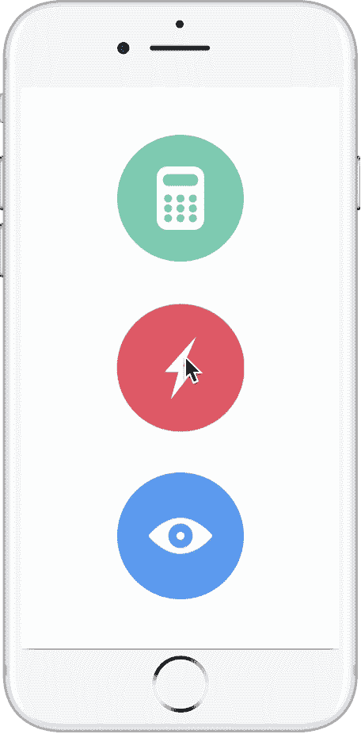
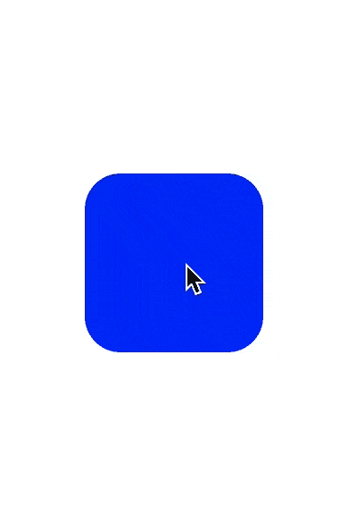
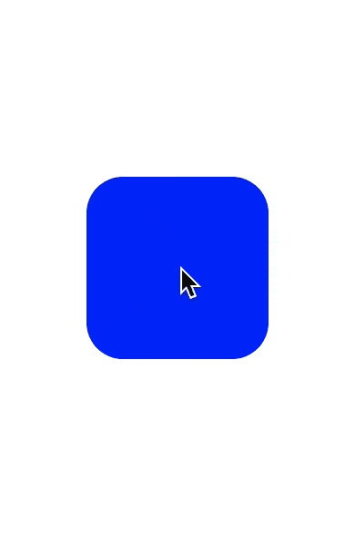
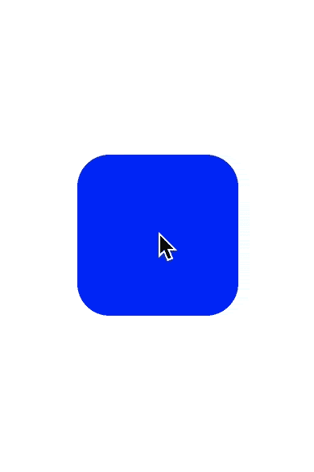
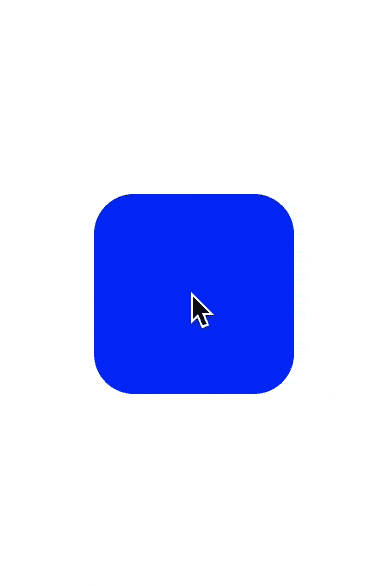
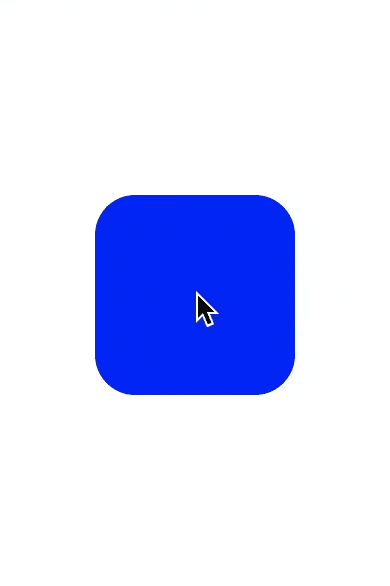
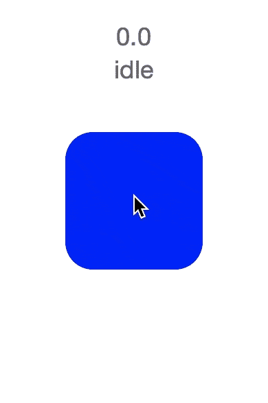

# 操场原型制作

> 原文:[https://dev.to/eonist/prototyping-in-playground](https://dev.to/eonist/prototyping-in-playground)

用 XCode Playground 和 Animator 制作 UI/UX 原型一个新的动画。我正在构建的框架。最精彩的部分？您可以获得构建应用程序时可以使用的本机代码。而且是[开源](https://github.com/gitsync/AnimLib)。看看下面的例子:

### 7。让我们给它添加一些设计:

[T2】](https://res.cloudinary.com/practicaldev/image/fetch/s--ry0IKPMD--/c_limit%2Cf_auto%2Cfl_progressive%2Cq_66%2Cw_880/https://raw.githubusercontent.com/stylekit/img/master/video_iphone.gif%3FmaxAge%3D2512168)

### 6。Peek & Pop 现已完成(新增解散):

[T2】](https://res.cloudinary.com/practicaldev/image/fetch/s--HBeTR5tV--/c_limit%2Cf_auto%2Cfl_progressive%2Cq_66%2Cw_880/https://raw.githubusercontent.com/stylekit/img/master/modal_complete.gif%3FmaxAge%3D2512168)

### 5。如果处于提示状态，模式现在保持空闲:

[T2】](https://res.cloudinary.com/practicaldev/image/fetch/s--XeTpzjll--/c_limit%2Cf_auto%2Cfl_progressive%2Cq_66%2Cw_880/https://raw.githubusercontent.com/stylekit/img/master/modal_idle.gif%3FmaxAge%3D2512168)

### 4。模态现在显示提示按钮:

[T2】](https://res.cloudinary.com/practicaldev/image/fetch/s--PfWQEJHN--/c_limit%2Cf_auto%2Cfl_progressive%2Cq_66%2Cw_880/https://raw.githubusercontent.com/stylekit/img/master/modal_w_prompt.gif%3FmaxAge%3D2592022)

### 3。莫代尔现在有边界 w/ log10(又名滑摩擦):

[T2】](https://res.cloudinary.com/practicaldev/image/fetch/s--_2EmFROA--/c_limit%2Cf_auto%2Cfl_progressive%2Cq_66%2Cw_880/https://raw.githubusercontent.com/stylekit/img/master/modal_log10.gif%3FmaxAge%3D2592003)

### 2。模态现在可拖动，带缓动:

[T2】](https://res.cloudinary.com/practicaldev/image/fetch/s--GSm-Bb-F--/c_limit%2Cf_auto%2Cfl_progressive%2Cq_66%2Cw_880/https://raw.githubusercontent.com/stylekit/img/master/modal_drag.gif%3FmaxAge%3D2592001)

### 1。深按按钮激活 peek:

[T2】](https://res.cloudinary.com/practicaldev/image/fetch/s--u15n3Xv8--/c_limit%2Cf_auto%2Cfl_progressive%2Cq_66%2Cw_880/https://raw.githubusercontent.com/stylekit/img/master/modal_pop.gif%3FmaxAge%3D2592000)

### 先决条件:(弄清楚 ForceTouch 是如何工作的)

[T2】](https://res.cloudinary.com/practicaldev/image/fetch/s--pXzp1ZbW--/c_limit%2Cf_auto%2Cfl_progressive%2Cq_66%2Cw_880/https://raw.githubusercontent.com/stylekit/img/master/ForceTouchEvent_anim.gif)

### 资源:

[在操场上使用框架文件](http://eon.codes/blog/2017/01/16/playground-and-framework/)

本文最初发表在我的博客 [http://eon.codes](http://eon.codes)