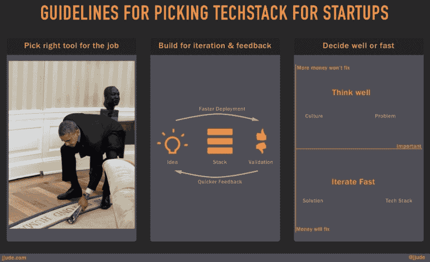

# 为创业公司挑选技术组合的指导方针

> 原文：<https://dev.to/jjude/guidelines-for-picking-tech-stack-for-startups>

[T2】](https://res.cloudinary.com/practicaldev/image/fetch/s--yxXhXj4w--/c_limit%2Cf_auto%2Cfl_progressive%2Cq_auto%2Cw_880/https://cdn.jjude.com/guidelines-for-startup-tech-stack.jpg)

咨询方面最好的轶事之一来自克莱顿·克里斯滕森教授。英特尔首席执行官安迪·格罗夫问这位教授，他的颠覆理论对英特尔意味着什么。教授没有直接回答，而是教安迪·格罗夫，“**如何思考这个问题。我一直遵循这种方法做决策。我不寻求答案，而是寻求“如何思考”一个特定的问题。这种方法帮助我在不同的情况下做出决定。同样，让我给出三条为创业公司设计技术栈的指导方针。**

### 为工作挑选合适的工具

当一只苍蝇闯入他的会议时，奥巴马总统卷起一本杂志，猛击那只苍蝇。他没有要枪，没有打电话给他的军队将军，也没有输入核密码。他挑了一本附近的杂志，卷起来，自己动手干了起来。

经常有人问我。Net 更好或者 Python 更好或者 node.js 更好构建一个创业产品。如果有一个技术联合创始人，我的建议总是**从他们了解的堆栈**开始。以后随着产品的增长，添加所需的内容，或者转移到更合适的堆栈。 [Marco Arment](https://marco.org/) 用 PHP 为他广受欢迎的[podcast 播放器编写了后端代码，因为这是他所知道的。后来它长大了，他](https://overcast.fm/)[转到了 Golang](http://highscalability.com/blog/2015/2/2/marco-arment-uses-go-instead-of-php-and-saves-money-by-cutti.html) 。同样，Twitter 最初是用 Ruby 编写的，后来改用 Scala。

现在应该很清楚了，随着初创公司经历其成长阶段，右边的栈**会发生变化。**

### 构建用于迭代和反馈

创业就是**快速验证想法**。因此，选择一种能给你带来这种优势的技术组合。快速验证想法不仅仅是关于技术栈。也是关于公司的 [devops](https://en.wikipedia.org/wiki/DevOps) 流程。它也是关于在应用程序中使用探针来给你操作上的洞察力。这种**技术栈、devops 和应用分析的结合有助于快速验证想法**。

大多数**初创公司的技术团队不会投资开发运维及应用分析**。开发运维及分析的缺乏限制了他们的敏捷性和速度，这比技术堆栈更大。

### 决定好还是快

每个业务主管都必须做出大量决策。缺乏数据使决策变得复杂。我用一个经验法则来帮助我决定。我问自己，这是不是以后钱能解决的事情？钱解决不了的问题很少。

公司文化是一个钱多也解决不了的问题。事实上，金钱放大了已经存在的东西。因此，如果一家公司以性别歧视、不诚实、专制的文化起家，那么以后再多的钱也不会扭转这种文化。优步就是一个例子。

然而，很多问题可以通过带来更多的钱来解决。标志、网站设计和技术是金钱可以解决的一些问题。正如我之前所说，Twitter 从 Ruby 切换到 Scala。Dropbox 正在试验 Golang。脸书投资编写了自己的 PHP 编译器。

如果更多的钱可以解决问题，选择快速迭代。你不应该等待更多的数据。凭你的直觉决定，很可能会有好的结果。如果没有，引入更多的资金来解决这个问题。

如果更多的钱不能解决问题，那就深入思考。如果需要，寻求外界的帮助。找已经解决问题的人聊聊。这些决定将对公司产生持久的影响。对创始人和公司来说，犯错误将是一场灾难。

*你可以在[我的博客](https://jjude.com/stacks-for-startups/)上阅读全文*