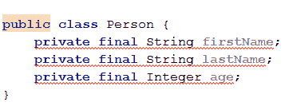
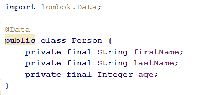
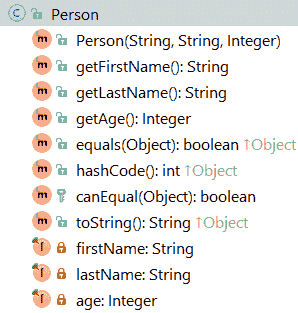
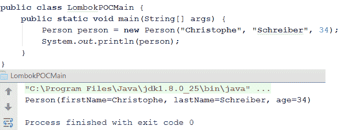
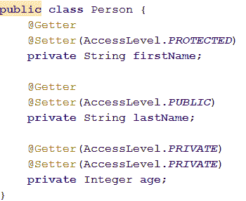
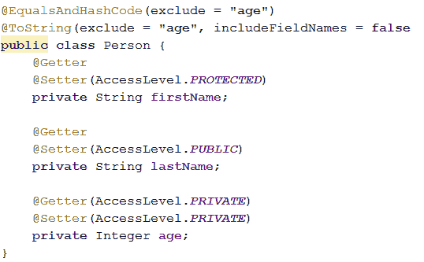
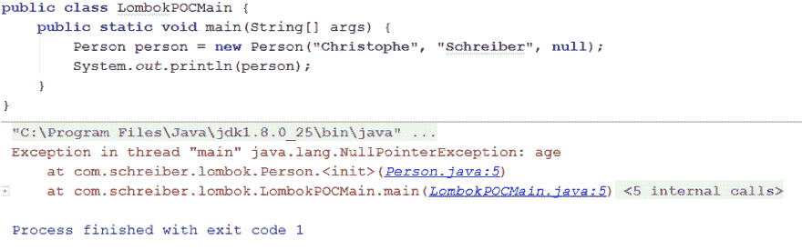

# 用 Lombok 简化我们的 POJOs

> 原文：<https://dev.to/schreiber_chris/simplifying-our-pojos-with-lombok>

每个人都知道如何编写 POJO(普通老式 Java 对象)。此外，我们的现代 ide 通过生成样板代码(如访问器、构造器和通常被重写的方法，如 toString、equals 或 hashCode)来处理这种重复且不那么有益的工作。顺便说一句，有哪个开发人员能告诉我们，他从来没有和他的团队就如何编写一个令人满意的 equals 或 hashCode 方法进行过长时间的讨论，他从来没有收到过来自他的静态代码分析工具的关于这些方法实现中使用的字段之间不一致的通知？
Lombok 项目的目标是通过处理这些肮脏的工作，从所有这些样板代码中清除 POJOs，使开发人员的生活更加轻松，这些样板代码没有多少价值，更重要的是，在技术层中间丢失了重要的信息，即业务代码。简单地说，这是如何工作的:Lombok 与您最喜欢的 IDE 集成，并将自动生成这些代码，而无需向您展示。您将只能看到字段定义，尽管所有的访问器和“实用程序”方法都是可用的。这种魔力是通过使用一个或多个注释来实现的。
我们还将讨论一些其他重复和/或冗长的任务，Lombok 可以为我们处理。

## 开始吧！

安装 Lombok 很容易。您可以在官方网站上下载它的自执行 jar 并执行它，或者在您的 IDE 中安装它的插件(我个人使用 IntelliJ，所以我使用了这个解决方案)，然后将 lombok.jar 添加到您的 Java 项目的类路径中。如果您使用 Maven 来处理您的构建和依赖项，请在 pom.xml 中添加以下依赖项:
`<dependency>
<groupId>org.projectlombok</groupId>
<artifactId>lombok</artifactId>
<version>1.16.8</version>
<scope>provided</scope>
</dependency>`

一旦我们准备好工作，让我们创建一个简单的 POJO:

[T2】](https://res.cloudinary.com/practicaldev/image/fetch/s--84SzsqGA--/c_limit%2Cf_auto%2Cfl_progressive%2Cq_auto%2Cw_880/https://www.christopheschreiber.fr/blog/wp-content/uploads/2017/04/image1.png)

不出所料，编译器对我们的代码非常满意...让我们将 Lombok 的@Data 注释添加到我们的类定义中:

 
问题解决了！但真正有趣的是，我们的 POJO 现在提供了更多:

[T2】](https://res.cloudinary.com/practicaldev/image/fetch/s--a5VTiN_9--/c_limit%2Cf_auto%2Cfl_progressive%2Cq_auto%2Cw_880/https://www.christopheschreiber.fr/blog/wp-content/uploads/2017/04/image3.png)

我们可以快速测试结果:

[T2】](https://res.cloudinary.com/practicaldev/image/fetch/s--ue_Wy9Qt--/c_limit%2Cf_auto%2Cfl_progressive%2Cq_auto%2Cw_880/https://www.christopheschreiber.fr/blog/wp-content/uploads/2017/04/image4.png)

我们现在有了一个非常容易理解的 toString 方法，而不必写几行代码！

## 特殊需要

这是 Lombok 的一个更简单的用例，但是我相信你们中的一些人会认为它有一点局限性，并且它不适合你们的特殊情况。不要害怕！Lombok 允许你定制它生成的任何东西。Lombok 没有使用@Data 来生成所有代码，而是为它的每个特性提供了注释。例如，如果我们想只为某些字段或特定的可见性公开访问器，我们可以通过在所需的属性上使用@Getter 和@Setter 注释及其参数来实现。

[T2】](https://res.cloudinary.com/practicaldev/image/fetch/s--S9zVZFLD--/c_limit%2Cf_auto%2Cfl_progressive%2Cq_auto%2Cw_880/https://www.christopheschreiber.fr/blog/wp-content/uploads/2017/04/image5.png)

关于我们前面看到的特性，我们可以注释该类以生成 toString、equals 和 hashCode 方法，并且对于每个方法，我们可以指定代码生成要包括或排除的属性:

[T2】](https://res.cloudinary.com/practicaldev/image/fetch/s--ylbiJk66--/c_limit%2Cf_auto%2Cfl_progressive%2Cq_auto%2Cw_880/https://www.christopheschreiber.fr/blog/wp-content/uploads/2017/04/image6.png)

我们还可以生成一个私有构造函数及其关联的工厂:

[T2】](https://res.cloudinary.com/practicaldev/image/fetch/s--quNXmepC--/c_limit%2Cf_auto%2Cfl_progressive%2Cq_auto%2Cw_880/https://www.christopheschreiber.fr/blog/wp-content/uploads/2017/04/image7.png)

Lombok 提供的另一个有趣的注释是@NonNull。它允许自动检查 setter 或 constructor 的参数是否不为 null，否则抛出异常:

[T2】](https://res.cloudinary.com/practicaldev/image/fetch/s--jJCSJnmM--/c_limit%2Cf_auto%2Cfl_progressive%2Cq_auto%2Cw_880/https://www.christopheschreiber.fr/blog/wp-content/uploads/2017/04/image8.png)

[T2】](https://res.cloudinary.com/practicaldev/image/fetch/s--ReLm-SPU--/c_limit%2Cf_auto%2Cfl_progressive%2Cq_auto%2Cw_880/https://www.christopheschreiber.fr/blog/wp-content/uploads/2017/04/image9.png)

## 保持事情简单很重要！

Lombok 也包含了更多的注释，但我发现它们没那么有趣。例如，@CleanUp 允许自动调用 try/catch 块中定义的变量的 close 方法。对于那些仍在使用 Java 6 并且不喜欢尝试 JDK 7 中引入的资源的人来说，这可能很有用。
@ Synchronized 注释允许定义锁。我个人更喜欢使用每个 Java 开发人员都知道的标准 synchronized 关键字来定义锁。
我想说的最后一个注释是技巧:@SneakyThrows 允许在方法体中抛出未经检查的异常，而无需在方法签名中指定它。它会对开发人员隐藏潜在的错误，因此很容易出错，我不推荐使用它。

## 最后的想法

总之，我认为 Lombok 是一个简化 POJO 编写的有趣工具。它不是一个杀手级工具，但对我来说，有更少的样板代码需要维护是一件好事，它有助于使业务信息更加清晰可见。对我来说，Lombok 的技术注释没那么有趣，从我的角度来看，它们甚至可能相当危险。尽管有这些缺点，我还是准备在我的个人项目中尝试一下 Lombok。

你可以在我的[我的 Github 库](https://github.com/ChristopheSchreiber/LombokPOC)上找到这篇文章的代码片段