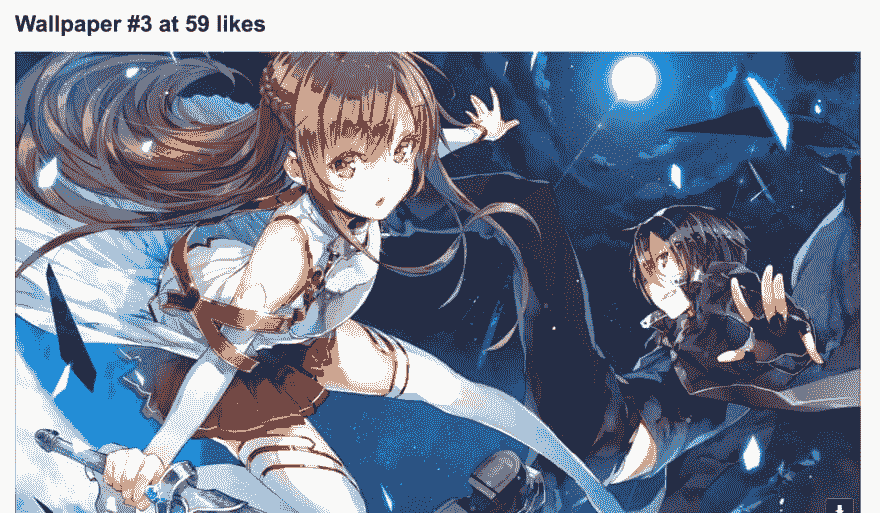

# 如何制作动漫简讯

> 原文:[https://dev.to/maxwell_dev/how-to-make-an-anime-newsletter](https://dev.to/maxwell_dev/how-to-make-an-anime-newsletter)

像我的大多数 Node 项目一样，我最近的一个项目开始于一个奇怪的想法:*我可以每天早上给自己发电子邮件发很酷的动漫壁纸吗？*

简而言之:感谢 Node，绝对。

长版:继续看。

### 进退两难

我最喜欢的一个推特机器人定期发高质量的动漫壁纸。滚动浏览它们很有趣(尽管有些可能倾向于 NSFW)，但往往有太多的选择。所以我在想，我能不能每天挑几个看看？特别是在早上的邮件里？

事实证明，是的！Node 使之成为可能，我一直渴望尝试将 Node 用于除 Express 站点之外的其他地方。这将是直接解决一个特定的问题，而不是使用 CSS -这对我来说是第一次！

因此，我心血来潮，去了公共图书馆，让我的音乐继续，并尝试了一下。

### 分解问题

在任何雄心勃勃的编码任务中，我的第一步是将事情分解成最小的部分。在研究了我可以用什么来制作我的“壁纸简讯”之后，我完成了这些任务:

1.  获取今天和昨天的日期范围。
2.  使用 Twitter API 从所需的帐户获取 Twitter 数据。
3.  从返回的数据中获取前五条推文。
4.  格式化电子邮件的数据并发送它。
5.  每天早上自动发送电子邮件。

我使用的 NPM 模块是:

1.  **[Twitter](https://www.npmjs.com/package/twit)**用于访问 Twitter API
2.  **[节点邮件](https://www.npmjs.com/package/nodemailer)** 用 SMTP 创建和发送邮件。
3.  **[节点——调度](https://www.npmjs.com/package/node-schedule)** 以特定间隔运行功能。

我将从最简单的任务开始。

### 1)获取日期范围

问题:我需要为我的 Twitter API 请求获取日期，特别是当天和昨天。

对于高级搜索，Twitter 在特定时间为推文使用一个日期范围。我需要一个从昨天到今天的范围。这在技术上做了我想要的，并返回昨天的推文。这就像一个 CodeWars 挑战，而且很简单——使用一些 JavaScript 日期对象！

```
let today = new Date(),
    yesterday = new Date();
yesterday.setDate(yesterday.getDate() - 1); 
```

<svg width="20px" height="20px" viewBox="0 0 24 24" class="highlight-action crayons-icon highlight-action--fullscreen-on"><title>Enter fullscreen mode</title></svg> <svg width="20px" height="20px" viewBox="0 0 24 24" class="highlight-action crayons-icon highlight-action--fullscreen-off"><title>Exit fullscreen mode</title></svg>

一个问题是 Twitter 搜索使用了`yyyy-mm-dd`格式的日期。通过向`Date`对象添加正确的方法，格式化就很容易了。

```
Date.prototype.yyyymmdd = function() {
  var mm = this.getMonth() + 1;
  var dd = this.getDate();

  return [this.getFullYear(),
    (mm>9 ? '' : '0') + mm,
    (dd>9 ? '' : '0') + dd
  ].join('-');
}; 
```

<svg width="20px" height="20px" viewBox="0 0 24 24" class="highlight-action crayons-icon highlight-action--fullscreen-on"><title>Enter fullscreen mode</title></svg> <svg width="20px" height="20px" viewBox="0 0 24 24" class="highlight-action crayons-icon highlight-action--fullscreen-off"><title>Exit fullscreen mode</title></svg>

然后我就像这样导出格式化的值。

```
module.exports = {
  'today': today.yyyymmdd(),
  'yesterday': yesterday.yyyymmdd()
}; 
```

<svg width="20px" height="20px" viewBox="0 0 24 24" class="highlight-action crayons-icon highlight-action--fullscreen-on"><title>Enter fullscreen mode</title></svg> <svg width="20px" height="20px" viewBox="0 0 24 24" class="highlight-action crayons-icon highlight-action--fullscreen-off"><title>Exit fullscreen mode</title></svg>

我现在有了搜索 tweets 所需的日期！接下来是更难的部分，进行 API 请求。

### 2)发出 Twitter API 请求

问题:我有了我的日期范围，现在我需要得到实际的推文！这意味着访问 Twitter API 并发送一个查询。

让我们把无聊的东西扔掉。首先，我找到了所需的模块，并插入了 API 所需的密钥、秘密和令牌。

```
const Twit = require('twit'),
      date = require('./get-dates'),
      images = [];

let T = new Twit({
  consumer_key:         '**********',
  consumer_secret:      '**********',
  access_token:         '**********',
  access_token_secret:  '**********',
  timeout_ms:           60*1000,  // optional HTTP request timeout to apply to all requests.
}); 
```

<svg width="20px" height="20px" viewBox="0 0 24 24" class="highlight-action crayons-icon highlight-action--fullscreen-on"><title>Enter fullscreen mode</title></svg> <svg width="20px" height="20px" viewBox="0 0 24 24" class="highlight-action crayons-icon highlight-action--fullscreen-off"><title>Exit fullscreen mode</title></svg>

`Twit`是帮助实际 API 查询的模块。`date`从之前提取所需日期范围的函数。`images`是存储最终结果的数组。

现在到了有趣的部分:使用 API！Twit 给出了几个返回数据的选项，但是一个搜索做了我需要的。它运行基本或高级搜索，类似于网站本身。

在这里，我需要设置一个高级搜索，它将:

*   仅从`@AceWallpaperBot`账户获取推文。
*   从我创建的日期范围内获取推文。
*   限制在 100 条以内(安全起见)

我的一个搜索示例是这样的:

```
`from:AceWallpaperBot since:2017-07-20 until:2017-07-21, count: 100` 
```

<svg width="20px" height="20px" viewBox="0 0 24 24" class="highlight-action crayons-icon highlight-action--fullscreen-on"><title>Enter fullscreen mode</title></svg> <svg width="20px" height="20px" viewBox="0 0 24 24" class="highlight-action crayons-icon highlight-action--fullscreen-off"><title>Exit fullscreen mode</title></svg>

插入我在第一步中制作的日期，它变成了这个:

```
'from:AceWallpaperBot since:' + date.yesterday + ' until:' + date.today, count: 100 
```

<svg width="20px" height="20px" viewBox="0 0 24 24" class="highlight-action crayons-icon highlight-action--fullscreen-on"><title>Enter fullscreen mode</title></svg> <svg width="20px" height="20px" viewBox="0 0 24 24" class="highlight-action crayons-icon highlight-action--fullscreen-off"><title>Exit fullscreen mode</title></svg>

现在使用查询！因为这是一个 API 请求，所以我使用了一个 JavaScript promise，它可以在数据返回后处理数据。

```
module.exports = T.get('search/tweets', { q: 'from:AceWallpaperBot since:' + date.yesterday + ' until:' + date.today, count: 100 })
  .catch(function (err) {
    console.log('caught error', err.stack);
  })
  .then(function (result){
    // Do stuff with the returned data here!
  }); 
```

<svg width="20px" height="20px" viewBox="0 0 24 24" class="highlight-action crayons-icon highlight-action--fullscreen-on"><title>Enter fullscreen mode</title></svg> <svg width="20px" height="20px" viewBox="0 0 24 24" class="highlight-action crayons-icon highlight-action--fullscreen-off"><title>Exit fullscreen mode</title></svg>

完成请求后，这一步完成了，但函数没有完成。我有比我需要的更多的数据——我只想要有最多赞的五条推文中的图片！这让我想到了第三步。

### 3)获得五条最受欢迎的推文

**问题:**我已经得到了我想要的 Twitter 数据，但是太多了！我想浏览结果，挑选出最喜欢的五个人，从他们身上保存我需要的东西。

整理所有这些数据并不困难，但很耗时。我最终想要两条信息:

1.  壁纸的文件路径
2.  这条推文获得的赞数

从第二步的承诺开始，这些是我保存的 JSON 结果的路径。

```
let results = result.data.statuses;

results.forEach(function(entry, i) {

  let newEntry = {
    path: results[i].entities.media[0].media_url_https,
    likes: results[i].favorite_count,
  };

  images.push(newEntry);
}); 
```

<svg width="20px" height="20px" viewBox="0 0 24 24" class="highlight-action crayons-icon highlight-action--fullscreen-on"><title>Enter fullscreen mode</title></svg> <svg width="20px" height="20px" viewBox="0 0 24 24" class="highlight-action crayons-icon highlight-action--fullscreen-off"><title>Exit fullscreen mode</title></svg>

仍然保留昨天的所有推文，但只有我关心的信息。

下一步是将数据从最喜欢到最不喜欢排序。

```
images.sort(function(a, b) { return b.likes - a.likes; }); 
```

<svg width="20px" height="20px" viewBox="0 0 24 24" class="highlight-action crayons-icon highlight-action--fullscreen-on"><title>Enter fullscreen mode</title></svg> <svg width="20px" height="20px" viewBox="0 0 24 24" class="highlight-action crayons-icon highlight-action--fullscreen-off"><title>Exit fullscreen mode</title></svg>

最后，返回这个排序数组中的前五项——也就是前五个喜欢的 tweets！

```
return images.slice(1, 6); 
```

<svg width="20px" height="20px" viewBox="0 0 24 24" class="highlight-action crayons-icon highlight-action--fullscreen-on"><title>Enter fullscreen mode</title></svg> <svg width="20px" height="20px" viewBox="0 0 24 24" class="highlight-action crayons-icon highlight-action--fullscreen-off"><title>Exit fullscreen mode</title></svg>

结合第二步和第三步，这是我导出的最后一个模块:

```
module.exports = T.get('search/tweets', { q: 'from:AceWallpaperBot since:' + date.yesterday + ' until:' + date.today, count: 100 })
  .catch(function (err) {
    console.log('caught error', err.stack);
  })
  .then(function (result){
    let results = result.data.statuses;

    results.forEach(function(entry, i) {

      let newEntry = {
        path: results[i].entities.media[0].media_url_https,
        likes: results[i].favorite_count,
      };

      images.push(newEntry);
    });

    images.sort(function(a, b) { return b.likes - a.likes; });

    return images.slice(1, 6);
  }); 
```

<svg width="20px" height="20px" viewBox="0 0 24 24" class="highlight-action crayons-icon highlight-action--fullscreen-on"><title>Enter fullscreen mode</title></svg> <svg width="20px" height="20px" viewBox="0 0 24 24" class="highlight-action crayons-icon highlight-action--fullscreen-off"><title>Exit fullscreen mode</title></svg>

终于来了！这个模块让我可以获得这份时事通讯需要的 Twitter 数据，并组织好，随时可以使用。

### 4)发送带有壁纸的电子邮件

**问题:**我有排名前五的壁纸！现在我如何用电子邮件发送它们呢？

由于经验丰富，这对我来说是最难的一步。我以前用 JavaScript 做过 API，但不是用来发邮件的。幸运的是，NPM 有一个这样的模块(当然)。

这个文件的起始结构如下:

```
const api_request = require('./get-twitter-data'),
      nodemailer = require('nodemailer');

module.exports = function sendEmail() {
  api_request.then(function(data){

  });
} 
```

<svg width="20px" height="20px" viewBox="0 0 24 24" class="highlight-action crayons-icon highlight-action--fullscreen-on"><title>Enter fullscreen mode</title></svg> <svg width="20px" height="20px" viewBox="0 0 24 24" class="highlight-action crayons-icon highlight-action--fullscreen-off"><title>Exit fullscreen mode</title></svg>

这个文件使用上一步中的 Twitter API 请求来返回所需的数据。模块将制作并发送最终的电子邮件。该文件导出了通过 Gmail 实现这一功能的函数。

注意`api_request`函数后面紧跟着`.then`。该函数使用了一个承诺，所以这告诉它在下一步之前等待，直到该承诺被履行。当我第一次写这个的时候，邮件在有 Twitter 数据之前一直在发送。这是因为它在 Twitter API 响应之前就运行了所有的东西。这确保了它以正确的顺序执行。

回邮件！一旦我用 Gmail 设置了一个私人接入点，我就可以让应用程序向我的账户发送电子邮件。让你用这些信息创建一个“传送器”来发送电子邮件。

```
let transporter = nodemailer.createTransport({
  service: "gmail",
  auth: {
    user: '**********', // my email address
    pass: '**********' // the password for my private access point
  }
}); 
```

<svg width="20px" height="20px" viewBox="0 0 24 24" class="highlight-action crayons-icon highlight-action--fullscreen-on"><title>Enter fullscreen mode</title></svg> <svg width="20px" height="20px" viewBox="0 0 24 24" class="highlight-action crayons-icon highlight-action--fullscreen-off"><title>Exit fullscreen mode</title></svg>

下一步是用电子邮件需要的所有数据创建一个对象。

```
let mailOptions = {
  from: 'Ace Wallpaper Summary Bot', // sender address
  to: '**********', // my email again
  subject: 'Yesterday\'s Popular Wallpapers', // Subject line
  html: email_body // html body
}; 
```

<svg width="20px" height="20px" viewBox="0 0 24 24" class="highlight-action crayons-icon highlight-action--fullscreen-on"><title>Enter fullscreen mode</title></svg> <svg width="20px" height="20px" viewBox="0 0 24 24" class="highlight-action crayons-icon highlight-action--fullscreen-off"><title>Exit fullscreen mode</title></svg>

但是等等！在`html`字段中使用的变量是什么？！

这是整个邮件正文的位置。我将回溯代码来展示它是如何制作的。记住所有的 Twitter 数据都在这个函数的`data`变量中。我可以用它来访问这五张照片。这也让我回到了我的舒适区:编写 HTML 和 CSS！遗憾的是，这是电子邮件的前端，就像 20 世纪 20 年代喜欢快车一样，但仍然如此。

我是这样构造邮件正文的:

```
let photos = data,
    email_body = '<p>Here are yesterday\'s most popular Ace Wallpapers!</p>';

photos.forEach(function(photo, index){
  email_body += '<h1>Wallpaper #' + (parseInt(index) + 1) + ' at ' + photo.likes + ' likes</h1>';
}); 
```

<svg width="20px" height="20px" viewBox="0 0 24 24" class="highlight-action crayons-icon highlight-action--fullscreen-on"><title>Enter fullscreen mode</title></svg> <svg width="20px" height="20px" viewBox="0 0 24 24" class="highlight-action crayons-icon highlight-action--fullscreen-off"><title>Exit fullscreen mode</title></svg>

简单而有效-循环浏览每张照片，为它们的排名和点赞数创建标题，显示壁纸本身，并将其添加到电子邮件正文中。

下面先睹为快，看看这在实际邮件中是什么样子的:

[T2】](https://res.cloudinary.com/practicaldev/image/fetch/s--i2a8JI7q--/c_limit%2Cf_auto%2Cfl_progressive%2Cq_auto%2Cw_880/https://thepracticaldev.s3.amazonaws.com/i/5tztd3i6or0x9p0ofmym.png)

所以它确实有效！

这里只剩下一个步骤:发送电子邮件。再次覆盖我，使用对象和所有信息。

```
transporter.sendMail(mailOptions, (error, info) => {
  if (error) { return console.log(error); }

  console.log('Message %s sent: %s', info.messageId, info.response);
}); 
```

<svg width="20px" height="20px" viewBox="0 0 24 24" class="highlight-action crayons-icon highlight-action--fullscreen-on"><title>Enter fullscreen mode</title></svg> <svg width="20px" height="20px" viewBox="0 0 24 24" class="highlight-action crayons-icon highlight-action--fullscreen-off"><title>Exit fullscreen mode</title></svg>

说完，我好像就完事了。通过 Node 运行这个文件给我发了一封整洁的电子邮件，里面有昨天前五名的壁纸。它们很容易查看(如果我想的话，还可以下载)。最终导出的模块如下所示:

```
const api_request = require('./get-twitter-data'),
      nodemailer = require('nodemailer');

module.exports = function sendEmail() {
  api_request.then(function(data){

    let transporter = nodemailer.createTransport({
      service: "gmail",
      auth: {
        user: '**********', // my email address
        pass: '**********' // the password for my private access point
      }
    });

    let photos = data,
        email_body = '<p>Here are yesterday\'s most popular Ace Wallpapers!</p>';

    photos.forEach(function(photo, index){
      email_body += '<h1>Wallpaper #' + (parseInt(index) + 1) + ' at ' + photo.likes + ' likes</h1>';
    });

    // setup email data with unicode symbols
    let mailOptions = {
      from: 'Ace Wallpaper Summary Bot', // sender address
      to: '**********', // my email again
      subject: 'Yesterday\'s Popular Wallpapers', // Subject line
      html: email_body // html body
    };

    // send mail with defined transport object
    transporter.sendMail(mailOptions, (error, info) => {
      if (error) { return console.log(error); }

      console.log('Message %s sent: %s', info.messageId, info.response);
    });
  });
} 
```

<svg width="20px" height="20px" viewBox="0 0 24 24" class="highlight-action crayons-icon highlight-action--fullscreen-on"><title>Enter fullscreen mode</title></svg> <svg width="20px" height="20px" viewBox="0 0 24 24" class="highlight-action crayons-icon highlight-action--fullscreen-off"><title>Exit fullscreen mode</title></svg>

只剩一步了...

### 每天早上发送邮件

**问题:**我的简讯完成了！但是我怎么能让它每天早上自己寄出去呢？

使用`node-schedule`很容易做到这一点，它做的正是人们所想的:以设定的时间间隔运行代码。这很简单，所以我将跳到最后的结果:

```
const schedule = require('node-schedule'),
      sendEmail = require('./send-email');

schedule.scheduleJob('0 7 * * *', function(){
  sendEmail();
}); 
```

<svg width="20px" height="20px" viewBox="0 0 24 24" class="highlight-action crayons-icon highlight-action--fullscreen-on"><title>Enter fullscreen mode</title></svg> <svg width="20px" height="20px" viewBox="0 0 24 24" class="highlight-action crayons-icon highlight-action--fullscreen-off"><title>Exit fullscreen mode</title></svg>

是上一步中的函数——它制作并发送时事通讯。我只需要在`node-schedule`中运行它，它会完成剩下的工作。`'0 7 * * *'`字符串是模块的读法“每天早上 7 点”

所有这些都在`index.js`上，所以现在我需要做的就是运行`node index.js`(或任何快捷命令)，调度程序就启动并运行了！它会等到每天早上 7 点，获取最受欢迎的壁纸，然后用电子邮件发给我。**目标达成！**

> *边注:*我为此使用了 Heroku，`node-schedule`却无法正常工作。谢天谢地，Heroku 有一个我用的调度程序插件。如果不处理类似 Heroku 的并发症，`node-schedule`应该还是管用的。

## 通迅完成！

我已经让这个应用程序运行了大约一个星期，它运行得非常完美。每天早上，我都会从这个账户中得到五种不同的壁纸，根据有多少人喜欢它们来排序。

这是我的第一个完全集中于后端的 web 项目，所以感觉非常满意。事实上，我做的其他东西都是集中在前端的，主要使用 CodePen 或 Jekyll。所以对我来说，有一个后端项目，把我推到舒适区之外，同时给出有趣的最终结果，是一个更大的风险。

希望这对我未来的节点项目是个好兆头！