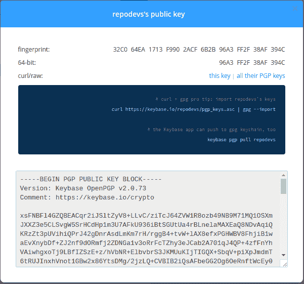
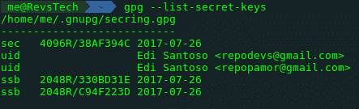
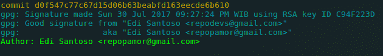
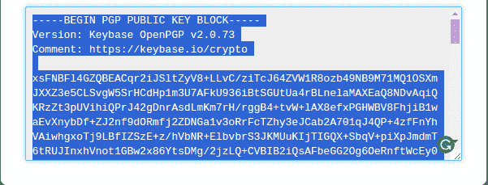
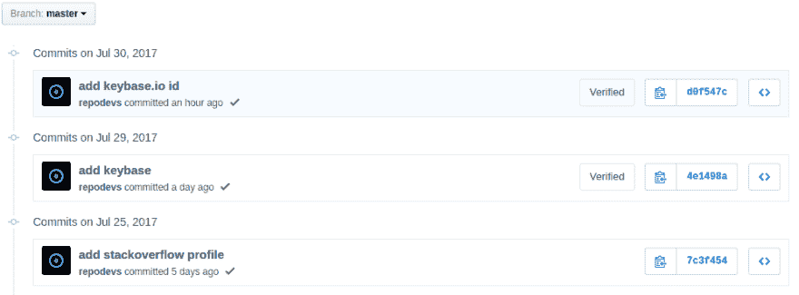

# Menambahkan GPG Keys pada Git dan GitHub

> 原文：<https://dev.to/repodevs/menambahkan-gpg-keys-pada-git-dan-github-3fd0>

ini adalah catatan cara untuk menambahkan GPG keys kedalam commit dari git, kemudian menambahkan GPG keys tersebut ke akun github kita.

Pertama buat GPG keys dahulu, ada banyak cara untuk membuat GPG key kita, pada catatan kali ini saya menggunakan GPG key yang di buat di [keybase.io](https://keybase.io) , untuk cara membuat akun dan generate GPG keys, silahkan baca-baca pada documentasi keybase.io itu tersendiri.

Setelah kita membuat akun dan generate GPG key di keybase.io kita akan lakukan import GPG key tersebut ke laptop/komputer kita.

oiya jangan lupa untuk install keybase.io client di laptop/komputer mu ya, untuk tutorialnya bisa di baca-baca di [sini](https://keybase.io/docs/the_app/install_linux)

[](https://res.cloudinary.com/practicaldev/image/fetch/s--vQHVJMD2--/c_limit%2Cf_auto%2Cfl_progressive%2Cq_auto%2Cw_880/https://me.repodevs.com/asseimg/2017-07-30/1.png)

*【gpg keys Dari key base . io】*

lakukan import GPG keys dengan menggunakan command

```
$ curl https://keybase.io/repodevs/pgp_keys.asc | gpg --import
# GANTI https://keybase.io/repodevs/pgp_keys.asc DENGAN URL KEYS MU !!!

$ keybase pgp export -s | gpg --import --allow-secret-key-import 
```

Enter fullscreen mode Exit fullscreen mode

cek apakah GPG key sudah terimport dengan benar kedalam laptop/komputer kita menggunakan command

```
$ gpg --list-secret-keys

# ---------------------------
# sec 4096R/38AF394C 2017-07-26
# uid Edi Santoso <repodevs@gmail.com>
# uid Edi Santoso <repopamor@gmail.com>
# ssb 2048R/330BD31E 2017-07-26
# ssb 2048R/C94F223D 2017-07-26 
```

Enter fullscreen mode Exit fullscreen mode

[T2】](https://res.cloudinary.com/practicaldev/image/fetch/s--Fam-a_kD--/c_limit%2Cf_auto%2Cfl_progressive%2Cq_auto%2Cw_880/https://me.repodevs.com/asseimg/2017-07-30/2.png)

Selanjutnya setting Git kita untuk menggunakan GPG key yang telah terimport didalam laptop kita tersebut.

```
$ git config --global user.signingkey 38AF394C
$ git config --global commit.gpgsign true
$ git config -l

# user.email=repopamor@gmail.com
# user.name=Edi Santoso
# user.signingkey=38AF394C
# commit.gpgsign=true 
```

Enter fullscreen mode Exit fullscreen mode

[T2】](https://res.cloudinary.com/practicaldev/image/fetch/s--rmje0Fg7--/c_limit%2Cf_auto%2Cfl_progressive%2Cq_auto%2Cw_880/https://me.repodevs.com/asseimg/2017-07-30/3.png)

Lakukan Commit pada file, kemudian cek apakah GPG keys nya berjalan atau tidak

```
$ git add testfile.txt
$ git commit -m 'test commit with gpg keys'
$ git show --pretty=short --show-signature

# commit d0f547c77c67d15d06b63beabfd163eecde6b610
# gpg: Signature made Sun 30 Jul 2017 09:27:24 PM WIB using RSA key ID C94F223D
# gpg: Good signature from "Edi Santoso <repodevs@gmail.com>"
# gpg: aka "Edi Santoso <repopamor@gmail.com>"
# Author: Edi Santoso <repopamor@gmail.com>
#
# test commit with gpg keys
# ... 
```

Enter fullscreen mode Exit fullscreen mode

[T2】](https://res.cloudinary.com/practicaldev/image/fetch/s--42ra96g0--/c_limit%2Cf_auto%2Cfl_progressive%2Cq_auto%2Cw_880/https://me.repodevs.com/asseimg/2017-07-30/4.png)

### 设置 GitHub

Setelah commit code kita sudah berhasil, Selanjutnya kita setting GitHub kita, agar GPG keys kita terverifikasi oleh github dengan akun kita.

Buka Public PGP key kita dari keybase.io tadi, dan copy key tersebut.

[T2】](https://res.cloudinary.com/practicaldev/image/fetch/s--w0sXjEUW--/c_limit%2Cf_auto%2Cfl_progressive%2Cq_auto%2Cw_880/https://me.repodevs.com/asseimg/2017-07-30/5.png)

Buka akun github kita, dan masuk ke Settings GPG Keys, atau bisa buka [Link Ini](https://github.com/settings/keys)

Tambahkan GPP Key yang kita copy tadi.

[T2】](https://res.cloudinary.com/practicaldev/image/fetch/s--BCViacO_--/c_limit%2Cf_auto%2Cfl_progressive%2Cq_auto%2Cw_880/https://me.repodevs.com/asseimg/2017-07-30/6.png)

Setelah di tambahkan, lakukan push code yang telah kita commit dengan signingkey tadi.

Jika semua langkah yang kita lakukan tadi berhasil, pada commitan github kita akan ada tanda terverifikasi

[T2】](https://res.cloudinary.com/practicaldev/image/fetch/s--sgc5XA4k--/c_limit%2Cf_auto%2Cfl_progressive%2Cq_auto%2Cw_880/https://me.repodevs.com/asseimg/2017-07-30/7.png)

Yeahh sudah, begitalah catatan kali ini, silahkan comment jika masih ada kendala / kebingunan \ :D /

_**Referensi:**_

*[https://github.com/pstadler/keybase-gpg-github](https://github.com/pstadler/keybase-gpg-github)*

*[https://keybase.io/download](https://keybase.io/download)*