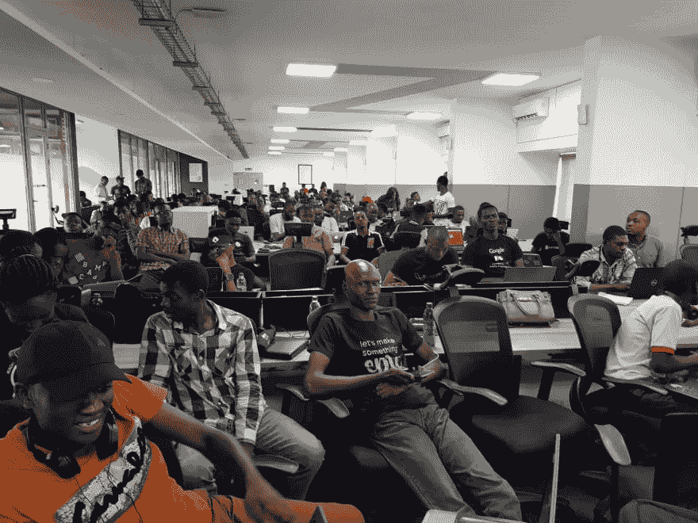
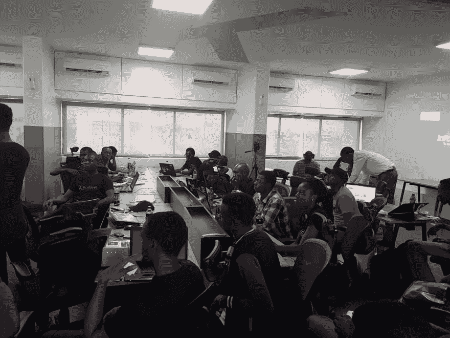
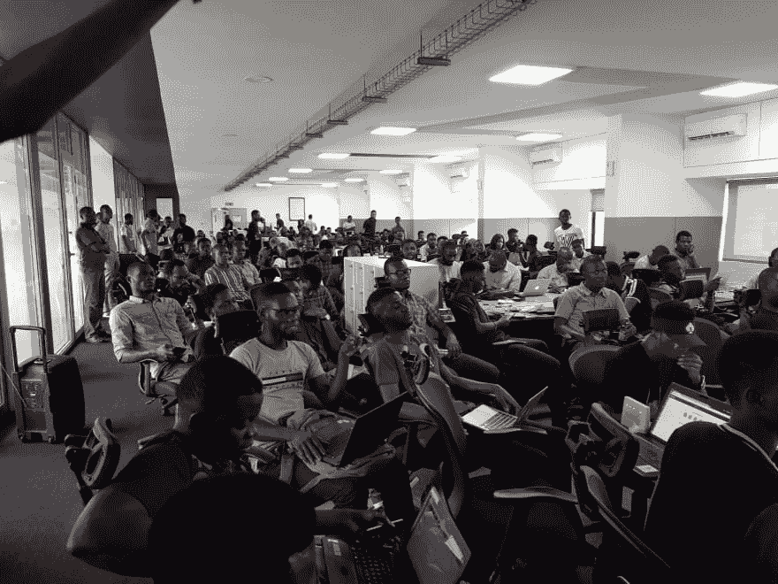

# 尼日利亚拉勒维尔——当聚会变成会议

> 原文：<https://dev.to/neo/laravel-nigeria--when-meetups-turn-into-conferences>

[T2】](https://res.cloudinary.com/practicaldev/image/fetch/s--J7lzG41j--/c_limit%2Cf_auto%2Cfl_progressive%2Cq_auto%2Cw_880/https://thepracticaldev.s3.amazonaws.com/i/pq0ogtacx7zyrnmzlh6k.jpg)

当我想到尼日利亚的拉勒维尔时。我和 Prosper 谈过，我们决定让它发生，这不是我们想象的那样。我们不认为会有 350 人回复 VPd 和 150+在等候名单上。我们根本没想到。

毫无疑问，第一版的《尼日利亚拉腊维尔》大受欢迎，但我完全没有料到第二版会有这么多数字。当我谈到第一个问题时，我详细讲述了我是如何在像 [Pusher](https://pusher.com) 、 [Andela](https://andela.com) 和其他许多公司的帮助下组织这次聚会的。这一次，更多的公司再次站出来赞助这项活动。Scotch.io 的 Chris Sevilleja 对 meetup 的支持令人惊讶，我们很高兴它发生了。

所以不多说，我将分享一些来自 meetup 的图片。如果你需要更多关于下一次聚会的信息，或者你能提供什么帮助，请在下面留言，我会非常乐意与你联系。

🔥🔥🔥🔥

更多即将推出。