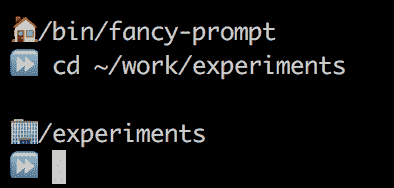
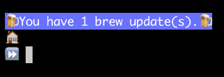
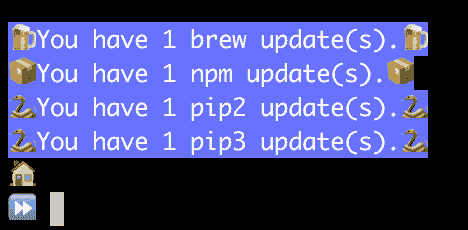

# Emojifying 我的 Bash 提示符(为什么你也应该)

> 原文:[https://dev.to/thatjoemoore/emojifying-my-bash-prompt](https://dev.to/thatjoemoore/emojifying-my-bash-prompt)

**警告:前方有哑弹**

这个帖子包含一些愚蠢的东西。如果你把自己看得太重，你可能想找些不那么古怪的东西来读ðÿ˜。

**/警告**

让我们面对现实吧——开发工作有时会对精神造成伤害。当不切实际的项目截止日期临近或堆积如山的技术债务迫在眉睫时，有时一点小小的快乐可以让你度过一天。让我保持理智的一件事是寻找一些小方法，让自己在一天中获得小小的快乐。这就是为什么，当我几周前得到一台新的笔记本电脑时，我决定尝试一下，找到一种有趣的方法来解决一些问题。怎么，你问？通过给我的 bash 提示添加表情。

# 为什么，哦为什么，你会做这种蠢事？

嗯，这一切都始于我在旧笔记本电脑上发现的两个不同的问题；当其他事情都在工作的时候，那些不值得花时间去解决的小烦恼。我有一个个人原则，一旦我有了一台新的笔记本电脑，我会花几天时间来调整和配置它，然后我的设置会被冻结至少几个月。这有助于我逐步改进我的设置，但防止我陷入无休止的调整和测试循环，永远也不会完成任何实际工作。我见过开发人员在配置他们的工作站时如此迷失，以至于他们基本上一个月都没用，我永远不想成为那样的人。

# 一个非常花哨的ðÿž提示

我一直喜欢定制我的 bash 提示符；我从来不喜欢默认。我最近的几个工作站和我所有的服务器都有基本相同的提示:

```
hostname:/current/directory/here
 -> 
```

<svg width="20px" height="20px" viewBox="0 0 24 24" class="highlight-action crayons-icon highlight-action--fullscreen-on"><title>Enter fullscreen mode</title></svg> <svg width="20px" height="20px" viewBox="0 0 24 24" class="highlight-action crayons-icon highlight-action--fullscreen-off"><title>Exit fullscreen mode</title></svg>

显然，这没什么特别的，但是定制我的提示是我在 Bash 中想出的第一件事，当我最终让它按照我想要的方式工作时，它仍然给我一点喜悦。

几台笔记本电脑之后，我进一步改进了这个提示，以检测我何时位于我的主目录的子目录中，并用`~`替换我的主路径。当我看到它时，又是一阵小小的喜悦。

而现在，我正在安装一台新的笔记本电脑，我已经厌倦了我的提示。首先，我想给它添加一些颜色，但是我很快就厌倦了——它并不比一个简单的提示更令人兴奋。然后，在使用`brew`安装一些包时，我注意到当你成功安装某个东西时会弹出一个小啤酒表情符号，我开始想——如果我玩表情符号会怎么样？最近，每当我需要提出一个琐碎的演示或例子时，我倾向于用表情符号做一些愚蠢的事情，因为严肃地对待表情符号这样愚蠢的事情让我发笑(只要看看我不久前为向我的团队演示一些概念而创建的约曼生成器的[输出](https://github.com/ThatJoeMoore/byu-fancy-component))。

那么，如何让我瞬间心动呢？

好吧，这里是如何:

[T2】](https://res.cloudinary.com/practicaldev/image/fetch/s--h2UTOx-3--/c_limit%2Cf_auto%2Cfl_progressive%2Cq_auto%2Cw_880/https://thepracticaldev.s3.amazonaws.com/i/ttoe1ciyc0f8yni0e4zu.png)

我真的没做什么——我只是用ðÿ替换了我的`~`,用β替换了我的 ASCII 小箭头。然而，每次看到这些小表情符号，我的生活都会变得更加美好。

你会注意到我添加了另一个表情符号——在这台笔记本电脑上，我把所有与工作相关的代码都放在`~/work`下，所以我决定用ðÿ的办公楼来代替这条路径。为什么？为什么不呢？我可能最终会添加更多这样的替换，但我已经耗尽了我的自我强制调整时间。也许我会让`~/Documents`成为ðÿ，让`/tmp`成为。我肯定能想到一些可以被ðÿ'取代的项目目录。但这是另一台笔记本电脑的问题。

因此，我的提示设置在这一点上并不太复杂:

```
 fancyprompt() {
  echo where=$PWD
  home=$HOME
  work="$home/work"

  where="${where/$work/🏢 }"
  where="${where/$home/🏠}"

  PS1='$where
⏩  '
}

PROMPT_COMMAND=fancyprompt 
```

<svg width="20px" height="20px" viewBox="0 0 24 24" class="highlight-action crayons-icon highlight-action--fullscreen-on"><title>Enter fullscreen mode</title></svg> <svg width="20px" height="20px" viewBox="0 0 24 24" class="highlight-action crayons-icon highlight-action--fullscreen-off"><title>Exit fullscreen mode</title></svg>

但是它能变得更花哨吗？T3】

当然啦！

# 让我保持最新状态

再一次，当我安装所有正常的`brew`包时，我开始思考我在自制软件中遇到的一个问题:过时的包。我会让这么多的更新累积起来，却从来不对它们做任何事情，以至于当我确实需要更新一个时，我最终会让一个`brew upgrade`运行半个小时，我不喜欢这样。那么，我能找到一个有趣的方法来解决这个问题吗？如果我没有，我会在这里告诉你吗？我不这么认为！

我的想法是增强我已经很花哨的提示功能，让它在有 brew 更新要安装时告诉我:

[T2】](https://res.cloudinary.com/practicaldev/image/fetch/s--4uPd6Rz5--/c_limit%2Cf_auto%2Cfl_progressive%2Cq_auto%2Cw_880/https://thepracticaldev.s3.amazonaws.com/i/y7yy6b9ij3xnijdi88za.png)

我最初的实现是这样的:

```
 fancyprompt() {

  brew update
  outdated=`brew outdated --quiet | wc -l | tr -d '[:space:']`

  if [ "$outdated" -gt "0" ]; then echo -e "\x1B[104m\x1B[97m🍺 You have $outdated brew update(s).🍺 \x1B[0m"
  fi

  ...the rest of my prompt...
} 
```

<svg width="20px" height="20px" viewBox="0 0 24 24" class="highlight-action crayons-icon highlight-action--fullscreen-on"><title>Enter fullscreen mode</title></svg> <svg width="20px" height="20px" viewBox="0 0 24 24" class="highlight-action crayons-icon highlight-action--fullscreen-off"><title>Exit fullscreen mode</title></svg>

这奏效了...慢慢地。非常慢，因为它必须做大量的工作，包括相当数量的网络 IO。因此，我将`brew update`转移到一个每天运行的 cron 作业中:

```
PATH=/bin:/sbin:/usr/bin:/usr/sbin:/usr/local/sbin:/usr/local/bin

@daily brew update 
```

<svg width="20px" height="20px" viewBox="0 0 24 24" class="highlight-action crayons-icon highlight-action--fullscreen-on"><title>Enter fullscreen mode</title></svg> <svg width="20px" height="20px" viewBox="0 0 24 24" class="highlight-action crayons-icon highlight-action--fullscreen-off"><title>Exit fullscreen mode</title></svg>

(谁在自己的工作站上使用 cron？显然，我知道！)

现在，我可以从我的提示中删除`brew update`。我当时的提示是...不那么慢。事实证明，`brew outdated`也非常慢，大约需要 500 毫秒来执行。由于对实际发生的事情一无所知，我选择启动一个 Ruby 进程来运行 brew，以此来转移注意力。无论如何，500 毫秒是一条路。也是。慢点。每次我输入命令，等待我的提示返回时，我都感觉自己快要死了。所以我必须变得更疯狂。

我通过将`brew outdated`检查也转移到我的 cron 作业中，将输出写到`/tmp` :
中的一个小文件中，解决了速度问题

```
@daily brew update && brew outdated --quiet | wc -l | tr -d '[:space:'] > /tmp/.brew-outdated 
```

<svg width="20px" height="20px" viewBox="0 0 24 24" class="highlight-action crayons-icon highlight-action--fullscreen-on"><title>Enter fullscreen mode</title></svg> <svg width="20px" height="20px" viewBox="0 0 24 24" class="highlight-action crayons-icon highlight-action--fullscreen-off"><title>Exit fullscreen mode</title></svg>

现在，我有一个文件，其中包含我的过期 brew 包的计数。我所要做的就是在我的提示功能中阅读它，这非常快！

```
 outdated=0
    if [ -f "/tmp/.brew-outdated" ]; then
      outdated=`cat /tmp/.brew-outdated`
    fi 
```

<svg width="20px" height="20px" viewBox="0 0 24 24" class="highlight-action crayons-icon highlight-action--fullscreen-on"><title>Enter fullscreen mode</title></svg> <svg width="20px" height="20px" viewBox="0 0 24 24" class="highlight-action crayons-icon highlight-action--fullscreen-off"><title>Exit fullscreen mode</title></svg>

万岁！现在，每当我有 brew 更新时，我都会有快乐的小啤酒表情符号和一条好消息。

但是我们能去更好的地方吗？T3】

亲爱的读者，不要害怕，我们可以！

# 更新所有的包

原来，我有一堆更多的包管理器来保持更新。我做一些 web 开发，所以，当然，我有一堆 npm 包，我必须安装 pip，因为我们的一堆部署工具是用 Python 编写的。那么，我可以扩展这个来获得更新吗？

但是当然！

我最终创建了一些额外的函数来处理这个问题，并编写了一个脚本来检查更新:

```
 #!/bin/bash

check_brew() {
  echo checking brew
  brew update
  brew outdated --quiet | wc -l | tr -d '[:space:]' > /tmp/.brew-outdated
}

check_npm() {
  echo checking npm
  npm outdated --global | wc -l | tr -d '[:space:]' > /tmp/.npm-outdated
}

check_pip() {
  echo checking pip2
  pip2 list --outdated --format=legacy | wc -l | tr -d '[:space:]' > /tmp/.pip2-outdated
  echo checking pip3
  pip3 list --outdated --format=legacy | wc -l | tr -d '[:space:]' > /tmp/.pip3-outdated
}

check_brew
check_npm
check_pip 
```

<svg width="20px" height="20px" viewBox="0 0 24 24" class="highlight-action crayons-icon highlight-action--fullscreen-on"><title>Enter fullscreen mode</title></svg> <svg width="20px" height="20px" viewBox="0 0 24 24" class="highlight-action crayons-icon highlight-action--fullscreen-off"><title>Exit fullscreen mode</title></svg>

其中的每一个都写到一个名为`/tmp/.(toolname)-outdated`的文件中。然后，在我的 bash 配置文件中有一些函数，给定一个工具名称和表情符号，这些函数将检查适当的文件并显示一条消息。

[](https://res.cloudinary.com/practicaldev/image/fetch/s--VRlfITc7--/c_limit%2Cf_auto%2Cfl_progressive%2Cq_auto%2Cw_880/https://thepracticaldev.s3.amazonaws.com/i/zfh25hk24nnorcwfdwqs.png)T3】

```
 _count_updates() {
  type=$1
  f=/tmp/.$type-outdated
  upd=0
  if [ -f "$f" ]; then
    upd=`cat $f`
  fi
  echo $upd
}

_has_updates() {
  type=$1

  cnt=`_count_updates $type`
  if [ "$cnt" -gt "0" ]; then
          return 0
  fi
  return 1
}

_update_prompt() {
  type=$1
  icon=$2

  upd=`_count_updates $type`
  if [ "$upd" -gt 0 ]; then
    echo -e "\x1B[104m\x1B[97m$icon You have $upd $1 update(s).$icon \x1B[0m"
  fi
}

# configure my multi-line prompt
fancyprompt() {
  echo

  _update_prompt brew 🍺
  _update_prompt npm 📦
  _update_prompt pip2 🐍
  _update_prompt pip3 🐍

  where=$PWD
  home=$HOME
  work="$home/work"

  where="${where/$work/🏢 }"
  where="${where/$home/🏠 }"

  PS1='$where
⏩  '
} 
```

<svg width="20px" height="20px" viewBox="0 0 24 24" class="highlight-action crayons-icon highlight-action--fullscreen-on"><title>Enter fullscreen mode</title></svg> <svg width="20px" height="20px" viewBox="0 0 24 24" class="highlight-action crayons-icon highlight-action--fullscreen-off"><title>Exit fullscreen mode</title></svg>

然后，我认为记住正确的命令来更新所有内容是一件痛苦的事情，主要是因为 Pip 很奇怪，所以我在 bash 配置文件中创建了一个知道如何为我做到这一点的函数:

```
 update_all() {
  if _has_updates brew; then echo "Updating Brew"
          brew upgrade
  fi

  if _has_updates npm; then echo "Updating NPM"
          npm update -g
  fi

  if _has_updates pip2; then echo "Updating Pip2"
          pip2 list --outdated --format=freeze | cut -d = -f 1 | xargs -n1 pip2 install -U
          echo "Running pip update again, because that's necessary"
          pip2 list --outdated --format=freeze | cut -d = -f 1 | xargs -n1 pip2 install -U
  fi

  if _has_updates pip3; then echo "Updating Pip3"
          pip3 list --outdated --format=freeze | cut -d = -f 1 | xargs -n1 pip3 install -U
          echo "Running pip update again, because that's necessary"
          pip3 list --outdated --format=freeze | cut -d = -f 1 | xargs -n1 pip3 install -U
  fi echo "Finshed updating"
 ~/bin/fancy-prompt/outdated-packages.sh
} 
```

<svg width="20px" height="20px" viewBox="0 0 24 24" class="highlight-action crayons-icon highlight-action--fullscreen-on"><title>Enter fullscreen mode</title></svg> <svg width="20px" height="20px" viewBox="0 0 24 24" class="highlight-action crayons-icon highlight-action--fullscreen-off"><title>Exit fullscreen mode</title></svg>

我最终不得不运行 pip2 和 pip3 两次更新，因为几乎总是会有更多的包需要更新。

***发烧友！*T3】**

不。我花了一周的时间每天花一个小时来调整这个，我已经耗尽了我的设置时间。将来，我可以增强它，使它更容易添加更多的包管理器，或者把它们换出来，让它在 Linux 上运行。然而，这是我下一台笔记本电脑的工作。

# 下一步

如果你愿意，你可以从(Github)[[https://github.com/ThatJoeMoore/fancy-prompt](https://github.com/ThatJoeMoore/fancy-prompt)]下载我的脚本。我不承诺任何形式的帮助或支持，但我可能会做出未来的调整。

我还建议你看一下 [bash-git-prompt](https://github.com/magicmonty/bash-git-prompt) 。它让你的 git repos 愉快的ðÿ˜。我甚至为它设计了一个表情主题，因为当然是我设计的。

# 结论，也许还有一些深刻的想法

我意识到这是我第一次在这里发一个完全荒谬的帖子，但是我确实有理由写这样一个荒谬的帖子。

你后悔在这么琐碎的事情上花了这么多时间吗？T3】

没有。即使过了快一个月，看到这些小表情符号也让我开心。也许光芒最终会消失，但在那之前，这是完全值得的。

***但是为什么！？！*T3】**

因为这让我开心。

所以现在我们进入我文章的深层部分。

作为一名开发人员压力很大。通常，有很多事情压在我们身上，除了我们的直接团队成员之外，它通常不会带来太多的荣耀或认可。你把一个漂亮的程序放在银盘子里交给客户，他们抱怨说它不是白金和钻石镶嵌的。我们工作到很晚，为了保持应用程序的运行而失眠，我们吃了太多的披萨(不要试图确保我的项目团队仍然可以吃到两个披萨！).

我们都需要找到在身体上、精神上和情感上照顾自己的方法。有些人可能会利用午休时间锻炼身体。有些人可能会从拥有一张漂亮的立式办公桌，或者一套乐高星球大战玩具，或者桌子上放着他们孩子的照片中获得快乐。对我来说，它涉及到我的 bash 提示符。

如果你只是想成为一名开发人员，当然，去吧，跳过一些小事。但我认为我们大多数人也想成为一个人，这涉及到的不仅仅是代码。如果我的经验告诉我什么的话，那就是最好的代码来自那些花时间成为一个全面发展的人，以及那些找到让自己整天快乐的方法的人。套用玛丽·波平斯的一句话，“一勺糖有助于开发者保持理智。”

这就是为什么，有时候，我花太多时间玩一些可笑的东西，比如表情符号。我做的不仅仅是让自己开心，但是这些小事可以帮助你在漫长的一天中保持快乐。找到对你有用的愚蠢的事情，然后去做。