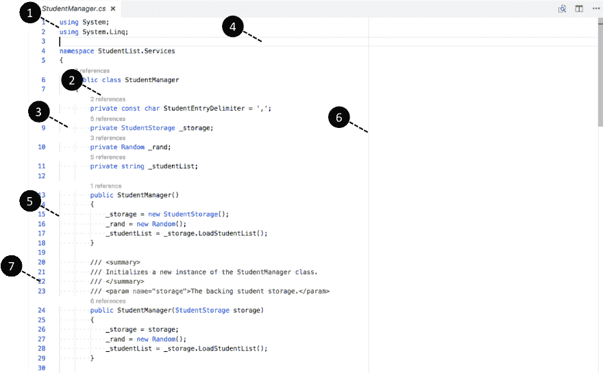
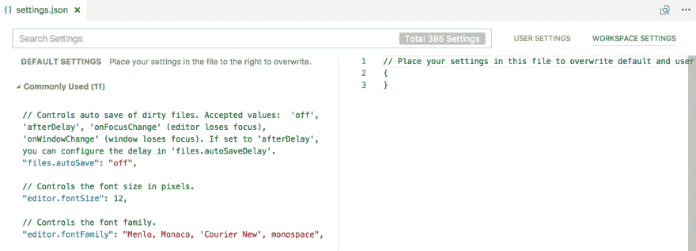
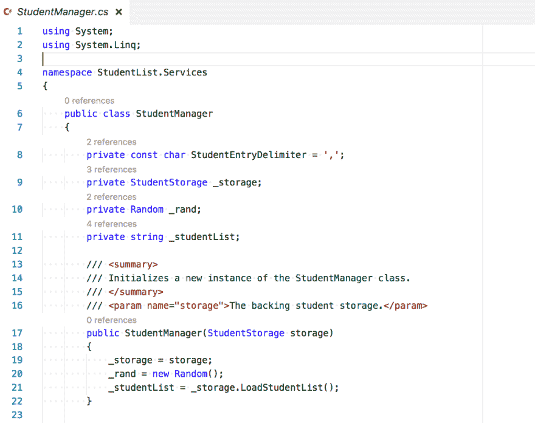
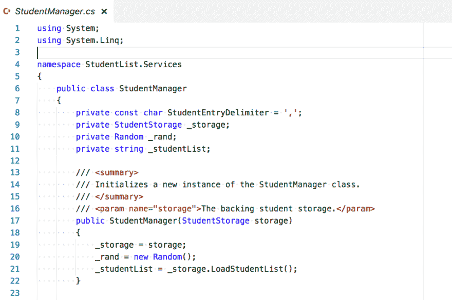
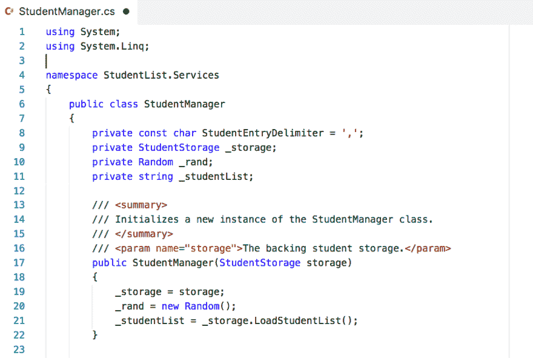
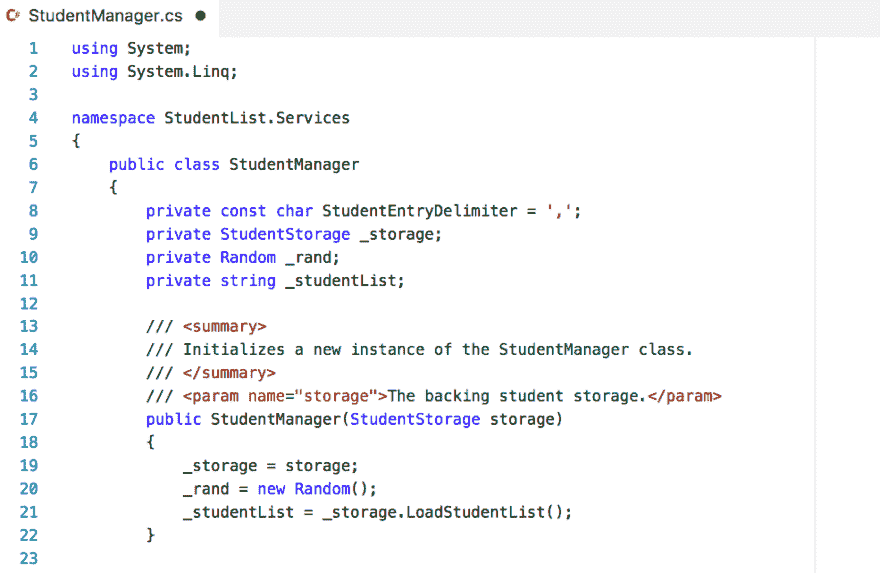
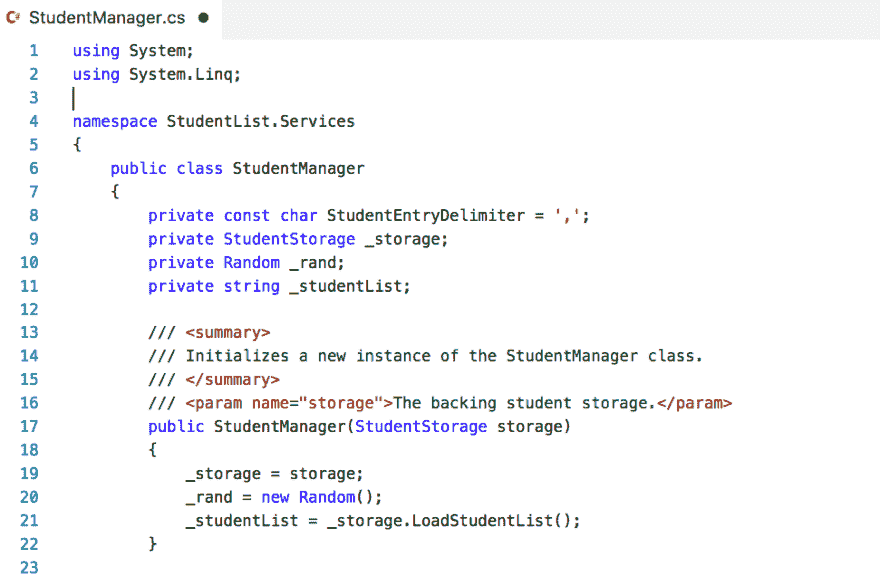

# Visual Studio 代码:6 个设置照亮你的代码截图。

> 原文:[https://dev . to/andrewjbyrne/visual-studio-code-6-settings-to-light-up-your-code-截图](https://dev.to/andrewjbyrne/visual-studio-code-6-settings-to-light-up-your-code-screenshots)

用 VS 代码？经常截图你的代码？这里有一个简单的技巧，可以帮助你每次都获得干净、清晰的代码截图。

[T2】](https://res.cloudinary.com/practicaldev/image/fetch/s--tERumdEb--/c_limit%2Cf_auto%2Cfl_progressive%2Cq_auto%2Cw_880/https://github.com/AndrewJByrne/assets/blob/master/i/practical-dev/1/pablo-11.png%3Fraw%3Dtrue)

每当我需要向某人解释一些事情时，我不可避免地会径直走向白板或餐巾纸，以梳理出我试图传达的可视化内容。我不能画画来拯救我的生命，但这并不重要。我用足够多的时间来表达我的观点。我目前作为课程创建者/讲师的角色，强化了我的信念，即我可以通过精心选择合适的交流媒介——文字、视频、图片、截屏甚至代码本身——来传递更多的知识。

为了说明我在这里要解决的问题，让我们用下面的截图来突出它...

[T2】](https://res.cloudinary.com/practicaldev/image/fetch/s--QZYMa6wY--/c_limit%2Cf_auto%2Cfl_progressive%2Cq_auto%2Cw_880/https://github.com/AndrewJByrne/assets/blob/master/i/practical-dev/1/annotate-screen2.png%3Fraw%3Dtrue)

这是我在编写代码时在 VSCode 中的典型设置。如您所见，我已经使用 VS 代码设置的强大功能为自己的需求定制了编辑器。然而，当我想抓取代码的截图时，有太多的脚手架挡住了我的路。在本文中，我将通过调整我的 VS 代码设置来解决以下问题。

*   字体太小
*   脚手架方面的屏幕噪音太大

> 为什么 VS 代码？最近我在 edX 上发表了我的第一个课程，[写专业代码](https://www.edx.org/course/writing-professional-code-microsoft-dev275x)。在这个课程中，我会谈到源代码控制，如何让你的代码更可读，单元测试等等。我选择的编辑器是 Visual Studio 代码，主要是因为它是跨平台和免费的。是的，我为微软工作，但我确实觉得 VS Code 是手头工作的合适工具。VS 代码有太多让人喜欢的地方，也许有一天我会写一封关于它的情书。Ben Halpern 最近写了一篇[的好文章，讲述了他为什么转而使用 Visual Studio 代码](https://dev.to/ben/why-i-switched-from-atom-to-visual-studio-code)，这应该会给你一些关于这个编辑器选择的独立见解。

让我带你看一下我在上一张截图中显示的每个编号的项目，解释它的作用和我为什么使用它，然后我如何为了制作像样的截图而改变每个项目。但是首先...

## 你知道吗？

Visual Studio 代码具有非常强大的设置、自定义和可扩展性功能，可以真正帮助您使编辑体验满足您的个人需求。在设置方面，您可以修改的所有内容都可以在一个简单的 **settings.json** 文件中获得。这里是我的机器上我的 settings.json 的一瞥。

[T2】](https://res.cloudinary.com/practicaldev/image/fetch/s--vr2sMOEs--/c_limit%2Cf_auto%2Cfl_progressive%2Cq_auto%2Cw_880/https://github.com/AndrewJByrne/assets/blob/master/i/practical-dev/1/settings-json2.png%3Fraw%3Dtrue)

在 VS 代码中，你可以在 macOS 上用 **Ctrl+、**或 **⌘、**访问这个文件(注意逗号是命令的一部分！).如您所见，每个设置都提供了默认值和丰富的注释。随着 VS 代码团队每个月的更新，可用的设置被调整，以确保开发人员从这些定制中获得最大收益。在前面的屏幕截图的右上角，我们看到设置的范围可以是您的工作区或您，即用户。所以，我一打开 VS 代码就可以使用的典型设置是我的*用户设置*。我为当前打开的工作区更改的设置被称为我的*工作区设置*。

> 我将利用本文中的工作区设置，因为我为了清理我的编辑器和拍摄漂亮的屏幕截图而对设置所做的更改是对打开的工作区的临时设置更改。

所以，现在我们知道了背景在哪里，让我们调整它们来显示它们如何影响我们看到的东西。

## 1。亲爱的，我把字体变大了！

我想解决的第一个问题是，当作为截图的一部分查看时，我用于编码的默认字体大小不太好看。正如前面的第一张截图所示，字体太小，无法阅读。缩放级别由设置**窗口控制。缩放级别**。我在工作区设置中将其设置为`"window.zoomLevel": 2`

这给了我以下的字体大小的改进。

[T2】](https://res.cloudinary.com/practicaldev/image/fetch/s--wy7EVt7I--/c_limit%2Cf_auto%2Cfl_progressive%2Cq_auto%2Cw_880/https://github.com/AndrewJByrne/assets/blob/master/i/practical-dev/1/setting-1-1.png%3Fraw%3Dtrue)

## 2。取下镜头

在 Visual Studio 系列产品中，CodeLens 是一个非常有用的特性。它基本上在编辑器中为您提供了关于您当前正在查看的代码的上下文信息。在我在本文中展示的第一个截图中，您可以看到 CodeLens 在工作，它向我们展示了存在多少对字段、方法、构造函数等的引用。编码时，这些信息非常有用，但在截图时就没那么有用了，除非你说的是那些引用或其他上下文信息。我通过在我的工作区设置中设置`"editor.codeLens": false`并保存更改，将它们从我的截图中删除。一旦这样做了，我得到了以下代码镜头标记删除...

[T2】](https://res.cloudinary.com/practicaldev/image/fetch/s--4ndnzIKV--/c_limit%2Cf_auto%2Cfl_progressive%2Cq_auto%2Cw_880/https://github.com/AndrewJByrne/assets/blob/master/i/practical-dev/1/setting-2.png%3Fraw%3Dtrue)

## 3。白鬼消失了！

开个玩笑，我实际上是指去除空白渲染，但是那太无聊了。你在我的截图中看到的那些小点是空白的，有时有助于看到一切是如何对齐的。截图和截屏？我看不到这些点的值，所以让我们通过设置`"editor.renderWhitespace": "none"`来移除它们，最后我得到...

[T2】](https://res.cloudinary.com/practicaldev/image/fetch/s---CL6kYzD--/c_limit%2Cf_auto%2Cfl_progressive%2Cq_auto%2Cw_880/https://github.com/AndrewJByrne/assets/blob/master/i/practical-dev/1/setting-3-2.png%3Fraw%3Dtrue)

## 4。失去亮点

我必须承认，我有点纠结。我所说的特性，在第一个屏幕截图中显示为数字 4，是编辑器中当前行周围的浅灰色突出显示。对于截图，我觉得很吵，所以我想删除它。对于截屏来说，这没有坏处，可能会帮助观众更容易地看到你从一行移到另一行。也就是说，我在这里用设置`"editor.renderLineHighlight": "none"`删除了它，这样我就有了以下微妙的更新...

[T2】](https://res.cloudinary.com/practicaldev/image/fetch/s--OEXSbaWz--/c_limit%2Cf_auto%2Cfl_progressive%2Cq_auto%2Cw_880/https://github.com/AndrewJByrne/assets/blob/master/i/practical-dev/1/setting-4.png%3Fraw%3Dtrue)

## 5。缩进参考线？电脑说，不！

缩进参考线(第一张截图中的第 5 项)帮助我保持整洁。现在，完全公开，我从来没有离开他们很长一段时间，看着我的代码崩溃到一团糟，我怀疑这种情况会发生。编辑器太复杂了，不会让我搞砸，在这一点上我已经完善了一种风格，这样当我产生难闻的代码和结构时，我可以很快看到。然而，我不介意缩进指南打开，除非是在制作截图和截屏的时候。因此，借助`"editor.renderIndentGuides": false`的魔力，我到达了下面这个快乐的地方:

[T2】](https://res.cloudinary.com/practicaldev/image/fetch/s--W9Z-y602--/c_limit%2Cf_auto%2Cfl_progressive%2Cq_auto%2Cw_880/https://github.com/AndrewJByrne/assets/blob/master/i/practical-dev/1/setting-5.png%3Fraw%3Dtrue)

## 6。纵队，解散！

我没有在某个宽度后自动换行，而是在第 80 列启用了一个列标记，并密切关注我的代码，以确保我不会失控并超出该宽度太多。在这一点上，80 是历史的和任意的，但它确实意味着我的大部分代码可以整齐地放入博客帖子中，而不需要太多的水平滚动。当演示代码和显示截图时，我不认为 marker 增加了价值，事实上可能会减少。因此，我在用删除所有标尺定义(空数组)的设置`"editor.rulers": []`截图时删除了它。这给了我最终的干净状态，如下所示:

[T2】](https://res.cloudinary.com/practicaldev/image/fetch/s--38FpbWI5--/c_limit%2Cf_auto%2Cfl_progressive%2Cq_auto%2Cw_880/https://github.com/AndrewJByrne/assets/blob/master/i/practical-dev/1/setting-6.png%3Fraw%3Dtrue)

*“但是等等 Andrew”*，我听到你说，*“你第一张截图的第 7 项呢”*？

好问题，我的朋友。第 7 项显示行号。行号在描述代码时非常有用，例如在代码评审中。我也在截图和截屏中使用它们。它们整齐地叠放在所有动作的左边，非常方便。所以，我让这些保持启用状态。另外，我答应你六个设置*变化*，六个就是你得到的:-)

## 音乐结束

现在你有了它，当你想在没有一些日常搭建的噪音的情况下开始拍摄你的代码的漂亮截图时，在 VS 代码中很容易设置的六个设置。在这里，它们都被分组在一起，所以你可以更容易地复制和粘贴。

```
"window.zoomLevel": 2,
"editor.codeLens": false,
"editor.renderWhitespace": "none",
"editor.renderLineHighlight": "none",
"editor.renderIndentGuides": false,
"editor.rulers": [] 
```

我希望你发现这个技巧很有用，并且希望听到关于设置调整或者你在 VS 代码设置中使用的其他效率。

直到下一次，这里有一个本文提到的所有变化发生在你眼前的动画:-)

[T2】](https://res.cloudinary.com/practicaldev/image/fetch/s--JuK3Iwuy--/c_limit%2Cf_auto%2Cfl_progressive%2Cq_66%2Cw_880/https://github.com/AndrewJByrne/assets/blob/master/i/practical-dev/1/changes.gif%3Fraw%3Dtrue)