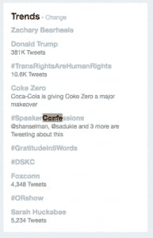

# 我从(共同)启动#SpeakerConfessions 中学到了什么

> 原文：<https://dev.to/geekygirlsarah/what-i-learned-from-co-starting-speakerconfessions-1h66>

TL；dr:跳到最后，看看我从成千上万条推文中看到的具体趋势。或者继续阅读完整的背景和统计数据。

标签标签

这是一个简单的对话。周三上午，我和 [Nate Taylor](https://twitter.com/taylonr) 谈论了我对会议的一些想法和感受，包括一些原因，在很大程度上，[我今年没有在会议上发言](https://geekygirlsarah.com/2017/07/27/why-i-stopped-submitting-talks-to-conferences-this-year/)。我对他说:

> 还有一件有趣的事情，我希望我听到更多的是那些已经谈论了一段时间的人谈论他们所面临的经历。他们仍然经常等到最后一分钟。他们觉得尽管一再成功，他们还是会悲惨地失败。以及他们觉得自己将会没有主意了(就像你说的)。如果能经常看到这些就好了。
> 
> 这很奇怪。我知道这些东西。然而…我的大脑只是说“你是个失败者，莎拉”

Nate 拿着它跑了起来，并以#SpeakerConfessions 的标签发布了这条推文:

> 每一年，我都担心我已经没有话题了。[# speaker confessions](https://twitter.com/hashtag/SpeakerConfessions?src=hash)[@ geekygirlsarah](https://twitter.com/geekygirlsarah)[@ Arthur doler](https://twitter.com/ArthurDoler)
> 
> —内特·泰勒(@ taylonr)[2017 年 7 月 26 日](https://twitter.com/taylonr/status/890223560517713920)

他把我和另一位演讲者亚瑟·多勒(Arthur Doler)联系在一起，我们都认识，并在各种会议上一起发言。我说出了我自己的一些自白:

> 我的第一次会议演讲非常成功。我一直担心从那以后我再也不会有成功的演讲了。[# speaker 会话](https://twitter.com/hashtag/SpeakerConfessions?src=hash)
> 
> —Sarah Withee([@ geekygirlsarah](https://dev.to/geekygirlsarah))[2017 年 7 月 26 日](https://twitter.com/geekygirlsarah/status/890225153258516480)
> 
> 我提交了一些演讲，我在不到一个小时的时间里就写好了摘要。截止时间前一小时。[# speaker 会话](https://twitter.com/hashtag/SpeakerConfessions?src=hash)
> 
> —Sarah Withee([@ geekygirlsarah](https://dev.to/geekygirlsarah))[2017 年 7 月 26 日](https://twitter.com/geekygirlsarah/status/890228256770805761)
> 
> 当我演讲时，我想知道谁会过来告诉我有重大的问题和错误，或者我完全错了。[# speaker 会话](https://twitter.com/hashtag/SpeakerConfessions?src=hash)
> 
> —Sarah Withee([@ geekygirlsarah](https://dev.to/geekygirlsarah))[2017 年 7 月 26 日](https://twitter.com/geekygirlsarah/status/890229822768783360)
> 
> 如果我同时作为一个著名的“超级演说家”进行演讲，我经常会想，是否有人会出现在我的面前。[# speaker 会话](https://twitter.com/hashtag/SpeakerConfessions?src=hash)
> 
> —Sarah Withee([@ geekygirlsarah](https://dev.to/geekygirlsarah))[2017 年 7 月 26 日](https://twitter.com/geekygirlsarah/status/890231023182778369)
> 
> 我通常表现得非常自信。我已经花了一个小时在超级焦虑和给自己做心理准备之前。[# speaker 会话](https://twitter.com/hashtag/SpeakerConfessions?src=hash)
> 
> —Sarah Withee([@ geekygirlsarah](https://dev.to/geekygirlsarah))[2017 年 7 月 26 日](https://twitter.com/geekygirlsarah/status/890232760174084096)

内特提供了更多的信息，亚瑟也提供了[。这很酷，一些人开始附和。一开始我开始喜欢并转发所有的推文。](https://twitter.com/search?f=tweets&vertical=default&q=%23SpeakerConfessions%20from%3Aarthurdoler&src=typd)

到了午饭时间，我离开办公桌回来时，我的屏幕上已经挤满了推文。这真是太棒了。

Nate 在 2:45 左右注意到这个标签像病毒一样传播:

<figcaption id="caption-attachment-742"># speaker confessions 推特上的热门话题。(图片由内特·泰勒提供。)</figcaption>

当一天的工作结束的时候，#SpeakerConfessions 的推文积压得太多了，我都跟不上了！再也不可能继续工作并阅读每条推文了。

而且有如此多的多样性！我看到了来自全新演讲者的推文，他们正在给已经在这个行业中演讲超过 25 年的人做他们的第一次演讲。我见过年轻人和老年人发微博。我看到了初级和高级。我看到了开发人员、设计师、经理、scrummasters 等等。我看到了令人捧腹的推文，悲伤的推文，以及我真想拥抱人们的推文。喜欢说话的人，讨厌说话的人，不说话却怀念说话的人。拥有不到 50 名粉丝的人和拥有超过 50，000 名粉丝的人。人们的广度让我着迷，内特也同意这一点。

一夜之间平静下来(至少对我们来说)，但周四又恢复了。现在是星期五，它仍然很强劲！

**统计**(经由 [TalkWalker](https://www.talkwalker.com/app/page#/search#g=SEARCH&t=RESULTS&m=TOPICS_CATEGORY&i=417cdc0b-73f2-4149-91db-1d0fd6a4939f&tz=America%2FNew_York&co=project&cid=94079913-746a-48d9-a717-122fb5a35635) ，截止 2017 年 7 月 27 日，美国中部时间晚上 11:35):

仅在 Twitter 上，就有超过 3000 次提及，超过 5400 次互动，超过 190 万人参与。

世界各地的人们为此做出了贡献！当然来自美国(60.4%)，但是来自英国(11.3%)、澳大利亚(4.7%)、德国(3.6%)以及其他国家的许多人也做出了贡献。。

我注意到一件有趣的事情是性别比例是 61.4%男性，38.6%女性。因为每当会议说他们找不到女性发言时，就有一大堆女性在这个问题上发言！(注意:我不知道它是如何确定这一点的，也不知道它对非二进制或其他个体做了什么。)

根据这个网站，我发的这条微博(！！)影响最大(97 条转发，407 人参与，310 个赞):

> 即使只有一个人在我演讲后告诉我是我启发了他们，这也让我的工作变得值得。所以告诉我们什么时候会发生！[# speaker 会话](https://twitter.com/hashtag/SpeakerConfessions?src=hash)
> 
> —Sarah Withee([@ geekygirlsarah](https://dev.to/geekygirlsarah))[2017 年 7 月 26 日](https://twitter.com/geekygirlsarah/status/890314180632432641)

这是一种趋势，而美国领导人正在抨击变性人，立法部门也在努力摧毁医疗保健。还不错。也许这是一个很好的分散美国现在的恐怖的方法。

## 莎拉，你学到了什么？

很高兴你问了！

首先，我认为如果这个标签只是关于演讲者的建议，它就不会起作用。(肯定有人提供建议，而不是忏悔。我真的认为这是非常个人化的事实，许多人分享了他们的忏悔，它之所以成功是因为它引起了许多演讲者的共鸣，年轻人和老年人，新的和有经验的。

有许多非常常见的主题(点击链接查看我可以轻松搜索的集合):

*   冒名顶替综合征:新发言人觉得自己不够好，无法谈论事情。有经验的演讲者觉得自己不够好，不能谈论事情。该领域的专家认为他们不够好，不能谈论他们的话题。(事实证明，如果你懂一些东西，并能把它组织成一场演讲，你就有资格发表演讲！)
*   对其他演讲者的恐吓:让经验丰富的演讲者参加演讲是一种恐吓。有和你讲同样东西的演讲者是令人生畏的。事实证明，即使是任何参加讲座的*演讲者也会变得令人生畏。*
*   准备:很多人觉得准备不足。许多人在 T2 花了很多时间准备，却感到毫无准备。有些人甚至花了超过 100 个小时的[时间，试图让自己有足够的准备。](https://twitter.com/search?l=&q=100%20hours%20%23SpeakerConfessions&src=typd)
*   [提交学习](https://twitter.com/search?f=tweets&vertical=default&q=learn%20propose%20OR%20submit%20%20%23SpeakerConfessions&src=typd):你可以在不知情的情况下提议会谈。有些人这样做是为了在某个截止日期前学习某个特定的主题。(我已经这样做了三次了。其中一个成为了可笑的流行话题。)
*   拖延:有时他们直到截止日期那天才提交报告。还是几个小时前。或者一小时前。有时人们会在一周前写下他们的演讲。或者是一周。或者前一天。或…的日子。甚至几分钟前的*。他们甚至在飞机上或酒店里写。(实际上，我对*和*演讲者似乎是如此成功的拖延者印象深刻。)*
*   笔记:有些人写下演讲者的笔记，担心会忘记一些东西。有些是因为他们害怕自己会冻僵。有些人写了之后就忘了遵守。有些人甚至不这样做，因为他们想尝试以不同的方式与观众联系。
*   [恐惧](https://twitter.com/search?f=tweets&vertical=default&q=fear%20%23SpeakerConfessions&src=typd):光是这个词就被多次提及。担心观众会怎么想，担心搞砸，担心结束得太早/太晚，等等。
*   [反馈和评论](https://twitter.com/search?f=tweets&vertical=default&q=comment%20OR%20comments%20OR%20feedback%20%23SpeakerConfessions&src=typd):大多数发言人*希望从出席者那里得到*反馈。大多数演讲者甚至希望得到负面反馈，这样他们就可以改进。通常负面反馈也是针对个人的。(我最喜欢的新想法:写下你想要的反馈，并确保 talk 包括这一点。“TDD 你的谈话”)
*   紧张和焦虑:许多演讲者，即使有过一次演讲经验，也会在演讲前变得异常紧张或焦虑。有些人在演讲时会颤抖(甚至到了不用激光笔或喝水的地步，因为害怕会变得明显)。
*   自信:许多演讲者看起来很自信，然而，承认他们实际上并不自信。
*   [观众互动](https://twitter.com/search?f=tweets&vertical=default&q=audience%20%23SpeakerConfessions&src=typd):许多演讲者*希望与观众进行*互动。有时是为了意识到他们正在学习并与材料联系起来，有时只是为了知道人们是醒着的。
*   [问题](https://twitter.com/search?f=tweets&vertical=default&q=q%26a%20OR%20questions%20%23SpeakerConfessions&src=typd):一些演讲者*不想*互动，因为他们害怕会答错观众的问题，或者只是不知道答案。其他人想要提问，因为即使是演讲者也可以从这个过程中学到更多，这是一个与观众互动的好方法。
*   积极的结果:演讲者知道所有投入的工作都有助于帮助他人，或者学习新的东西，他们会很高兴。如果你从谈话中得到什么，让说话的人知道！

也有很多不是典型经历的推文。由于太多的推文，它们更难被发现和提取。有很多有趣的故事，一些令人难以置信的恐怖故事，还有一些非常尴尬的故事。

**内特的更多想法**

内特在自己的博客上写下了自己对这个标签的看法。他的文章叫做[网络的力量](http://taylonr.com/the-power-of-networking/)。我建议你也去看看！

**结论**

我在这篇文章的开头提到过，我知道作为一名公共演说家有很多事情，有好有坏，从别人那里听到这些会很好。在内特的帮助下，成百上千的人发布了数千份告白。当我试着阅读尽可能多的推文时，看到这么多真正成功的演讲者经历了这么多和我一样的情况，令人难以置信地安心和鼓舞。我发现我的信心能够上升，因为我能够向新的演讲者保证他们可以做到这一点，并为那些与我一样挣扎的人提供我发现的提示和技巧。也许最重要的是，我看到许多其他人从我们的这个小实验中受益。我也希望许多新的演讲者能够看到这一点，以获得一些保证，即所有发生的古怪事情可能都是完全正常的，如果他们想继续讲下去，他们应该继续讲下去。

> 第一次还是长期演讲者？没关系。看看[# speaker confessions](https://twitter.com/hashtag/SpeakerConfessions?src=hash)[# speaker confession](https://twitter.com/hashtag/SpeakerConfession?src=hash)——如此鼓舞人心< 3
> 
> —达亚娜(@ DajanaGuenther)[2017 年 7 月 27 日](https://twitter.com/DajanaGuenther/status/890628445759094785)