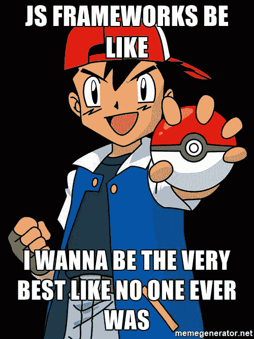
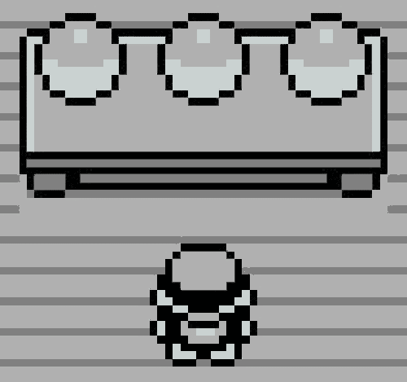
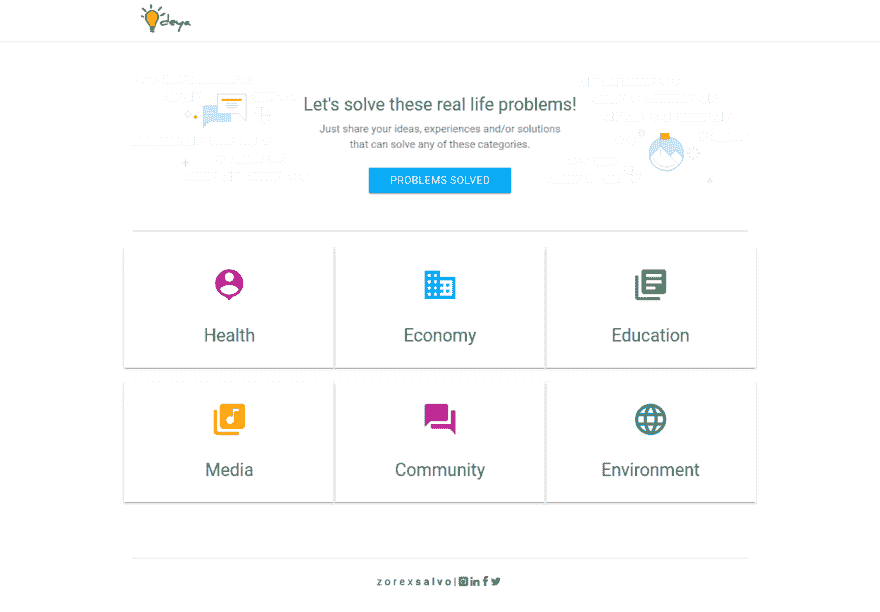

# Vue.js 我选你！

> 原文:[https://dev.to/zorexsalvo/vuejs-i-choose-you](https://dev.to/zorexsalvo/vuejs-i-choose-you)

### 前段时间...

我真的被 javascript 的庞大世界所淹没。当我把脚伸进去的那一刻，我吃了一惊。

你能想象吗？近两年来，我一直否认我不需要学习 javascript 或者至少尝试用它写脚本。在我的辩护中，我仅仅依靠 ASP.NET C #如何将数据传递给模板，并且仅仅使用来自模板、样板文件和前端框架的默认 javascript 文件，就完成了我的论文并且大学毕业，**就像**一样。幸运的是，我得到的第一份工作是创建一个 WEB API。一切都是服务器端的，所以我不必做任何涉及前端开发的事情(*我又一次躲过了不可避免的*)。但是....后来在完成那个项目后，我被要求为它创建一个 webtool，带有仪表板、统计数据等。有那么一瞬间，我以为我可以不用再写任何 Javascript 了。我以为 Django 模板就够了，我错了，我没准备好，但我有任务要完成。从那一刻起，我心里想:“你需要学习 javascript，你需要！”。

### 但在此之前...

我做了你们中的一些人也做过的事。寻找前所未有的最好的 js 框架。*【搜索谷歌| 2017 年度热门 JavaScript】*

[T2】](https://res.cloudinary.com/practicaldev/image/fetch/s--DuAq9HtK--/c_limit%2Cf_auto%2Cfl_progressive%2Cq_auto%2Cw_880/http://zorexsalvo.com/img/iwannabe.jpg)

根据这个搜索关键词，2017 年 Q2 排名前几位的 javascript 框架是...*鼓点* **棱角**、**反应**、**余烬**、**流星**、 **Vue** 等等。每个人都有自己的顶层 JS 框架。对我来说，我只需要开始。所以我选了最容易的一个，它能让我很容易就上瘾。每个框架有这么多博客和文章，当我浏览这些文章和博客时，我已经记住了这些关键字:简单明了。所以也许你现在已经知道为什么 **Vue.js，我选择你了！**。

### 简单易行

对于一个初学者来说，这些话就像一块磁铁。所以马上就选了。这足够让我开始了。

[T2】](https://res.cloudinary.com/practicaldev/image/fetch/s--H9_ilOJ3--/c_limit%2Cf_auto%2Cfl_progressive%2Cq_auto%2Cw_880/http://zorexsalvo.com/img/choosejs.png)

我用 vuejs 做的第一件事就是创建一个 Todo 应用程序。我在 youtube 上找到了它的一步一步的视频教程:Academind。非常有趣。我没想到用 frontend 编码会非常有趣和容易。但是说实话，有了那个视频教程(< 1 小时)，有了这么多的魔法，我不知道 vue 是怎么做到的，我没学到多少，但是我的收获是我体验到了 Vue 的神奇。

既然真的被炒作了，那我就继续我的学习和实验吧。我从头开始。jsfiddle 上的代码脚本，了解了指令、dom 交互、列表呈现和条件。在我学习了所有的基础知识之后，我创建了一个简单的 CRUD 应用程序，名为 ideya，是我的想法的仓库。我的[博客](http://zorexsalvo.com)里也有一些 vuejs。

[T2】](https://res.cloudinary.com/practicaldev/image/fetch/s--aRa8sTkD--/c_limit%2Cf_auto%2Cfl_progressive%2Cq_auto%2Cw_880/http://zorexsalvo.com/img/ideya.png)

完成这个简单的项目后，我真的为自己感到骄傲。但是我对自己在 Vue 的技术还是不满意。当我浏览文档时，我阅读了关于 vue-cli、webpack、组件和更多的内容。我不会就此罢休。在这个框架中，仍然有许多令人兴奋的事情需要我去探索。