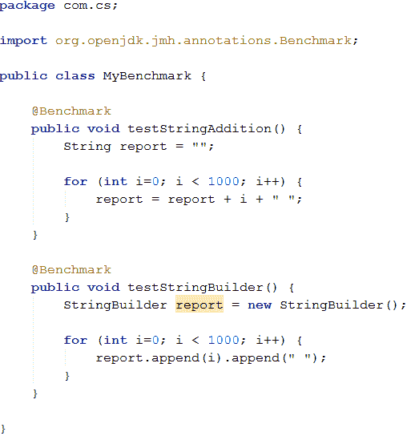
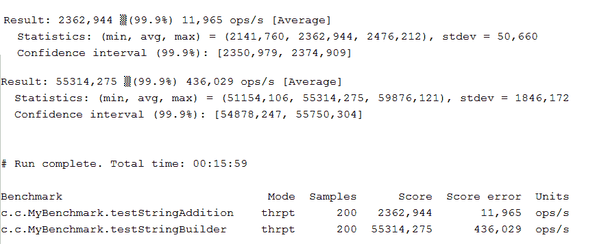

# 用 JMH 写微基准

> 原文:[https://dev . to/schreiber _ Chris/writing-micro benchmarks-with-jmh](https://dev.to/schreiber_chris/writing-microbenchmarks-with-jmh)

今天我想谈谈我关心的一个话题:表演。我将快速概述一下它不常涉及的一个方面:微基准测试。我们将看到如何使用 JMH 工具实现微观基准。

## 为什么要用微标杆，为什么要用 JMH？

当我们编码时，我们经常想要快速评估一个算法、一个实用方法或者我们正在编写或使用的任何组件的性能。我们经常做的是在一个非常基本的主类中编写一些简单的代码，调用我们想要检查的测试，并使用系统时钟测量调用所经过的时间。不幸的是，这是一个非常不精确的方法，只有当它清楚地显示非常差的性能时，它才是一个充分的指标。这种性能测试与我们想要执行产品代码的环境大相径庭:

*   这种单一的衡量方法很容易出错，而且不能提供可靠的统计数据
*   只有少量执行的简单测试享受不到 JVM 优化的好处，比如 JIT (Just in Time)编译器把频繁执行的字节码编译成本机代码来优化执行时长。这种优化只能在多次调用后应用，这样 JIT 编译器就可以检测到可能的增益。
*   由于多线程并发访问及其对性能的所有影响，很难再现一个生产环境。为了解决这些问题，OpenJDK 项目开发了一个工具，专门用于 JVM 上运行的语言的基准测试，称为 JMH。该框架旨在自动重复执行我们的代码，模拟生产环境并收集有关代码性能的统计数据。当然，JMH 可以用于 Oracle 的官方 JDK，而不仅仅是 OpenJDK 安装。

## 项目设置

JMH Maven 原型是可用的，这使得使用命令行设置项目变得非常容易:

`mvn archetype:generate
-DinteractiveMode=false
-DarchetypeGroupId=org.openjdk.jmh
-DarchetypeArtifactId=jmh-java-benchmark-archetype
-DgroupId=com.cs
-DartifactId=poc-jmh
-Dversion=1.0`

该模块将包含所有必要的依赖项和 Maven 插件，还将创建一个默认的 MyBenchmark 类。这个类将包含一个空的带注释的方法。像许多其他 Java 框架一样，JMH 也在使用注释。基准测试类类似于我们每天编写的单元测试类(我希望你也是！；-)
执行基准测试(意味着执行用@Benchmark 注释的类)需要用众所周知的命令构建我们的 Maven 项目:

`mvn clean install`
然后我们只要执行生成的 jar 文件:
`java -jar target/benchmarks.jar`

这将启动一系列迭代(在预定义的持续时间内连续执行我们的代码),并在最后生成一个报告。

## 用法举例

让我们考虑一个大家都知道的简单用例:循环中的字符串连接。我们将比较在字符串对象上使用+运算符的简单实现和 StringBuilder 用法:

 ...

## 处理更复杂的案件

在使用默认的执行参数实现了一个非常简单的 JMH 基准之后，我们将看看如何定制我们的基准。正如本文开头所解释的，JMH 旨在提供接近生产环境的执行。这是通过一些参数调整实现的，例如:

*   迭代的次数
*   每次迭代的持续时间
*   基准类型(例如，我们可以测量一段时间内的执行次数或平均执行时间)
*   用于模拟并发访问的线程数量
*   我们希望在其上执行基准的 JVM 实例的数量，以及它们的参数
*   每个场景中要执行的预热迭代次数。这些迭代不会出现在计算的统计数据中，但是当我们希望了解 JIT 编译器优化后代码的行为时，这是一个非常有用的特性。这不是 JMH 特性的详尽列表。如果你想更深入，我邀请你看看它的众多例子【官方文件】[官方文件](http://hg.openjdk.java.net/code-tools/jmh/file/tip/jmh-samples/src/main/java/org/openjdk/jmh/samples)。

## 结论

JMH 是一个非常有用和强大的工具，通过使用微基准来构建、执行和监控我们的代码。这是一种非常有趣的方法，可以完成更传统的性能测试，比如负载测试。它可以为我们提供关于代码某些精确部分的非常有价值的数据。与单元测试一样，要测试的代码越解耦，编写基准测试就越简单，结果也会更准确！
你可以在[我的 Github 库](https://github.com/ChristopheSchreiber/poc-jmh)上找到这篇文章的来源