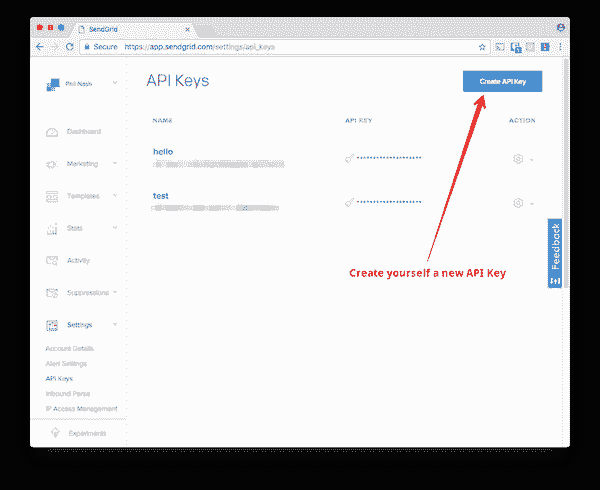
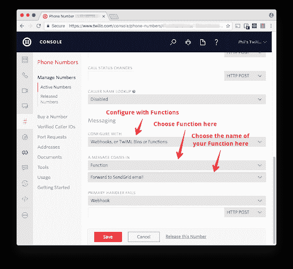
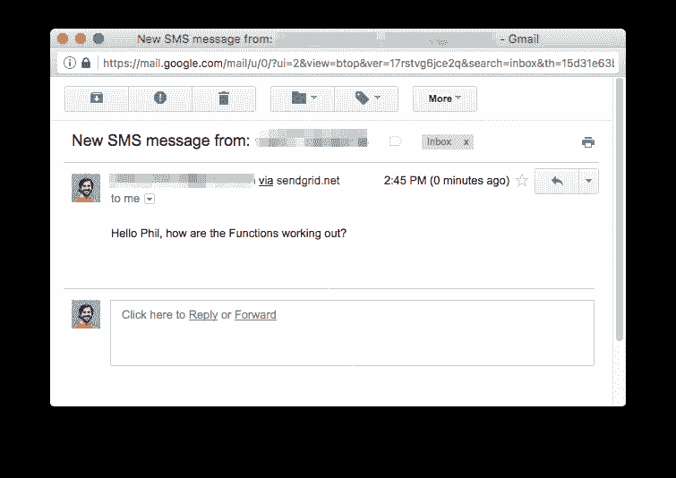

# 使用 Node.js、SendGrid 和 Twilio 功能将收到的短信转发到电子邮件

> 原文:[https://dev . to/twilio/forward-incoming-SMS-messages-to-email-with-nodejs-send grid-and-twilio-functions](https://dev.to/twilio/forward-incoming-sms-messages-to-email-with-nodejs-sendgrid-and-twilio-functions)

如果你想在电子邮件中阅读发送到你的 Twilio 号码的短信，那么我今天有一个巧妙的解决方案。我们将使用 [Twilio 函数](https://www.twilio.com/functions)和 [SendGrid](https://sendgrid.com/) 将短信直接转发到您的电子邮件地址。

## 你需要的东西

*   [一个 Twilio 账户](http://twilio.com/try-twilio)和一个可以接收短信的电话号码
*   [一个 SendGrid 账户](http://sendgrid.com/)

## 让我们得到建筑

将 SMS 消息转发到您的电子邮件地址的整个操作将只需要一个函数，因此我们将使用一个 [Twilio 函数](https://www.twilio.com/functions)来构建它。如果您没有听说过 Twilio 函数，它们是一个无服务器环境，您可以使用它来运行 Node.js 代码。这意味着我们不需要开发环境或部署位置，我们只需用 Twilio 编写代码并使用它。

不过，我们确实需要配置一些变量。

## 首先启动，配置

为了使用 SendGrid API 发送电子邮件，我们需要一个 SendGrid API 密钥。前往 SendGrid 仪表板中的 [API Keys 区域，为自己创建一个。](https://app.sendgrid.com/settings/api_keys)

[T2】](https://res.cloudinary.com/practicaldev/image/fetch/s--pzHVD_8g--/c_limit%2Cf_auto%2Cfl_progressive%2Cq_auto%2Cw_880/https://twilioinc.wpengine.com/wp-content/uploads/2017/07/8gjvwk4h-J5zl3Wt1CLme-6VhpYrEtbbbxlRm5mUsAgCrSrikZbOR5un7vh5oAkrIP_NiqauaYR-1EedgRXOtmMsA4NtCf1yn-XyNKNlWhp0JuV8C6paezoSdtGu8yItLbeYIeU.png)

打开你的 Twilio 控制台，前往[功能配置部分](https://www.twilio.com/console/runtime/functions/configure)。添加一个名为`SENDGRID_API_KEY`的新环境变量，并粘贴新的 API 密匙。

我们还需要创建两个环境变量，一个用于接收短信的电子邮件，另一个用于发送短信。如果你在 SendGrid 中有一个[域设置，那么我建议你使用它，但是你可以使用任何你想要的电子邮件地址作为发件人，甚至是你要发送的那个。](https://app.sendgrid.com/settings/whitelabel/domains)

在环境变量部分输入这些电子邮件地址作为`TO_EMAIL_ADDRESS`和`FROM_EMAIL_ADDRESS`。

[T2】](https://res.cloudinary.com/practicaldev/image/fetch/s--5yqQzJ9E--/c_limit%2Cf_auto%2Cfl_progressive%2Cq_auto%2Cw_880/https://twilioinc.wpengine.com/wp-content/uploads/2017/07/nnprxGs1d_vwXckZNHpVaqazXH9Vti6m5eYtoz-bEhqitHJiJYHwZdT7iSih4cl775rN407zBfCJ9vwy0_3LDtLKjKNL3AaZDlpKQDDoMTRlqxbNJZ37D7-ZT1JG4940C7QnCI.png)

我们已经完成了配置，是时候写一些代码了。

### 我们去写个函数吧

前往[功能管理页面](https://www.twilio.com/console/runtime/functions/manage/)，为自己创建一个新功能。因为我们正在处理收到的短信，选择“你好短信”模板。

通常对于 Node.js，这应该是开始搜索 [SendGrid npm 包](https://www.npmjs.com/package/sendgrid)的时候，但是函数目前不允许你安装其他包。谢天谢地，有一个软件包可以帮助我们轻松地发出 HTTP 请求:[得到了](https://www.npmjs.com/package/got)。

在你的代码顶部需要`got`模块，然后删除函数内的所有内容。你应该有:

```
const got = require('got');

exports.handler = function(context, event, callback) {

}; 
```

<svg width="20px" height="20px" viewBox="0 0 24 24" class="highlight-action crayons-icon highlight-action--fullscreen-on"><title>Enter fullscreen mode</title></svg> <svg width="20px" height="20px" viewBox="0 0 24 24" class="highlight-action crayons-icon highlight-action--fullscreen-off"><title>Exit fullscreen mode</title></svg>

我们需要建立一个 SendGrid 能够理解的 API 请求。在我们将要使用的 v3 API 的文档页面上，我们需要发送一个 JSON 的[示例。让我们在函数
中用我们自己的值创建一个 JavaScript 对象](https://sendgrid.com/docs/API_Reference/Web_API_v3/Mail/index.html)

```
exports.handler = function(context, event, callback) {
  const requestBody = {
    personalizations: [{ to: [{ email: context.TO_EMAIL_ADDRESS }] }],
    from: { email: context.FROM_EMAIL_ADDRESS },
    subject: `New SMS message from: ${event.From}`,
    content: [
      {
        type: 'text/plain',
        value: event.Body
      }
    ]
  }; 
```

<svg width="20px" height="20px" viewBox="0 0 24 24" class="highlight-action crayons-icon highlight-action--fullscreen-on"><title>Enter fullscreen mode</title></svg> <svg width="20px" height="20px" viewBox="0 0 24 24" class="highlight-action crayons-icon highlight-action--fullscreen-off"><title>Exit fullscreen mode</title></svg>

在这里，我们使用`event.From`来获取发送给我们的 SMS 消息的号码，使用`event.Body`来获取收到的消息的文本。`event`对象包含作为请求的一部分传递给函数的所有参数。

现在我们需要将这个对象发送给 API 来发送电子邮件。使用`got.post`向 API URL`https://api.sendgrid.com/v3/mail/send`发出 POST 请求，并传递描述请求头和请求体的 options 对象。

如果请求成功，我们将返回一个空的 TwiML 响应，如果失败，我们将通过调用函数回调来记录错误。

```
 got.post('https://api.sendgrid.com/v3/mail/send', {
    headers: {
      Authorization: `Bearer ${context.SENDGRID_API_KEY}`,
      'Content-Type': 'application/json'
    },
    body: JSON.stringify(requestBody)
  })
    .then(response =&gt; {
      let twiml = new Twilio.twiml.MessagingResponse();
      callback(null, twiml);
    })
    .catch(err =&gt; {
      callback(err);
    });
}; 
```

<svg width="20px" height="20px" viewBox="0 0 24 24" class="highlight-action crayons-icon highlight-action--fullscreen-on"><title>Enter fullscreen mode</title></svg> <svg width="20px" height="20px" viewBox="0 0 24 24" class="highlight-action crayons-icon highlight-action--fullscreen-off"><title>Exit fullscreen mode</title></svg>

这就是所有的代码！

给你的函数取一个容易记住的名字和一个路径，然后保存它。

[T2】](https://res.cloudinary.com/practicaldev/image/fetch/s--1nKMy_vY--/c_limit%2Cf_auto%2Cfl_progressive%2Cq_auto%2Cw_880/https://twilioinc.wpengine.com/wp-content/uploads/2017/07/9vyk8JRd-RBLDQ4xXORDrDWQN2iTKNJYgQE-9c1C-k8uteskEI0BNR0LLgMSp7DZkVr3pE7QA6mQQi37TrnApSWcszKEKNZ0THyhPJpzJrEHpLBDL0qVPneDlP52WXuYzCGVArc.png)

### 勾搭你的 Twilio 号

剩下要做的就是把你的 Twilio 号和你的函数联系起来。转到 Twilio 控制台的[数字部分，编辑您想要使用的数字。在“消息”部分，显示“有消息进来”，选择函数，然后从下拉列表中选择您的函数。](https://www.twilio.com/console/phone-numbers/incoming)

[T2】](https://res.cloudinary.com/practicaldev/image/fetch/s--rOdedesP--/c_limit%2Cf_auto%2Cfl_progressive%2Cq_auto%2Cw_880/https://twilioinc.wpengine.com/wp-content/uploads/2017/07/t5QyneIwNseDhtcZ2if42a0nS4jEak8rUF2EczSob807__O5OycpBayF-YOiJWjcAyxupa_vqjR81evq71WXqnXhrM0b6T7OpDvP03L3Wb2MBnZr6KsUhzsXbH9wv3-F0dKM2H4.png)

点击保存按钮，你就完成了！

### 测试

是时候测试你的新功能了。向您的 Twilio 号码发送短信并打开您的电子邮件。

[T2】](https://res.cloudinary.com/practicaldev/image/fetch/s--D7bq5vCd--/c_limit%2Cf_auto%2Cfl_progressive%2Cq_auto%2Cw_880/https://twilioinc.wpengine.com/wp-content/uploads/2017/07/l0gPA9piDWcgVbe6HdoWQVOOfxxkWjEZ2DgBJehT_IzeRVXiH71qM-slhGq92FzhXsz3cDIh0jvAreoDP2qKivYgsRmWPcFMYVoqqzgCavr5fvekwVXEoqrq7XmR88lGozmdCsM.png)

*注意:如果您没有使用 SendGrid 设置域名，请检查您的垃圾邮件文件夹中是否有该邮件。如果你和我一样使用 gmail，你可以为电子邮件地址添加一个例外，使其永远不会发送垃圾邮件，并总是接收你的新邮件。*

## Twilio 函数让管道工程变得简单

通过 Twilio 函数和 31 行 Node.js，我们使用 SendGrid API 将 SMS 消息转发到电子邮件，甚至不需要自己的服务器。Twilio 函数对于 Twilio 数这样的管道非常有用。

我对此感到兴奋，并开始了有用的 Twilio 函数的[回购，包括](https://github.com/philnash/useful-twilio-functions)[我们在这篇文章](https://github.com/philnash/useful-twilio-functions/tree/master/forward-message-as-email)中构建的函数，它们已经过测试，可供您使用。到目前为止只有几个可用的，但因为它是一个开放的回购，你可以[在问题](https://github.com/philnash/useful-twilio-functions/issues)中请求新的功能，或者通过拉请求提交你自己的功能。

我将增加回购，我也很想看到你的贡献！

关于使用 Twilio 函数或用它们构建任何很酷的东西有任何问题吗？请在下面的评论中给我留言，或者在 [Twitter](https://twitter.com/philnash) 上联系我。

* * *

*[用 Node.js、SendGrid 和 Twilio 功能将收到的短信转发到电子邮件](https://www.twilio.com/blog/2017/07/forward-incoming-sms-messages-to-email-with-node-js-sendgrid-and-twilio-functions.html)原载于 2017 年 7 月 18 日 [Twilio 博客](https://www.twilio.com/blog)。*