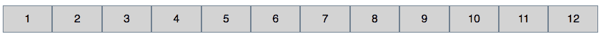
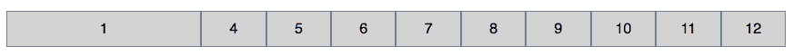
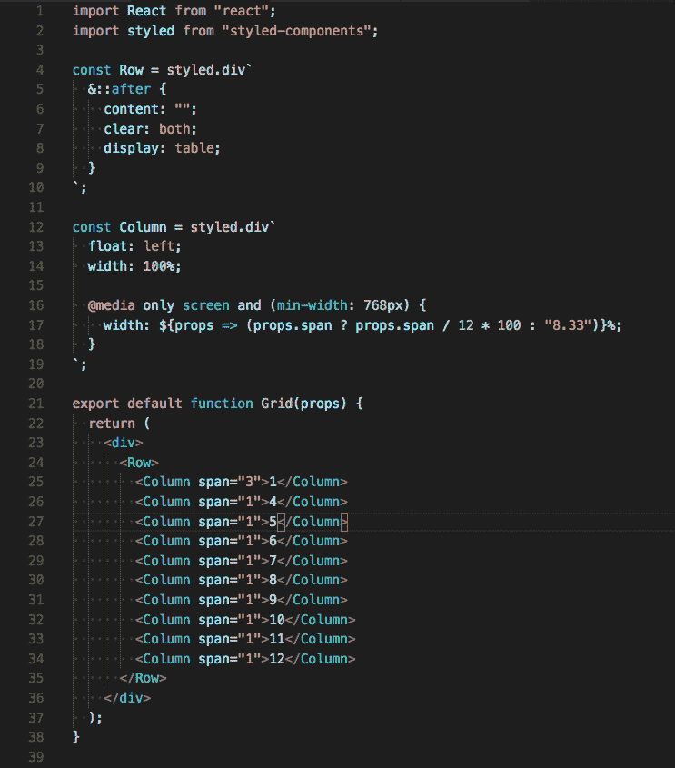
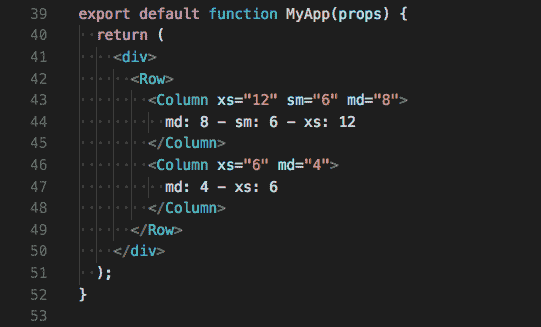
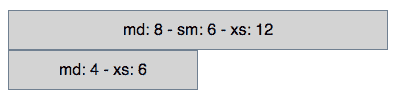
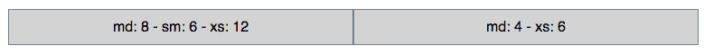
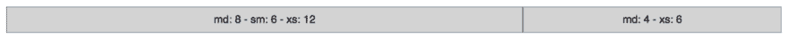

# 如何用样式化组件创建响应式 UI

> 原文:[https://dev . to/a _ reiterer/how-to-create-responsive-ui-with-styled-components](https://dev.to/a_reiterer/how-to-create-responsive-ui-with-styled-components)

使用 ReactJS 创建响应式 web 应用程序有几种方法。除了使用 Bootstrap 这样的完整框架，我还想创建一个带有样式化组件的响应式网格视图，这一点非常容易。

现在[我已经用 ReactJS 和样式化组件构建了一个实际的 web 应用](http://www.andreasreiterer.at/web-development/how-to-build-a-simple-hackernews-feed-with-styled-components/)(不可否认，是一个很小的应用)，我想知道创建一个更具响应性的应用会有多容易。更准确地说，我想知道如何创建一个响应性页面布局，就像使用 Bootstrap 很容易做到的那样，这只是一个例子。这就是我们要在这篇文章中构建的，一个简单的网格视图，它允许我们将一个网站分成多个列，当它从手机或平板电脑上打开时，这些列就会堆叠起来。

到目前为止，每当我构建一个响应式 web 页面布局时，在使用 ReactJS 时，我总是依赖于 Bootstrap 或 react-bootstrap。为什么？因为我发现它很容易使用，而且开发速度更快。

但这次不是。所以我看了一下关于构建响应网格视图的 w3schools 教程，想知道在那些华丽的图书馆背后发生了什么:

#### 响应式网格视图是如何工作的？

首先，我想简单介绍一下响应式网格视图是如何工作的。如果您已经知道这一点，请随意跳过这一部分。

通常这种网格有 12 列，总宽度为 100%。根据网站的布局，你可能不需要所有的栏目，所以可以把一些栏目合并在一起，得到一个更大的栏目。在后台真正发生的是，有一堆等宽的`div`标签向左`float`排列，所以它们排成一行。

```
.column {
  width: 8.33%;
  float: left;
} 
```

*编辑:如*[*Mauro Lionel Ocorso*](https://medium.com/@ocorsomauro)*和*[*Jean Duthon*](https://medium.com/@duthon.jean)*所述，也可以使用****flexbox****代替* `float: left;` *。然而，如果你想支持旧的浏览器，可能会有一些兼容性问题。谢谢你们指出这一点！*

[](https://res.cloudinary.com/practicaldev/image/fetch/s--FIGZLUyM--/c_limit%2Cf_auto%2Cfl_progressive%2Cq_auto%2Cw_880/https://cdn-images-1.medium.com/max/1000/1%2A6Pld5ZuXMOylEXP_1bSPjA.png) 

<figcaption>有十二列的网格</figcaption>

因为整个网格的宽度是 100%，所以每列的宽度正好是 8.33%。现在，假设我们希望在网格的开始处有一个更大的列，大小为三列或屏幕的 25%。

[](https://res.cloudinary.com/practicaldev/image/fetch/s--jc2xveKu--/c_limit%2Cf_auto%2Cfl_progressive%2Cq_auto%2Cw_880/https://cdn-images-1.medium.com/max/1000/1%2ALHlTLJZuNcrgOGg0ernv5A.png) 

<figcaption>第一列横跨前三列</figcaption>

在上图中，可以看到第一列横跨三列，导致第二列和第三列消失。真正发生的并不是一个*真实的*列跨度。第一列的宽度为 25 %,第二列和第三列被删除，因为不再需要它们。

为了实现这一点，必须做出一些改变。不是每个列都有一个 CSS 类，而是每个可能的列跨度都有一个 CSS 类。这也反映在我使用的类名中:col-1 跨越一列，col-3 跨越三列，col-12 的宽度为 100%。

```
[class*="col-"] {
  float: left;
}

.col-1{
 width: 8.33%;
}

.col-2 {...}

.col-3{
 width: 25%;
}

[...] 
```

现在唯一缺少的是，当我们从一个更小的设备上查看页面时，如何堆叠这些列。这可以通过使用媒体查询来实现(了解关于它们的更多信息[这里](https://www.w3schools.com/css/css_rwd_mediaqueries.asp))。

[](https://res.cloudinary.com/practicaldev/image/fetch/s--03aLRhEm--/c_limit%2Cf_auto%2Cfl_progressive%2Cq_auto%2Cw_880/https://cdn-images-1.medium.com/max/1000/1%2AONwpRoHIJA7FRnIErifF9A.png) 

<figcaption>从小型设备上看，这些列应该垂直堆叠</figcaption>

假设我们想在宽度小于 768px 时堆叠列。

```
[class*="col-"] {
  /*Mobile first: set the width to 100% by default*/
  width: 100%;
}

@media only screen and (min-width: 768px) {
 /* For everything bigger than 768px */
 .col-1{
   width: 8.33%;
 }

 .col-2 {...}

 .col-3{
  width: 25%;
 }
}

[...] 
```

首先，我将所有列的初始宽度设置为 100%。因为这是它在小屏幕上应该有的样子，所以也提高了页面显示的性能。通过将宽度设置为 100 %,这些列会自动垂直堆叠，所以没什么可做的了。

第二件重要的事情是我添加的`@media`规则:一旦宽度超过 768px，就使用上一个例子中的总宽度。

现在已经涵盖了基础知识，让我们看看，这是如何与反应和样式组件！

#### 用样式化组件创建基本网格视图

首先，我们将构建完全相同的网格，就像我在上一节中提到的那样:

*   它将有十二个可能的列
*   一列可以跨越 1–12 列的宽度。
*   如果总宽度小于 768px，所有列将垂直堆叠。

在下面的截图中，你会看到，我创建了一个名为*行*的组件，需要它来清除列后的浮动。然后我添加了一个*列*组件，它默认有`float: left`设置，宽度为 100%(移动优先，你还记得吗？).

但是你自己看看:

[](https://res.cloudinary.com/practicaldev/image/fetch/s--m2adfKpW--/c_limit%2Cf_auto%2Cfl_progressive%2Cq_auto%2Cw_880/https://cdn-images-1.medium.com/max/1000/1%2AS_jt8B668fUQBkW4vVOVUA.png)

*列*组件接受一个代表要跨越的列数的属性`span`。如果设置了此属性，我们将计算所需的百分比宽度。如果没有设置列跨度，我们默认为 8.33%，这是列跨度为 1 的默认宽度。

#### 扩展网格:不同的断点！

以 Bootstrap 为例，我们希望能够为不同的视窗定义不同的列跨度。这将使我们有可能在不同的屏幕尺寸上使用不同的列跨度。

为此，*列*将不再带`span`道具。相反，每个断点都有一个:

*   ***xs***_ _ 适用于屏幕尺寸高达 768px
*   ***sm*** 尺寸高达 992px
*   ***MD***_ _ 最大尺寸为 1200
*   ***LG***_ _ 对于任何大于那个的东西

[](https://res.cloudinary.com/practicaldev/image/fetch/s--yytOBab7--/c_limit%2Cf_auto%2Cfl_progressive%2Cq_auto%2Cw_880/https://cdn-images-1.medium.com/max/1000/1%2AoQ57567nklR574tNd4o2tA.png) 

<figcaption>星湖柱构件</figcaption>

我们在这里做了什么？因为对于大于***【xs】***_ _ 的列跨度，我们没有后备宽度，所以我们不再计算宽度值，而是计算整个文本。

例如:如果你为 *md* 设置一个 6 的列跨度，你将在中型设备上得到`width: 50%;`。如果您没有为 *md* 设置列跨度，并且屏幕宽度超过 992px，我们将不会设置任何宽度。通过这种方式，该列总是获得下一个较小的设置列跨度的宽度，如果没有设置，则为 100%。

现在让我们看看它是如何工作的:

[](https://res.cloudinary.com/practicaldev/image/fetch/s--2O5hFo3J--/c_limit%2Cf_auto%2Cfl_progressive%2Cq_auto%2Cw_880/https://cdn-images-1.medium.com/max/1000/1%2AJbcS7nAE-ynTqUGlk9y78Q.png) 

<figcaption>上面的例子应该渲染一个有两列的网格。</figcaption>

**超小屏幕** ( < 768px)

在超小屏幕上，第一列占据整个宽度，而第二列移动到下一行。

[](https://res.cloudinary.com/practicaldev/image/fetch/s--5CvMw25y--/c_limit%2Cf_auto%2Cfl_progressive%2Cq_auto%2Cw_880/https://cdn-images-1.medium.com/max/1000/1%2Ar6IfYjLc1K8S7hG1NpTfnQ.png) 

<figcaption>我们的例子呈现在一个额外的小屏幕上</figcaption>

**小屏幕** ( > 768px)

第一列应该横跨 6 列，因此应该得到 50%的宽度。在这种情况下，第二列没有为小屏幕设置的列跨度，因此分配下一个最小断点的宽度:50%。

[](https://res.cloudinary.com/practicaldev/image/fetch/s--FMvylD5M--/c_limit%2Cf_auto%2Cfl_progressive%2Cq_auto%2Cw_880/https://cdn-images-1.medium.com/max/1000/1%2A5xjJWyQNYtgeGxWU9kl1Fg.png) 

<figcaption>小屏幕-如果没有为某个屏幕尺寸设置列跨度，则分配下一个更小的。</figcaption>

<figcaption>

**中等屏幕**(>992 px)
T3】这应该很简单:第一列跨越 8 列(66.66%)，第二列跨越 4 列(33.33%)

[](https://res.cloudinary.com/practicaldev/image/fetch/s--qMobu4Gr--/c_limit%2Cf_auto%2Cfl_progressive%2Cq_auto%2Cw_880/https://cdn-images-1.medium.com/max/1000/1%2AGfDfNujlo0p94k9N58gy5A.png) 

<figcaption>中等屏幕</figcaption>

因为我们没有为大屏幕设置列跨度，所以这两列看起来就像在中等屏幕上一样。

#### 结论

我们在这里构建的是一个具有基本功能的样式化组件的响应式网格示例。你可以扩展组件来支持更多的样式，比如边距、填充或边框，等等。

我认为在我为本文所做的研究中，我能找到的最先进的响应网格视图是来自 [Brent Jackson](https://medium.com/@jxnblk) 的[网格风格的](http://jxnblk.com/grid-styled/)。它甚至允许你为四个不同的断点设置不同的字体大小等等。然而，在本文中，我试图介绍响应式网格的基础知识以及如何构建一个响应式网格。我真正喜欢的是，考虑不同的断点是多么容易，因为我们可以使用真正的 CSS。我知道，有几种选择，我已经看过其中一些了。但是就使用媒体查询而言，大多数博客文章都推荐使用像 [react-responsive](https://github.com/contra/react-responsive) 或 [react-responsive-mixin](https://github.com/akiran/react-responsive-mixin) 这样的库，这可能还不错，但是我觉得不太合适。

*帖子[如何用样式化组件](http://www.andreasreiterer.at/web-development/responsive-ui-with-styled-components/)创建响应式 UI 最早出现在[我的网站](http://www.andreasreiterer.at)。*

# 行动号召

你想了解更多关于样式组件、响应式设计或其他 web 开发技巧和诀窍吗？好消息:订阅我的[每周简讯](www.andreasreiterer.at/weekly-webdev-newsletter/)每周学习一次新东西:)

</figcaption>