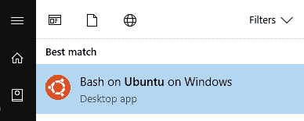
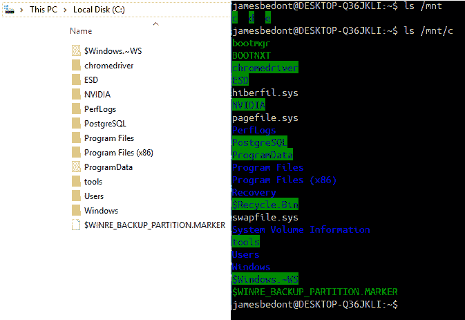
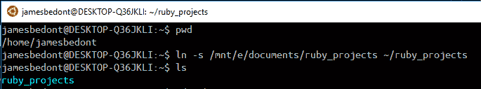
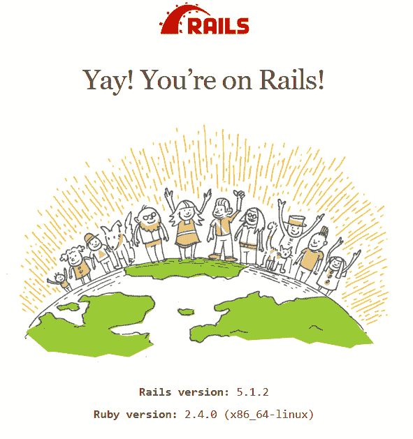

# 在 Windows 10 上利用 Ubuntu 安装 Ruby on Rails

> 原文:[https://dev . to/jamesbedont/installing-ruby-on-rails-leveraging-Ubuntu-on-windows-10](https://dev.to/jamesbedont/installing-ruby-on-rails-leveraging-ubuntu-on-windows-10)

### 背景

根据我的经验，在 Windows 机器上安装 Ruby 和 by extension Rails 可能会很困难，而且会让人头疼。根据我的经验，在完成所有设置后，它的运行速度比在 Linux 或 OSX 上稍慢一些。

由于 Windows 上的 Ruby 所面临的挑战，最好的解决方案通常要么涉及 [Docker](https://docs.docker.com/compose/rails/) 要么涉及虚拟机。虽然这些解决方案没有问题，但另一个解决方案已经到来；[Windows 10 上的 Ubuntu](https://blogs.windows.com/buildingapps/2016/03/30/run-bash-on-ubuntu-on-windows/#psSTUpZWO53T1Ly4.97)。

简单地说，微软已经开发了运行 Ubuntu 的“Windows Linux 子系统(WSL)”。它允许使用 Linux 命令行工具与 Windows 机器上的文件进行交互，并在 Windows 中提供真正的 Ubuntu Linux 环境。

Ruby on Rails 现在可以在 Ubuntu 环境中安装和运行，同时访问位于 Windows 文件系统上的应用程序代码。这意味着我们可以使用像 Visual Studio 代码这样的 windows 应用程序来修改应用程序代码，但要通过 Ubuntu 环境来提供服务。

### 在 Windows 10 上启用 Ubuntu

您必须运行带有周年更新或更高版本的 64 位 Windows 10。并遵循 [MSDN 安装说明](https://msdn.microsoft.com/en-us/commandline/wsl/install_guide)

### 在轨道上安装 Ruby

重新启动后，你应该可以在“ubuntu”中按下开始菜单，然后看到下面的新程序。点击它会打开一个 bash shell。

[T2】](https://res.cloudinary.com/practicaldev/image/fetch/s--L_d3j_0I--/c_limit%2Cf_auto%2Cfl_progressive%2Cq_auto%2Cw_880/https://thepracticaldev.s3.amazonaws.com/i/amx43krnxdvfz7bmxc0j.PNG)

我们将在 Bash 中安装 Ruby on Rails。因为这不是一个关于如何在 Ubuntu 上安装 Ruby on Rails 的帖子，我将链接到一个关于如何安装的[伟大指南](https://gorails.com/setup/ubuntu/14.04)。因为我们现在在一个 Ubuntu Bash Shell 中，所以我们可以这样对待它，并跟踪任何 Ubuntu 资源。

### 概念性概述

现在我们已经在 Windows 上启用了 Ubuntu，并在那个环境中安装了 Ruby on Rails，我们准备好生成一个新项目了。

现在我想指出的是[使用 Windows 应用程序和工具来更改 Linux 文件是一个坏主意，可能会导致数据丢失](https://blogs.msdn.microsoft.com/commandline/2016/11/17/do-not-change-linux-files-using-windows-apps-and-tools)。相反，我们将使用 Linux 来修改/执行 Windows 文件，这完全没问题，并且在 WSL 的预期用途内[。](https://blogs.msdn.microsoft.com/commandline/2016/11/17/do-not-change-linux-files-using-windows-apps-and-tools/#comment-25677)

在我们的 Bash shell 中，可以在`/mnt/`找到 Windows 文件系统。下面是`/mnt/c`和从文件浏览器导航到的 c 盘内容的比较。请注意，它们是相同的；我们现在正从 Linux 导航到 Windows 文件系统。

[T2】](https://res.cloudinary.com/practicaldev/image/fetch/s--yWLm7YxT--/c_limit%2Cf_auto%2Cfl_progressive%2Cq_auto%2Cw_880/https://thepracticaldev.s3.amazonaws.com/i/alvnfep16g9xrbbr3gu4.png)

只要我们在 Windows 文件系统(`/mnt`)中生成 Rails 项目，我们就符合预期的用途，没有数据丢失的风险。更不用说，我们可以像修改任何其他 Windows 文件一样修改这些文件。

### 生成新的 Rails App

我发现首先要做的最好的事情是创建一个[符号链接](https://en.wikipedia.org/wiki/Symbolic_link)到我们的 Windows 开发文件夹。在这篇文章中，我在 windows 中创建了下面的目录`E:\documents\ruby_projects`，它在 Bash shell 中是`/mnt/e/documents/ruby_projects`。

[T2】](https://res.cloudinary.com/practicaldev/image/fetch/s--4rHrcJ8M--/c_limit%2Cf_auto%2Cfl_progressive%2Cq_auto%2Cw_880/https://thepracticaldev.s3.amazonaws.com/i/m85t4z66zy8ygbtz6lcx.png)

`$ ln -s TARGET LINK_NAME`

1.  将目录切换到`~/ruby_projects`并查看实际位于`/mnt/e/documents/ruby_projects`的文件
2.  `$ rails new blog`生成一个名为“博客”的新 Rails 应用程序
3.  CD 进入新的博客目录，并执行`$ rails server`，这将启动一个监听端口 3000 的服务器
4.  在 Windows 网络浏览器中导航至`localhost:3000`。

[T2】](https://res.cloudinary.com/practicaldev/image/fetch/s--cO7L-tJy--/c_limit%2Cf_auto%2Cfl_progressive%2Cq_auto%2Cw_880/https://thepracticaldev.s3.amazonaws.com/i/93swmtbgxrr2qa8jjqwk.PNG)

成功！请注意这条消息是如何说明 Ruby 正在 Linux 中运行的。

现在你可以在 Windows 中打开你最喜欢的文本编辑器/IDE，像平常一样在`E:\documents\ruby_projects`编辑文件。这些变化将被运行在 Ubuntu 上的 Rails 服务器看到，并反映在 localhost 上。