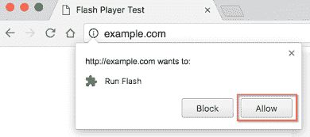

# 闪电侠死了💀(有点)

> 原文：<https://dev.to/walker/flash-is-dead--actually-kind-of>

今天早些时候，Adobe [发表了一篇博客文章](https://blogs.adobe.com/conversations/2017/07/adobe-flash-update.html),宣布他们将逐渐淘汰他们著名的插件 Flash。据帖子称，该公司将继续“发布定期安全补丁，维护操作系统和浏览器的兼容性，并根据需要添加功能和能力”，但计划在 2020 年底前停止更新和分发 Flash。

[T2】](https://res.cloudinary.com/practicaldev/image/fetch/s--4LC03jCR--/c_limit%2Cf_auto%2Cfl_progressive%2Cq_auto%2Cw_880/http://www.techcult.com/wp-content/uploads/2008/09/indestructotankgame.jpg)

怀旧的用户可能会为 Flash 的死而流泪——我们当中有谁不依赖 Flash 为我们提供早期的病毒视频或异想天开的浏览器游戏？—但普遍的共识是，如果有什么不同的话，那就是 Flash 早就应该停下来了。几乎所有人都同意，web 开发人员认为 Flash 是安全漏洞、缓慢性能和浪费电池的潜在来源。Chrome 和 Safari 等主流浏览器会自动屏蔽该插件——你可能还记得被要求允许它在各种网站上运行。

[T2】](https://res.cloudinary.com/practicaldev/image/fetch/s--iuf_1aYE--/c_limit%2Cf_auto%2Cfl_progressive%2Cq_auto%2Cw_880/https://lh3.googleusercontent.com/Lz_8IWHPgQP3-r3yBPMIxwy6G1F0FH2kcet0sfUZarc4luSisLmPcvilZvp3mYqTLUDX%3Dw390)

Flash 最初于 20 世纪 90 年代推出，十多年来一直是在线音频和视频播放的标准。但最终像 HTML5 这样的高级技术取代了插件，Flash 持续的漏洞和糟糕的安全性吸引了许多批评者，最著名的是史蒂夫·乔布斯，他在 2010 年写了一篇长文谴责 Flash。

但 Flash 过去的突出地位意味着它仍然遍布网络，这就是为什么 Adobe 依靠其强大的合作伙伴，苹果，脸书，谷歌，微软和 Mozilla，通过鼓励开发者将当前的 Flash 内容迁移到现代格式来简化过渡。距离正式截止日期还有三年，这使得这种转换变得更加容易，但 Flash 在教育和游戏等行业的数字化崛起中发挥了重要作用，因此这种变化很可能会打破一些陈旧和无人管理的网站。

多年来，许多 [dev.to](https://dev.to/) 用户肯定都有过使用 Flash 的经历，有正面的，也有负面的。欢迎在下面的评论中分享！