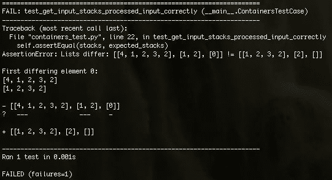

# 如何在 Python 3 中测试输入处理

> 原文:[https://dev . to/vergeev/how-to-test-input-processing-in-python-3](https://dev.to/vergeev/how-to-test-input-processing-in-python-3)

测试使用`input()`的函数不是一项简单的任务。本教程展示了如何做到这一点。

## 问题

竞赛编程问题解答通常是自动测试的。因此，输入只是一组具有预定义格式的字符串，它们被输入到标准输入中。

例如，假设一个问题需要我们读入 N 个不同大小的堆栈。那么输入可能是这样的:

```
3
4 1 2 3 2
1 2
0 
```

<svg width="20px" height="20px" viewBox="0 0 24 24" class="highlight-action crayons-icon highlight-action--fullscreen-on"><title>Enter fullscreen mode</title></svg> <svg width="20px" height="20px" viewBox="0 0 24 24" class="highlight-action crayons-icon highlight-action--fullscreen-off"><title>Exit fullscreen mode</title></svg>

这里，3 是要读入的堆栈数。每一行的第一个数字是堆栈的大小(Python 中不需要，但在其他语言中很有用)，后面是它的元素。

为了从输入中提取数据，必须进行一些操作:

```
def get_input_stacks():
    n = int(input())
    stacks = []
    for _ in range(n):
        str_stack = input().split(' ')
        stack = [int(s) for s in str_stack]
        stacks.append(stack)
    return stacks 
```

<svg width="20px" height="20px" viewBox="0 0 24 24" class="highlight-action crayons-icon highlight-action--fullscreen-on"><title>Enter fullscreen mode</title></svg> <svg width="20px" height="20px" viewBox="0 0 24 24" class="highlight-action crayons-icon highlight-action--fullscreen-off"><title>Exit fullscreen mode</title></svg>

而且在这里犯一个错误并不需要很大的努力。事实上，我已经在上面的代码中创建了一个。因此，对这种功能进行自动测试也是很好的。

## 解

我在 [StackOverflow](https://stackoverflow.com/questions/18161330/using-unittest-mock-to-patch-input-in-python-3) 上找到的一个解决方案应用于我的问题时是这样的:

```
from unittest.mock import patch
import unittest

import containers

class ContainersTestCase(unittest.TestCase):

    def test_get_input_stacks_processed_input_correctly(self):
        user_input = [
            '3',
            '4 1 2 3 2',
            '1 2',
            '0',
        ]
        expected_stacks = [
            [1, 2, 3, 2],
            [2],
            [],
        ]
        with patch('builtins.input', side_effect=user_input):
            stacks = containers.get_input_stacks()
        self.assertEqual(stacks, expected_stacks)

if __name__ == '__main__':
    unittest.main() 
```

<svg width="20px" height="20px" viewBox="0 0 24 24" class="highlight-action crayons-icon highlight-action--fullscreen-on"><title>Enter fullscreen mode</title></svg> <svg width="20px" height="20px" viewBox="0 0 24 24" class="highlight-action crayons-icon highlight-action--fullscreen-off"><title>Exit fullscreen mode</title></svg>

当我运行测试时，我看到它失败了:
[](https://res.cloudinary.com/practicaldev/image/fetch/s--ja5bB37g--/c_limit%2Cf_auto%2Cfl_progressive%2Cq_auto%2Cw_880/https://thepracticaldev.s3.amazonaws.com/i/50a3mgwe421oh3qjtm0t.png) 
问题是我将堆栈的大小作为堆栈的一个元素读入。相反，我应该忽略它:`str_stack = input().split(' ')[1:]`。

# 解决方案的工作原理

这是测试中最有趣的一行:

```
with patch('builtins.input', side_effect=user_input): 
```

<svg width="20px" height="20px" viewBox="0 0 24 24" class="highlight-action crayons-icon highlight-action--fullscreen-on"><title>Enter fullscreen mode</title></svg> <svg width="20px" height="20px" viewBox="0 0 24 24" class="highlight-action crayons-icon highlight-action--fullscreen-off"><title>Exit fullscreen mode</title></svg>

我假设已经知道语句的[如何工作。`unittest.mock.patch`](http://effbot.org/zone/python-with-statement.htm) [有](https://docs.python.org/3/library/unittest.mock.html#patch)几个修改其行为的关键字参数，但在本例中，它只是用一个`unittest.mock.MagicMock`对象替换了内置的`input()`函数。对象的属性之一是返回它的`return_value`，除非它的`side_effect`返回别的东西:

```
>>> import unittest.mock
>>> mock = unittest.mock.MagicMock()
>>> mock.return_value = '43'
>>> mock()
'43'
>>> def foo():
...  return 'something_else'
... 
>>> mock.side_effect = foo
>>> mock()
'something_else' 
```

<svg width="20px" height="20px" viewBox="0 0 24 24" class="highlight-action crayons-icon highlight-action--fullscreen-on"><title>Enter fullscreen mode</title></svg> <svg width="20px" height="20px" viewBox="0 0 24 24" class="highlight-action crayons-icon highlight-action--fullscreen-off"><title>Exit fullscreen mode</title></svg>

注意`side_effect`与`return_value`不同，它是一个函数。`side_effect`也可以是一个异常对象(当 mock 被调用时会引发异常)或者一个 iterable。如果它是一个 iterable，那么每次它被调用时，mock 都会产生一个新值:

```
>>> mock.side_effect = [1, 2]
>>> mock()
1
>>> mock()
2
>>> mock()
Traceback (most recent call last):
  File "<stdin>", line 1, in <module>
  File "/usr/local/Cellar/python3/3.6.1/Frameworks/Python.framework/Versions/3.6/lib/python3.6/unittest/mock.py", line 939, in __call__
    return _mock_self._mock_call(*args, **kwargs)
  File "/usr/local/Cellar/python3/3.6.1/Frameworks/Python.framework/Versions/3.6/lib/python3.6/unittest/mock.py", line 998, in _mock_call
    result = next(effect)
StopIteration
>>> 
```

<svg width="20px" height="20px" viewBox="0 0 24 24" class="highlight-action crayons-icon highlight-action--fullscreen-on"><title>Enter fullscreen mode</title></svg> <svg width="20px" height="20px" viewBox="0 0 24 24" class="highlight-action crayons-icon highlight-action--fullscreen-off"><title>Exit fullscreen mode</title></svg>

这就是我们试图通过模仿`input()`来达到的目的:每次调用时都有一个不同的预定义值。这就是为什么我们将`side_effect=user_input`传递给`patch()`函数(`side_effect`既是`MagicMock`的属性，也是`patch()`的关键字参数:

```
user_input = [
    '3',
    '4 1 2 3 2',
    '1 2',
    '0',
]
with patch('builtins.input', side_effect=user_input): 
```

<svg width="20px" height="20px" viewBox="0 0 24 24" class="highlight-action crayons-icon highlight-action--fullscreen-on"><title>Enter fullscreen mode</title></svg> <svg width="20px" height="20px" viewBox="0 0 24 24" class="highlight-action crayons-icon highlight-action--fullscreen-off"><title>Exit fullscreen mode</title></svg>

参数`'builtins.input'`包含一个指向`input()`函数的名称。`patch()`所做的基本上是让这个名字指向`MagicMock`对象，直到`with`块结束。Python 中的一个对象可以有多个名称，所以修补正确的名称([这里是如何](https://docs.python.org/3/library/unittest.mock.html#where-to-patch))。[内置](https://docs.python.org/3/library/builtins.html)是内置函数名所在的模块:

```
>>> import builtins
>>> builtins.print('hi')
hi 
```

<svg width="20px" height="20px" viewBox="0 0 24 24" class="highlight-action crayons-icon highlight-action--fullscreen-on"><title>Enter fullscreen mode</title></svg> <svg width="20px" height="20px" viewBox="0 0 24 24" class="highlight-action crayons-icon highlight-action--fullscreen-off"><title>Exit fullscreen mode</title></svg>

每次函数`get_input_stacks()`调用被修补的`input()`时，它会获得`user_input`列表中的下一个字符串。这是我们想要的行为。

# 何去何从

为了更好地理解`unittest.mock`提供的能力，最好阅读[手册](https://docs.python.org/3/library/unittest.mock.html)。作为练习，我建议通过修补`print()`来测试一个与`get_input_stacks()`相反的函数。

感谢您的阅读！