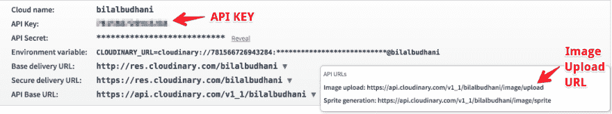

# 使用 React Dropzone & Axios 将多个文件上传到 Cloudinary

> 原文：<https://dev.to/bilalbudhani/upload-multiple-files-to-cloudinary-using-react-dropzone--axios>

[T2】](https://res.cloudinary.com/practicaldev/image/fetch/s--Ue0MAo-d--/c_limit%2Cf_auto%2Cfl_progressive%2Cq_auto%2Cw_880/https://cloudinary-res.cloudinary.com/image/upload/c_fill%2Cw_770/dpr_2.0/React_Image_Library_2000x1100_v1.jpg)

在我们最近的一个客户项目中，我们有一个提供大量文件上传的要求。作为一名开发者，我们非常习惯于整个上传过程&在互联网上花费的时间。然而，对于互联网上的大量用户来说，文件上传可能是一个令人生畏的体验，所以当你在使用一个文件上传时要小心。

我们在构建文件上传方面有很好的经验——通过利用所有这些经验，我们的目标是围绕它构建愉快的用户体验。我在下面描述了我们用来构建这种体验的服务和库。

[cloud inary](http://cloudinary.com/invites/lpov9zyyucivvxsnalc5/ihvoxdl9tuoaxpbdrre8)——很长一段时间以来，这项服务已经成为我事实上的托管资产的地方，原因是它们不仅提供了出色的动态图像处理功能，还提供了超级简单的直接从浏览器上传文件的过程，不涉及任何后端。

[React drop zone](https://react-dropzone.js.org/)——我们非常喜欢 React 构建 UI 的声明式方法。类似地，dropzone 提供了一个直观的声明式 api 来支持跨浏览器的文件上传。

[Axios](https://github.com/mzabriskie/axios)——一个基于 sleek promise 的 HTTP 健壮客户端库，帮助我们毫不费力地与第三方服务&后端进行对话。

### 如何ðÿ'ðÿ“ðÿ'

首先在 [Cloudinary](http://cloudinary.com/invites/lpov9zyyucivvxsnalc5/ihvoxdl9tuoaxpbdrre8) 上注册，(如果你还没有账户的话)并获取你的 API 密匙&图片上传 URL

[T2】](https://res.cloudinary.com/practicaldev/image/fetch/s--aK6iNsG7--/c_limit%2Cf_auto%2Cfl_progressive%2Cq_auto%2Cw_880/https://cdn-images-1.medium.com/max/1600/1%2ApFHq5wQaIYcqWzrd_AXnhg.png)

其次，我们需要在我们的账户设置
[](https://res.cloudinary.com/practicaldev/image/fetch/s--UNgS8uu0--/c_limit%2Cf_auto%2Cfl_progressive%2Cq_auto%2Cw_880/https://cdn-images-1.medium.com/max/1600/1%2AixSreGuN55V2XlD0OU_dqA.png) 中启用未签名上传

一旦我们启用了未签名上传，我们应该会看到类似这样的
[](https://res.cloudinary.com/practicaldev/image/fetch/s--E1XREtbx--/c_limit%2Cf_auto%2Cfl_progressive%2Cq_auto%2Cw_880/https://cdn-images-1.medium.com/max/1600/1%2AjSe3M4EfjFN1Iwc3pvx60Q.png)

记下预设名称，我们将在后面的代码中用到它。

现在，转到您的项目——添加 React Dropzone 和 Axios

```
npm install --save react-dropzone axios 
```

Enter fullscreen mode Exit fullscreen mode

让我们将这些新添加的依赖项导入到 React 组件中，我们希望在这里提供上传功能

```
import Dropzone from 'react-dropzone'
import axios from 'axios' 
```

Enter fullscreen mode Exit fullscreen mode

我们现在将添加上传代码

```
<Dropzone 
  onDrop={this.handleDrop} 
  multiple={true}
  accept="image/*" 
  style={styles.dropzone}
>
  <p>Drop your files or click here to upload</p>
</Dropzone> 
```

Enter fullscreen mode Exit fullscreen mode

当我们的用户选择好要上传的文件后，Dropzone 将触发`handleDrop`函数，第一个参数是一个文件数组。
现在让我们添加代码，将这些文件上传到我们的云端账户

```
handleDrop = files => {
  // Push all the axios request promise into a single array
  const uploaders = files.map(file => {
    // Initial FormData
    const formData = new FormData();
    formData.append("file", file);
    formData.append("tags", `codeinfuse, medium, gist`);
    formData.append("upload_preset", "pvhilzh7"); // Replace the preset name with your own
    formData.append("api_key", "1234567"); // Replace API key with your own Cloudinary key
    formData.append("timestamp", (Date.now() / 1000) | 0);

    // Make an AJAX upload request using Axios (replace Cloudinary URL below with your own)
    return axios.post("https://api.cloudinary.com/v1_1/codeinfuse/image/upload", formData, {
      headers: { "X-Requested-With": "XMLHttpRequest" },
    }).then(response => {
      const data = response.data;
      const fileURL = data.secure_url // You should store this URL for future references in your app
      console.log(data);
    })
  });

  // Once all the files are uploaded 
  axios.all(uploaders).then(() => {
    // ... perform after upload is successful operation
  });
} 
```

Enter fullscreen mode Exit fullscreen mode

*(用自己的替换 Cloudinary 图片上传 URL、上传预置、API key)*

瞧啊。我们刚刚得到了一个完全功能化的文件上传机制，不需要任何后端代码。

**本文首发于[https://blog . code infuse . com/upload-multiple-files-to-cloud inary-using-drop zone-axios-27883 C2 a5 EC 6](https://blog.codeinfuse.com/upload-multiple-files-to-cloudinary-using-react-dropzone-axios-27883c2a5ec6)T3】**

> [Codeinfuse](https://www.codeinfuse.com) 是全栈开发店。有我们可以协助的项目吗？欢迎在 hello@codeinfuse.com 的[与我们交流](mailto:hello@codeinfuse.com)