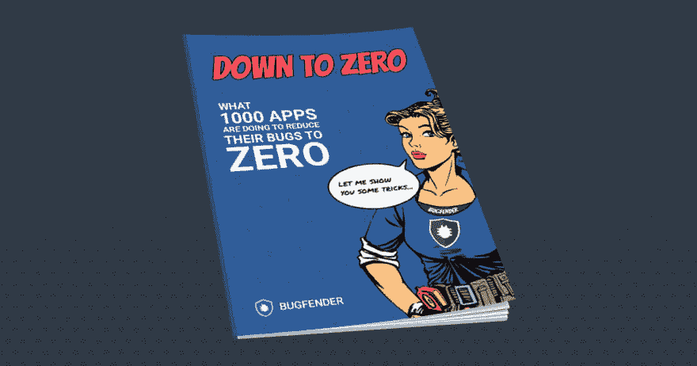

# 归零——修复移动应用程序 Bug 的实用指南

> 原文：<https://dev.to/bugfenderapp/down-to-zero---a-practical-guide-to-bug-fixing-mobile-apps>

[T2】](https://res.cloudinary.com/practicaldev/image/fetch/s--ltDrs6iQ--/c_limit%2Cf_auto%2Cfl_progressive%2Cq_auto%2Cw_880/https://bugfender.com/wp-content/uploads/2017/07/530174c4-a567-4c1b-b0fd-6af2ee04b788.jpg)

下载一个刚能用的新应用不是很好吗？能够实现其目标并提供出色用户体验的东西。在 [Mobile Jazz](https://mobilejazz.com/) 上，我们努力发布尽可能好的应用程序，事实上，这也是我们创建 [Bugfender](https://bugfender.com/) 的原因。

我们是一个小的，偏远的友好机构，工程师和设计师遍布世界各地。在一个应用程序的开发过程中，有时我们甚至无法复制我们的队友所面临的错误——更不用说真实用户可能遇到的错误了。

我们很快意识到我们需要一个分散的控制台，在那里我们可以从我们的应用程序中查看 NSLogs 和 Logcat 文件，即使设备没有连接到我们的计算机。令我们惊讶的是，没有一个能满足我们的需求。所以我们建造了它-见见 Bugfender。

现在， [Bugfender](https://bugfender.com/) 只是我们在调试应用时实际使用的工具之一。事实上，[在过去的五年里](https://mobilejazz.com/blog/five-years-of-mobile-jazz-why-we-dont-want-to-be-google/)，我们已经一次又一次地改进了我们的流程和工具包，为了提高效率，我们不得不分享它们。我们希望将我们的知识传播到全世界，希望更多的开发者开始发布更高质量的应用程序。

今天就获得一本我们的免费电子书吧！

## 下降到零

《归零》是我们新的**免费电子书**，记录了我们创建优秀应用的过程。这是 1000 个开发者正在做的减少他们应用程序中的错误的方法...下降到零:)

在电子书中，我们涵盖了:

*   应用程序失败的首要原因
*   如何防止 bug
*   雇佣优秀的开发人员
*   如何正确测试您的应用程序
*   收集什么数据
*   收集崩溃信息
*   日志收集和远程调试
*   分析工具
*   记录最佳实践
*   如何记录用户身份
*   要记录的重要时刻
*   更多

如果您想开始开发优秀的应用程序并提供更好的客户支持，[今天就去拿一本我们的免费电子书吧](https://bugfender.com/our-free-app-bugfixing-ebook-down-to-zero/)。

你可能也对订阅我们的[博客](https://bugfender.com/blog/)感兴趣，我们有一些关于[不要记录什么](https://bugfender.com/blog/what-not-to-log-when-remotely-debugging-mobile-apps/)和[有见地的用例](https://bugfender.com/blog/blast-motion-advanced-logging-to-help-advanced-athletes/)的精彩文章，它们来自我们的客户【Bugfender 如何拯救他们。