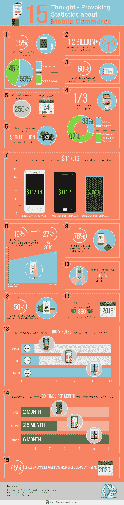

# 关于移动商务的 15 大统计数字-信息图

> 原文:[https://dev.to/fmeaddons/infographic-关于移动商务的 15 大统计数字](https://dev.to/fmeaddons/infographic---top-15-stats-and-figures-regarding-mobile-commerce)

互联网已经成为我们与朋友联系和获取各种信息的基本需求。现在人们可以在手机上轻松使用互联网，而不是台式电脑。超过 12 亿人现在使用智能手机访问互联网，他们也通过手机进行网上购物。这意味着移动商务正在成为电子商务的一个重要组成部分，因为现在 60%的顾客在购买之前会先在网上搜索产品。除此之外，76%的移动用户还会使用智能手机搜索最整洁的商店。大约 33%的电子商务来自智能手机，其余的人使用其他设备。如果我们看一下过去两年的统计数据，特别是亚洲，移动商务增长了 250%，这是一个惊人的增长。在美国，移动商务每年带来约 1000 亿美元的收入，预计在不久的将来还会增加。
超过 50%的智能手机购物者依赖数字钱包进行在线购物，如 PayPal、Google wallet 等。因为从数字钱包支付非常容易，只需要几秒钟。电子商务支付总额中，19 %是通过智能手机完成的，预计到 2018 年，这一比例将上升至 27%。
如果我们比较不同的智能手机操作系统，我们观察到 iPhone 产生的转化价值为 117.6 美元，高于 Android(111.7 美元)和 windows(100.91 美元)。这意味着大部分的移动商务转换都是通过 iPhone 和 Android 进行的。在网络星期一，大约 5 亿的销售额来自移动商务，预计在美国，2018 年超过 900 亿美元的销售额将由移动商务推动。
如果我们看看顶级电子商务网站，顾客在亚马逊(100 分钟)上花费的时间最多，而不是塔吉特(20 分钟)和沃尔玛(14 分钟)。此外，顾客每月返回亚马逊 6 次，高于塔吉特和沃尔玛。2020 年，45%的电子商务将通过移动商务完成。关于[移动商务](https://www.fmeaddons.com/blog/15-thought-provoking-statistics-mobile-commerce-infographic)的一些更有用的见解记录在以下由 FME Addons 编辑的信息图中。

 **信息图 by-[Fme 插件](http://www.fmeaddons.com/)**