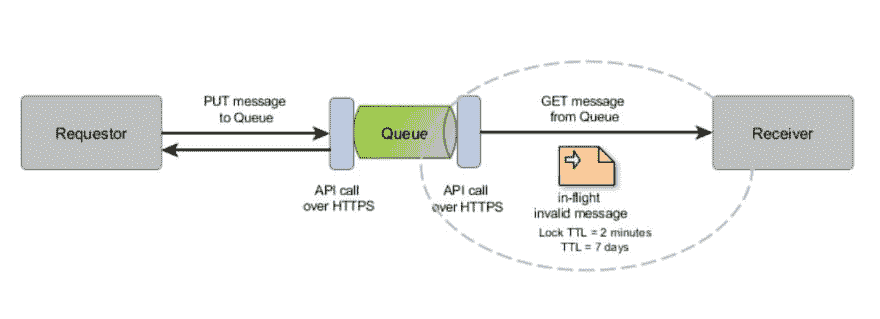

# 永远不要低估最佳实践的力量

> 原文:[https://dev . to/ana/永远不要低估最佳实践的力量](https://dev.to/ana/never-underestimate-the-power-of-best-practice)

我认为最佳实践是通过以各种方式混合各种成分，反复做同样的事情，直到你得到一个容易重现(标准)和高质量的结果而创造出来的特殊配方。

让我们来看看以下无限循环的场景，以及通过应用正确的成分来解决它的选项:

[T2】](https://res.cloudinary.com/practicaldev/image/fetch/s--CQK1x4lK--/c_limit%2Cf_auto%2Cfl_progressive%2Cq_auto%2Cw_880/https://thepracticaldev.s3.amazonaws.com/i/b6s7tw4kas798rfspdf3.jpg)

用例先决条件

*   队列上发布的消息无效
*   由接收消息进行处理的接收方引发的异常不会在 catch 块中被捕获

用例描述

1.  请求者将无效消息发布到消息通道(队列)。
2.  这个队列有一个侦听器/接收器，它将获取消息。

    a)在有效消息的情况下，发送回确认(ACK ),表明它现在处于安全状态。
    b)在我们的例子中，错误处理不正确的无效消息导致一个未被捕获的异常和一个锁定的消息“运行中”(一个等待 ACK 或 NACK 的消息),直到默认锁定 TTL(生存时间)到期(例如:2 分钟)

3.  2 分钟后(锁定 TTL)，无效消息对其他接收者可见。在我们的例子中，同一个接收者将接收消息并从 2.b)开始恢复

4.  有害消息将在队列中保留 7 天(TTL = 7 天),这给了我们一个隐藏得很好的无限循环。

当您看到消息不断在队列中被释放，而接收方逻辑的执行速度只能让您在寻找快速执行的系统时感到高兴时，您会怎么做？你当然会试着解决这个难题...

正如您可能从上述先决条件中注意到的，已经有两个主要问题:

*   在发布到队列之前，没有应用消息验证
*   无论发生什么，总是捕捉所有的异常！

犯错是人之常情，因此你应该总是为失败设计你的解决方案。

几点建议:

*   始终使用分配给处理队列的死信队列，以便在给定的重试次数后，将无效消息移至死信队列。这样你至少缩短了无限循环的寿命。
*   针对与非功能性需求相关的应用程序/服务设置监控:您是否期望队列上的负载大约为。每分钟 10 条消息，而你最终处理了 2000 条，那么很可能这需要你的注意
*   检查您的配置设置，默认设置是好的，但是根据具体情况定制可能会更好
*   对您的代码进行单元测试，包括错误处理

使用的技术:Anypoint MQ (MuleSoft 的云消息服务)和 MuleESB