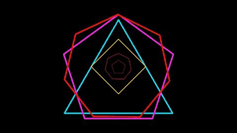

# 过去一周最受欢迎的 7 篇开发人员帖子

> 原文:[https://dev . to/the practical dev/the-7-most-popular-dev-posts-from-the-past-week-7398](https://dev.to/thepracticaldev/the-7-most-popular-dev-posts-from-the-past-week-7398)

每周一我们都会收集一些上周的热门帖子、评论和推文。如果您有任何反馈，请留下评论。安

# 1。旁注

[T2】](https://i.giphy.com/media/26xBwC6f9RzFyi1Co/giphy.gif)

几乎所有的程序员都会告诉你，提高你的技能，同时创造一些你可以向潜在雇主展示的东西的最好方法是专注于一些副业。但是首先你需要有一个副业，所以萨姆·贾曼列出了一些激发你想象力的方法:

 [## 为项目编程寻找思路

### 萨姆·贾曼👨🏼‍💻7 月 22 日 173 分钟读数

#career #sideprojects #ideas #apis](/samjarman/finding-ideas-for-programming-side-projects)

他的一个建议——寻找自动完成个人任务的方法——很受欢迎:

 [ lukaszkuczynski ](/lukaszkuczynski) • [<time datetime="2017-07-24T05:38:03Z"> Jul 24 '17 </time>](https://dev.to/lukaszkuczynski/comment/ebc) 

是的。自动化很好。让东西更容易被搜索也很好。对我来说，我认为这个好主意是让 Elasticsearch 中的内容更容易被搜索到？例如通过消费 RSS 源..

* * *

# 2。表情模块

[T2】](https://i.giphy.com/media/VELC2400W8PbG/giphy.gif)

“Node.js 最大的优点之一是它庞大的模块生态系统，”张秀坤·昆德尔写道。那么是什么促使他去建造呢？一个从字符串输入中读取表情符号并返回其短代码的模块。观察他是如何做到的:

 [## 在 TypeScript 中编写 Node.js 模块

### 张秀坤·昆德尔 7 月 18 日 1715 分钟阅读

#typescript #javascript #modules #npm](/dkundel/writing-a-nodejs-module-in-typescript)

* * *

# 3。去构建一个 API

[T2】](https://i.giphy.com/media/l0HlAKiRrw4vc5nkk/giphy.gif)

感觉每周都有顶级开发者发布关于 Go 的内容。本周，Francis Sunday 将向我们展示如何用这种语言构建 RESTful API:

## 文章不再可用

* * *

# 4。贸易工具

[T2】](https://i.giphy.com/media/26BRDHKnjgXuhjlde/giphy.gif)

有这么多的语言、库、框架等等。很难(也令人望而生畏)试图弄清楚要成为一名准备充分的全栈开发人员需要知道什么。萨姆·贾曼(他两次破解了本周的综述！)，他列出了以下清单:

 [## 程序员的工具箱里应该有什么？

### 萨姆·贾曼👨🏼‍💻7 月 22 日 174 分钟读数

#career #tooling #frameworks #bestpractices](/samjarman/what-should-be-in-a-coders-toolbox)

* * *

# 5。可靠的介绍

[T2】](https://i.giphy.com/media/qUJTA6qpXCSWY/giphy.gif)

几十年前，Robert C. Martin 提出了可靠的原则作为可维护和灵活的软件设计的标准，今天，它们仍然是一套非常有用的指导原则。Theofanis Despoudis 向我们展示了五个核心理念:

 [## 理解坚实的原则:依赖倒置

### theofanis Despoudis 7 月 18 日 177 分钟阅读

#solid #di #inversify #ooprinciples](/theodesp/understanding-solid-principles-dependency-injection)

* * *

# 6。德沃普斯的肮脏秘密

[T2】](https://i.giphy.com/media/4fbrBPFJKHj8s/giphy.gif)

克里斯·多兹(Chris Dodds)厌倦了只看到关于 DevOps 的成功故事——正如他所说的那样，“大胆的 IT 领导者转变其业务并引领大公司驶向未来的故事”——所以他写了一些关于 DevOps 失败的“肮脏秘密”，你很少看到这些故事:

 [## 德沃普斯的肮脏秘密

### 克里斯·多兹 19 年 7 月 17 日 4 分钟阅读

#devops #agile #process #people](/liquid_chickens/dirty-secrets-of-devops)

* * *

# 7。遥远的危险

[T2】](https://i.giphy.com/media/3o6ZsYWCHFlexmVzNu/giphy.gif)

人们对灵活的工作环境和在家工作赞不绝口，因此很容易忽略这种安排的一些缺陷。查尔斯·维拉德自己也在远程办公，他解释了 WFH 的一些危险:

 [## 远程工作中有怪物

### 查尔斯 d .维拉德 7 月 18 日 174 分钟阅读

#remote #beginners #career #cdvillard](/cdvillard/there-be-monsters-in-working-remotely)

* * *

我们的每周总结到此结束！请关注 Dev.to 本周的每日内容和讨论...如果您遗漏了任何内容，我们将在下周一进行回顾！