# 用基数排序得到排序的根

> 原文:[https://dev . to/vaidehijoshi/getting-to-the-root-of-sorting-with-radix-sort](https://dev.to/vaidehijoshi/getting-to-the-root-of-sorting-with-radix-sort)

今天是我们将在这个系列中讨论的最后一个排序算法。你终于可以松一口气了！

排序算法是计算机科学的面包和黄油(好吧，也许更像甘蓝)。了解它们对我们有好处，我们应该偶尔咀嚼它们，但它们并不总是最有趣的学习内容。希望这个系列能让他们更加愉快。

但正如大多数对你有益的事情一样，排序算法在计算史上留下如此不可磨灭的印记是有原因的。当我们完成这一节的排序时，我们将学习一些关于第一个排序算法:基数排序！我们已经准备好学习这种特殊的算法，它似乎是一个完美的接近。要理解排序算法的威力、重要性和丰富历史，还有什么比学习开创这一切的算法更好的方法呢？

所以，让我们最后一次整理吧！

### 对根的一种生根的兴趣

在我们进入基数排序的内部工作以及它是如何工作的之前，让我们首先理解单词 *radix* 实际上是什么意思。事实证明，如果你从一开始就阅读这个系列，你已经*知道*是什么意思了。

几个月前，当我们学习用二进制构建位、字节和[时，我们学习了“基数”的概念，它表示一个单个位值中可能有多少位。我们还发现不同的数系有不同的基数。](https://dev.to/vaidehijoshi/bits-bytes-building-with-binary)

<figure>[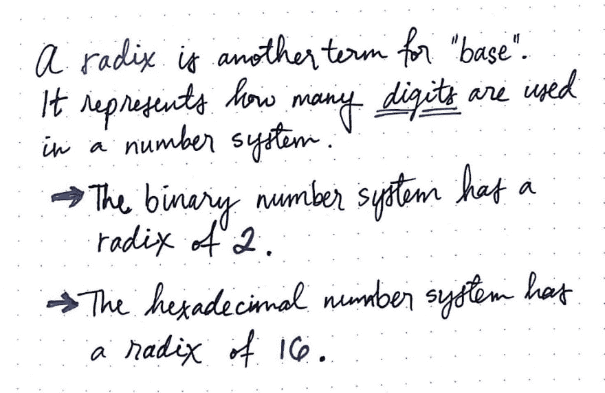](https://res.cloudinary.com/practicaldev/image/fetch/s--IeQeYL-1--/c_limit%2Cf_auto%2Cfl_progressive%2Cq_auto%2Cw_880/https://cdn-images-1.medium.com/max/1024/1%2Avpw55nb2JcE3F7qxT6BcFA.jpeg) 

<figcaption>基数是基数的另一种说法。</figcaption>

</figure>

嗯，这就是基数！ ***基数*** 不过是一个数的*基数*的另一个数学术语。基于这一逻辑，我们可以说十六进制数的基数是 16，类似于十六进制数系统是以 16 为基数的数系统。

术语*基数*有一个有趣的背景故事。它的词源直接来自拉丁语；在拉丁语中，*根*直接翻译成*根*，当你想到一个数的根和一个直接从它的根导出的数系，以及一个数的位值的可能位数时，这是有意义的。

<figure>[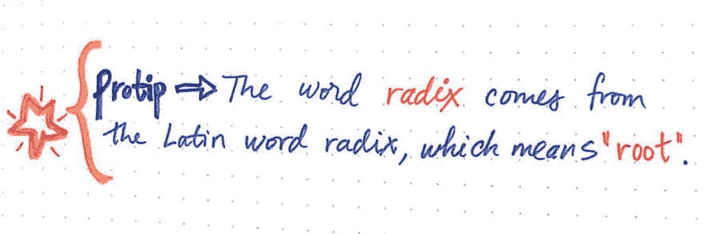](https://res.cloudinary.com/practicaldev/image/fetch/s--CaefpFse--/c_limit%2Cf_auto%2Cfl_progressive%2Cq_auto%2Cw_880/https://cdn-images-1.medium.com/max/1024/1%2AF7MNnDh_GLeQRVcmhqHSfg.jpeg)

<figcaption>radix 这个词来源于拉丁语的“根”。</figcaption>

</figure>

那么，基数这个术语是如何与基数排序联系起来的呢？好吧，如果你猜测基数排序与数字的基数或位数有关，那你就完全正确了。

***基数排序算法*** 是一种整数排序算法，通过将数字按其各自的位数(或基数)分组来排序。它使用每个基数/数字作为一个关键字，并在幕后实现计数排序或桶排序，以便完成排序工作。

<figure>[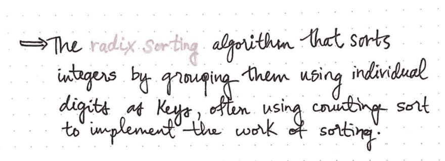](https://res.cloudinary.com/practicaldev/image/fetch/s--pyP3ONVA--/c_limit%2Cf_auto%2Cfl_progressive%2Cq_auto%2Cw_880/https://cdn-images-1.medium.com/max/1024/1%2AmwaAhwvvY2C9AMhyiOuGAA.jpeg) 

<figcaption>基数排序:一个定义</figcaption>

</figure>

如果这听起来有点复杂，不要沮丧！这个特殊算法的超级酷之处在于，你可能已经在日常生活中使用过它了。

让我告诉你怎么做。

比方说，我们有一堆单词需要整理。因为我们在处理单词，把它们按顺序排列基本上就是按字母顺序排列！我们能处理好的，对吧？我们以前都不得不按字母顺序排列一些东西。

在这个例子中，我们想按字母顺序排列室内植物的列表。我想为我的公寓买一个，这些是我的候选名单上的室内植物。

<figure>[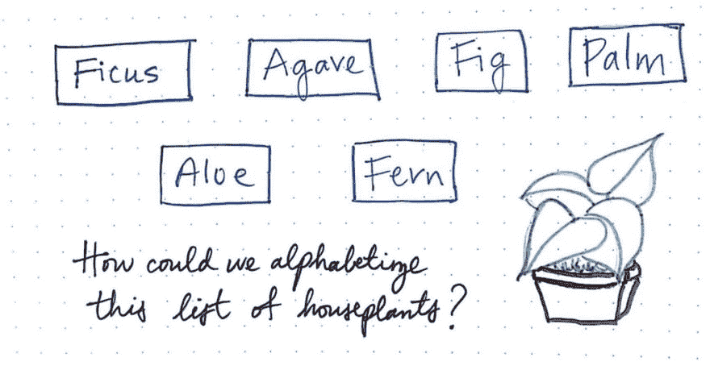](https://res.cloudinary.com/practicaldev/image/fetch/s--Mm1YGhrb--/c_limit%2Cf_auto%2Cfl_progressive%2Cq_auto%2Cw_880/https://cdn-images-1.medium.com/max/1024/1%2A6qLnEhblB98RvsTBbCsISg.jpeg) 

<figcaption>我们该如何按字母顺序排列这些室内植物呢？</figcaption>

</figure>

好的，我们有六个名字要按字母顺序排列:榕树，龙舌兰，无花果，棕榈，芦荟和蕨类植物。我们不要想太多，简单就好。我们如何开始把这些名字按顺序排列？

<figure>[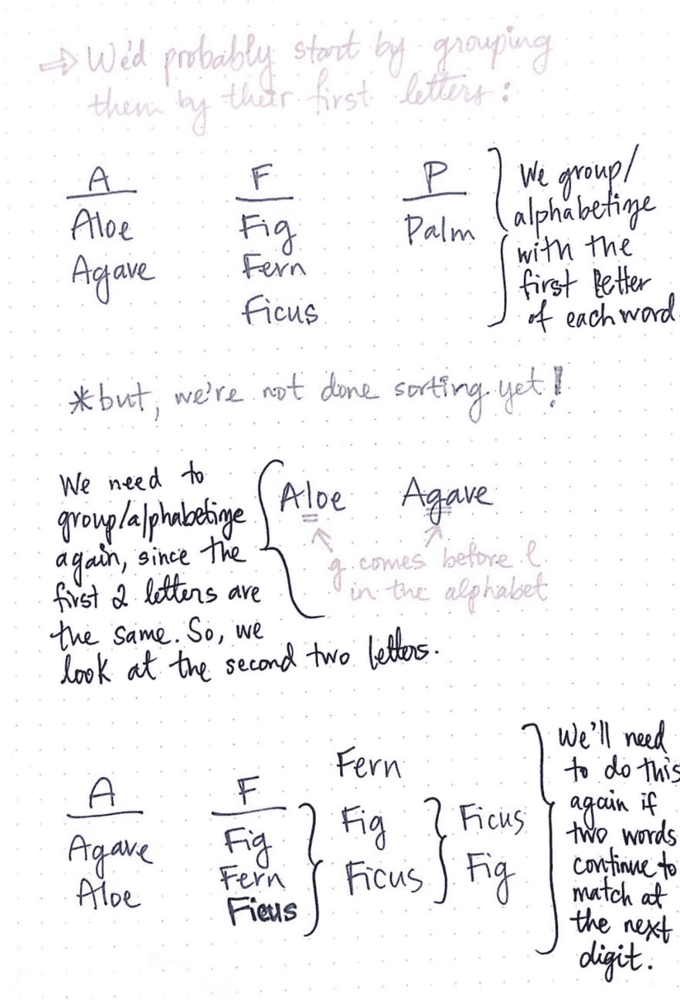](https://res.cloudinary.com/practicaldev/image/fetch/s--vwabAIg5--/c_limit%2Cf_auto%2Cfl_progressive%2Cq_auto%2Cw_880/https://cdn-images-1.medium.com/max/1024/1%2AeT-_GZ1M7n1EnHlskobY-w.jpeg) 

<figcaption>将单词按不同字母分组</figcaption>

</figure>

嗯，我们可能会先把字母相似的名字组合在一起，当我们这样做的时候，我们可以开始排序的初始过程。

换句话说，我们将查找所有以 A 开头的名字，然后是任何以 B、C、D 开头的名字，依此类推。在我们的例子中，我们没有那么多的名字要排序，所以我们最终有三个桶:以 A、F 和 p 开头的名字。

太好了，我们已经对这些名字进行了部分排序，但只是按它们的首字母排序。我们会注意到我们还没有完成分类——A 桶中的两个名字，芦荟和龙舌兰——还没有排序。

所以，我们需要重新按字母顺序排列。这一次，我们将查看每个单词的第二个字母，对于任何包含多个元素的 bucket。如果我们考虑芦荟和龙舌兰，我们知道龙舌兰需要被归类为这两个元素中的第一个，因为在字母表中 g 在 l 之前。

现在，我们可以想象我们需要对 F 桶中的名字做同样的事情，因为有三个元素需要按顺序排列。我们将按 Fig，Fern 和 Ficus 的第二个字母排序。由于 e 在 I 之前，我们将把 Fern 作为第一个元素。但是无花果和榕树都有相同的第二个字母！别担心——我们会按第三个字母排序，以便将它们放在正确的位置。

请注意，我们似乎在对输入数据的较小部分做完全相同的工作。你可能开始看到一个重复的模式；如果这被封装到一个方法中，它将是一个*递归*方法调用，因为我们在我们数据的一个更小的子集上做完全相同的工作序列。

但稍后会详细介绍。现在，让我们回到我们的字母排序！我们的 A 和 F 桶都是有序的。最后，我们有 P 桶，它只包含一个元素:Palm。希望您还记得我们以前在排序中的经历，但是万一您需要复习一下:列表中的单个元素总是被认为是已排序的，因为没有其他东西可以与之比较！所以，我们的 P 桶也被排序了。

<figure>[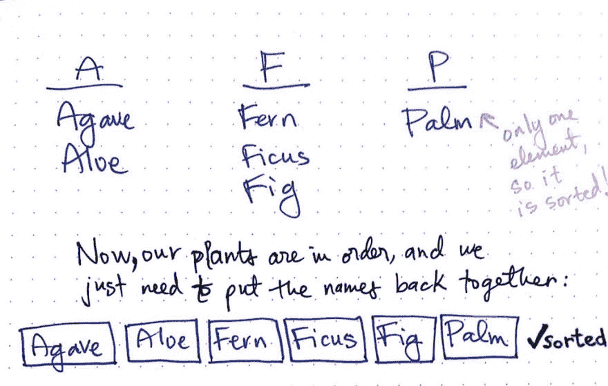](https://res.cloudinary.com/practicaldev/image/fetch/s--scsBpgj8--/c_limit%2Cf_auto%2Cfl_progressive%2Cq_auto%2Cw_880/https://cdn-images-1.medium.com/max/1024/1%2Ao1wMG0DmG_WmLjbNKpDBdg.jpeg) 

<figcaption>我们的植物名称又回来了！</figcaption>

</figure>

现在所有的名字都已经按照它们的第一、第二和第三个字母进行了排序，我们可以将它们重新组合在一起。这里的关键是以迭代的顺序将这些名字连接在一起，从第一个存储桶中的第一个名字开始。

一旦我们这样做了，我们最终得到了一个排序的室内植物名称列表:龙舌兰、芦荟、蕨类、榕属、无花果、棕榈。现在，我仍然不知道我会为我的房子买哪种植物，但至少它们终于排序了。万岁！

<figure>[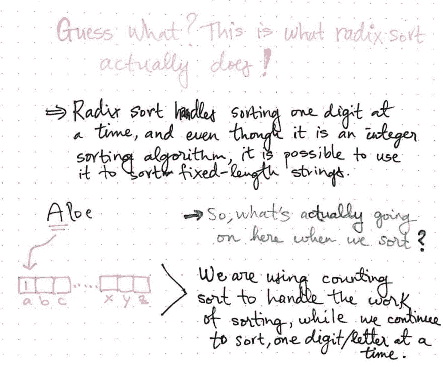](https://res.cloudinary.com/practicaldev/image/fetch/s--_0pUE9_u--/c_limit%2Cf_auto%2Cfl_progressive%2Cq_auto%2Cw_880/https://cdn-images-1.medium.com/max/1024/1%2AeWDA5-QZF5sx01SHRe5BuQ.jpeg) 

<figcaption>基数排序一次处理一个数字的排序。</figcaption>

</figure>

好吧，老实告诉你，这不是关于按字母顺序排列植物名称，而是一个关于*基数排序如何在幕后工作的例子。*

我们对名字列表进行排序的步骤与基数排序对一组整数进行排序的步骤完全相同！基数排序通过一次对一个数字执行计数排序(或桶排序)来处理排序。而且，它以一种非常特殊的顺序完成这一切，我们一会儿会了解更多。然而，您可能记得基数排序是一种严格的*整数*排序算法。那么，它怎么能对琴弦做同样的事情呢？好吧，如果我们给字符串中的每个字母分配一个整数值，我们弯曲字符串以符合仅整数基数排序的规则。例如，我们可以将单词 Fig 中的每个字母赋给一个整数:F 可以是 0，I 可以是 1，g 可以是 2。通过这种方式，我们可以将字符串转换为整数，然后在其上实现基数排序。

但是，基数排序到底是如何作用于整数的呢？是时候找出答案了！

### 放下(根)根

为了理解基数排序如何作用于整数，我们需要首先决定我们想要查看哪种形式的基数排序。没错——基数排序算法有两种不同的基本格式。

在我们的室内植物字母排序示例中，我们通过查看每个单词的第一个字母来排序我们的名字，并将首字母相同的单词分组在一起。然后，如果两个单词有相同的第一个字母，我们对这个桶中每个单词的第二个字母重复这个过程。

<figure>[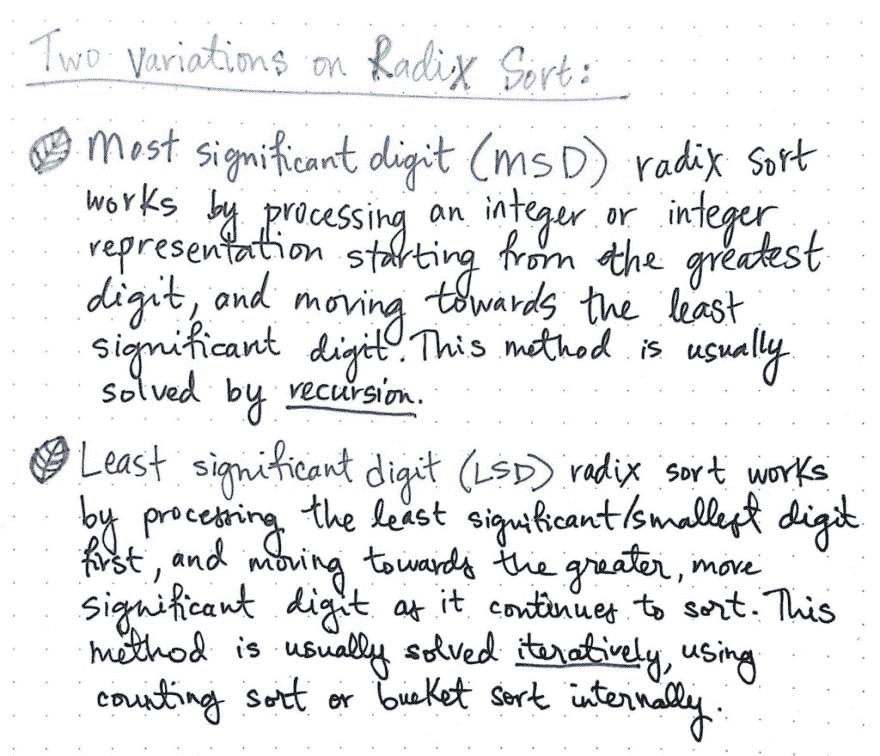](https://res.cloudinary.com/practicaldev/image/fetch/s--zNA9VpIe--/c_limit%2Cf_auto%2Cfl_progressive%2Cq_auto%2Cw_880/https://cdn-images-1.medium.com/max/1024/1%2AsIejCejq1_Zw8VdhzAeBYg.jpeg) 

<figcaption>两种变奏</figcaption>

</figure>

这种形式的基数排序被称为***【MSD】***最高有效位基数排序。它通过处理一个整数——或整数表示(如果我们处理的是字符串——从*最高* *位*开始)并在排序时向最低有效位移动来发挥作用。换句话说，它首先从最大的数字开始，然后继续排序，直到到达最小的数字。这种方法使用计数排序或桶排序，通常通过 ***递归*** 来解决，这正是我们在对我们的室内植物数据的一个较小子集进行完全相同的工作序列时所做的。

基数排序的第二种形式称为***【LSD】***基数排序，其工作方式是首先处理最低有效位，或*最小位*，随着继续排序，向更高、更有效位移动。这种方法类似于 MSD，因为它也在内部使用计数或桶排序；但通常是迭代求解*，不递归。*

 *既然我们已经看到了 MSD 基数排序在我们的室内植物排序示例中是如何工作的，那么让我们看看 LSD 基数排序在一组实际的整数中是如何工作的。在下面的例子中，我们对一个整数数组进行排序:[10，52，5，209，19，44]。因为我们知道我们将处理这些数字中每一个的*基数*(或数字)，我们可以重写它们，使它们都具有相同的数字位数。

<figure>[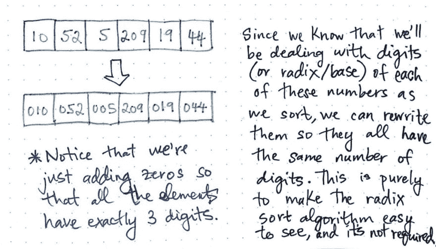](https://res.cloudinary.com/practicaldev/image/fetch/s--RHbTJnBk--/c_limit%2Cf_auto%2Cfl_progressive%2Cq_auto%2Cw_880/https://cdn-images-1.medium.com/max/1024/1%2AXpQnVHH5L8Xvd0ygvcUzFA.jpeg) 

<figcaption>重写数组元素，使其具有相同的位数</figcaption>

</figure>

这不是基数排序的一部分，而只是一种让我们更容易看到算法的每一步发生了什么的方法。

因为最大的数字有三位数，我们将重写数组并在必要的地方添加零，这样每个元素都有三位数。

重写后，我们的数组现在看起来像这样:[010，052，005，209，019，044]。

由于我们正在处理*最低有效位*基数排序，我们知道我们的第一步将是按照——您猜对了！–最低有效数字。

> 最低有效位是每个数字中最小的数字；如果我们处理的是十进制的整数，那么最低有效位就是十进制的数字。

<figure>[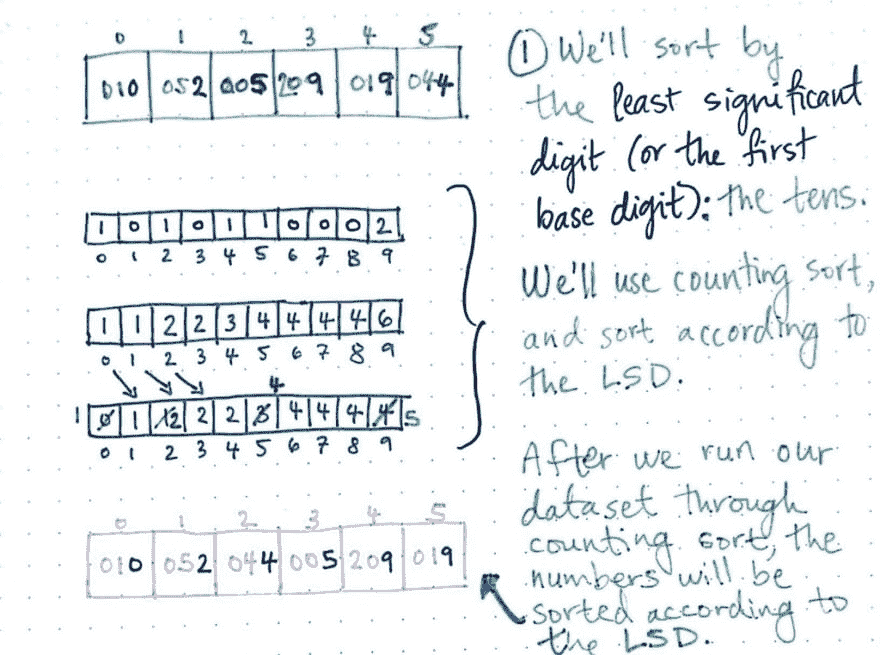](https://res.cloudinary.com/practicaldev/image/fetch/s--KoHDyibT--/c_limit%2Cf_auto%2Cfl_progressive%2Cq_auto%2Cw_880/https://cdn-images-1.medium.com/max/1024/1%2AT_Bb1A8EI1u0Bx3PpJ-ftw.jpeg) 

<figcaption>LSD 基数排序:step 1</figcaption>

</figure>

太好了，这应该很容易识别。在此处显示的示例中，最低有效位，即每个整数元素中的十位，以蓝色突出显示。

我们将使用计数排序来排序所有这些整数；因为我们上周已经学习了计数排序，所以我不会详细介绍它实际上是如何工作的。如果你需要复习，你可以随时[复习计数排序](https://dev.to/vaidehijoshi/counting-linearly-with-counting-sort)。

在我们使用十位作为我们的*键*通过计数排序运行我们的数据集之后，我们的数组稍微排序了一些。现在看起来是这样的:[010，052，044，005，209，019]。我们会注意到它是按照十进制排序的。换句话说，十位数为 0 的整数 10 位于数组的第一位，而十位数为 9 的整数 209 和 19 都位于数组的末尾。我们还会注意到，19 和 209 出现的顺序与它们在原始数组中的顺序相同。

<figure>[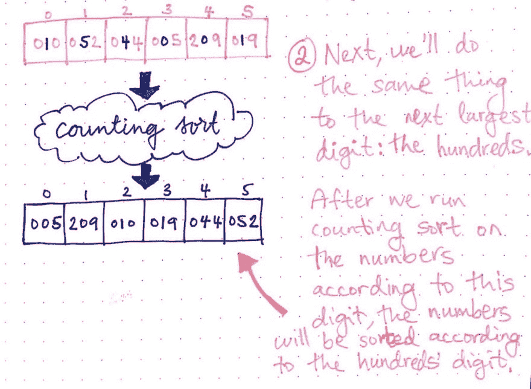](https://res.cloudinary.com/practicaldev/image/fetch/s--aVSShE44--/c_limit%2Cf_auto%2Cfl_progressive%2Cq_auto%2Cw_880/https://cdn-images-1.medium.com/max/1024/1%2A4_L4DarIMVVoJx3bCY0p2w.jpeg) 

<figcaption>LSD 基数排序:step 2</figcaption>

</figure>

然而，我们希望将这些整数作为整数进行排序，而不仅仅是按十位数！因此，我们需要按照下一个位置值进行排序:百位。

在此处显示的插图中，每个整数中位于百位数的数字以蓝色突出显示。我们将重复与之前相同的过程，通过计数排序来对这些整数进行排序，使用每个数字的百位数作为计数排序的关键字。在我们第二次遍历数组后，它现在是这样的:[005，209，010，019，044，052]。请注意数字现在是如何按第二位数字排序的。数字 52，在包含 5 的百位中具有最大值，现在位于数组的末尾。

好了，最后一步——终于到了！

<figure>[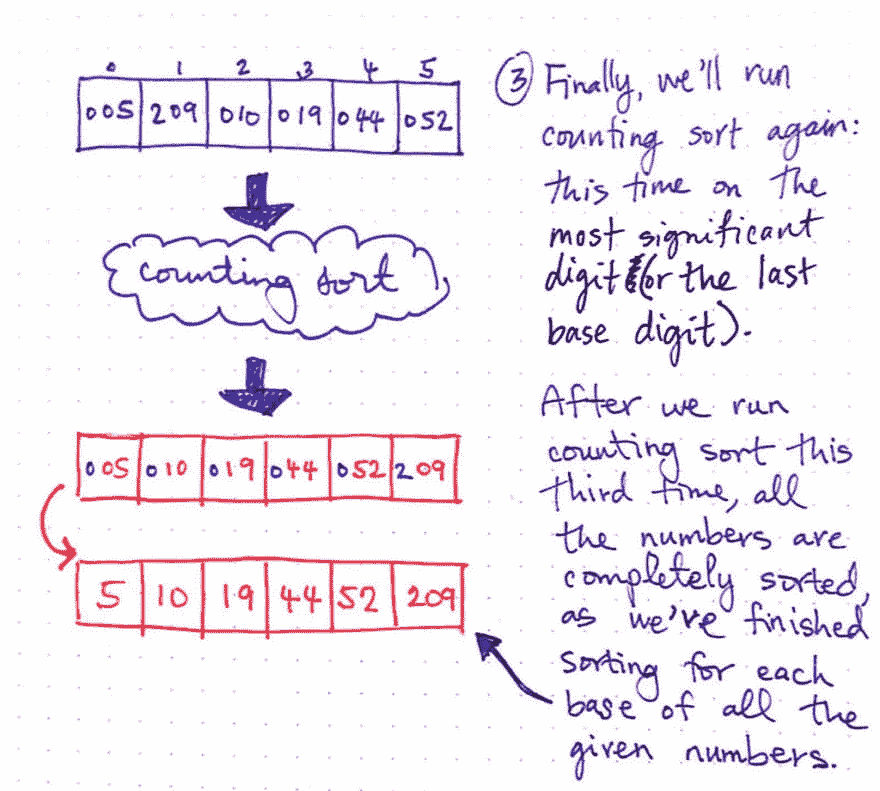](https://res.cloudinary.com/practicaldev/image/fetch/s--yNsrdAGK--/c_limit%2Cf_auto%2Cfl_progressive%2Cq_auto%2Cw_880/https://cdn-images-1.medium.com/max/1024/1%2AE1bm8rAixsz_D5b1lZN24g.jpeg) 

<figcaption>LSD 基数排序:step 3</figcaption>

</figure>

我们会对最后一个数字做同样的处理，也就是*最重要的*，或者最大的基数:千。在此处显示的插图中，每个数字的千位值再次以蓝色突出显示。

在我们第三次运行 counting sort 之后，我们所有的数字都被完全排序了，我们完成了所有输入数字的每个基数的排序。我们的数组现在看起来像这样:[005，010，019，044，052，209]。

如果我们通过删除最初为了便于阅读而添加的所有额外的零来清理它，下面是我们的数组的样子:[5，10，19，44，52，209]。

哦嘿！你看到了吗？我们的数组已经排序了。很酷，对吧？

那么，当我们每次通过输入数据时，它是如何变化的呢？让我们来看看。在基数排序的每次传递中，我们可以看到我们的数组是如何根据我们在该传递中排序的特定基数进行转换的:

<figure>[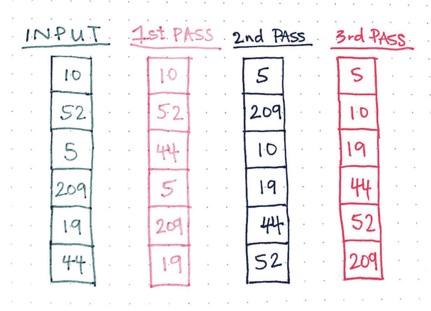](https://res.cloudinary.com/practicaldev/image/fetch/s---afDCyln--/c_limit%2Cf_auto%2Cfl_progressive%2Cq_auto%2Cw_880/https://cdn-images-1.medium.com/max/1024/1%2AYlgAn60PFJ_bHsHg1X5Wlg.jpeg) 

<figcaption>LSD 基数排序数据转换</figcaption>

</figure>

还要注意，为了完全排序我们的输入数据，我们不得不进行三次传递。通过的次数直接对应于我们输入数据中的最大数:209。当然，我们添加了额外的零来填充，但最终，我们必须通过三次的原因是因为至少有一个数字有三位数。

这对于基数排序的工作方式非常重要。它通常最适用于一系列较小的数字，因为即使只有一个带有额外数字的*数字也会导致整个数组的额外传递。*

<figure>[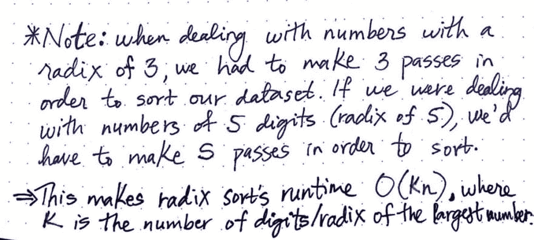](https://res.cloudinary.com/practicaldev/image/fetch/s--OHBe8PXr--/c_limit%2Cf_auto%2Cfl_progressive%2Cq_auto%2Cw_880/https://cdn-images-1.medium.com/max/1024/1%2Au4jZDedLj_43-OXCRiRy6Q.jpeg) 

<figcaption>基数排序在运行时的时间复杂度</figcaption>

</figure>

在我们的例子中，我们只处理基数为 3 的数字。因此，为了对数据集进行排序，我们必须通过三次。然而，我们可以想象一下，如果我们不得不处理数字(甚至只是一个数字！)的基数为 5、10 或 15…那么，为了对数组进行排序，我们必须遍历 5、10 或 15 次。

radix sort 的这个特性解释了它的运行时间，就是 ***O(kn)*** ，其中 *n* 是数组中要排序的元素总数， *k* 是数组中最大数的位数，或者说基数。

### 根深蒂固的排序历史

与其他排序算法相比，基数排序是最像计数排序的；如果我们考虑一下，它是有意义的，因为基数排序经常在幕后实现计数排序。

我们已经知道基数排序的时间复杂度是 *O(kn)。*一般来说，除非 *k* 是常数或者接近 *n* 的值，否则很少会发现使用基数排序。如果 *k* 是一个常量，也就是说，如果我们知道最大可能的整数，因此在运行基数排序之前知道它的长度，那么基数排序算法的实际运行时间接近于*。*

 *<figure>[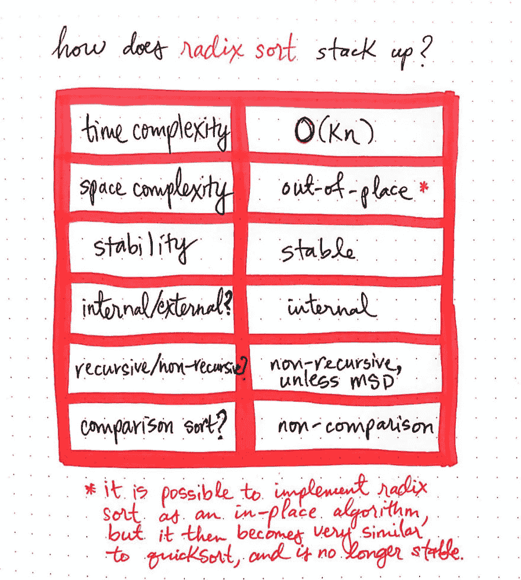](https://res.cloudinary.com/practicaldev/image/fetch/s--BxhDXgdK--/c_limit%2Cf_auto%2Cfl_progressive%2Cq_auto%2Cw_880/https://cdn-images-1.medium.com/max/1024/1%2AtH5BMmOYRtDNtsRT5ZYqwg.jpeg) 

<figcaption>基数如何排序堆积？</figcaption>

</figure>

基数排序通常实现为 ***错位*** 算法，因为它需要创建第二个复制数组，以处理哈希排序工作——类似于计数排序。它也不需要额外的外部存储器，这意味着我们可以将其归类为一种 ***内部*** 排序算法。

然而，*有可能实现就地基数排序算法，但是这样的实现很快变得类似于快速排序，并且它还失去了另一个重要的属性:稳定性。基数排序算法通过一次排序一位来处理排序工作；这确保了出现在输入数组中其他数字之前的数字在最终排序的数组中保持相同的顺序；这使得基数排序成为 ***稳定的*** 算法。*

最后，我们知道 radix sort 是一个 ***非比较*** 整数排序算法，它既可以递归实现***(MSD radix sort)***也可以非递归实现***(LSD radix sort)***。在大多数情况下，基数排序通常以最低有效位格式实现，因为这比 MSD 格式稍容易编码。

通常，我会包含一个如何实现排序算法的代码示例，但是考虑到基数排序与计数排序非常相似，我决定本周做一些稍微不同的事情！

我前面提到过基数排序是第一个被创建的排序算法。嗯，它的历史比我们任何人可能意识到的都要久远！

排序算法的历史来自于生活在 19 世纪晚期的美国发明家[赫尔曼·何乐礼](http://www.columbia.edu/cu/computinghistory/hollerith.html)。他在 1890 年负责确定官方人口统计，并必须在六个月内统计人口普查结果。他创造了一台机器，名为霍尔瑞斯机器，来帮助他解决所有这些数据的计数问题。

<figure>[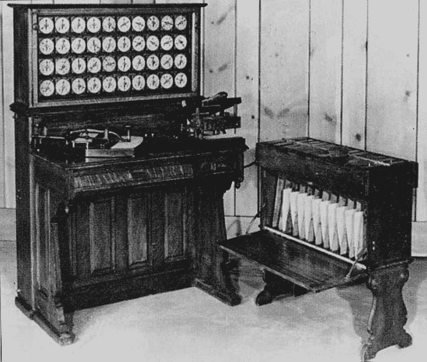](https://res.cloudinary.com/practicaldev/image/fetch/s--OeGQS4dR--/c_limit%2Cf_auto%2Cfl_progressive%2Cq_auto%2Cw_880/https://cdn-images-1.medium.com/max/948/1%2AqFgjqj5DMCgTHVDV7ang0w.jpeg) 

<figcaption>【霍尔瑞斯机器】[计算机编程艺术](http://ed-thelen.org/comp-hist/Knuth-Sort.html)</figcaption>

</figure>

大约在 1901 年，霍尔瑞斯想出了利用他的排序机器，一次一列地对数据进行排序的主意；他将条目放在第一列，然后将穿孔制表机重新插入机器，并按下一列排序。

据研究在 [*计算机科学与信息技术的里程碑*](https://books.google.com/books?id=JTYPKxug49IC) *:*

> 为了与他在 19 世纪晚期的一台霍尔瑞斯机器一起使用，赫尔曼·何乐礼开发了一种称为基数排序的算法，因为它依赖于多次排序，一次排序对应于要排序的最大值数中的一个数字(基数)位置。

霍尔瑞斯创建了自己的公司，命名为制表机公司，最终成为计算机制表记录公司(CTR)。他在那里做了多年的工程师。你猜怎么着？他的公司 CTR 于 1924 年更名为国际商业机器公司，简称 IBM。

我们今天学到的算法已经存在了一百多年，让我们的生活变得更加容易！现在，我们知道它是如何工作的，以及何时使用它。

排序算法有着悠久而丰富的历史。没有他们，计算的故事就不会一样了！所以，下次你发现自己在阅读排序算法的时候，想想赫尔曼·何乐礼和其他发现如何快速有效排序的人；花一点时间来欣赏他们的辛勤工作，并沉浸在这样一个事实的喜悦中，因为有了他们，我们再也不用担心解决这些棘手的问题了。

### 资源

基数排序是学习起来最有趣的算法之一，如果你能找到好的资源的话。我为你做了一些谷歌搜索，这样你就不会迷失在搜索引擎优化的深渊中。这里有一些继续学习基数排序的好地方，基数排序是所有排序算法的根源。分类愉快！

1.  [基于数字的排序和数据结构](https://www.cs.cmu.edu/~avrim/451f11/recitations/rec0921.pdf)，Avrim Blum 教授
2.  [基数排序可视化](https://www.cs.usfca.edu/~galles/visualization/RadixSort.html)，大卫·加勒教授
3.  [排序介绍](http://www.cs.cmu.edu/~adityaa/211/Lecture12AG.pdf)，阿南达古纳教授
4.  [排序和搜索——计算机编程的艺术](http://ed-thelen.org/comp-hist/Knuth-Sort.html)，唐纳德·克努特
5.  [排序算法++:基数排序](https://www.youtube.com/watch?v=dHeTp6hO71U)，NERDfirst

* * *

*本帖最初发表于[medium.com](https://medium.com/basecs/getting-to-the-root-of-sorting-with-radix-sort-f8e9240d4224)T3】***