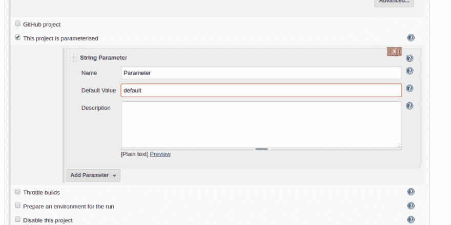

# 詹金斯管道和他们的肮脏秘密 2。

> 原文：<https://dev.to/pencillr/jenkins-pipelines-and-their-dirty-secrets-2>

# 用管道解决参数化问题:

在下一节中，我将介绍几个使用管道的 Jenkins 工作流处理示例。咱们不要浪费时间和 ***见码*** ！

* * *

## 1。运行参数化作业

创建管道时，您可以将其设置为参数化:
[](https://res.cloudinary.com/practicaldev/image/fetch/s--XvSvfoij--/c_limit%2Cf_auto%2Cfl_progressive%2Cq_auto%2Cw_880/https://thepracticaldev.s3.amazonaws.com/i/ryjwgx28gqbbwkxhad7g.png) 
如果您想在管道脚本中使用这些参数，您可以将它们称为`params.your_parameter`。现在我要迷惑你:**你也可以在你的管道脚本中声明参数！**

```
#!/usr/bin/env groovy
pipeline {
    agent any
        parameters {
            string(
                name: 'MyString',
                defaultValue:"default",
                description: "Any")
... 
```

事实上，没有什么可以阻止您在管道脚本中放置参数块。那么，如果您现在构建作业，会发生什么情况呢？答案如下:在这种情况下，当您的管道作业第一次构建时，**它会清除作业中所有之前的配置集，根据管道脚本的参数块对其进行参数化，并使用其默认参数**运行它。如果您这样做并查看您的作业的控制台输出，您将会看到以下消息，警告您您在 jenkis 作业中的配置将会丢失，并替换为管道脚本中的配置:`WARNING: The properties step will remove all JobPropertys currently configured in this job, either from the UI or from an earlier properties step.`
总之，这就是您如何在管道脚本中设置参数，并使用它来运行另一个带有参数的作业:

```
#!/usr/bin/env groovy

pipeline {
    agent any
        parameters {
            choice(
                name: 'Nodes',
                choices:"Linux\nMac",
                description: "Choose Node!")
            choice(
                name: 'Versions',
                choices:"3.4\n4.4",
                description: "Build for which version?" )
            string(
                name: 'Path',
                defaultValue:"/home/pencillr/builds/",
                description: "Where to put the build!")
    }
    stages {
        stage("build") {
            steps {
                script {
                    build(job: "builder-job",
                        parameters:
                        [string(name: 'Nodes', value: "${params.Nodes}"),
                        string(name: 'Versions', value: "${params.Versions}"),
                        string(name: 'Path', value: "${params.Path}")])
                }
            }
        }
    }
} 
```

* * *

## 2。初始化参数化作业:

***需要知道的一件重要事情:*** 将管道作业创建为参数化作业是很方便的，因为如果不这样做，在第一次构建作业时*将无法选择参数！*
**将您的作业设置为参数化:**
[](https://res.cloudinary.com/practicaldev/image/fetch/s--XvSvfoij--/c_limit%2Cf_auto%2Cfl_progressive%2Cq_auto%2Cw_880/https://thepracticaldev.s3.amazonaws.com/i/ryjwgx28gqbbwkxhad7g.png) 
反正还有另外一种方式*(上一节也解释过！)* :
当在 Jenkinsfile 中有参数块的作业运行时，**它清除作业配置中以前设置的所有参数，并用 Jenkinsfile 中的参数覆盖它**。这是一种第一次*试运行*，它设置参数，在第二次运行时，您可以将作业作为参数化作业**运行，即使您没有将其创建为一个**。
不幸的是，在这种情况下，可能会发生这样的情况:在第一次试运行时，当您还不能设置参数时，您的作业基本上只是以其默认参数开始运行。这可能很糟糕，因为你可能不希望这样。
***对于这个场景，我提供了一个解决方法:***
在 jenkinsfile 中创建一个初始化器选择参数，默认值为“Yes”。
`choice(name: 'Invoke_Parameters', choices:"Yes\nNo", description: "Do you whish to do a dry run to grab parameters?" )`
然后创建第一个`stage`，检查这是否是首次运行。如果是，它将中止构建。

```
 stages {
        stage("parameterizing") {
            steps {
                script {
                    if ("${params.Invoke_Parameters}" == "Yes") {
                        currentBuild.result = 'ABORTED'
                        error('DRY RUN COMPLETED. JOB PARAMETERIZED.')
                    }
                }
            }
        } 
```

由于这是在`parameters`块之后，当您第二次运行它时，您的作业将被参数化，并且您可以取消设置 Invoke_Parameters 选择参数。

* * *

## 3。从以前的作业继承作业变量:

在以前的构建流程中，您可以将参数传递给作业，并在需要时获得最终的 AbstractBuild，这是很常见的事情。

```
b = build( "job1", param1: "foo", param2: "bar" )
build( "job2", param1: b.build.number ) 
```

有一种方法正在酝酿中。您可以通过`buildVariables` :
找到这些

```
#!/usr/bin/env groovy

pipeline {
    agent any
    stages {
        stage("build") {
            steps {
                script {
                    def b = build(job: "parameter-source-job", propagate: false)
                    build(
                        job: "analyzer-job",
                        parameters: [
                            [
                                $class: 'StringParameterValue',
                                name: 'PARAM_ONE',
                                value: b.buildVariables.PARAM_ONE
                            ],
                            [
                                $class: 'StringParameterValue',
                                name: 'PARAM_TWO',
                                value: b.buildVariables.PARAM_TWO
                            ]
                        ]
                    )
                    if (b.result == 'FAILURE') {
                            error("${b.projectName} FAILED")
                    }
                }
            }
        }
    }
} 
```

## 4。管道在构建过程中请求输入

管道脚本提供了一种有用的语法，以防您在构建期间需要请求权限或数据。
想象一个场景，其中**我需要根据我之前选择的其他参数**来选择一些构建参数。
这就是用户输入选择派上用场的地方。

*   这里，在初始运行期间，节点块中的 bash 脚本首先生成一个节点(字符串)列表，并在参数化阶段停止。
*   在第二次运行时，我们从这个节点列表中选择一个节点参数，作为参数化构建运行作业。
*   此后，在`choose version`阶段，运行另一个 bash 脚本，将`node`参数作为其第一个参数，为该节点生成节点版本列表。
*   在`input message`部分，作业停止，我们可以从这些版本中选择。
*   最后，该作业使用我们的参数运行另一个作业。

```
#!/usr/bin/env groovy

def nodes
def versions

node {
    dir('/home/pencillr/workspace') {
        nodes = sh (script: 'sh list_nodes.sh', returnStdout: true).trim()
    }
}

pipeline {
agent any
    parameters {
            choice(name: 'Invoke_Parameters', choices:"Yes\nNo", description: "Do you whish to do a dry run to grab parameters?" )
            choice(name: 'Nodes', choices:"${nodes}", description: "")
    }
    stages {
        stage("parameterizing") {
            steps {
                script {
                    if ("${params.Invoke_Parameters}" == "Yes") {
                        currentBuild.result = 'ABORTED'
                        error('DRY RUN COMPLETED. JOB PARAMETERIZED.')
                    }
                }
            }
        }
        stage("choose version") {
            steps {
                script {
                    def version_collection
                    def chosen_node = "${params.Nodes}"
                    dir('/home/pencillr/workspace') {
                         version_collection = sh (script: "sh list_versions.sh $chosen_node", returnStdout: true).trim()
                    }
                        versions = input message: 'Choose testload version!', ok: 'SET', parameters: [choice(name: 'TESTLOAD_VERSION', choices: "${version_collection}", description: '')]

        stage("build") {
            steps {
                script {
                    build(job: "builder-job",
                        parameters:
                        [string(name: 'Nodes', value: "${params.Nodes}"),
                        string(name: 'Versions', value: "${versions}"),
                        ])
                }
            }
        }
    }
} 
```