# 使用选中的构建器模式创建复杂对象

> 原文：<https://dev.to/schreiber_chris/creating-complex-objects-using-checked-builder-pattern>

建设者模式太棒了。当我发现它时，我觉得使用这种优雅的模式，我以前编写代码时遇到的许多困难都会消失，特别是在处理有 20 个字段的复杂对象时。构建器模式允许您用比调用难看的构造器更具表达性的代码创建如此复杂的对象，这并不能表明您正在构建的对象所代表的业务。而且，创建的对象是不可变的！在这篇文章中，我想展示的是一种特殊的构建器，这是我不久前发现的，当时我正试图定义一个构建器和一个工厂的混合体:我希望能够创建一个对象的两种类型(每种类型都继承自同一个基类)，但我希望有一个声明性的 API，以避免在构建特定对象时设置无用的参数。

## 介绍我的业务

让我们考虑一个我将在整篇文章中使用的例子:假设我们想要构建快餐订单。我的快餐是卖沙拉和三明治。两者都有一些共同的属性，但也有一些是特定于一种食物的。例如，三明治需要一种面包，但这与沙拉无关。因此，我定义了一个基类 FastFoodOrder 和两个子类 Sandwich 和 Salad:

[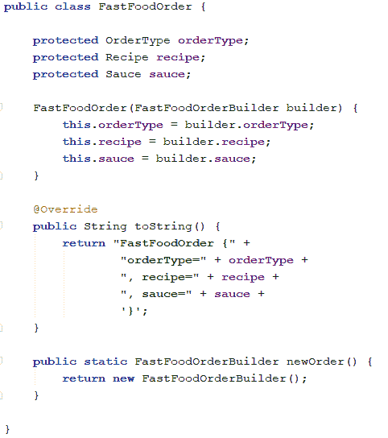](https://res.cloudinary.com/practicaldev/image/fetch/s--skm8PZBh--/c_limit%2Cf_auto%2Cfl_progressive%2Cq_auto%2Cw_880/https://www.christopheschreiber.fr/blog/wp-content/uploads/2017/07/model-2.png)
[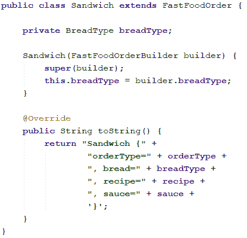](https://res.cloudinary.com/practicaldev/image/fetch/s--vtCXeZqh--/c_limit%2Cf_auto%2Cfl_progressive%2Cq_auto%2Cw_880/https://www.christopheschreiber.fr/blog/wp-content/uploads/2017/07/sandwich.png)
[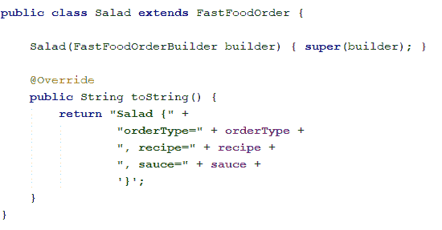](https://res.cloudinary.com/practicaldev/image/fetch/s--I92GFw-O--/c_limit%2Cf_auto%2Cfl_progressive%2Cq_auto%2Cw_880/https://www.christopheschreiber.fr/blog/wp-content/uploads/2017/07/salad.png)
属性是简单枚举:
[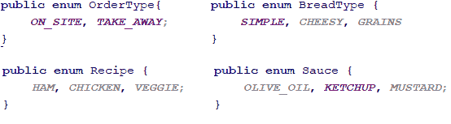](https://res.cloudinary.com/practicaldev/image/fetch/s--E_xuPySX--/c_limit%2Cf_auto%2Cfl_progressive%2Cq_auto%2Cw_880/https://www.christopheschreiber.fr/blog/wp-content/uploads/2017/07/model2-1.png)

## 经典构建器模式

首先，我们来定义一个经典建造者。对于那些不了解这种模式的人来说，它允许通过使用一个 builder 类来创建对象，该类包含要设置的每个属性的 setter，每个 setter 返回 builder 本身，以便 setter 可以很好地链接。当所有需要的属性都设置好后，build 方法被调用，它返回我们想要构造的类的一个实例。在我们的例子中，我们会有这样的类:

[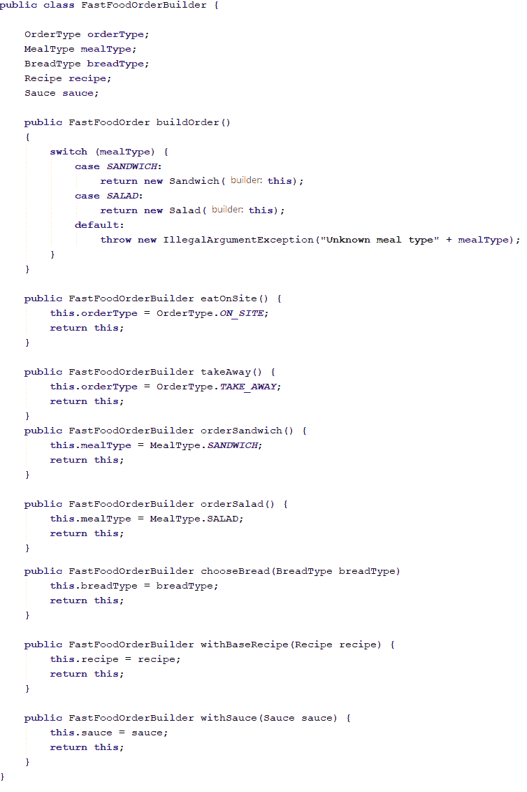T2】](https://res.cloudinary.com/practicaldev/image/fetch/s--gD5lGmE9--/c_limit%2Cf_auto%2Cfl_progressive%2Cq_auto%2Cw_880/https://www.christopheschreiber.fr/blog/wp-content/uploads/2017/07/builder-3.png)

使用这个生成器很简单:

[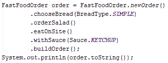](https://res.cloudinary.com/practicaldev/image/fetch/s--pSlE54DG--/c_limit%2Cf_auto%2Cfl_progressive%2Cq_auto%2Cw_880/https://www.christopheschreiber.fr/blog/wp-content/uploads/2017/07/using-builder.png) 
这个调用的结果会是:
[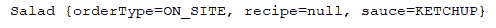](https://res.cloudinary.com/practicaldev/image/fetch/s--wUbwh5q6--/c_limit%2Cf_auto%2Cfl_progressive%2Cq_auto%2Cw_880/https://www.christopheschreiber.fr/blog/wp-content/uploads/2017/07/results-builder-1.png)

正如你所看到的，这不是很令人满意:我们定义了一个没有食谱的沙拉，我们试图选择面包...一个简单的解决方法是验证 buildOrder 方法中的数据。但是验证规则将在构建器实现内部，如果不查看代码(或者可能过时的文档)，调用者将不知道如何构造有效的订单。这个问题由 checked builder 模式解决。

## 引入选中的构建器模式

checked builder 模式的基本思想是在 builder 类中定义一个 API，以便强制字段和特殊情况直接向调用者公开。这允许在编译时直接检查有效性，并受益于 IDE 中的自动完成等良好特性。那么，这是如何工作的呢？对于构建过程的每一步，我们都定义了一个简单的接口，它包含一个 setter 方法，返回下一步的接口类型。这允许声明我们当前正在进行的步骤，并定义我们的构建器的流程。
例如，在我们的例子中，我们想要定义这个流:

*   选择带走还是现场吃
*   在沙拉和三明治之间选择
*   如果我们选择了三明治，我们必须选择一种面包，如果我们选择了沙拉，我们不需要这一步
*   选择基础配方(主要成分)
*   或者，选择一种调味汁
*   构建 FastFoodOrder 实例

我们的第一步将代表一个空订单，因此让我们创建一个界面，允许在外卖或现场就餐之间进行选择:

[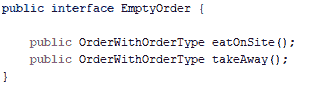](https://res.cloudinary.com/practicaldev/image/fetch/s--c8fjBN_Q--/c_limit%2Cf_auto%2Cfl_progressive%2Cq_auto%2Cw_880/https://www.christopheschreiber.fr/blog/wp-content/uploads/2017/07/step1.png) 
现在，我们有一个关联订单类型的订单，因此我们必须在我们的系统可以处理的餐食类型之间进行选择，即三明治和沙拉:

[T2】](https://res.cloudinary.com/practicaldev/image/fetch/s--tMSJV4Uv--/c_limit%2Cf_auto%2Cfl_progressive%2Cq_auto%2Cw_880/https://www.christopheschreiber.fr/blog/wp-content/uploads/2017/07/step2-1.png)

如果是三明治，我们必须选择它的面包类型，然后我们到达同一个阶段:

[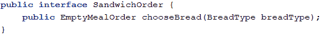](https://res.cloudinary.com/practicaldev/image/fetch/s--fsg-98Nv--/c_limit%2Cf_auto%2Cfl_progressive%2Cq_auto%2Cw_880/https://www.christopheschreiber.fr/blog/wp-content/uploads/2017/07/sandwich-order.png) 
[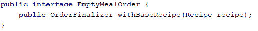](https://res.cloudinary.com/practicaldev/image/fetch/s--aILM3xjn--/c_limit%2Cf_auto%2Cfl_progressive%2Cq_auto%2Cw_880/https://www.christopheschreiber.fr/blog/wp-content/uploads/2017/07/choose-meal.png) 
最后，我们到达最后一个阶段，在这里我们可以选择可选的配料(在我的例子中，酱是唯一可选的配料)并构建我们的对象:
[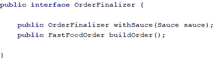](https://res.cloudinary.com/practicaldev/image/fetch/s--o5SWBLeX--/c_limit%2Cf_auto%2Cfl_progressive%2Cq_auto%2Cw_880/https://www.christopheschreiber.fr/blog/wp-content/uploads/2017/07/finalizer.png)

现在，我们只需要在我们的构建器中实现所有这些接口:
[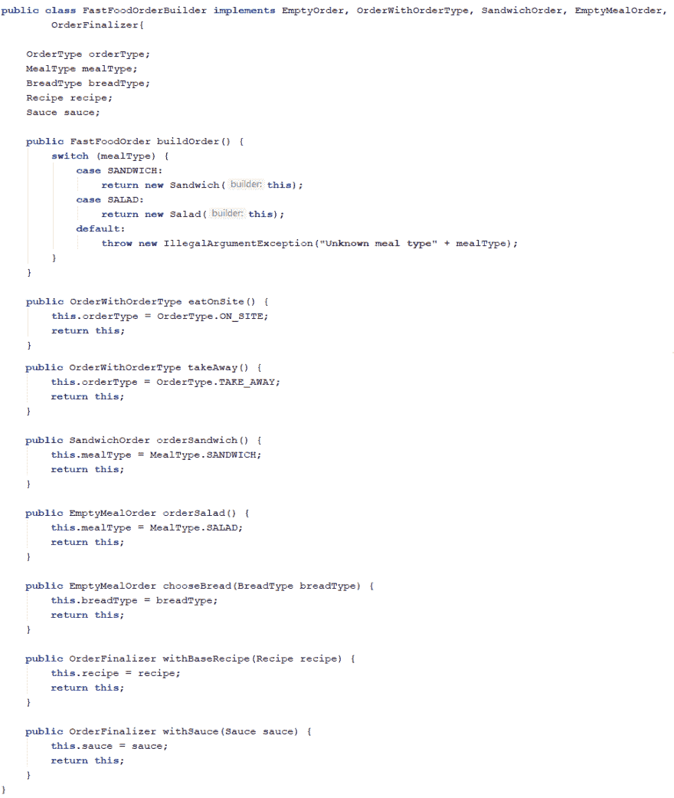](https://res.cloudinary.com/practicaldev/image/fetch/s--ZOuDwjq8--/c_limit%2Cf_auto%2Cfl_progressive%2Cq_auto%2Cw_880/https://www.christopheschreiber.fr/blog/wp-content/uploads/2017/07/checked-builder.png)

我们还必须在 FastFoodOrder.newOrder()中更改构建器的实例化，以便检索的实例属于第一步的类型(EmptyOrder)，否则我们将能够访问构建器的所有方法，绕过预期的工作流并构建不一致的订单(尽管我们无法阻止恶意用户强制构建器访问不希望的状态):

[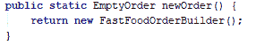T2】](https://res.cloudinary.com/practicaldev/image/fetch/s--ZpOWW0Sb--/c_limit%2Cf_auto%2Cfl_progressive%2Cq_auto%2Cw_880/https://www.christopheschreiber.fr/blog/wp-content/uploads/2017/07/checked_builder_init-1.png)

使用这个构建器，我们只能设置与我们正在创建的对象相关的属性，如果不指定所有必需的成分，我们就无法构建实例:
[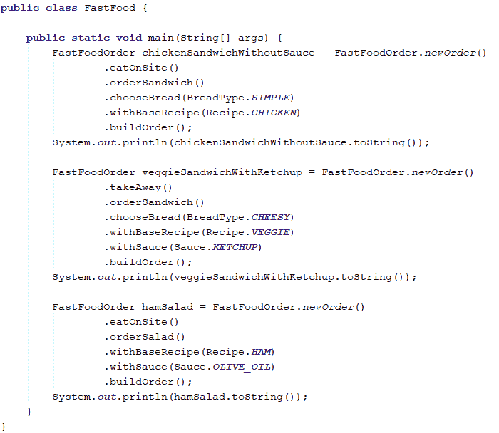](https://res.cloudinary.com/practicaldev/image/fetch/s--zmpK_ZMX--/c_limit%2Cf_auto%2Cfl_progressive%2Cq_auto%2Cw_880/https://www.christopheschreiber.fr/blog/wp-content/uploads/2017/07/using-checked-builder.png)

[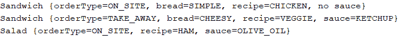T2】](https://res.cloudinary.com/practicaldev/image/fetch/s--Tm8qh5uZ--/c_limit%2Cf_auto%2Cfl_progressive%2Cq_auto%2Cw_880/https://www.christopheschreiber.fr/blog/wp-content/uploads/2017/07/results-checked-builder.png)

## 结论

builder 模式的这种特殊实现有很多优点，因为它允许在编写代码时直接检查对象的一致性，而不是在运行时。这在一个公共 API 中非常有用(这可以看作是一些活文档；-) )
另一方面，它的主要缺点是它引入了大量的接口来构建工作流模型的对象，因而可能很难阅读或修改。因此，像往常一样，这不是每次您想要实现构建器时都应该使用的银弹，尤其是当处理工作流中有许多分支的复杂业务对象时，或者当工作流可能经常改变时。
这只是另一个工具，在某些情况下可能有用:-)
你可以在[我的 Github 页面](https://github.com/ChristopheSchreiber/CheckedBuilderDemo)上找到我的例子中的代码