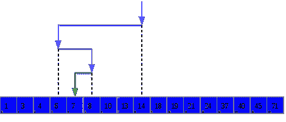

# 用 git 二分法查找中断提交

> 原文:[https://dev . to/msan Ford/finding-breaking-commits-with-git-biquite-2300](https://dev.to/msanford/finding-breaking-commits-with-git-bisect-2300)

### 分步指南

工作流程是这样的:

1.  **git log** 检查提交历史
2.  **git checkout** <一个确认的工作提交>
3.  **git checkout** <一个确认的破提交；常团长>
4.  **git 平分**以找到中断提交

“一分为二”的意思是切成两半。Git 二等分就是这样做的:您选择两个提交，一个已知是坏的，一个已知是好的，git 将检查这两个提交之间的修改，并要求您检查每个提交并标记为好或坏，直到您找到引入 bug 的特定提交。

在只有少数开发人员的小项目中，识别中断提交可能非常容易。但是，当项目变得越来越复杂，大型分布式团队快速连续地提交大型块时，像这样的工具就变得有用了。

**重要提示:** *Git 平分*存在是因为人是人，会犯错；这只是一个工具的演练，该工具用于帮助找到那些尽管我们尽了最大努力仍会漏掉的错误。

### 工作示例

我们将举一个真实世界的例子，并逐步解决这个问题。

### 注意到问题

一名开发人员试图启动 exostore，并收到以下消息:

```
14:29:24.78 \<trace\> [init][db]start createDataPool (in dblink.js:63)
14:29:24.80 \<trace\> [kakyo] Init DB OK (in dblink.js:59)

/vagrant/exostore-v4/exo\_lib/data/modules/dbapi\_admin\_device.js:66
).error(errorHandler ).then(funcation(result){
^
SyntaxError: Unexpected token {
at Module.\_compile (module.js:439:25)
at Object.Module.\_extensions..js (module.js:474:10)
at Module.load (module.js:356:32)
at Function.Module.\_load (module.js:312:12)
at Module.require (module.js:364:17)
at require (module.js:380:17)
at Object.\<anonymous\> (/vagrant/exostore-v4/exo\_lib/data/dbmodules.js:9:23)
at Module.\_compile (module.js:456:26)
at Object.Module.\_extensions..js (module.js:474:10)
at Module.load (module.js:356:32)
**error: Forever detected script exited with code: 8** 
```

虽然问题所在很明显(即 dbapi_admin_device.js:66)，但是简单地运行并修复它是不明智的。我们需要检查提交历史，并查看是否有其他内容作为批处理的一部分被更改，这可能会影响其他组件。

### 检查日志

```
git log oneline decorate

**759c997** ( **HEAD** , **origin/master** , **origin/HEAD** , **msanford** , **master** ) Globally refactor SUCCESSED \> SUCCESS; MSGID \> MSG\_ID; datas \> data.

**47a77a2** [EXO-135](https://exouinc.atlassian.net/browse/EXO-135) #resolve Add admin user account creation API, update stored procedure for error handling, scaffold unit test.

**19371ec** 1\. Added a constraint in admin db tbe\_domain. 2\. Added two test helper functions. 3\. Added a insertion helper function. 4\. Added a unit test case set for db\_store\_app model class.

**d38a884** add device related implementations

**9f05de2** Remove old fixture generation script

**a1f5ff3** Refactor comment style in db/\*.sql

**ea1b955** Manually regenerate vagrant-v4 fixtures

**3248f20** Updated translation support — Added data table sample — Removed unused stuff — Replaced message APIs routes by correct paths in `app.js`

**d7f3076** add get msg count apis 
```

这里我们看到一系列的提交，其中任何一个都有可能破坏系统。

> 重置基础是一台时间机器
> 
> 虽然如果您只是第一次看到它中断，可能会很容易认为历史上的最后一次提交引入了突破性的更改，但事实并非如此！
> 
> 因为我们在一个私有分支中工作，重定基础到主分支，然后在推送之前将主分支重定基础到我们的工作分支，所以在时间上较晚的提交*可能会在工作历史*中较早出现，因为它们被重定了基础。

### 寻找好的状态

```
git checkout 9f05de2 
```

商店正确启动！

### 找到不好的状态

```
git checkout master 
```

这将检查原点/主头(此时为 759c997)。商店休息！

### 查找中断提交

#### 设置初始状态

```
git bisect start

git bisect good 9f05de2 
```

#### 通过标记一个错误的提交开始一分为二

```
git bisect bad 759c997
Bisecting: 1 revision left to test after this (roughly 1 step)
[19371eca935657ebaecb0a4e9879ce295a91f5a2] 1\. Added a constraint in admin db tbe\_domain. 2\. Added two test helper functions. 3\. Added a insertion helper function. 4\. Added a unit test case set for db\_store\_app model class. 
```

#### 发现错误提交，继续

此时，git 已经签出了一个特定的修订(commit) *，大约在好的和坏的*之间。测试之后，我们发现存储无法加载，因此我们将此标记为错误提交。

```
git bisect bad

Bisecting: 0 revisions left to test after this (roughly 0 steps)
[d38a88471524c07f3762921a030887e29460dc3e] add device related implementations 
```

这意味着我们也必须测试这个版本。我们越来越接近了！但是在这种情况下，商店也无法启动。因此，我们将此提交标记为坏。

#### 发现另一个错误提交，继续

```
git bisect bad

**d38a88471524c07f3762921a030887e29460dc3e is the first bad commit**
commit d38a88471524c07f3762921a030887e29460dc3e
Author: [REDACTED]
Date: Thu Aug 28 09:16:14 2014 -0700

add device related implementations

:040000 040000 53c2f55597509733e427063ff7c8c8d9f6d5efeb aa6a09dd673be0a7d73ccf36f25fc6078ee3ae5d M exo\_lib
:040000 040000 f1d3b03ff9ffd3a56fa16a7f698c76bbc7883dd0 a75004b9fe513ec4edd27c12d5d7ae25177c3134 M routes 
```

### 找到了！

对分已经完成，我们已经确定了错误的提交，所以我们可以将我们的工作副本重置为其先前的状态。

```
git bisect reset

Previous HEAD position was d38a884… add device related implementations
Switched to branch ‘master’
Your branch is up-to-date with ‘origin/master’ 
```

### 修修补补

既然您已经找到了引入重大变更的提交，那么您可以采取措施来补救它，这可能包括:

1.  直接联系提交作者，
2.  自己纠正它，并进行紧急修复提交。

在这种情况下，找到提交是有用的，因为它不仅暴露了明显的已知问题，还暴露了同一提交中的另一个相关问题。

### 表现

[二等分](https://en.wikipedia.org/wiki/Bisection_method)通常是对连续值函数进行搜索的术语，而 git 提交显然是离散的元素，这使得 git-二等分成为了[二分搜索法](https://en.wikipedia.org/wiki/Binary_search_algorithm)算法。

二分搜索法在最坏情况下运行 *O(log n)* 时间和 *O(1)* 空间。

<figure>[](https://res.cloudinary.com/practicaldev/image/fetch/s--IIHKbud9--/c_limit%2Cf_auto%2Cfl_progressive%2Cq_auto%2Cw_880/https://cdn-images-1.medium.com/max/470/1%2A-9MWPstfy1BgClAs3JJTAw.png) 

<figcaption>【二分搜索法】法为从 14 开始取值 7；[维基共享资源](https://en.wikipedia.org/wiki/Binary_search_algorithm)。</figcaption>

</figure>

将 14 和 6 替换为“已知好的”和“已知坏的”提交，本质上是相同的过程。