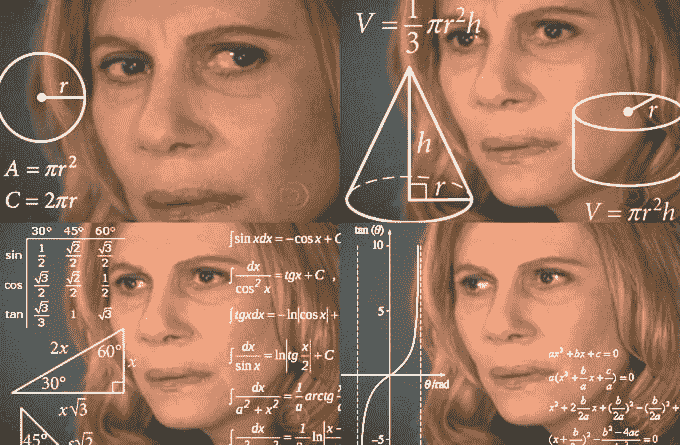

# 你是如何精通网络动画和/或虚拟现实的几何和矢量数学的？

> 原文:[https://dev . to/johnlukeg/how-you-how-be-competent-at-geometry-and-vector-math-for-web-animations-andor-VR](https://dev.to/johnlukeg/how-did-you-become-proficient-at-geometry-and-vector-math-for-web-animations-andor-vr)

免责声明:我的问题可能因其性质而模棱两可。我不完全确定简明地要求什么，所以我试图描述它，希望有人比我聪明得多将翻译。

在过去的一年里，我一直在前端工作，并试图学习虚拟现实开发。随着我变得越来越先进，我发现我希望能够创造出漂亮的产品，而不是模仿他人的作品，这是基于对 3D 对象和向量的几何和物理的理解。许多教程似乎忽略了过程的这一方面，因为知识可能是假定的。我获得了计算机科学的本科学位，所以你会认为我应该知道这些，但我从来没有机会把这些联系起来。*

 

<figure>

<figcaption>“等等...所以我真的需要知道什么是神经过敏？</figcaption>

</figure>

你有什么资源建议来帮助人们更好地开始创建像 svg 绘图、css 绘图/动画和/或虚拟现实环境/对象这样的东西吗？

*例如，我正在阅读[史蒂文·m·拉瓦勒关于虚拟现实的书](http://vr.cs.uiuc.edu/vrbook.pdf)，但当他说我应该能够通过查看方程来可视化四元数时，我开始感到困惑。我可以很容易地理解几何旋转的数学原理，但是我不理解为什么要应用数学原理。