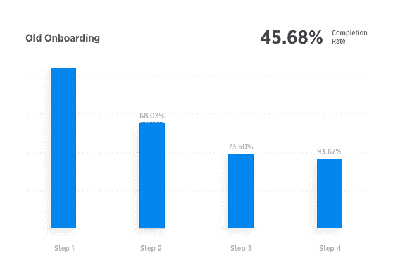
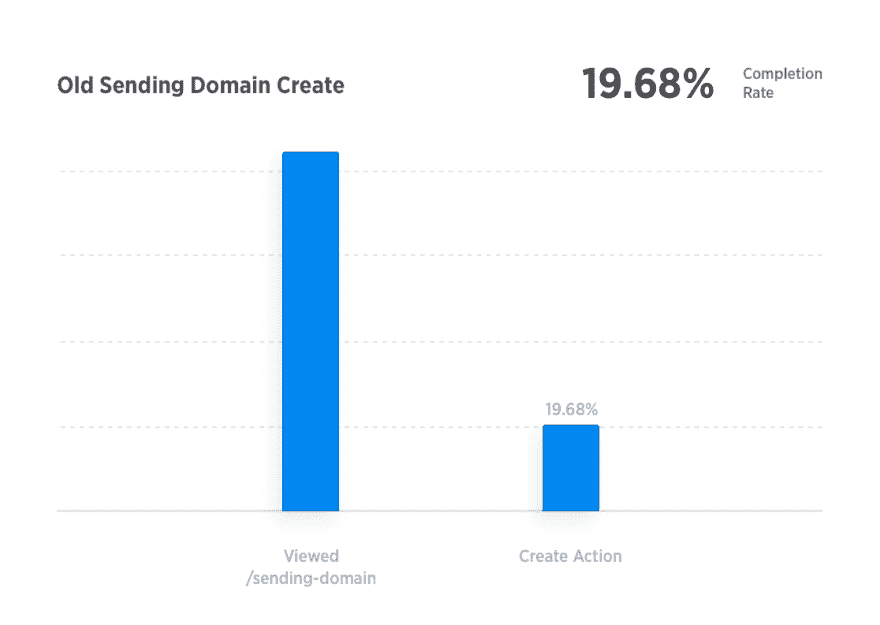
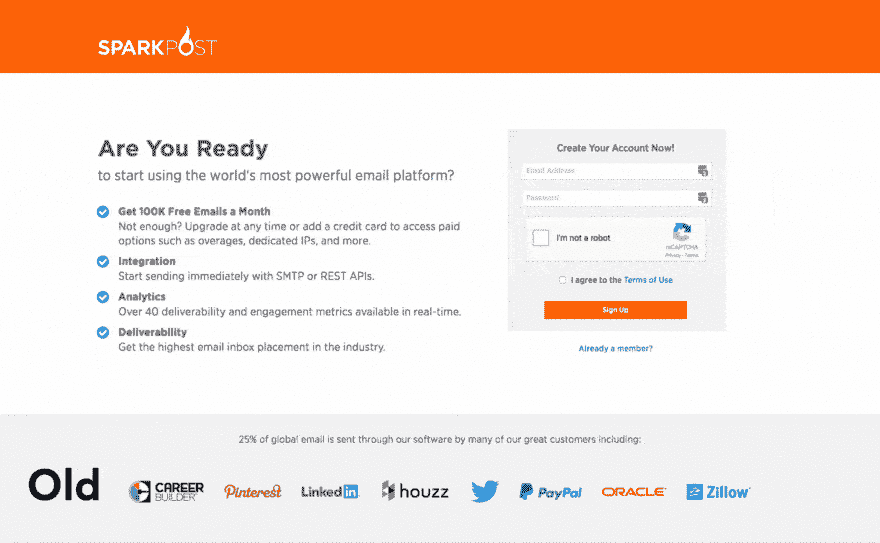
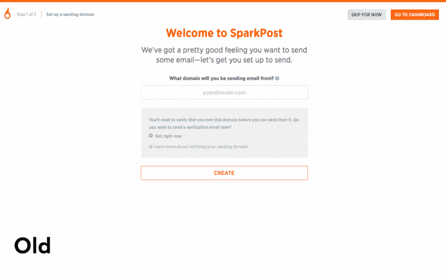
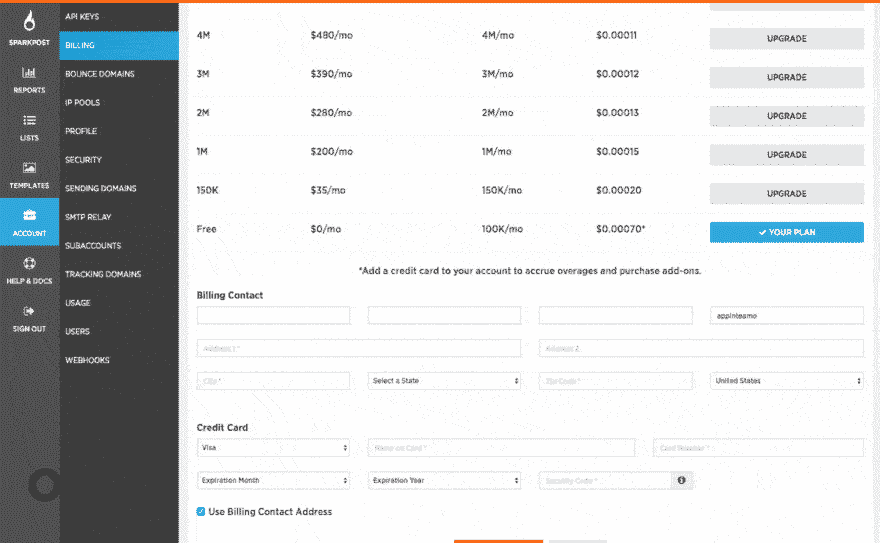
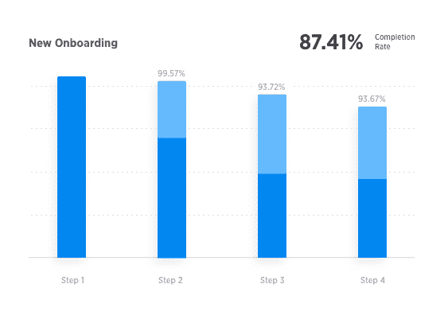
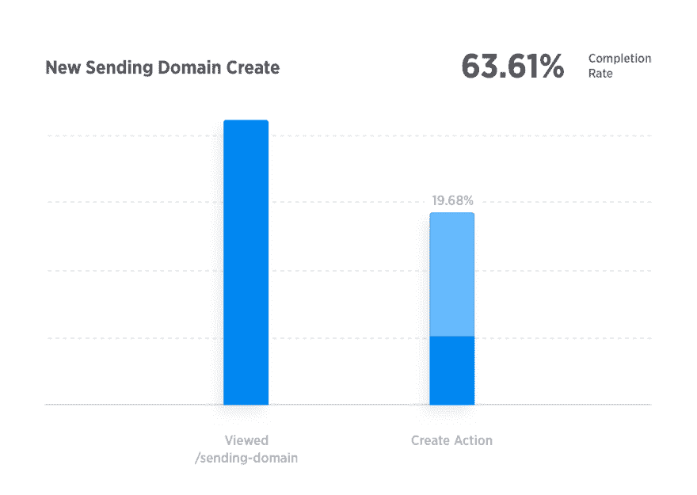

# 如何设计更好的入职体验

> 原文:[https://dev . to/sparkpost/how-to-design-a-better-on boarding-experience](https://dev.to/sparkpost/how-to-design-a-better-onboarding-experience)

## 优化我们的入职体验

入职很难做好。这是我们的用户与我们的应用程序建立关系的开始，也是介绍我们产品功能以及建立对我们品牌信任的绝佳机会。这可能是让我们的语气、互动和指示正确的最重要的地方之一。

在 [SparkPost](https://www.sparkpost.com) ，我们最近更新了我们的入职体验。作为这个项目的设计负责人，我想我应该回馈给其他设计师和开发人员，分享我们做出的一些决定以及做出这些决定的原因。

## 99 个问题

随着我们的应用程序不断发展，我们过去的入职体验并没有很好地扩展。数据显示它不知怎么坏了。太多的人完全忽略了这一点，错过了他们需要完成的关键步骤，然后才能起来运行发送一些电子邮件。

### 1。有些人根本没有看到入职

从我们的营销网站导航，通过我们的注册流程，进入我们的应用程序是一个复杂的过程，涉及许多分支机构。新注册会看到不同的东西，这取决于用户是从哪里注册的。

有些人甚至完全退出了入职培训。我们把它们放在应用程序的中间，让它们自己解决其他问题。我们没有指导他们正确使用我们的应用程序所需的设置和配置。

从下面你可以看到，只有 45%的人完成了整个入职体验。

[T2】](https://res.cloudinary.com/practicaldev/image/fetch/s--AAFaitFU--/c_limit%2Cf_auto%2Cfl_progressive%2Cq_auto%2Cw_880/https://media.sparkpost.com/uploads/2017/07/Funnel-Old.png)

### 2。这种经历是一种动力杀手

我们意识到体验是新注册用户和应用程序之间的巨大障碍。在某些方面，我们要求太多的输入，而在其他方面，我们没有提供足够的指导。例如，一个表单包含 21 个字段。此外，我们的域验证步骤非常混乱。

视觉上，我们的旧界面感觉很嘈杂，而且从一步到下一步有点不一致。放置不当的按钮、文本和不一致的风格是让整个体验感觉不可预测和难以消化的一些问题。

很少有人添加他们的发送域名——这是非常重要的一步。

[T2】](https://res.cloudinary.com/practicaldev/image/fetch/s--Z36shzb1--/c_limit%2Cf_auto%2Cfl_progressive%2Cq_auto%2Cw_880/https://media.sparkpost.com/uploads/2017/07/Create-Old.png)

### 3。对不起，其他问题不存在，因为我们得到了…

### 我们肩上的泥土

回到绘图板，我们决定我们的注册流程应该:

*   介绍该应用程序及其重要功能。
*   向用户介绍这些功能的好处。
*   把用户变成发送口碑最好的发送者。

我们又增加了两步。

是的，我们增加了步骤。你可能会认为我们疯了，但我们想确保我们的用户拥有成为成功的发送者所需的一切。电子邮件是相当复杂的，即使是在我们处理棘手问题的时候，所以我们需要给他们必要的工具，让他们以正确的方式运行起来。

首先，我们创建了一个新的计划选择步骤。我们想确保我们的免费和付费用户知道他们得到了什么。这个新的计划选择页面允许我们突出每个计划的优点、特点和限制。

对于我们的高容量发件人，我们引入了另一个新的步骤，可以选择添加专用 IP 地址。专用 IP 是一个小的附加功能，可以帮助提高发件人的声誉。

然而，我们并没有一味地添加页面。我们彻底检查了内容，刷新了用户界面，删除了很多垃圾内容。这里有一些指导我们内部设计过程的原则。

**消化率**

好的设计容易消化。

我们希望尽可能快地保持新的入职体验，并让我们的发送者获得他们体验中最有价值的部分——实际使用我们的应用程序。他们应该完成整个过程，而不需要花费大量的时间和精力去想该做什么。

通过颜色、字体大小和考虑周到的位置来重新组织我们页面的层次结构，这些都有助于给我们的用户提供他们所需要的指导，使他们能够更快地做出决定。

字段、按钮、交互，甚至整个步骤都被砍掉了——任何会让用户困惑的东西。我们能够将前面提到的 21 个字段缩减为更容易理解的 10 个字段。

[T2】](https://res.cloudinary.com/practicaldev/image/fetch/s--BwWtFcns--/c_limit%2Cf_auto%2Cfl_progressive%2Cq_66%2Cw_880/https://media.sparkpost.com/uploads/2017/07/Sign-Up-Compare3.gif)

**透明度**

好的设计让选择变得清晰。

电子邮件有时会让人很困惑，但我们不能指望用户阅读如何开始使用我们产品的手册。易读和简短的文本是不够的。在每一步，我们都确保解释和说明:

*   这个步骤或特征是为了什么
*   为什么我们需要收集信息
*   他们下一步应该做什么

[T2】](https://res.cloudinary.com/practicaldev/image/fetch/s--tU-9TUTq--/c_limit%2Cf_auto%2Cfl_progressive%2Cq_66%2Cw_880/https://media.sparkpost.com/uploads/2017/07/Domain-Compare1.gif)

**熟悉度**

好的设计也意味着一致性。

这一点主要来自于利用人们对 UI 交互的现有期望。我们不想重新发明我们已经使用多年的通用设计模式。因此，我们通过坚持良好建立的 UI 和设计惯例来避免混淆。

我们希望入职体验在视觉上尽可能与我们的其他属性保持一致，包括我们的网站和应用程序。从我们的网站和应用程序中整合组件、文本样式和其他设计模式，确保与我们品牌有视觉接触的任何人的一致性。

[T2】](https://res.cloudinary.com/practicaldev/image/fetch/s---cPgoMm_--/c_limit%2Cf_auto%2Cfl_progressive%2Cq_66%2Cw_880/https://media.sparkpost.com/uploads/2017/07/Billing-Compare.gif)

## 又来了

最后，我们准备好并兴奋地发布这些更新。用户界面看起来很棒！然而，我们都知道，如果结果实际上不能帮助我们的客户，这并没有多大意义。现在我们有足够的时间来衡量新入职体验的影响，我们对此更加兴奋。

我们的完成率几乎翻了一番。

[T2】](https://res.cloudinary.com/practicaldev/image/fetch/s--IHSXnopQ--/c_limit%2Cf_auto%2Cfl_progressive%2Cq_auto%2Cw_880/https://media.sparkpost.com/uploads/2017/07/Funnel-New.png)

*我们的发送域完成率翻了三倍！*

[T2】](https://res.cloudinary.com/practicaldev/image/fetch/s--j9VNiajH--/c_limit%2Cf_auto%2Cfl_progressive%2Cq_auto%2Cw_880/https://media.sparkpost.com/uploads/2017/07/Create-New.png)

当然，入职只是客户体验我们产品的开始。但是一次精心设计的入职体验会让他们在做自己真正想做的事情上领先一步。

## (W)振打起来

最后，入职从未停止，这是真的。

反复解决问题是每个设计过程的基本部分。我们发现的问题有时很难解决，但是随着每次设计冲刺和每次修改，我们看到了改进。这是我们前进的动力。最重要的是，我们希望看到我们的用户成功。

如果你最近注册了 SparkPost，我们很想听听你对我们入职体验的看法。请随意联系 Slack，[Twitter](http://twitter.com/sparkpost)，或者留下你的任何想法。

[T2】](https://res.cloudinary.com/practicaldev/image/fetch/s--sCS57472--/c_limit%2Cf_auto%2Cfl_progressive%2Cq_66%2Cw_880/https://media.sparkpost.com/uploads/2017/07/jayz.gif)

** *免责声明:乔恩根本不听 Jay-Z*

*本帖最初发表于[sparkpost.com](https://www.sparkpost.com/blog/better-onboarding-experience/)T3】*