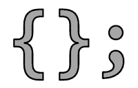
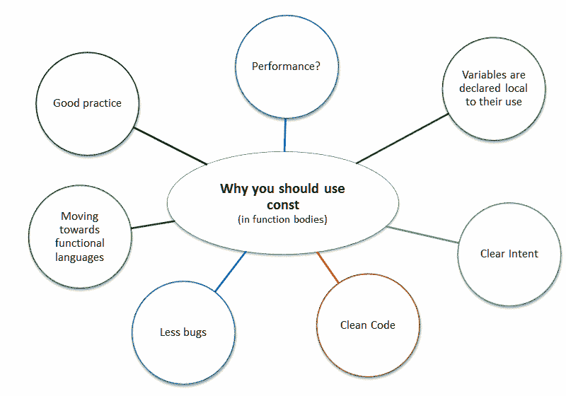

# 请将变量声明为常量

> 原文:[https://dev.to/fenbf/please-declare-your-variables-as-const](https://dev.to/fenbf/please-declare-your-variables-as-const)

[T2】](http://www.bfilipek.com/2016/12/please-declare-your-variables-as-const.html)

我需要承认，在过去的几年里，我有点沉迷于让所有变量变得不确定的想法。每当我在函数体中声明一个变量的时候，我都会试着去想是否能让它成为常量。让我解释一下为什么我认为你也应该这样做。

**注**:本帖最初发布在我的博客: [Bartek 的编码博客:请将你的变量声明为 const](http://www.bfilipek.com/2016/12/please-declare-your-variables-as-const.html) 。

## 怎么了？

以下代码有什么问题？

```
int myVariable = 0;

// some code...

myVariable = ComputeFactor(params...); 
```

<svg width="20px" height="20px" viewBox="0 0 24 24" class="highlight-action crayons-icon highlight-action--fullscreen-on"><title>Enter fullscreen mode</title></svg> <svg width="20px" height="20px" viewBox="0 0 24 24" class="highlight-action crayons-icon highlight-action--fullscreen-off"><title>Exit fullscreen mode</title></svg>

对比:

```
// some code...

const int myVariable = ComputeFactor(params...); 
```

<svg width="20px" height="20px" viewBox="0 0 24 24" class="highlight-action crayons-icon highlight-action--fullscreen-on"><title>Enter fullscreen mode</title></svg> <svg width="20px" height="20px" viewBox="0 0 24 24" class="highlight-action crayons-icon highlight-action--fullscreen-off"><title>Exit fullscreen mode</title></svg>

在第一个例子中，我们只是改变了一些变量的值，这是代码中的典型现象…不是吗？

让我们来看看第二种方法的好处。

请注意，我将只关注函数体中使用的变量，而不是函数的参数或类成员。

## 为什么有帮助

### 性能？

几年前，我的同事建议使用`const`作为变量。我认为唯一的原因是优化和性能。后来，我明白了，这并不那么明显，使用`const`还有更重要的原因。

事实上，一个好的 C++编译器可以做同样的优化，不管你是否使用`const`。编译器会推断出一个变量是被改变了还是在开始时被初始化了一次。那么，这里有什么性能上的好处吗？

这里很难展示真实的数字。理想情况下，我们可以得到一个 C++项目(比如最小 10k LOC ),然后尽可能使用`const`,并与没有`const`的相同项目进行比较。

在合成中，小例子有:

```
string str;
str = "Hello World"; 
```

<svg width="20px" height="20px" viewBox="0 0 24 24" class="highlight-action crayons-icon highlight-action--fullscreen-on"><title>Enter fullscreen mode</title></svg> <svg width="20px" height="20px" viewBox="0 0 24 24" class="highlight-action crayons-icon highlight-action--fullscreen-off"><title>Exit fullscreen mode</title></svg>

vs

```
const string str = "Hello World"; 
```

<svg width="20px" height="20px" viewBox="0 0 24 24" class="highlight-action crayons-icon highlight-action--fullscreen-on"><title>Enter fullscreen mode</title></svg> <svg width="20px" height="20px" viewBox="0 0 24 24" class="highlight-action crayons-icon highlight-action--fullscreen-off"><title>Exit fullscreen mode</title></svg>

甚至可以有 30%的性能提升！数字来自 [J .特纳](https://twitter.com/lefticus)的谈话[的实际表演做法](https://www.youtube.com/watch?v=lNnBExDoNSQ)。正如一位[评论者注意到的](https://www.reddit.com/r/cpp/comments/5gktfc/please_declare_your_variables_as_const/dat2rcb/):收益不是来自于常量本身，而是来自于我们没有重新赋值的事实。

正如我们所看到的，有可能获得一些性能，但我对整个项目不抱太大期望。这要看上下文。也许最多 1%或 2%左右。像往常一样:测量测量测量！:)

尽管如此，为什么不让编译器的工作变得更容易，并拥有更好的代码呢？

因此，看起来“性能”并不是使用`const`的最有力的理由，阅读下面更重要的方面:

### 变量被声明为局部使用

如果你想声明一个常量变量，你需要准备好所有需要的数据。这意味着你不能只在函数的开头声明它(就像在标准的老式 C-way 中一样)。因此，更有可能将变量放在它们实际使用的地方。

```
void foo(int param)
{
    const int otherVariable = Compute(param);
    // code...

    // myVar cannot be declared before 'otherVariable'
    const int myVar = param * otherVariable; 
} 
```

<svg width="20px" height="20px" viewBox="0 0 24 24" class="highlight-action crayons-icon highlight-action--fullscreen-on"><title>Enter fullscreen mode</title></svg> <svg width="20px" height="20px" viewBox="0 0 24 24" class="highlight-action crayons-icon highlight-action--fullscreen-off"><title>Exit fullscreen mode</title></svg>

将变量声明为局部变量不仅是一种好的做法，而且可以减少内存使用量(因为并非所有变量都会被分配)，甚至使代码更加安全。

### 明确意图

当你声明某个东西为常量时，你清楚地表明“我不会改变那个变量的值。”

当你阅读代码时，这样的练习是至关重要的。例如:

```
int myVar = 0;

// code...

// code... 
```

<svg width="20px" height="20px" viewBox="0 0 24 24" class="highlight-action crayons-icon highlight-action--fullscreen-on"><title>Enter fullscreen mode</title></svg> <svg width="20px" height="20px" viewBox="0 0 24 24" class="highlight-action crayons-icon highlight-action--fullscreen-off"><title>Exit fullscreen mode</title></svg>

看到这样的事情，你不确定`myVar`会不会改变。这在小函数中可能不是问题，但是对于更长、更复杂的方法呢？

同时拥有:

```
const int myVar = ...;

// code... 
```

<svg width="20px" height="20px" viewBox="0 0 24 24" class="highlight-action crayons-icon highlight-action--fullscreen-on"><title>Enter fullscreen mode</title></svg> <svg width="20px" height="20px" viewBox="0 0 24 24" class="highlight-action crayons-icon highlight-action--fullscreen-off"><title>Exit fullscreen mode</title></svg>

你至少可以确定`myVar`没有发生任何事情。你就少了一个需要追踪的参数。

### 清理代码

有时候变量的初始化不仅仅是简单的赋值。可以使用几行(或更多行)来给出适当的值。在这种情况下，使用变量`const`会迫使你将这样的初始化转移到一个单独的地方。

正如我在[life 中对复杂初始化](http://www.bfilipek.com/2016/11/iife-for-complex-initialization.html)所描述的，你可以在 life 或不同的方法中包含初始化。无论如何，你会避免代码看起来像这样:

```
int myVariable = 0;

// code... 

// complex initialization of 'myVariable'
if (bCondition)
    myVariable = bCond ? computeFunc(inputParam) : 0;
else
    myVariable = inputParam * 2;

// more code of the current function... 
```

<svg width="20px" height="20px" viewBox="0 0 24 24" class="highlight-action crayons-icon highlight-action--fullscreen-on"><title>Enter fullscreen mode</title></svg> <svg width="20px" height="20px" viewBox="0 0 24 24" class="highlight-action crayons-icon highlight-action--fullscreen-off"><title>Exit fullscreen mode</title></svg>

不管你用什么，你最终只能在一个地方获得变量的值。

### 虫子少

当一个变量是`const`时，你不能改变它，所以一些不想要的错误不太可能发生。

当一些长函数和变量在某些情况下倾向于被*重用*时，很容易出现意外问题。你改变了一个变量的值，它适用于你的情况，但是使用它的旧情况现在停止工作了。同样，声明一个变量为`const`至少会保护你免受这些愚蠢的错误。更不用说调试这样的错误可能是一个真正的痛苦。

顺便说一句:举例来说，请看 Andrzej Krzemienski 的博客文章:[更多的常数–更少的错误](https://akrzemi1.wordpress.com/2016/12/16/more-const-fewer-bugs/)

### 走向函数式语言

函数式风格可能是一个值得单独写一篇文章的主题，但是一般来说，拥有*不可变对象*是函数式语言中的一个基本要素。

不可变对象本质上是线程安全的。当一个线程处理这种类型的对象时，我们可以确定没有其他线程正在改变这些对象。可以避免大量的数据竞争。这为算法的并行化提供了许多相对容易的方法。

### 因为别人这么说

摘自 C++核心指南(Con:常量和不变性)

> 缺点 1:默认情况下，使对象成为不可变的原因
> 
> 不可变对象更容易推理，所以要使对象非常数
> 
> 只有当需要改变它们的值时。防止意外
> 
> 或者很难注意到的价值变化。

和

> 缺点 4:使用 const 定义值不变的对象
> 
> 施工后原因
> 
> 防止意外更改对象值带来的意外。

Scott Meyers 著[有效 C++](https://www.amazon.com/Effective-Specific-Improve-Programs-Designs/dp/0321334876/ref=as_li_ss_tl?ie=UTF8&qid=1480795794&sr=8-1&keywords=effective%20C%20%20&linkCode=ll1&tag=bfilipek-20&linkId=a28e239e8d4ec05703ad6f0efba14f5f) (第 3 章):

> 尽可能使用 const。
> 
> const 的奇妙之处在于它允许您指定一个语义约束——一个特定的对象不应该被修改——并且
> 
> 编译器将强制实施该约束。它让你能够交流
> 
> 对于编译器和其他程序员来说，值应该保留
> 
> 不变。每当那是真的时候，你都应该这样说，
> 
> 因为这样你就可以获得编译器的帮助来确保
> 
> 不违反约束。

简森·特纳:

*   [CppCon 2016:“微型计算机的丰富代码:C++17 中的简单 Commodore 64 游戏](https://www.youtube.com/watch?v=zBkNBP00wJE)
*   [实际表演练习](https://www.youtube.com/watch?v=lNnBExDoNSQ)

## 异常情况

“常量变量”这难道不是一种矛盾修饰法吗？

当然，在某些情况下，变量需要是“正常的”。事实上，您可能会认为大多数情况都需要修改值。所以除非你想写函数代码(比如不变性)，否则当你需要改变一个值(或者只是一个对象的一部分)的时候，你会有很多例子。

简单的例子:计算一个数组的和，迭代器，小函数，改变 GameActor 中的健康参数，设置一部分 GPU 流水线。

尽管如此，请记住，上面的大多数例子也可以重写为“不可变”的版本。例如，您可以使用更高阶的函数，如 Fold/Reduce 和递归来实现许多“标准”算法。但这将进入函数式语言领域。

**一句话:**当我写这篇文章的时候，我意识到我在这里做了一个区分:变量和更大的对象。理论上，它们是一样的，但是出于实际原因，在更小的“原子”类型上使用`const`更容易。所以，我试着将`const`用于更小的类型:比如 numerics、strings、Vector2d 等等……但是当我有一些大的自定义类时，我就跳过`const`,允许改变它的状态(如果需要的话)。也许在我的*“const correction”*的下一次迭代中，我会尝试将该规则应用到更大的对象上……所以这将是一种更实用的编程风格。

## 总结

[T2】](https://res.cloudinary.com/practicaldev/image/fetch/s--G11L_dPy--/c_limit%2Cf_auto%2Cfl_progressive%2Cq_auto%2Cw_880/https://dl.dropbox.com/s/t4umx5afg9vub9i/constinfunc.png%3Fdl%3D0)

希望看完这个帖子；你至少可以尝试更频繁地使用`const`变量。这并不是说每次都是 100% `const`，但是看到这种方法的好处是很重要的。

正如我所描述的，最终的代码将更详细、更明确、更干净(功能可能更小)和更安全。更不用说你会从编译器那里得到额外的帮助。

如果可能的话，你会考虑变量吗？

你的项目指南提到`const`正确性了吗？

### 喜欢这篇文章？

如果你想从我这里读到更多，请访问我在 bfilipek.com 的博客。我每周都写关于 native/c++编程的故事。