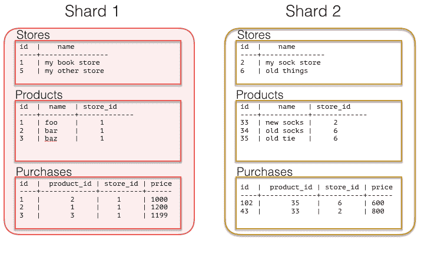

# 用 Postgres 切分多租户应用

> 原文:[https://dev . to/craigkerstiens/sharding-a-multi-tenant-app-with-PostgreSQL](https://dev.to/craigkerstiens/sharding-a-multi-tenant-app-with-postgresql)

无论你是在构建营销分析、电子商务网站的门户网站，还是迎合学校的应用程序，如果你在构建一个应用程序，而你的客户是另一家企业，那么多租户方法是常态。相同的代码对所有客户运行，但是每个客户看到他们自己的私有数据集*，除了整体内部报告*的情况。

在应用程序生命周期的早期，客户数据有一个简单的结构，它是有机发展的。通常，所有信息都与中央客户/用户/租户表相关。有了更少的数据量(几十个 GB ),很容易通过向应用程序添加更多硬件来扩展应用程序，但是当您取得如此大的成功，以至于您的数据不再适合单个机器上的内存，或者您需要更多的并发性时，会发生什么呢？您通过重新设计您的应用程序进行横向扩展，这通常很痛苦(也很昂贵)。)

## 扩展数据库的选项

这种数据库向外扩展的模式对于像[谷歌](http://research.google.com/pubs/pub41344.html)和 [Instagram](http://instagram-engineering.tumblr.com/post/10853187575/sharding-ids-at-instagram) 这样的公司非常有效，但并不像你想象的那么复杂。

如果您能够以正确的方式对您的多租户数据建模[分片](http://www.craigkerstiens.com/2012/11/30/sharding-your-database/)会简单得多——您不需要重新设计您的应用程序来进行扩展，并且您可以从数据库中获得您需要的功能，包括连接、索引等等。我在 [Citus Data](https://www.citusdata.com/) 工作，在那里我们创建了一个可以扩展 Postgres(实际上是 Postgres 的扩展)的数据库:我们已经完成了分片的艰苦工作，所以你不必这么做。虽然 Citus 允许您扩展处理能力、内存和存储，但您如何对数据建模将决定您从系统中获得的便利性和灵活性。如果您正在构建一个多租户 SaaS 应用程序，希望下面的例子能够突出说明如何在不扭曲应用程序太多的情况下尽早计划伸缩。

### 采用多租户数据模型轻松扩展 Postgres

无论您是否意识到，在大多数 SaaS 应用程序的核心，租用已经内置。“租户”的意思是，您的 SaaS 应用程序有多个客户(“租户”)，他们共享同一个应用程序，但是他们的数据需要彼此分开。(同样的方式，多个租户可以住在同一栋楼里，但每个人都有自己独立的公寓。)

无论如何，正如我们上面提到的，您可能有一个用户表。让我们看一个非常基本的 SaaS 模式来强调这一点:

```
CREATE TABLE stores (
  id UUID,
  owner_email VARCHAR(255),
  owner_password VARCHAR(255),
  name VARCHAR(255),
  url VARCHAR(255),
  last_login_at TIMESTAMPTZ,
  created_at TIMESTAMPTZ
)

CREATE TABLE products (
  id UUID,
  name VARCHAR(255),
  description TEXT,
  price INTEGER,
  quantity INTEGER,
  store_id UUID,
  created_at TIMESTAMPTZ,
  updated_at TIMESTAMPTZ
)

CREATE TABLE purchases (
  id UUID,
  product_id UUID,
  customer_id UUID,
  store_id UUID,
  price INTEGER,
  purchased_at TIMESTAMPTZ,
) 
```

<svg width="20px" height="20px" viewBox="0 0 24 24" class="highlight-action crayons-icon highlight-action--fullscreen-on"><title>Enter fullscreen mode</title></svg> <svg width="20px" height="20px" viewBox="0 0 24 24" class="highlight-action crayons-icon highlight-action--fullscreen-off"><title>Exit fullscreen mode</title></svg>

上面的模式突出了一个*过度简化的*多租户电子商务网站。比方说，像 Etsy 或 Shopify 这样的人。当然，您会对此运行许多查询:

列出特定商店的产品:

```
SELECT id, 
       name,
       price
FROM products
WHERE store_id = foo; 
```

<svg width="20px" height="20px" viewBox="0 0 24 24" class="highlight-action crayons-icon highlight-action--fullscreen-on"><title>Enter fullscreen mode</title></svg> <svg width="20px" height="20px" viewBox="0 0 24 24" class="highlight-action crayons-icon highlight-action--fullscreen-off"><title>Exit fullscreen mode</title></svg>

或者假设您想计算给定商店每周有多少购买:

```
SELECT date_trunc('week', purchased_at),
       sum(price * quantity)
FROM purchases,
     stores
WHERE stores.id = products.stores_id
  AND store_id = ‘foo’ 
```

<svg width="20px" height="20px" viewBox="0 0 24 24" class="highlight-action crayons-icon highlight-action--fullscreen-on"><title>Enter fullscreen mode</title></svg> <svg width="20px" height="20px" viewBox="0 0 24 24" class="highlight-action crayons-icon highlight-action--fullscreen-off"><title>Exit fullscreen mode</title></svg>

从这里，你可以想象如何给每个商店自己的存在和分析。现在，如果我们快进一点，开始考虑横向扩展，那么我们就可以选择如何分割数据。

最容易做到这一点的级别是租户级别，或者在本例中是在`store_id`级别。使用上面的数据模型，随着时间的推移，最大的表可能是 products 和 purchases，我们可以共享这两个表。虽然如果我们选择产品或购买，困难在于我们可能希望进行一些高级项目的查询，如商店。如果我们选择`store_id`,那么特定存储的所有数据都将存在于同一个节点上，这将允许您将所有计算直接下推到单个节点上。

### 多租户和共址，完美的一对

将数据放在同一个物理实例中可以避免在连接期间通过网络发送数据。这可以大大加快操作速度。有了 Citus，有很多方法可以移动你的数据，这样你就可以灵活地加入和查询它，但对于这类多租户 SaaS 应用程序来说，如果你能确保数据最终在碎片上，这很简单。不过，要做到这一点，我们需要把`store_id`推到我们所有的桌子上。

让这一切成为可能的关键是让你的`store_id`出现在所有的牌桌上。通过这样做，您可以轻松地将所有数据分片，使其位于同一个分片上。在上面的数据模型中，我们碰巧在所有的表上都有`store_id`,但是如果没有，您可以添加它。这将使您能够很好地分布所有数据，使其存储在相同的节点上。所以现在让我们试着分割我们的租户，在这里是商店:

```
SELECT master_create_distributed_table('stores', 'id', 'hash');
SELECT master_create_distributed_table('products', 'store_id', 'hash');
SELECT master_create_distributed_table('purchases', 'store_id', 'hash');

SELECT master_create_worker_shards('stores', 16);
SELECT master_create_worker_shards('products', 16);
SELECT master_create_worker_shards('purchases', 16); 
```

<svg width="20px" height="20px" viewBox="0 0 24 24" class="highlight-action crayons-icon highlight-action--fullscreen-on"><title>Enter fullscreen mode</title></svg> <svg width="20px" height="20px" viewBox="0 0 24 24" class="highlight-action crayons-icon highlight-action--fullscreen-off"><title>Exit fullscreen mode</title></svg>

现在你都准备好了。*同样，你会注意到我们通过 store_id 来分割所有内容——这允许所有查询被路由到一个 Postgres 实例。*只要您的查询中有 store_id，与之前相同的查询应该就可以了。现在，您的数据布局示例可能类似于:

[T2】](https://res.cloudinary.com/practicaldev/image/fetch/s--KhAKq2io--/c_limit%2Cf_auto%2Cfl_progressive%2Cq_auto%2Cw_880/https://d3vv6lp55qjaqc.cloudfront.net/items/0n0E3430183k0J410H05/shard_tenant.png%3Fv%3Df9133ad4)

替代主机托管的方法是选择一些较低级别的碎片键，比如 orders 或 products。这样做的代价是增加了连接和查询的难度，因为您必须通过网络发送更多的数据，并确保以分布式方式工作。如果您的分析总是针对整个数据集(在以指标为中心的用例中经常出现这种情况),那么这个较低级别的键对于以消费者为中心的数据集会很有用。

### 要扩展你的 Postgres 数据库，你有比你想象的更多的好选择。

正如我们在 Postgres post 中的 [sharding JSON 中所做的那样，需要注意的是，不同的分发模式可能有不同的好处和权衡。在某些情况下，在较低级别的实体 id(如产品或购买)上建模可能是正确的选择——您可以获得更多的分析并行性，并在查询单个商店时牺牲简单性。无论是选择多租户数据模型还是采用更加](https://www.citusdata.com/blog/2016/07/25/sharding-json-in-postgres-and-performance/)[的分布式文档模型](https://www.citusdata.com/blog/2016/07/25/sharding-json-in-postgres-and-performance/)，都可以进行扩展，但是每一种都有自己的权衡。如果您现在需要横向扩展您的多租户应用，请尝试一下 [Citus 云](https://console.citusdata.com)，或者如果您对哪种横向扩展数据模型最适合您的应用有任何疑问，请不要犹豫[联系我在 Citus 的团队](https://www.citusdata.com/about/contact_us)。我们可以帮忙。(我们有没有提到 Citus 是开源的，是 AWS 中的数据库服务，也是本地的？)

*[原载于 Citus 数据博客](https://www.citusdata.com/blog/2016/08/10/sharding-for-a-multi-tenant-app-with-postgres/)*