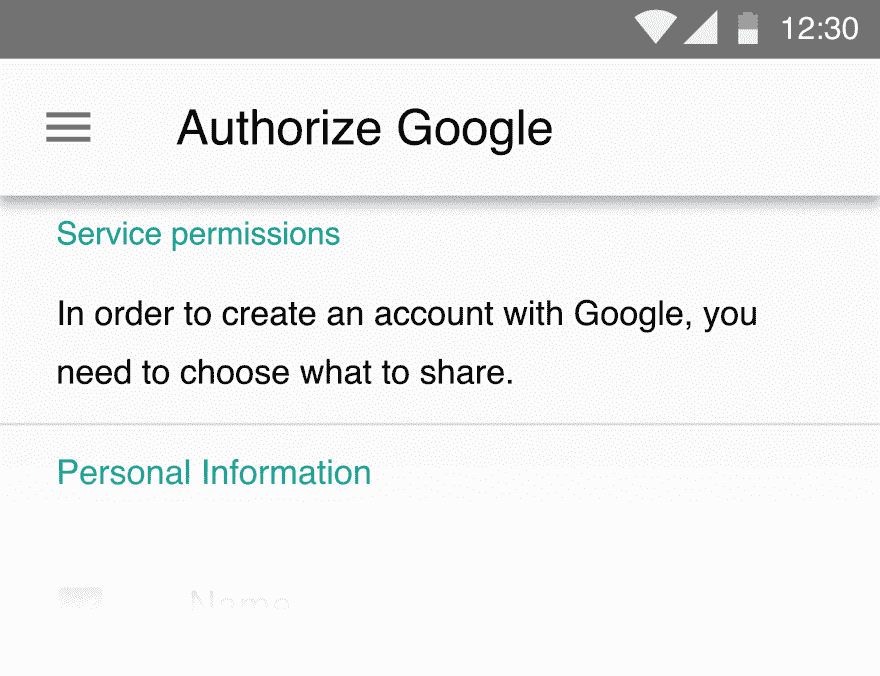
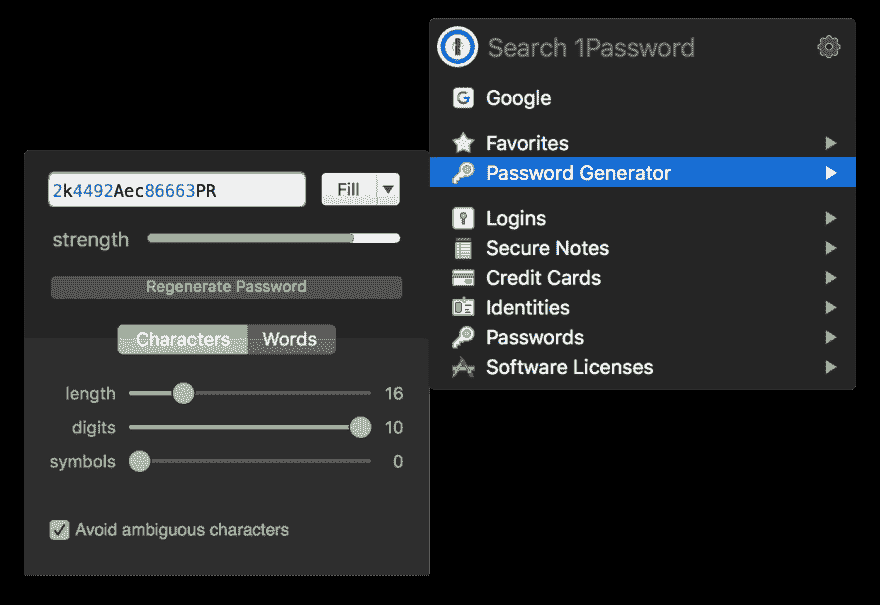
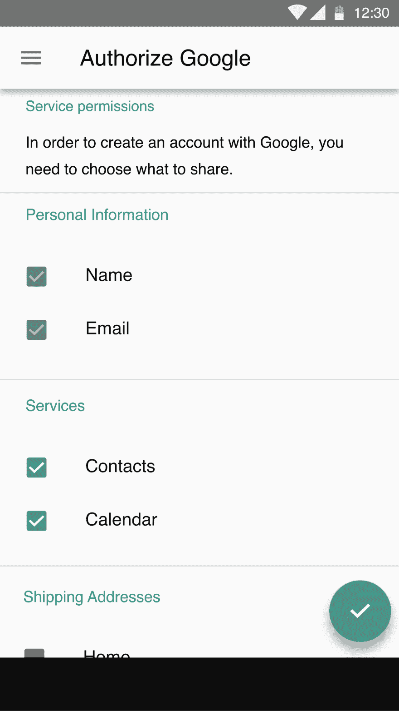

# 密码管理器太难了

> 原文:[https://dev . to/Justin oboyle/password-managers-is-too-caught-CHF](https://dev.to/justinoboyle/password-managers-are-too-difficult-chf)

[T2】](https://res.cloudinary.com/practicaldev/image/fetch/s--J1D2yCBe--/c_limit%2Cf_auto%2Cfl_progressive%2Cq_auto%2Cw_880/https://blog.justinoboyle.com/conteimg/2017/07/pm.png)

密码管理器为用户创造了奇迹，通过创建一个单一的密码来保护他们所有的密码，防止数据泄露解锁他们的每个帐户。

## 原问题

人们重复使用密码，他们重复使用的密码一般都很糟糕。[根据 Sophos](https://nakedsecurity.sophos.com/2013/04/23/users-same-password-most-websites/) ， **55%的用户重复使用密码**！

## 原问题的解决方案

使用类似于 [1Password](https://1password.com/) 或 [LastPass](https://www.lastpass.com/) 的东西，创建一个主密码，用户只需记住一个密码(明白吗？)访问他们所有的密码。然后，密码管理器可以为您生成随机密码，所以您不必考虑它。

[T2】](https://res.cloudinary.com/practicaldev/image/fetch/s--xb2lqzTj--/c_limit%2Cf_auto%2Cfl_progressive%2Cq_auto%2Cw_880/https://st.justinoboyle.com/4a431395ed9016af.png)

简单吧？

## 密码管理器的问题

他们还是太难了。想想它现在是如何工作的:

1.  用户必须了解密码管理器以及如何使用它们。
2.  用户必须购买一个密码管理器并安装在他们所有的设备上

在他们安装了它之后，想要注册一个站点，用户必须，

1.  单击注册
2.  填写未通过自动填充填写的个人信息，非常偶然
3.  记住不要只填写他们通常的密码
4.  记得点击密码管理器
5.  输入他们的密码/认证(生物识别)
6.  填写 web 表单的其余部分
7.  回答令人困惑的“保存密码？”浏览器和密码管理器中的对话框

这为什么这么复杂？为什么我们没有这样的工作流程呢？：

1.  点击注册/登录
2.  使用指纹或密码进行身份验证
3.  勾选他们希望在网站上分享的内容

恭喜，你再也不用登录了。哦，和一点点工作与 [Authy](https://authy.com/) 和它可以自动设置 2FA。

这是可行的。谷歌通过 Chrome 或类似工具的推动很可能会让网站在这方面跟上速度。此外，我们也不必担心点击劫持密码箱或其他类似的奇怪事情。此外，用户将更倾向于使用他们的密码管理器，因为它非常简单。

#### 样机

没有模型，哪篇科技博客文章是完整的？

[T4】](https://res.cloudinary.com/practicaldev/image/fetch/s--I2D1SgDK--/c_limit%2Cf_auto%2Cfl_progressive%2Cq_auto%2Cw_880/https://st.justinoboyle.com/d44129e1f8d375ef.png)

我希望我们能很快找到这样的东西。在密码管理器比典型的密码更容易使用之前，`password`和`hunter2`仍然会极其普遍和重复使用。