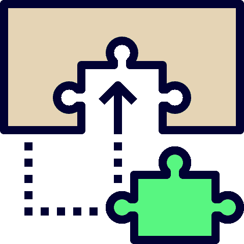
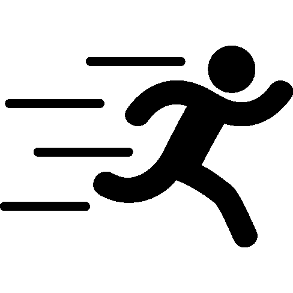
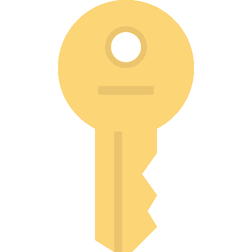

# 当“简单”的 JavaScript 教程非常复杂时

> 原文：<https://dev.to/yaphi1/when-that-simple-javascript-tutorial-is-super-complicated>

*这篇[文章](https://simplestepscode.com/how-to-use-tutorials/)最初出现在[简单步骤代码](https://simplestepscode.com/)上，它尽力帮助人们[学习 JavaScript 并真正记住它](https://simplestepscode.com/learn-javascript/)。*

> 由于某种原因，JavaScript 教程通常以“在本教程中，我们将编写一个简单的...12，000 行之后，你不记得你想学什么了。"
> 
> –[@ perrydBUCS](https://twitter.com/perrydBUCS)在对[发展到](https://dev.to/yaphi1/what-are-your-biggest-struggles-in-learning-javascript/comments/dd8)的评论中

这真的说得很好，它说明了大量教程的关键问题:它们在开始时承诺简单，然后它们最终变得如此冗长和复杂，以至于读者放弃了。

让我们来谈谈如何解决这个问题，并从教程中获得最大收益。

## 技巧 1:从尽可能小的一块开始

[T2】](https://res.cloudinary.com/practicaldev/image/fetch/s--AYI6H1eO--/c_limit%2Cf_auto%2Cfl_progressive%2Cq_auto%2Cw_880/https://simplestepscode.com/img/icons/puzzle.svg)

很多教程把一堆概念组合成一个大步骤。例如，他们可能会要求您在单击按钮时播放动画。

如果你在这一点上跟随教程，你将会结束输入(或粘贴)许多东西并且不记得它。

相反，把第一步分成更小的步骤。首先显示一个按钮。接下来，让按钮做一些简单的事情(比如点击时说声你好)。之后，试着自己创作动画。一旦你有了一个可用的按钮和一个可用的动画，你就可以把这些部分放在一起，你就会明白它们是如何工作的。

如果您去掉不必要的样式或标记，以便接近使代码工作的最基本要素，这也会有所帮助。(关键词:没必要。如果某些样式和标记是必需的，就保留它们。)

一般来说，小片段更容易理解，更容易操作，也更容易记忆。这种方法将对你的学习方式产生巨大的影响。

## 小贴士#2:继续前进前的实验

[T2】](https://res.cloudinary.com/practicaldev/image/fetch/s--WohUyrvq--/c_limit%2Cf_auto%2Cfl_progressive%2Cq_auto%2Cw_880/https://simplestepscode.com/img/icons/experiment.svg)

如果你正在学习新概念，不要只是按照写好的教程去做。尝试每一步。例如，如果教程向您展示了一种类型的动画，也可以尝试另一种类型。如果当一个按钮被点击时需要发生一些事情，试着在这个按钮被点击时让不同的事情发生。

调整，实验，玩耍，打破东西。用这种方法，你会在这么短的时间内学到很多东西。

## 技巧 3:先自己尝试每一步

[T2】](https://res.cloudinary.com/practicaldev/image/fetch/s--BwJvibwE--/c_limit%2Cf_auto%2Cfl_progressive%2Cq_auto%2Cw_880/https://simplestepscode.com/img/icons/running.svg)

如果可能的话，在看教程之前先自己尝试一下。你可能会挣扎，但你会深入思考你试图解决的问题和需要注意的问题。这将使你更好地理解教程，因为你会明白为什么包括某些步骤。

在看教程之前尝试解决问题并不总是可能的，但如果它对你的情况有意义，这是值得考虑的事情。

## 关键要点

[T2】](https://res.cloudinary.com/practicaldev/image/fetch/s--FhFRcd2G--/c_limit%2Cf_auto%2Cfl_progressive%2Cq_auto%2Cw_880/https://simplestepscode.com/img/icons/key.svg)

下次您看到教程时，请尝试以下技巧:

*   把它分成尽可能小的部分。
*   在进入下一步之前，先进行实验。
*   先试着自己解决一些碎片。

当我自己尝试这些技巧时，发生了以下情况:

与其做十个教程，学零个东西，不如做一个教程，学十个东西。

我希望这也能发生在你身上。

*本文转载自[简单步骤代码](https://simplestepscode.com/how-to-use-tutorials/)，它尽力帮助人们[学习 JavaScript 并真正记住它](https://simplestepscode.com/learn-javascript/)。*

如果你讨厌这篇文章，请随意访问我的网站，对我大喊大叫。然而，如果你有善意的评论，请将它们放在 dev.to:)