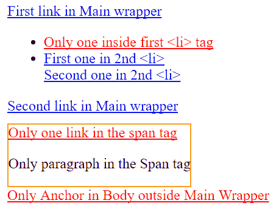
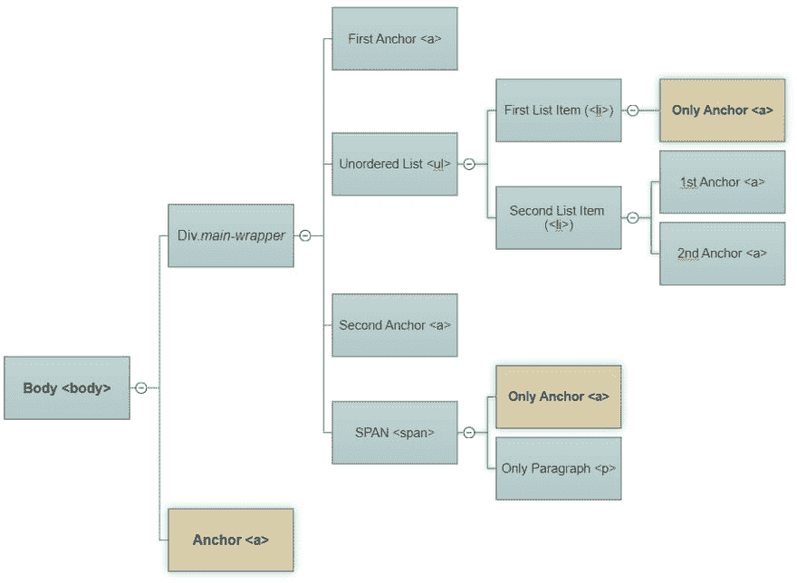

# 了解仅类型 CSS 伪类选择器

> 原文：<https://dev.to/moreonfew/understanding-only-of-type-css-pseudo-class-selector-48o0>

老实说，CSS 有时会变得有点棘手和难以理解。特别是随着 CSS3 和所有这些新的 CSS3 选择器和伪类的出现，很有可能我们中的许多人仍然在试图赶上新的选择器。好吧， **only-of-type** 就是这样一个新的 CSS3 伪类，可能有点令人困惑。因此，让我们深入理解唯一类型的 CSS 伪类选择器。

## 什么是唯类型 CSS 选择器/伪类选择器？

简单来说，only-of-type 伪类的目的是选择或过滤掉其父元素下“某个类型”(

> only-of-type 选择器的目的是定位那些在其父元素中唯一的特定“类型”的元素。

让我们借助下面的代码和插图更好地理解这一点。请浏览一遍 DOM 结构！

```
<style>
    a:only-of-type{color:red;} /*We want to target all the 'ONLY' anchors under its parent element */
    span{border:1px solid orange;display:inline-block;margin-top:10px;}
</style>

<body>

<div class="main-wrapper">
   <a href="#">First link in Main wrapper</a>

   <ul>
      <li><a href="#">Only one inside first <li> tag</a></li>
      <li><a href="#">First one in 2nd <li></a><br/>
          <a href="#">Second one in 2nd <li></a></li>
   </ul>

   <a href="#">Second link in Main wrapper</a><br/>

   <span>
      <a href="#">Only one link in the span tag</a>
      <p>Only paragraph in the Span tag</p>
   </span>
</div>

<a href="#">Only Anchor in Body outside Main Wrapper</a>
</body> 
```

Enter fullscreen mode Exit fullscreen mode

以上代码在浏览器上的呈现方式如下:

[T2】](https://res.cloudinary.com/practicaldev/image/fetch/s--50UH-lUL--/c_limit%2Cf_auto%2Cfl_progressive%2Cq_auto%2Cw_880/https://i1.wp.com/moreonfew.com/wp-content/uploads/2020/04/only-of-type-demo_tmyanj.png%3Fresize%3D458%252C357%26ssl%3D1)

出于表示的目的，上述 DOM 也可以表示为树结构。让我们来看看吧。

[T2】](https://res.cloudinary.com/practicaldev/image/fetch/s--At6k0OhH--/c_limit%2Cf_auto%2Cfl_progressive%2Cq_auto%2Cw_880/https://i1.wp.com/moreonfew.com/wp-content/uploads/2020/04/only-of-type-explained_lbxtr0.png%3Fresize%3D918%252C672%26ssl%3D1)

正如您所注意到的，在 Body 的正下方有两个元素:一个包含类“`main-wrapper`”的 DIV 和一个锚点。请注意，这个锚是 Body 标签下唯一的锚。类似地，在`main-wrapper` DIV 下有一个 span 标签，标签下有一个锚点和一个段落。在这里，您也可以注意到，锚是 span 下的唯一锚，而另一个兄弟是一个段落。第一个列表项中唯一的锚也是如此。第二个列表项中有两个定位点，因此不符合唯一类型元素的条件。

**only-of-type 选择器的目的是定位其父元素**中该类型的唯一元素。这些元素没有相同类型的同级，但可以包含任何其他类型的同级。这个选择器非常有用，可以很容易地避免使用 JavaScript 来设计或隐藏这些元素。好吧，继续使用唯一类型选择器，让我们知道您的使用体验。

帖子[理解唯类型 CSS 伪类选择器](https://www.moreonfew.com/understanding-only-of-type-css-pseudo-class-selector/)最早出现在 [MoreOnFew](https://www.moreonfew.com) 上。