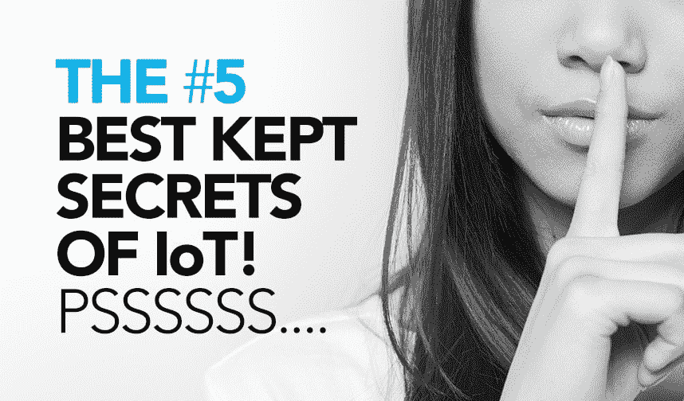
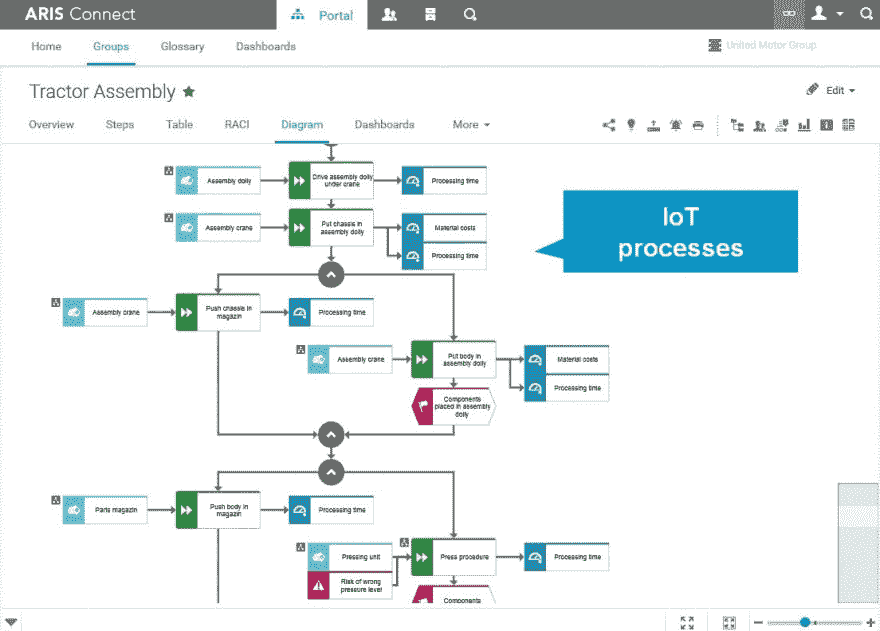
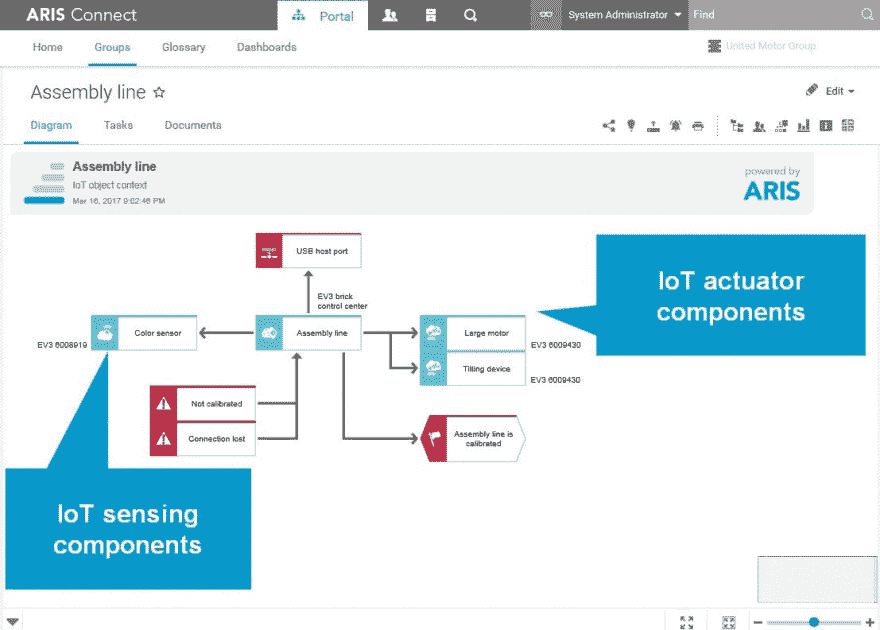
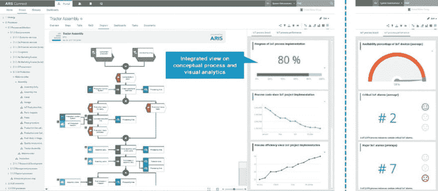
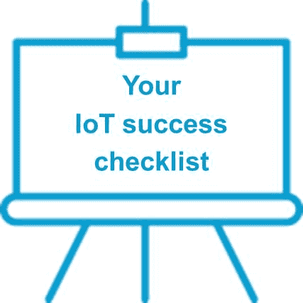

# 物联网驱动的业务转型

> 原文：<https://dev.to/techcommunity/iot-driven-business-transformation-4om5>

## 物联网五大绝密！

*由 ARIS 产品营销软件公司的 Josèphe Blondaut 和
T2 ARIS 产品管理软件公司的 Julian Krumeich*

| 2017 年第三期 | [下载 PDF](http://techcommunity.softwareag.com/ecosystem/download/techniques/2017-Issue3/SAG_IoT_Driven_Business_TECHniques_Jul_WEB.pdf) |
| --- | --- |

[T2】](https://res.cloudinary.com/practicaldev/image/fetch/s--dBwF8FLw--/c_limit%2Cf_auto%2Cfl_progressive%2Cq_auto%2Cw_880/http://techcommunity.softwareag.com/documents/10157/8964209/IoT1.jpg/fc856cbc-971a-4acb-ac62-7f392fbe5440%3Ft%3D1500450721372)

让我们从

**#1、** **保存最好的** **物联网的秘密** :

**物联网(IoT)不(仅仅)是一个 IT 项目！**

我们可以很容易地想象你在电脑前疑惑:物联网当然是关于 IT 的，它处理网络、设备、基础设施、传感器和数据。但如果你看看物联网背后的驱动因素，你会发现它们并不是为了技术。他们努力提高运营效率，提供新的收入来源，并提供更具吸引力的客户体验。

这些驱动因素，或者让我们称之为物联网项目背后的目标，指的是业务，并为物联网驱动的业务转型奠定基础。

您如何改进您的业务，尤其是基于物联网的底层业务流程？物联网如何支持卓越运营？这完全是一个规划和建立物联网战略的问题。

这将我们引向

**物联网秘密#2** :

**最优秀的物联网项目不一定是拥有最佳技术基础设施的项目，而是经过最佳规划和持续控制的项目。**

总的来说，规划一个物联网项目无异于规划另一个项目:思考战略，设定明确的目标，定义相关计划，评估涉及的流程、部门和利益相关者，并设定 KPI……以确保您的公司也能从物联网的潜力中受益。

使用战略规划方法，如平衡记分卡和商业模式画布。ARIS 为您提供合适的工具来定义您的战略路线图，并设定目标来支持您的物联网战略实施，例如，将效率提高 15%或提高质量以减少错误数量。

**物联网秘密#3** **是

支持项目的物联网流程，意味着您的业务流程与技术物联网设计的结合。**

 

*在 ARIS 设计物联网流程*

流程专家密切关注相关的现有业务流程，以确定物联网可以在哪些方面产生最大的积极影响。通过使用 ARIS，他们可以进行详细的过程分析，以搜索和确定优化潜力。此外，ARIS 提供了一种在专用模型类型中设计和管理新物联网对象的方法。此外，物联网对象可以直接从 Software AG 基于云的物联网设备集成平台 Cumulocity 导入。

[T2】](https://res.cloudinary.com/practicaldev/image/fetch/s--KE5Vg3OF--/c_limit%2Cf_auto%2Cfl_progressive%2Cq_auto%2Cw_880/http://techcommunity.softwareag.com/documents/10157/8964209/iot3.jpg/3f55bedf-59c2-474e-92d0-2400deae0b99%3Ft%3D1500450845000)

*从 Cumulocity 导入物联网设备*

新的模型类型将一个物联网对象分解为几个子设备。这意味着，例如，示例性物联网生产网络是几个分配的物联网对象的组合。

*ARIS 设计物联网对象*

物联网子设备基于“物联网对象上下文”模型进行更深层次的描述。在这里，物联网对象是基于其组成组件(如传感器和执行器)及其技术物联网配置来指定的。为了从业务角度完整地描述这一画面，我们描述了数据变量、相关风险以及物联网对象发出和消费的事件。

基于这些信息，可以使用物联网对象增强现有流程，以定义设想的未来流程。关键是利用物联网功能识别业务流程改进机会，支持其发展和适应，并确保以业务流程设计为重点的紧密协作。物联网对象可以很容易地插入和连接现有的业务功能。

**物联网秘密#4:**

**监控和衡量你的物联网项目的进展和成功。**听起来很明显？在许多物联网项目中，关键成功因素和 KPI 没有定义或仅从技术角度定义。

 

*监控 ARIS 的物联网项目和流程*

只有通过监控和分析所有相关的 KPI，该循环才是闭合的。ARIS 意识在最初设计的流程中提供关键绩效指标。它有助于创建一个物联网仪表板，其中包括衡量物联网实施进度的 KPI，以及例如相关的减少和效率提高。真实的物联网性能也可以基于物联网对象的可用性以及贯穿物联网支持的业务流程执行的潜在警报和警告来可视化。

第五个也是最后一个秘密——我们甚至不知道，因为它是你的！你的物联网计划是什么？您的行业如何从物联网中受益？

物联网背后的真正驱动力是什么？你的物联网未来是什么样的？你会选择物联网驱动的业务转型，还是仅仅追随另一场 IT 炒作？

[T2】](https://res.cloudinary.com/practicaldev/image/fetch/s--rqpDWg_w--/c_limit%2Cf_auto%2Cfl_progressive%2Cq_auto%2Cw_880/http://techcommunity.softwareag.com/documents/10157/8964209/TECHniques_IoT_picNumber6_2.jpg/ea519526-8604-47ab-812a-b4439cd5a6b4%3Ft%3D1501064215909)

从 Software AG 的物联网战略和物联网框架中包含的设计中获得帮助！

[了解更多信息](http://www.softwareag.com/aris_iot)