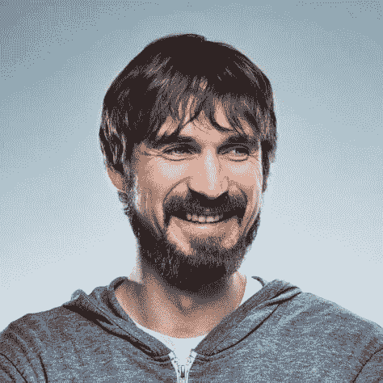

# 嗨，我是安德烈·奥科涅奇尼科夫

> 原文:[https://dev.to/okonetchnikov/hi-im-andrey-okonetchnikov](https://dev.to/okonetchnikov/hi-im-andrey-okonetchnikov)

[T2】](https://res.cloudinary.com/practicaldev/image/fetch/s--OarUuGgZ--/c_limit%2Cf_auto%2Cfl_progressive%2Cq_auto%2Cw_880/https://thepracticaldev.s3.amazonaws.com/i/knrbtn8nh1v3om5o1urb.jpg)

我是一名前端工程师和 UI & UX 设计师，来自俄罗斯，住在奥地利维也纳，目前在 [Feedly](https://feedly.com) 工作。

我热衷于编程、UI 和 UX 设计、字体设计、音乐、摄影、山地自行车和咖啡。

我是一名拥有计算机科学硕士学位的工程师，但我也是一名设计师。我喜欢解决复杂的问题，不管是设计还是技术挑战。我主要使用 JavaScript 和 CSS 进行代码设计，但必要时我也会使用图形编辑器。

我相信“没有 UI ==最好的 UI”，好的 UI 是事物如何工作，而不仅仅是它们看起来如何。我重视统计数据，并倾向于使用原型和可用性测试来验证我的想法。

我关心代码的可读性和可维护性。我是ðÿšðÿ'[lint-staged](https://github.com/okonet/lint-staged)的作者，这是一个帮助团队提高代码质量的简单工具。

当我写风格的时候，我使用 CSS 模块，或者在不可能的时候，使用 BEM，我相信 CSS-in-JS 是 CSS 的未来。

你可以在推特上找到我，我的名字是 [@okonetchnikov](https://twitter.com/okonetchnikov)

很高兴见到你。