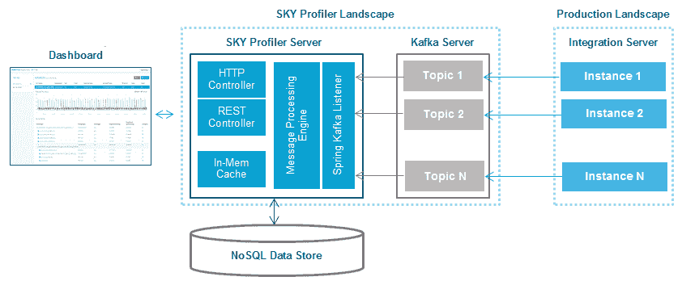

# sky Profiler:web methods 集成服务器的实时监控

> 原文:[https://dev . to/tech community/sky-profiler-real-time-monitoring-for-web methods-integration-server-249h](https://dev.to/techcommunity/sky-profiler-real-time-monitoring-for-webmethods-integration-server-249h)

## 对 webMethods 集成服务器进行实时监控

大多数可用的评测工具只提供 Java 类或方法级的评测，与 Integration Server (IS)流服务无关。它们还会消耗大量系统资源，无法在生产环境中部署，并且通常需要重启应用程序才能进行分析。此外，运营团队需要手动关联来自不同系统的数据，以发现问题。天空剖面仪为所有这些问题提供了一个令人兴奋的替代方案。

SKY Profiler 是一款开源工具，旨在实时监控信息系统服务调用。分析器帮助用户跟踪每个服务调用所用的时间，并进一步深入到子服务，确定哪个子服务贡献了最大的响应时间。

| 2017 年第三期 | [下载 PDF](http://techcommunity.softwareag.com/ecosystem/download/techniques/2017-Issue3/SAG_Sky_Profiler_TECHniques_Jul_WEB.pdf) |
| --- | --- |

## **天空剖面仪的主要特性**

使用 SKY Profiler，您不仅可以在单个仪表板中监控多个 IS 调用，还可以:

1.  使用适合生产的即插即用功能
2.  根据需要启动和停止分析，而不必重新启动 IS
3.  为基线违规创建基线设置和警报，以便与 SLA 违规进行比较
4.  创建系统使用的关联，以识别瓶颈
5.  用于离线分析的报告生成功能
6.  使用最少的内存和 CPU，这使得天空剖面仪非常适合生产系统

## 工作原理

SKY Profiler 是使用服务器代理模型构建的。代理是一个 is 包[SKYProfilerRuntime]，需要部署在需要监控的 IS 上。服务器组件[SKYProfilerServer]可以与数据库和消息传递组件一起部署在 IS 的生产实例之外的机器上(参见图 1)。

[T2】](https://res.cloudinary.com/practicaldev/image/fetch/s--8ndvy5Qn--/c_limit%2Cf_auto%2Cfl_progressive%2Cq_auto%2Cw_880/http://techcommunity.softwareag.com/documents/10157/8763256/sky-profiler-img1.png/)

**图 1** :架构

在 SKY Profiler 仪表板中识别和监控交易的所有 IS 包。当监控开始时，从所选包执行的所有服务都被跟踪，并且带有服务执行细节的事件被发布到 Kafka 主题。与服务事件一起，将发布另一个包含系统资源统计信息的事件。服务器中的 Kafka 监听器消费该事件，处理该事件，将该事件保存在数据库中，并将数据发送到用户界面进行显示。

## 天空剖面仪入门

### 1.1 安装

SKY Profiler 源代码是开源的，可以从 GitHub 下载。可以通过[链接](https://github.com/SoftwareAG/webMethods-IntegrationServer-SKYProfiler)在本地克隆。

从源代码编译和构建 SKY Profiler 服务器二进制文件:

```
c:/{webMethods-IntegrationServer-SKYProfiler}\> ant 
```

这将创建 SKY Profiler 包和服务器 jar。在需要监控的 IS 中部署 SKY Profiler 包[Agent]。运行 SKY Profiler 服务器 jar 以启动应用程序[服务器]。

注:关于先决条件和详细安装步骤，请参考 [GitHub 链接](https://github.com/SoftwareAG/webMethods-IntegrationServer-%20SKYProfiler)。

### 1.2 用法

为了使用 SKY Profiler 开始监控，您需要完成以下步骤:

1.  登录 SKY Profiler 服务器应用程序。
2.  添加需要监控的 IS。
3.  选择需要监控的程序包，并在配置屏幕中提供消息传递组件的详细信息。
4.  点击主仪表板上的“开始”按钮开始监控。

属于所选程序包的任何服务执行都将显示在仪表板上的服务监控表中。

### 1.3 瓶颈分析

要创建瓶颈分析，您必须:

1.  单击“服务概要表”中的服务名称以展开可折叠栏。

2.  将显示响应时间图。(只会显示最新的服务执行响应时间)。单击图表中的一个数据点，以获得服务呼叫树。

3.  服务调用树显示服务执行层次结构以及每个服务执行所需的时间。此信息可用于查找在整个服务执行响应时间中花费最多时间的服务。单击花费时间最多的服务对应的关联图标。

4.  这将打开一个模式窗口，其中包含 CPU、磁盘、网络、垃圾收集等系统资源使用情况图表，以及服务响应时间和线程级 CPU 等特定于服务的图表。

5.  单击其中一个图表中的数据点，突出显示所有图表中的相关线。

6.  这些图表帮助您将响应时间与其他系统资源对应起来，以识别瓶颈。

### 1.4 报告

通过两个简单的步骤生成报告并获得即时洞察:

1.  在主仪表板屏幕中，单击选项>报告。
2.  将生成一个 HTML 报告，并可以保存在本地进行离线分析。

## 结论

SKY Profiler 是一款实时信息系统服务分析产品，有助于轻松识别服务执行期间的性能瓶颈。这有利于运营团队，并帮助他们避免停机。内部实验室结果表明，当分析数据从 IS to Kafka 主题中推出时，CPU 总消耗不到 2%，吞吐量不到 1.5%，内存占用可以忽略不计。由于开销和内存占用较少，它适合于生产使用，也许最好的部分是源代码是开源的，可以在 GitHub 上获得。

要了解更多信息，请访问 TECHCommunity 上的 [SKY Profiler。](http://techcommunity.softwareag.com/pwiki/-/wiki/Main/SKY+Profiler+-+Performance+monitoring+%26+analysis+tool+for+webMethods+Integration+Server)

## 今天开始！

SKY 的源代码可以在 GitHub 上的 [SKY Profiler 中访问和克隆](http://github.com/SoftwareAG/webMethods-IntegrationServer-SKYProfiler)

**如果您有任何问题，请随时[联系我。](//mailto:YeshwanthKumar.Jayashankar@softwareag.com)T3】**