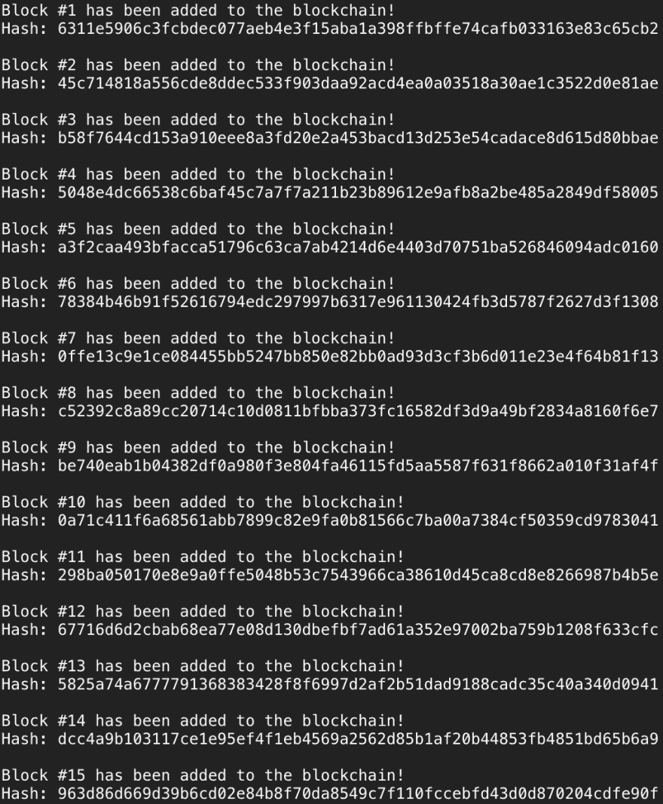

# 让我们建立最小的区块链

> 原文:[https://dev.to/aunyks/lets-build-the-tiniest-blockchain](https://dev.to/aunyks/lets-build-the-tiniest-blockchain)

*注:本文最初发表于 [Crypto 目前](https://medium.com/crypto-currently)。*

[T2】](https://res.cloudinary.com/practicaldev/image/fetch/s--7FNFJ8sg--/c_limit%2Cf_auto%2Cfl_progressive%2Cq_auto%2Cw_880/https://cdn-images-1.medium.com/max/2000/1%2Av5Ra8k9iLKDWT-fTtoZ4Rg.jpeg)

尽管有些人认为区块链是一个等待解决的问题，但毫无疑问，这项新技术是计算的奇迹。但是，到底什么是区块链呢？

**区块链**

> [一种数字分类账，其中以比特币或另一种加密货币进行的交易按时间顺序公开记录。](https://www.google.com/search?q=blockchain+definition&oq=blockchain+definition&aqs=chrome.0.0l6.2941j0j7&sourceid=chrome&ie=UTF-8) >

更一般地说，*它是一个公共数据库，新数据存储在一个称为块的容器中，并与过去添加的数据一起添加到一个不可变的链(因此称为区块链)中。*在比特币和其他加密货币的情况下，这些数据是交易的分组。但是，数据当然可以是任何类型。

区块链技术催生了新的全数字货币，如比特币和莱特币，它们不是由中央机构发行或管理的。这给那些认为今天的银行系统是骗局或容易失败的人带来了新的自由。区块链还以以太坊等技术的形式彻底改变了分布式计算，以太坊引入了[智能合约](https://blockgeeks.com/guides/smart-contracts/)等有趣的概念。

在本文中，我将用不到 50 行 Python 2 代码制作一个简单的区块链。它将被称为蛇币。

我们将首先定义我们的块的外观。在区块链，每个数据块都存储有时间戳和索引(可选)。在 SnakeCoin 中，我们将两者都存储起来。为了帮助确保整个区块链的完整性，每个数据块都有一个自我识别的哈希。像比特币一样，每个块的散列将是该块的索引、时间戳、数据和前一个块的散列的加密散列。哦，数据可以是你想要的任何东西。

```
import hashlib as hasher

class Block:
  def __init__(self, index, timestamp, data, previous_hash):
    self.index = index
    self.timestamp = timestamp
    self.data = data
    self.previous_hash = previous_hash
    self.hash = self.hash_block()

  def hash_block(self):
    sha = hasher.sha256()
    sha.update(str(self.index) + 
               str(self.timestamp) + 
               str(self.data) + 
               str(self.previous_hash))
    return sha.hexdigest() 
```

<svg width="20px" height="20px" viewBox="0 0 24 24" class="highlight-action crayons-icon highlight-action--fullscreen-on"><title>Enter fullscreen mode</title></svg> <svg width="20px" height="20px" viewBox="0 0 24 24" class="highlight-action crayons-icon highlight-action--fullscreen-off"><title>Exit fullscreen mode</title></svg>

厉害！我们有自己的数据块结构，但我们正在创建一个数据块链。我们需要开始向实际的链中添加块。正如我前面提到的，每个块都需要来自前一个块的信息。但话虽如此，一个问题出现了:**区块链的第一个街区是怎么来的？**嗯，第一块，或者说*创世纪块*，是一个特殊的块。在许多情况下，它是手动添加的，或者具有允许添加的独特逻辑。

我们将创建一个函数，简单地返回一个 genesis 块，使事情变得简单。这个块的索引为 0，它有一个任意数据值和“previous hash”参数中的任意值。

```
import datetime as date

def create_genesis_block():
  # Manually construct a block with
  # index zero and arbitrary previous hash
  return Block(0, date.datetime.now(), "Genesis Block", "0") 
```

<svg width="20px" height="20px" viewBox="0 0 24 24" class="highlight-action crayons-icon highlight-action--fullscreen-on"><title>Enter fullscreen mode</title></svg> <svg width="20px" height="20px" viewBox="0 0 24 24" class="highlight-action crayons-icon highlight-action--fullscreen-off"><title>Exit fullscreen mode</title></svg>

既然我们能够创建一个创世纪区块，我们需要一个函数来生成区块链中的后续区块。该函数将链中的前一个块作为参数，为要生成的块创建数据，并返回新块及其相应的数据。当新块散列来自先前块的信息时，区块链的完整性随着每个新块而增加。如果我们不这样做，外部团体就更容易“改变过去”，用他们自己的全新链条替换我们的链条。这种哈希链充当加密证明，有助于确保一旦将数据块添加到区块链，就无法替换或删除。

```
def next_block(last_block):
  this_index = last_block.index + 1
  this_timestamp = date.datetime.now()
  this_data = "Hey! I'm block " + str(this_index)
  this_hash = last_block.hash
  return Block(this_index, this_timestamp, this_data, this_hash) 
```

<svg width="20px" height="20px" viewBox="0 0 24 24" class="highlight-action crayons-icon highlight-action--fullscreen-on"><title>Enter fullscreen mode</title></svg> <svg width="20px" height="20px" viewBox="0 0 24 24" class="highlight-action crayons-icon highlight-action--fullscreen-off"><title>Exit fullscreen mode</title></svg>

这是大部分的艰苦工作。现在，我们可以创造我们的区块链了！在我们的例子中，区块链本身就是一个简单的 Python 列表。列表的第一个元素是创世块。当然，我们需要添加后续模块。因为 SnakeCoin 是最小的区块链，我们将只添加 20 个新块。我们可以用 for 循环来实现。

```
# Create the blockchain and add the genesis block blockchain = [create_genesis_block()]
previous_block = blockchain[0]

# How many blocks should we add to the chain
# after the genesis block num_of_blocks_to_add = 20

# Add blocks to the chain for i in range(0, num_of_blocks_to_add):
  block_to_add = next_block(previous_block)
  blockchain.append(block_to_add)
  previous_block = block_to_add
  # Tell everyone about it!
  print "Block #{} has been added to the blockchain!".format(block_to_add.index)
  print "Hash: {}\n".format(block_to_add.hash) 
```

<svg width="20px" height="20px" viewBox="0 0 24 24" class="highlight-action crayons-icon highlight-action--fullscreen-on"><title>Enter fullscreen mode</title></svg> <svg width="20px" height="20px" viewBox="0 0 24 24" class="highlight-action crayons-icon highlight-action--fullscreen-off"><title>Exit fullscreen mode</title></svg>

让我们测试一下到目前为止我们已经做了什么。

[](https://res.cloudinary.com/practicaldev/image/fetch/s--7_CqBtXl--/c_limit%2Cf_auto%2Cfl_progressive%2Cq_auto%2Cw_880/https://cdn-images-1.medium.com/max/1600/1%2Anjl6-UdLUWTLRFsHc4D-tA.png) 
好了！我们的区块链作品。如果你想在控制台中看到更多信息，你可以[编辑完整的源文件](https://gist.github.com/aunyks/8f2c2fd51cc17f342737917e1c2582e2)并打印每个块的时间戳或数据。

这就是蛇币所能提供的一切。为了让 SnakeCoin 扩展到今天的生产区块链的规模，我们必须添加更多的功能，比如一个服务器层来跟踪多台机器上的链的变化，以及一个[工作验证算法](https://en.bitcoin.it/wiki/Proof_of_work)来限制在给定时间段内添加的块数。

如果你想了解更多技术，你可以点击这里查看比特币白皮书原文。祝你好运，祝你黑客生涯愉快！

[T2】](https://i.giphy.com/media/3otPoUkg3hBxQKRJ7y/giphy.gif)

非常感谢您的阅读！
[Twitter](https://twitter.com/aunyks) ， [Github](https://github.com/aunyks) ， [Snapchat](https://snapchat.com/add/aunyks) ， [Medium](https://medium.com/@aunyks) ， [Instagram](https://instagram.com/aunyks)