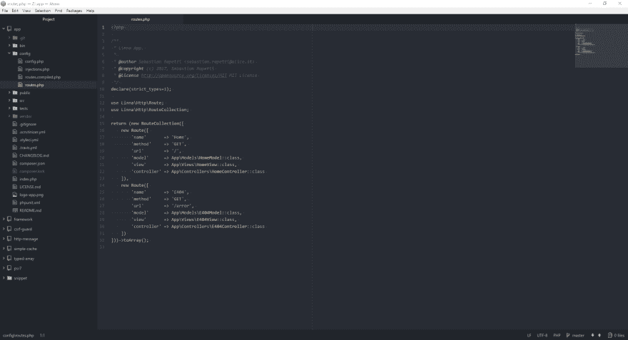

# 您首选的 Ide/文本编辑器？

> 原文：<https://dev.to/sebastianr1982/your-preferred-idetext-editor>

[T2】](https://res.cloudinary.com/practicaldev/image/fetch/s--wkZ-mSlC--/c_limit%2Cf_auto%2Cfl_progressive%2Cq_auto%2Cw_880/https://thepracticaldev.s3.amazonaws.com/i/rc3xa9zvorthxnwfzdze.png)

今天，在使用 Netbeans 几年后，我决定尝试 Atom，它给了我很好的感觉。

你用什么 ide/文本编辑器进行代码开发？