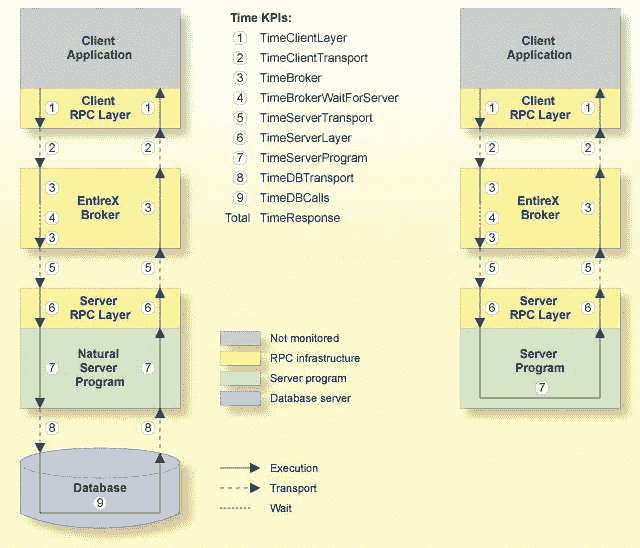
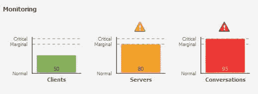

# 如何监控您的整个环境

> 原文：<https://dev.to/techcommunity/how-to-monitor-your-entirex-environment-4c9g>

## webMethods EntireX

**简要了解如何监控您的整个环境以及选择哪种方法。**

| 2017 年第三期 | [下载 PDF](http://techcommunity.softwareag.com/ecosystem/download/techniques/2017-Issue3/SAG_webMethods_EntireX_TECHniques_Jul_WEB.pdf) |
| --- | --- |

您可以用不同的方式监控整个环境。您根据当前情况选择的方式还取决于组件和您自己的需求:

1.  应用程序监控
2.  使用命令中心进行监控
3.  从命令行监控
4.  通过优化基础架构进行监控
5.  监视集成服务器的整个适配器
6.  查看 Designer/Eclipse 中的默认代理视图 TM

第一种方法与其他方法有很大不同。您可以沿着消息路径来回监控整个 EntireX 应用程序，在多个测量点测量响应时间。

使用其他方法，您可以在基础设施组件级别上监控 EntireX。例如，您可以获得 EntireX 代理或远程过程调用(RPC)服务器的信息。

阅读所有这些方法，为您的组织选择正确的方法。

## 应用监控

通过应用程序监控，您可以监控分布式应用程序中的响应时间，以及一些错误情况。如果您想知道在一个完整的应用程序场景中时间去了哪里，请使用此方法。

EntireX 应用程序监控数据收集器收集所选同步 EntireX RPC 服务的每个相关软件组件的响应时间数据。应用程序监视数据收集器将关键性能指标(KPI)值存储在逗号分隔值(CSV)文件中。这些文件可以由任何支持 CSV 文件的工具处理。

如果你想通过微软Excel 快速浏览，或者如果你想将 CSV 文件输入不同类型的工具，使用这种方法。从 EntireX 9.7 开始，可以收集到 CSV 文件。

1.  或者，您可以挂接自己的监控后端。为此，您可以使用数据收集器的回调用户出口。编写一个实现 DataCollectorCallback 接口的 Java 类，并使其为 DataCollector 所知。如果您想要实时提供任意的监控后端，请使用此方法。Java 的 DataCollectorCallback 从 EntireX 9.9 开始就可用了。

[T2】](https://res.cloudinary.com/practicaldev/image/fetch/s--sCcSsj3P--/c_limit%2Cf_auto%2Cfl_progressive%2Cq_auto%2Cw_880/http://techcommunity.softwareag.com/documents/10157/8964209/EntireX_1.jpg/e7b7f9a9-704a-483d-9dbc-355c74221c48%3Ft%3D1500461821499)

**图 1:**EntireX 应用监控中的时间 KPI

当选择了要监控的服务时，客户端应用程序对该服务的每个调用都会被监控。测量总体服务响应时间、网络传输时间、EntireX 代理处理和等待时间、RPC 服务器处理时间和数据库调用时间。每个相关的 Software AG 企业产品都将监控时间与服务呼叫联系起来。当调用返回到客户端时，客户端 RPC 运行时将事件数据提供给应用程序监视数据收集器。

除了如上所述监控 RPC 场景之外，您还可以监控使用 EntireX 适配器通过 CICS ECI 或 IMS Connect 调用事务的场景。

要了解更多信息，请阅读 webMethods EntireX 文档中的**应用程序监控**。

## 用指挥中心监控

Software AG Command Central 是一个工具，您可以使用它从一个位置远程执行管理任务。它可以帮助完成配置、管理和监控任务。作为操作员，您可以监控服务器的状态和运行状况，以及从一个位置启动和停止服务器。您还可以配置在计划外停机时发送的警报。

对于每个注册的实例，您可以在 Command Central 的实例概述中看到最多三个 KPI。如果您需要快速了解您的实例环境，那么 Command Central 似乎是最佳选择。

 

**图 2:** 命令中心的 EntireX 代理 KPI

通过 Software AG 的安装程序或通过 Command Central 安装的 EntireX Broker 实例可以在 Command Central 中进行管理。这个功能从 EntireX 9.9 开始就有了。这目前包括运行在 Linux 、UNIX 或 Windows 上的 EntireX 代理。计划在未来的版本中在其他平台上支持 EntireX 代理。

随着 EntireX 10.1 的推出，Command Central 也支持运行在 Linux、UNIX 或 Windows 上的第一组 RPC 服务器。

要了解更多信息，请阅读 webMethods EntireX 文档中的**使用命令中心管理 EntireX 代理**。

## 从命令行监控

从命令行监控有三种不同的方式:

1.  指挥中心
2.  metinfo
3.  命令行脚本

Command Central 还提供了命令行。您可以提交范围广泛的操作。

ETBINFO 是一个完整的经纪人信息服务。您可以从大多数 EntireX 经纪人平台远程或本地查询经纪人提供的所有类型的信息。

要了解更多信息，请阅读 webMethods EntireX 文档中的 **Broker 命令行实用程序**。

EntireX 提供了一组命令行脚本作为以下场景的解决方案:

*   “我希望快速了解我的标准代理以及正在运行的活动外部服务的列表”
*   “我想随着时间的推移监控整个组件(代理、服务或客户端)”
*   “我想监视我的环境，并检查所有组件(代理、RPC 服务器)都已启动并正在运行”

您可以从 EntireX 命令行脚本菜单中选择脚本，或者从命令行调用单个脚本。这些脚本都是基于 ETBINFO 来查询他们的信息。

尽管这些脚本运行在 Windows 平台上，但是您可以在任何其他平台上的本地或远程代理中使用它们。这些脚本是在 EntireX 9.7 中引入的，但是可以用于任何受支持版本的代理。

要了解更多信息，请阅读 webMethods EntireX 文档中的**使用命令行脚本监控 EntireX**。

## 监控并优化基础设施

Optimize 为您提供最全面的基础架构组件监控解决方案。它涵盖了所有主要的软件 AG 组件，如集成服务器、Adabas、ApplinX、Natural、complete、EntireX 等等。

优化使您能够实时监控所有软件 AG 组件资源。基础设施数据收集器监控与 Software AG 运行时组件相关联的系统和操作数据，并使用针对基础设施的优化来报告这些组件的状态。

例如，您可以找出在该时间间隔内调用数据库的次数、在该时间间隔内调用 EntireX Broker 的次数、在 Natural Security 中拒绝登录的次数等等。在 My webMethods 用户界面中，显示 KPI 值随时间变化的图表是可视化的。

使用 Optimize for Infrastructure 来监视单个托管对象的状态以及系统的整体状态。

优化实施执行以下主要功能:

*   数据收集
*   数据通信
*   数据处理和分析
*   数据存储
*   数据显示

要了解更多信息，请阅读网站 methods Optimize for infra structure 文档中的 Adabas、Natural、ApplinX 和 EntireX 系统指南。本指南也被称为**企业交易系统指南**。

## 监控集成服务器的 EntireX 适配器

如果您想监视 Integration Server (is)的 EntireX 适配器，那么您的最佳选择是 IS 管理控制台，就像其他 IS 适配器一样。您将在那里找到连接、服务和侦听器的基本信息以及统计值。

此外，您可以从 IS 管理控制台重置统计值。

要了解更多信息，请阅读 webMethods EntireX 文档中的**设置和信息**。

## 查看 Designer/Eclipse 中的默认代理视图

如果您是集成场景的开发人员，那么您选择的工具是基于 Eclipse 的 Software AG Designer。其中的 EntireX 零件也称为 EntireX Workbench 或 EntireX Designer。

如果您需要知道您的本地默认 EntireX 代理是否正在运行，或者相关的 RPC 服务器是否连接到它，请使用默认代理视图。为此，EntireX 透视图为您提供了默认的代理视图。你不必离开设计师就能得到这些基本信息。

 

**图 3:** EntireX 默认经纪人视图

此外，您可以使用本地默认的 EntireX 代理执行基本的管理任务，以及关闭连接的服务器实例或服务。

要了解更多信息，请阅读 webMethods EntireX 文档中的 **EntireX 默认代理视图**。

## 总结

现在，您已经对监控整个环境的许多方法有了基本的了解。根据你的特殊情况选择正确的方法。需要更多细节？访问 [TECHcommunity](http://techcommunity.softwareag.com) 或与您的 Software AG 代表交谈。