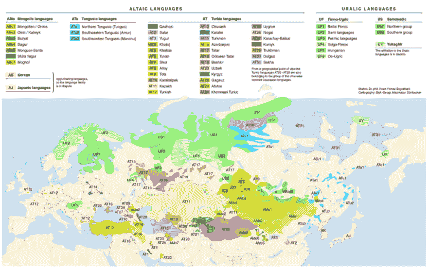

# 语言漂移是真实的

> 原文:[https://dev.to/andrewlucker/language-drift-is-real](https://dev.to/andrewlucker/language-drift-is-real)

语言漂移是真实的

而且它开始加速。

 

<figcaption>语言地图</figcaption>

英语是许多父母的孩子。我们的语言过去在地理上是如此的分散，以至于一个普通人甚至无法理解几英里外的另一个人。这是《贝奥武夫》的世界，写于公元 1000 年左右。

当时的语言通常是低日耳曼语和盎格鲁撒克逊语。然而，在几百年的时间里，几股力量联合起来将这些不同的方言统一起来，最终在莎士比亚的作品中达到顶峰；一部我们今天仍然可以欣赏的文学作品，不需要太多的翻译或旁注。

起作用的两股新力量是教会和政府。教会以布道的形式将拉丁语带给人们。国家以协商的形式把法语带给了人民。两者都将彻底改变古英语的结构，使之成为我们今天所知道的结构。

今天，类似的力量正在结合，从内部创造新的语言社区。今天起作用的力量与过去没有太大的不同。教堂的布道已经被计算机科学讲座所取代。国家谈判已经被社交网络和语音助手取代。

用计算机术语来说，语言转换的速度是无情的。正如业内任何人都会告诉你的那样，技术会迅速老化。目前，我们正在以如此惊人的速度堆积老化的基础设施，我们可能很快就会看到一种新的计算机领域的到来:技术考古学。一切都朝着“新”的方向发展，在四年的时间里，习语、句法和语义都变得过时了。

到目前为止，除了表情符号或迷因，人类语言经受住了互联网力量的冲击。不过，我相信这种情况不会持续太久。如果推特或脸书向我们展示了什么，那就是人类真的不擅长交流。任何从言论的情感或意识形态层说出来的话都会被丢掉或忽略。情绪太个人化，意识形态无聊。照这样下去，我们的网络泡沫将变成网络边界。网络边界正是语言边界形成的地方。除非我们开始打破泡沫，否则漂移将继续加速。

*本帖最初发表于[medium.com](https://medium.com/@andrew_subarctic/language-drift-is-real-11eba1d74b91)T3】*