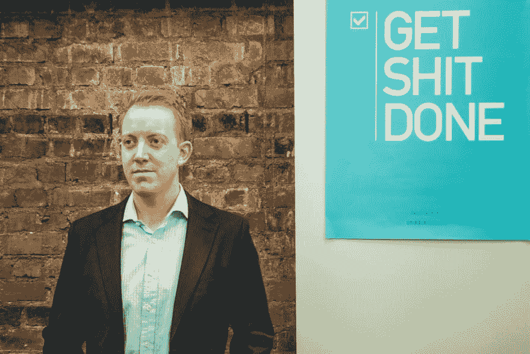

# 戴夫·查茨:约翰·丹尼尔·特拉斯克

> 原文：<https://dev.to/samjarman/dev-chats-john-daniel-trask-3l25>

[T2】](https://res.cloudinary.com/practicaldev/image/fetch/s--5gzTK6Z---/c_limit%2Cf_auto%2Cfl_progressive%2Cq_auto%2Cw_880/https://static1.squarespace.com/static/58bfb8c059cc68cc36914ea9/t/596aff15579fb3415caccc93/1500184356948/%3Fformat%3D1000w)

约翰-丹尼尔·柴斯克。Raygun 联合创始人兼首席执行官。

### 自我介绍！你是谁？你在哪里工作？

我叫约翰-丹尼尔·柴斯克，大多数人都叫我 JD。我是 [Raygun](https://raygun.com) 的联合创始人兼首席执行官。

我喜欢生活在商业和科技的交汇处。我个人认为商业和技术都是关注人类能力放大的范畴。两者的目标都是创造超越个人能力的成就。

我很幸运地参与了几个科技企业——经营一个，投资几个，并帮助其他人成长。我还获得了梅西大学的杰出校友奖，以及科技类的威灵顿年度奖。

今天，我在新西兰的惠灵顿和美国的西雅图之间来回奔波。Raygun 的总部设在惠灵顿，在西雅图设有办事处。我在推特上的名字是 [@traskjd](https://twitter.com/traskjd) 。

### 是谁或什么让你开始编程的？

我一直对事物的运作方式感兴趣。当我大约 5 岁的时候，我曾经拆卸过遥控车，试图弄明白这一点。当我们家有了一台电脑时，我大约 9 岁。我记得我被机器迷住了。这是在 WIndows 3.11 和 DOS 时代，我经常发现自己在 DOS 提示符下。我记得我浏览了每一条命令，想弄清楚它做了什么。编辑。Mem。导演。后来我偶然发现了 QBasic。

QBasic 是一个非常简单的编辑器，它编译基本代码来运行程序。它非常容易上手，我记得我学过写一些程序。简单的猜谜游戏，通过电脑扬声器播放音乐，等等。太棒了。我记得当时想“这就像我找到了一盒有无限碎片的乐高！”。我意识到，只要我用心，我就能建造任何东西，我被迷住了。

我在青少年时期继续学习 C、C++、汇编、Visual Basic、PHP 和 Delphi，大约 14 岁时开始在学校销售商业软件。

### 为软件开发者创造一个产品是什么感觉？

既有挑战性又令人兴奋。在挑战面前，许多软件开发人员运行广告拦截器(很难推向市场)，认为他们可以轻松地自己构建一些东西，对如何花费预算几乎没有发言权，并且可能非常固执己见。

话虽如此，就像你是一个建筑商，拿了另一个建筑商的钱去盖他们的房子:你被迫做一件非常棒的工作。他们的门槛很高，要求也很多。你不能带着一个不真正解决问题的半吊子解决方案离开。

一件非常好的事情是你可以和专家用户交流。一个用户可能会提出一个特性请求，你可以非常详细地讨论交付它会涉及到什么，以及什么可能会影响时间表。进行这样的对话非常好，因为它与我们的客户建立了更亲密的关系。

### 你是什么时候想到 Raygun 的？

这让我想起了我和杰里米(我的商业伙伴)在一家 It 服务公司做软件开发时的经历。我们非常关心我们软件的质量，讨厌惹恼客户。因此，我们会将错误通过电子邮件发送给自己。虽然很粗糙，但是很有效。

因此，当我们在自己的企业中开发一些产品时，我们一直在思考如何向自己报告问题。我们开发了 Raygun 崩溃报告，并提供给所有人，而不仅仅是通过电子邮件。事实证明，我们并不是唯一想确保生产出质量最好的软件的人！

### 当微软 MVP 是什么感觉？这对您/您的业务有什么影响？

成为微软 MVP 是巨大的荣誉和特权。通过我们与网络中其他 MVP 建立的关系，这对我们的业务是有益的。它还提供了一个看到 NDA 讨论和来自微软的软件改进的渠道。这有助于我们确保在第一天就能支持新技术。

因为 MVP 的身份，我从来没有写过博客或做过公开演讲。这些事情一直是我喜欢做的事情。所以当微软授予我 MVP 的时候，我非常感激。

### 

### 迄今为止，在你的软件生涯中，你学到的最难的一课是什么？

我不认为这很痛苦，但我回想起大学毕业后开始工作时学到的一些经验:

*   编码是最简单的部分，差距很大。人是难的部分。
*   总是，总是尽早沟通，经常谈论项目的实际情况。项目和产品经理通常不会因为某件事晚了而不高兴，除非他们在到期日才发现。
*   如果你认为你离完成只有“2 周”了，那你是在欺骗自己。软件工程师似乎默认一切都可以在两周内完成。
*   不要成为那个整天上 Twitter/Reddit/黑客新闻的人。相信我，大家都看到了，大家都觉得你不是很努力(...而你不是)。
*   出于某种原因，消极和愤世嫉俗似乎是我们在软件开发团队中培养的一种特质。没用的——永远把重点放在解决方案上。与其考虑我们为什么不应该做某事，不如考虑我们为什么应该做(引用埃隆·马斯克的话:我的第一个问题是成功的可能性是否不是零)。
*   总是主动提供帮助。当有人问问题、寻求意见、寻求志愿者时——选择加入。你会因此受到关注，取得更多成就，更快获得成功。

### 对于成功的软件职业生涯，你的第一条建议是什么？

采取行动。这不仅限于你的软件职业。我遇到过很多想做点什么的人(升职、约喜欢的人出去、创业、翻新浴室等等)。停止等待许可，停止阅读脸书的励志名言——基本上，停止胡闹，做该做的事情。没有人会给你东西。

我记得从大学毕业后的第一份工作开始。我 19 岁的时候遇到了一个人，他绝对是一个了不起的软件工程师。与这个家伙相比，我觉得自己一无是处(记住——我已经在家庭项目上写了十年的代码，所以我并不可怕，但我感觉到了！).我决心成为一名伟大的工程师。所以我开始在凌晨 4 点左右起床，在家编写项目代码。我会在工作时间，回家玩游戏，然后开始看软件开发教程(当时在微软的第九频道)。我沉浸在软件开发的手艺中。21 岁时，我已经是几个项目的团队领导，并开发了一些关键的内部工具来帮助管理公司使用的一些软件系统。

我用这个例子来强调我没有等待许可。我没有找借口。我认为这对我很重要，于是加快了速度。

### 管理软件开发和经营公司是什么感觉？你有时会“错过”编码吗？

现在我不直接管理我们的软件团队。杰里米·诺曼是我们的工程总监。我仍然会查看一些拉动式请求，并喜欢与 Jeremy 讨论团队动态。

我既怀念也不怀念编码。我仍然在周末写一些代码，尝试一些东西——所以这并不是说我不做任何编码。现在的诉求是写代码是一个数量级(或者两个！)比经营公司压力小。所以有时候我周末的编码会议更多的是为了宣泄，而不是为了实现一个特定的目标。

我也仍然非常着迷于事物是如何运作的。所以我的确会抽出一些时间来玩一些东西。例如，最近我花了一些时间研究 Google Tensorflow，以便我可以开始研究机器学习系统(这也是一个购买 nVidia 1080 Ti 的好借口！).

如果有一天你真的梦想经营自己的事业——享受你的编码时间。处于你自己的禅模式，听音乐，很少被打扰，是一个很棒的地方！:)

### 你会推荐什么书/资源？

最近我不太倾向于阅读关于软件开发的书籍——互联网上有太多好东西了。资源方面，就说导师吧。

我非常喜欢接触那些你尊敬并想向其学习的人。你会惊讶地发现有多少人不愿意讲述他们的故事——每个人都把他们放在一个基座上，不敢问！他们只是普通人。

我为前进所做的一些最好的事情是尝试与有成就的人联系。在我大学毕业后工作的 IT 服务公司，我特意去了解创始人和董事，尽管我对“仅仅”是一名研究生开发人员感到害怕。我记得当我考虑开始自己的生意时，我联系了 Rod Drury，并带他去吃了早午餐。通常，成功人士欢迎寻求建议的人，因为他们可以看到自己以前的样子。只是要尊重，不要浪费他们的时间。

### 最后，做出你的大喊！你想让读者去看什么？

我要给 https://medium.com/@ZhengRaygun 的李征( [@ZhengRaygun](https://twitter.com/zhengraygun) 在推特上)和她的博客:[喊一声](https://medium.com/@ZhengRaygun)

郑是 Raygun 的产品副总裁，在个人发展方面与我有很多相同的看法。她在 20 多岁时经营了自己成功的企业，现在在 Raygun 负责产品。

为了让身边的人都比自己优秀，我和郑在 2014 年结了婚。