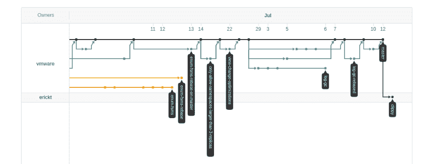
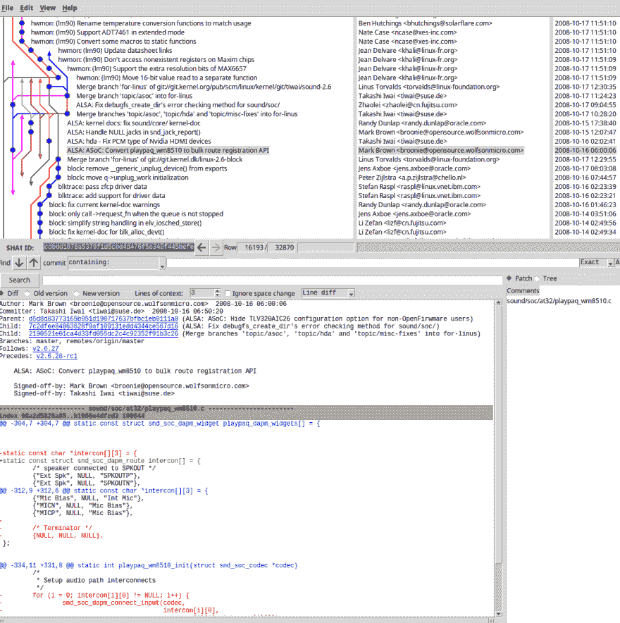
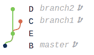
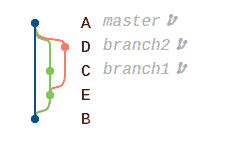
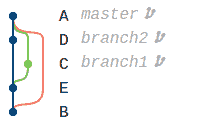
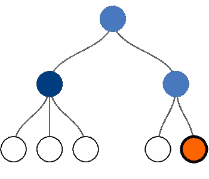
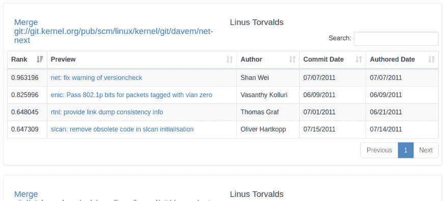
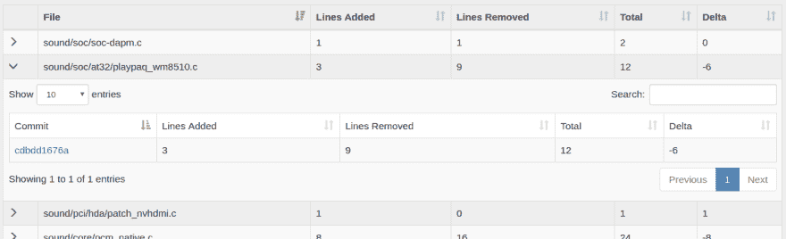
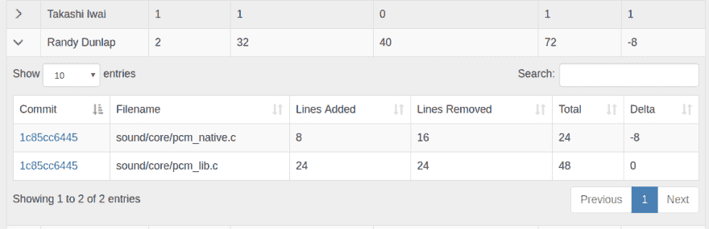

# 合并树:可视化 Git 存储库中提交的集成

> 原文:[https://dev . to/etc Wilde/merge-trees-visualizing-git-repositories](https://dev.to/etcwilde/merge-trees-visualizing-git-repositories)

Merge-trees 是我和我的主管提出的一个模型，用来显示提交是如何被合并到存储库的主分支中的。

# 有向无环图

有向无环图(DAG)是 git 内部使用的“漂亮的”、基于图论的模型，用于在存储库中存储提交和合并，它实际上非常擅长这项工作。这对于可视化存储库来说是合理的。我们习惯于在 Github 上看到 DAG 的可视化，在 GitKraken 上的网络选项卡或中间大窗格下，或者如果你最终倾向于。

因为所有这些工具都使用 DAG 进行可视化，所以它一定很棒，对吗？没有。一旦存储库达到一定的规模和给定的复杂程度，这些工具就开始瓦解。我的主要关注点是 Linux 存储库。在微软转向 git 之前，Linux 可能是现存的最复杂的 git 库(就我所知)，在某种程度上利用了 git 的几乎所有特性。由于 git 的复杂性和规模，我们在 Github 和 GitKraken 的朋友不再能为我们提供漂亮的图片。Github 甚至不去尝试，只是显示一条消息说资源库太大了。GitKraken 只是坐在那里，试图加载它几个小时。如果你有足够的内存和耐心，它最终也可能到达某个地方，但是一旦它被加载，执行任何操作仍然需要几个小时。

[T2】](https://res.cloudinary.com/practicaldev/image/fetch/s--Cht1nnpN--/c_limit%2Cf_auto%2Cfl_progressive%2Cq_auto%2Cw_880/https://thepracticaldev.s3.amazonaws.com/i/pzc6ykz7qtgfihc1858j.png)

但是...我们仍然可以有我们漂亮的照片。git 自带的 GUI 应用 Gitk 和终端上的`git log --graph`都能够产生可视化效果。

[T2】](https://res.cloudinary.com/practicaldev/image/fetch/s--IrPjVZ9P--/c_limit%2Cf_auto%2Cfl_progressive%2Cq_auto%2Cw_880/https://thepracticaldev.s3.amazonaws.com/i/8lwyo17ihkwty7ol33hj.png)

嗯，哪条线是主分支？这到底是怎么回事？谁知道呢？原来，那条从红色到亮绿色再到红色的线，就是主枝。我是怎么知道的，我已经查看了这个库超过了可以被认为是健康的，特别是这个提交。

那么，为什么人们使用 DAG 进行可视化呢？它完全代表了知识库。支持者可能会争辩说，它确切地显示了知识库的样子。现实主义者可能会说，“这很容易”。简单地通过存储库将呈现 DAG，而使用不同的模型(实际上我不知道有人试图设计不同的模型)是非常困难的，并且需要一些预处理步骤。更复杂的是，git 没有“主”分支的内部概念。主分支的概念是从过去的版本控制系统(SVN，CVS)继承来的。尽管有一个约定俗成的惯例。每个提交和合并都有一个父列表。提交只有一个父类，而合并可能有很多(如果你是正常人，有两个父类，如果你是 octopus-merge 组，你想要多少就有多少)。列表中的第一个父级是针对初始提交的前一个提交或合并，它与正在进行的提交在同一分支上。第二个(到第 n 个)是您要合并的下一个提交或合并，按照您引用合并的顺序。

[T2】](https://res.cloudinary.com/practicaldev/image/fetch/s--8XqkcEXl--/c_limit%2Cf_auto%2Cfl_progressive%2Cq_auto%2Cw_880/https://thepracticaldev.s3.amazonaws.com/i/966fwxv5kqjo6jogm1bn.png)

所以如果我在主分支上，我做了`git merge --no-ff branch1 branch2`

[T2】](https://res.cloudinary.com/practicaldev/image/fetch/s--ITFtMpS0--/c_limit%2Cf_auto%2Cfl_progressive%2Cq_auto%2Cw_880/https://thepracticaldev.s3.amazonaws.com/i/u4ymm9k59lcaesh0cwrm.png)

合并提交将具有包含三个元素(按此顺序)的父列表；

*   对主分支上先前提交的引用
*   对 branch1 上合并时最后一次提交的引用
*   对 branch2 上合并时最后一次提交的引用

如果发生了什么事情，比如有人变基不正确，或者合并了一些有趣的东西，或者错误地做了一个`git pull`(这就是为什么你让那些人说用`git fetch`后跟`git rebase`而不是`git pull`)，你可以切换那些父节点的顺序，这将使主分支消失。这叫做[狐步舞](https://bit-booster.blogspot.ca/2016/02/no-foxtrots-allowed.html)。

[T2】](https://res.cloudinary.com/practicaldev/image/fetch/s--ZjSsiNTF--/c_limit%2Cf_auto%2Cfl_progressive%2Cq_auto%2Cw_880/https://thepracticaldev.s3.amazonaws.com/i/3p2iirmjdch26z40wslq.png)

在这种情况下，我们交换了 branch2 和 master，这使得 E 和 D 看起来都在 master 分支上，即使我们知道 master 分支直接从提交 B 到合并 a。

另一个问题是快进合并。许多人害怕合并提交，没有一个好的可视化合并提交只会使事情变得复杂，所以他们进行快速合并。是的，它消除了合并提交，但是由于分支通常是独立的概念，合并提交就像是段落的分离。是的，你可以写一本没有段落的书，但是会很烂。不要这样对待你的仓库，否则它们也会很糟糕。

# 合并-树模型

好了，现在我们已经彻底讨论了 DAG，让我们来谈谈合并树。合并树是一种基于树的结构，显示了提交组如何合并到主分支中。根是到主分支的合并，叶子是单独的提交，内部节点是提交必须通过才能到达主分支的任何合并。

[T2】](https://res.cloudinary.com/practicaldev/image/fetch/s--cocMPqNd--/c_limit%2Cf_auto%2Cfl_progressive%2Cq_auto%2Cw_880/https://thepracticaldev.s3.amazonaws.com/i/vmpt98of5epk9acil4pd.png)

这是上面 Gitk 的 DAG 图片中突出显示的同一个提交的合并树可视化。亮橙色节点是提交。该模型删除了与我们感兴趣的提交不相关的提交，这使得可视化变得不那么混乱。此外，因为我们知道哪些提交属于合并，所以我们能够提供根中提交和合并的完整摘要。这可以是修改的文件和作者。

构建合并树依赖于主分支的知识来确定根应该在哪里。

# 验证

我们构建了一个名为 [Linvis](http://li.turingmachine.org) 的小工具来测试使用合并树的概念。用户可以通过日志消息中的散列、作者、文件名和关键字来搜索提交。搜索引擎使用全文搜索来查找与您的查询匹配的提交和合并。

例如，搜索“net-next”将返回一大堆与 Linux 网络模块相关的提交和合并的树。结果按照它们来自的合并树进行分组，到根的链接在顶部，到表中各个提交的链接在顶部。

[T2】](https://res.cloudinary.com/practicaldev/image/fetch/s--bjjkpHaz--/c_limit%2Cf_auto%2Cfl_progressive%2Cq_auto%2Cw_880/https://thepracticaldev.s3.amazonaws.com/i/igs95anr611aowrivfoa.png)

这些树是基于搜索排名的平均值排序的，因此更多相关的树在前面，而其他树浮动到后面。我们提供各种摘要，比如修改过的文件

[T2】](https://res.cloudinary.com/practicaldev/image/fetch/s--xCkzooCW--/c_limit%2Cf_auto%2Cfl_progressive%2Cq_auto%2Cw_880/https://thepracticaldev.s3.amazonaws.com/i/khqe21n2h2mvrl0soryl.png)

和作者

[T2】](https://res.cloudinary.com/practicaldev/image/fetch/s--Z9sPjzN5--/c_limit%2Cf_auto%2Cfl_progressive%2Cq_auto%2Cw_880/https://thepracticaldev.s3.amazonaws.com/i/zblxwo2w42fzlm0h0ly8.png)

此外，我们有三种不同的树的可视化，它们提供了不同的好处。Reingold-Tilford 树是经典的树，而 pack-tree 是为文件系统设计的，像仓库一样，文件系统通常有一个很宽但很浅的结构。

合并树是一个很有潜力的有趣概念。合并树的效用取决于储存库的结构；如果存储库使用快进合并，并且有 foxtrots，合并树要么没有用，要么不正确，因为它们依赖于主分支的知识。例如， [Caml](https://github.com/apache/camel) 存储库使用 CVS 存储库结构。所有的变更都在存储库的主分支中进行。分支仅用于分离发布。对发布的修改在发布分支中进行，但是发布分支永远不会合并回主分支。在这种情况下，合并树没有任何帮助；每次提交将是一个单独的合并树。

一些 git 工作流的中心是在发布时合并到主分支中。这些可能从合并树中受益最大，因为管理者可以很容易地总结出谁写了什么。此外，人们可以确切地看到每个提交是如何进入项目的。

Linux 存储库不使用这两者。Linus Torvalds 掌握着所有的权力，是唯一一个可以推进主分支的人。他只是一次合并内核的大的子模块，然后在发布点留下标签。这种结构也受益于合并树结构。

这是一个很长的帖子，所以我将在这里结束它。让我知道你的想法。