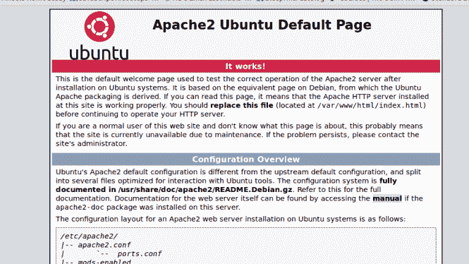
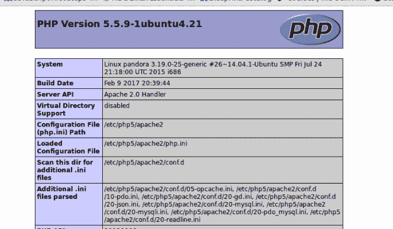
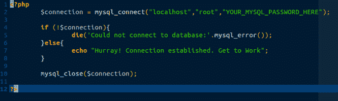
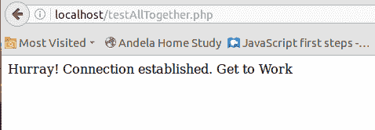

# 如何在 Linux (Ubuntu)中安装 LAMP 服务器

> 原文:[https://dev . to/xeroism/how-to-install-lamp-server-in-Linux-Ubuntu-3c3k](https://dev.to/xeroxism/how-to-install-lamp-server-in-linux-ubuntu-3c3k)

[T2】](https://i1.wp.com/fossnaija.com/wp-content/uploads/2017/07/LAMP-banner.jpg?ssl=1)

LAMP server stack 是 Linux 机器或电脑上的开源软件组合的缩写:*Apache*(web sever)*My**SQL*(数据库服务器)和 *PHP* (编程语言)。LAMP 服务器栈是成功的动态 web 开发的一个非常流行和强大的设置。

虽然有一些常见的一体化安装软件(MAMP，XAMP 等)。但是在这篇文章中，我们将单独安装和配置所有的包。在 Linux 上做这件事非常简单直接。事不宜迟，我们走吧。

## #1:安装 APACHE web 服务器。

Apache 可以使用 Linux 发行版的默认包管理器来安装。这里我们使用 Ubuntu 的 **apt** (fedora 和基于 fedora 的系统使用 **yum** )。因此，转到<u>终端</u>并输入以下命令:

**T2`sudo apt-get update`**

**T2`sudo apt-get install apache2`**

稍等…你的网络服务器已经安装好了！

安装完成后，您可以在网页浏览器上输入[https://server _ IP _ address](https://server_IP_address/)(默认 IP 地址应该是 127.0.0.1，也就是俗称的 *lo __cal* _ lhost_)。您应该会看到一个默认的欢迎页面。

[T2】](https://i1.wp.com/fossnaija.com/wp-content/uploads/2017/07/apache-works.png?ssl=1)

图片:Apache Ubuntu 默认页面(FossNaija.com)。

您可以通过将 IP 解析为一个以“ *localhost* ”而闻名的域名来进行更改，而不是总是键入这个 IP(这可能既麻烦又无聊)。为此，只需在您最喜欢的编辑器(Vim 或 gedit)中打开 apache 配置文件(*/**)etc/Apache 2/Apache 2 . conf*，如下所示:

**T2`sudo gedit /etc/apache2/apache2.conf`**

将这个“ServerName localhost”(不带双引号)添加到文件中。

并重新启动 apache:

**T2`sudo /etc/init.d/apache2 restart`**

或者

**T2`sudo service apache2 reload`**

现在打开浏览器，键入 localhost 代替服务器 IP 地址:

[https://localhost](https://localhost/)

您应该会看到如上所示的服务器主页。注意服务器的文档根目录在“***/var/www/html***”——默认情况下，所有 PHP 脚本都应该存储在这里，以便服务器能够访问。

## #2:安装 MySQL。

现在我们已经运行了 web 服务器，让我们安装 MySQL 数据库软件。

**T2`sudo apt-get install mysql-server`**

让安装开始。在安装过程中，它会提示您输入服务器根(或管理员)用户的密码，输入一个强密码(两次)，确认并继续。

安装后，通过运行以下命令检查服务器的状态进行确认:

**T2`sudo /etc/init.d/mysql status`**

** /usr/bin/mysqladmin 版本 8.42 发行版 5.5.55，适用于 i686 上的 debian-Linux-GNU*

*版权所有(c) 2000，2017，甲骨文和/或其附属公司。保留所有权利。*

*甲骨文是甲骨文公司和/或其*的注册商标

*关联公司。其他名称可能是其各自*的商标

*拥有者。*

*服务器版本 5.5.55-0ubuntu0.14.04.1*

*协议版本 10*

*通过 UNIX 套接字连接本地主机*

*UNIX 套接字/var/run/mysqld/mysqld.sock*

*运行时间:15 小时 8 分 34 秒*

*线程:1 问题:144 慢速查询:0 打开:60 刷新表:1 打开表:53 查询每秒平均:0.002*

如果你得到了上述输出或类似的输出，你就可以开始了。要登录数据库:

**T2`$ mysql -u root -p`**

输入密码:

欢迎使用 MySQL monitor。命令以结尾；或者\g.

*您的 MySQL 连接 id 是 54*

*服务器版本:5 . 5 . 55-0ubuntu 0 . 14 . 04 . 1(Ubuntu)*

*版权所有(c) 2000，2017，甲骨文和/或其附属公司。保留所有权利。*

*甲骨文是甲骨文公司和/或其*的注册商标

*关联公司。其他名称可能是其各自*的商标

*拥有者。*

键入“help”或“\h”寻求帮助。键入' \c '清除当前的输入语句。

*MySQL>T1】*

提示意味着你可以开始输入 mysql 命令来管理数据库。

## #3:安装 PHP。

只需输入命令:

**T2`sudo apt-get install php5 libapache2-mod-php5`**

安装后，为了测试 php 的工作情况，创建一个 PHP 文件(您可以随意命名)，内容如下:

**T2`<?php phpinfo(); ?>`**

在 */var/www/html* 目录中(这是所有 php 脚本默认存储的地方)。

比如说；

**T2`sudo gedit /var/www/html/phpinfo.php`**

并保存文件。

现在在浏览器中打开文件:

[https://localhost/phpinfo . PHP](https://localhost/phpinfo.php)

您应该会看到这样一个 PHP 信息页面:

[T2】](https://i0.wp.com/fossnaija.com/wp-content/uploads/2017/07/php-works.png?ssl=1)

图片:PHP 默认页面(FossNaija.com)。

恭喜你已经在你的系统上安装了灯！

最后，看看是否所有人都认识到了这一点，并愿意互相合作(这是最重要的一点)。在文档根目录下用你想要的名字创建另一个 php 文件(我的名字是*testAllTogether.php*),如下所示:

**T2`sudo gedit /var/www/html/testAllTogether.php`**

并增加以下内容:

*T2？php*

*$ connection = MYSQL _ connect(" localhost "，" root "，"**YOUR _ MYSQL _ PASSWORD _ HERE**")；*

*如果(！$connection){*

*die()'无法连接到数据库:'。MySQL _ error())；*

*}其他{*

*附和“万岁！已建立连接。开始工作"；*

*}*

*MySQL _ close($ connection)；*

*？>T1】*

[T2】](https://i0.wp.com/fossnaija.com/wp-content/uploads/2017/07/php-code.png?ssl=1)

图片:LAMP PHP 测试代码。

现在在浏览器中打开这个文件([https://localhost/testall together . PHP](https://localhost/testAllTogether.php))，如果一切顺利，您应该会看到这样一个页面。

[T2】](https://i1.wp.com/fossnaija.com/wp-content/uploads/2017/07/all-works.png?ssl=1)

图片:所有作品！

瞧啊。我们都做完了。

[如何在 Linux (Ubuntu)](https://fossnaija.com/install-lamp-server-linux-ubuntu/) 上安装 LAMP 服务器的帖子最早出现在 [Foss Naija](https://fossnaija.com) 上。