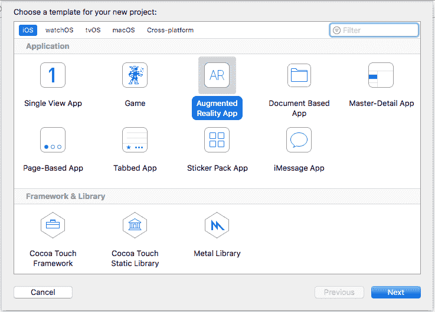
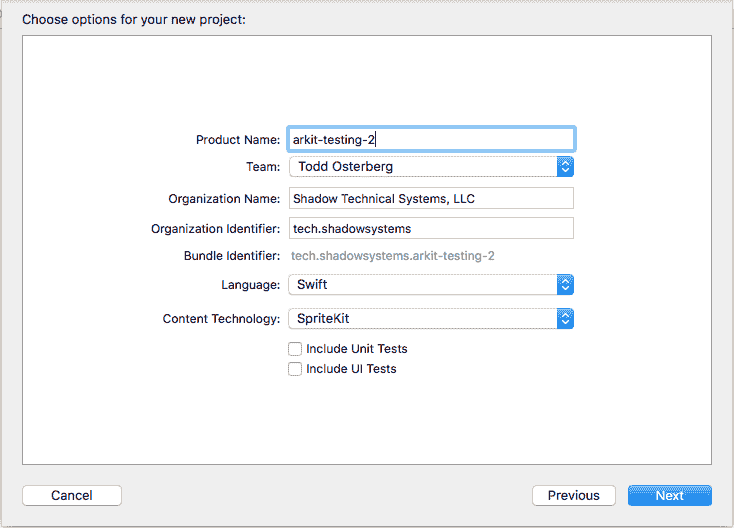
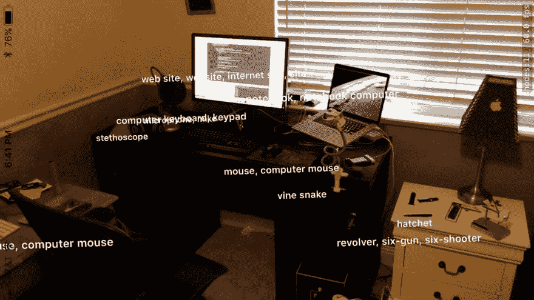
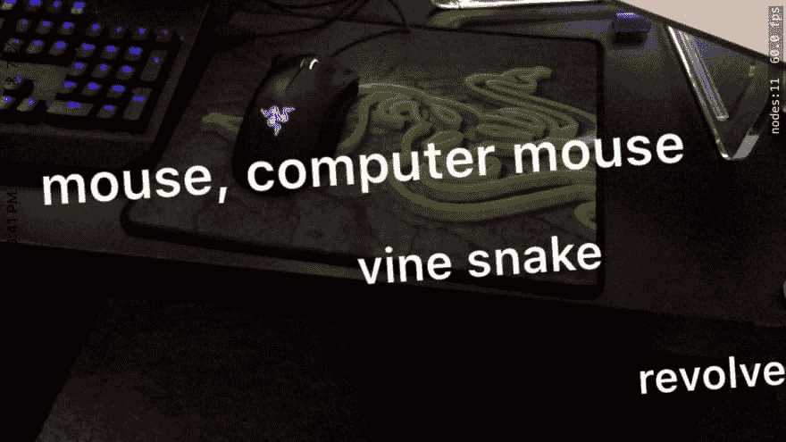
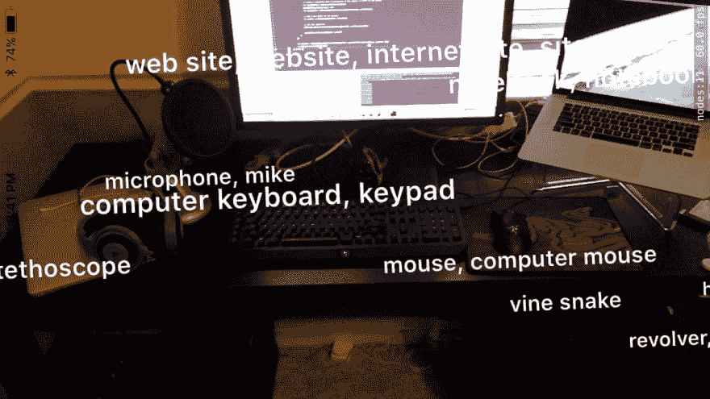

# ARKit + Vision:一个有趣的组合

> 原文:[https://dev.to/jordanosterberg/arkit——一个有趣的组合](https://dev.to/jordanosterberg/arkit--vision-an-intriguing-combination)

经过数周的思考，我应该首先对苹果新发布的 ARKit 做些什么，我决定我不会把我的思维局限于这一个 API。我已经看了很多关于 CoreML/Vision 的对象识别特性的教程，我决定亲自尝试一下。

**TL；DR: ARKit 和 Vision 是完美的结合。**

### 我们在做什么？

我们将创建一个 ARKit 应用程序，无论何时点击屏幕，它都会显示 iOS 设备认为相机中显示的对象是什么。(参见文章底部的示例图片)

### 项目设置

我们从 Xcode (9 或更高版本)开始我们的旅程，在那里我们创建了一个新的**增强现实应用**...

[T2】](https://res.cloudinary.com/practicaldev/image/fetch/s--PC3jSswv--/c_limit%2Cf_auto%2Cfl_progressive%2Cq_auto%2Cw_880/http://i.imgur.com/A4f1KOi.png)

...给它一个名字...(在我的例子中是“arkit-testing-2”)并将**内容技术**设置为 **SpriteKit** ...

[T2】](https://res.cloudinary.com/practicaldev/image/fetch/s--1V5J9Oz3--/c_limit%2Cf_auto%2Cfl_progressive%2Cq_auto%2Cw_880/http://i.imgur.com/AVO3ecp.png)

...选择它在我们硬盘上的位置，然后开始工作。

### ViewController.swift

我们将把重点放在这堂课的重要代码上，因为大部分代码都是普通的样板文件。

```
override func viewWillAppear(_ animated: Bool) {
    super.viewWillAppear(animated)

    // Create a session configuration
    let configuration = ARWorldTrackingSessionConfiguration()

    // Run the view's session
    sceneView.session.run(configuration)
} 
```

<svg width="20px" height="20px" viewBox="0 0 24 24" class="highlight-action crayons-icon highlight-action--fullscreen-on"><title>Enter fullscreen mode</title></svg> <svg width="20px" height="20px" viewBox="0 0 24 24" class="highlight-action crayons-icon highlight-action--fullscreen-off"><title>Exit fullscreen mode</title></svg>

在`viewWillAppear`中，创建了`ARWorldTrackingSessionConfiguration`类，然后运行视图的会话。如果你愿意，你可以修改配置，但是在本教程中，我们不会使用它。

```
func view(_ view: ARSKView, nodeFor anchor: ARAnchor) -> SKNode? {
    // Create and configure a node for the anchor added to the view's session.
    let labelNode = SKLabelNode(text: "👾")
    labelNode.horizontalAlignmentMode = .center
    labelNode.verticalAlignmentMode = .center
    return labelNode;
} 
```

<svg width="20px" height="20px" viewBox="0 0 24 24" class="highlight-action crayons-icon highlight-action--fullscreen-on"><title>Enter fullscreen mode</title></svg> <svg width="20px" height="20px" viewBox="0 0 24 24" class="highlight-action crayons-icon highlight-action--fullscreen-off"><title>Exit fullscreen mode</title></svg>

在这个函数中，提供了一个`ARSKView`对象和一个`ARAnchor`对象。这个`ARAnchor`物体以后会很重要。在函数内部，配置并返回一个`SKLabelNode`。这在后面也会很重要。

在我们进入这个样板文件中的另一个重要文件之前，让我们修改一下我们的`viewDidLoad`方法，这样我们就不会遇到我在创建这个项目时遇到的错误。

替换...

```
// Load the SKScene from 'Scene.sks'
if let scene = SKScene(fileNamed: "Scene") {
    sceneView.presentScene(scene)
} 
```

<svg width="20px" height="20px" viewBox="0 0 24 24" class="highlight-action crayons-icon highlight-action--fullscreen-on"><title>Enter fullscreen mode</title></svg> <svg width="20px" height="20px" viewBox="0 0 24 24" class="highlight-action crayons-icon highlight-action--fullscreen-off"><title>Exit fullscreen mode</title></svg>

随着...

```
let scene = Scene(size: self.view.frame.size)
sceneView.presentScene(scene) 
```

<svg width="20px" height="20px" viewBox="0 0 24 24" class="highlight-action crayons-icon highlight-action--fullscreen-on"><title>Enter fullscreen mode</title></svg> <svg width="20px" height="20px" viewBox="0 0 24 24" class="highlight-action crayons-icon highlight-action--fullscreen-off"><title>Exit fullscreen mode</title></svg>

我不确定这个错误是什么，或者为什么它可以修复它，但是它确实可以。如果需要的话，您可以尝试原始代码并找到替代的修复方法。

### 雨燕

首先，注释掉`touchesBegan`中的以下代码:

```
// Create a transform with a translation of 0.2 meters in front of the camera
var translation = matrix_identity_float4x4
translation.columns.3.z = -0.2
let transform = simd_mul(currentFrame.camera.transform, translation)

// Add a new anchor to the session
let anchor = ARAnchor(transform: transform)
sceneView.session.add(anchor: anchor) 
```

<svg width="20px" height="20px" viewBox="0 0 24 24" class="highlight-action crayons-icon highlight-action--fullscreen-on"><title>Enter fullscreen mode</title></svg> <svg width="20px" height="20px" viewBox="0 0 24 24" class="highlight-action crayons-icon highlight-action--fullscreen-off"><title>Exit fullscreen mode</title></svg>

是的，把这些都注释掉。不要删除它，我们稍后会回来。

### 远景！

在`Scene.swift`文件中，确保在开始之前导入 Vision 框架:

```
import Vision 
```

<svg width="20px" height="20px" viewBox="0 0 24 24" class="highlight-action crayons-icon highlight-action--fullscreen-on"><title>Enter fullscreen mode</title></svg> <svg width="20px" height="20px" viewBox="0 0 24 24" class="highlight-action crayons-icon highlight-action--fullscreen-off"><title>Exit fullscreen mode</title></svg>

现在去[苹果开发者网站的机器学习页面](https://developer.apple.com/machine-learning/)下载 InceptionV3 模型。你可以下载你喜欢的任何型号，这只是我喜欢的一个，它的文件大小相对较小。

**编者按**:网站上已经没有 InceptionV3 型号了。幸运的是，您可以下载不同的模型并相应地修改代码。

您现在所要做的就是将 InceptionV3 MLModel 文件拖放到您的项目中，就像您处理任何其他文件一样。

Xcode 在这里为您做的是为模型生成一个快捷的接口。我推荐观看 WWDC17 上的视觉和介绍 CoreML 会议来了解更多信息，分别位于[这里](https://developer.apple.com/videos/play/wwdc2017/506/)和[这里](https://developer.apple.com/videos/play/wwdc2017/703/)。

现在我们终于准备好在`touchesBegan`中编写一些代码了。

让我们输入一个后台线程，以便在运行其中一个请求时不会完全破坏我们应用程序的性能(我是通过艰苦的努力才知道的):

```
DispatchQueue.global(qos: .background).async {

} 
```

<svg width="20px" height="20px" viewBox="0 0 24 24" class="highlight-action crayons-icon highlight-action--fullscreen-on"><title>Enter fullscreen mode</title></svg> <svg width="20px" height="20px" viewBox="0 0 24 24" class="highlight-action crayons-icon highlight-action--fullscreen-off"><title>Exit fullscreen mode</title></svg>

现在让我们创建一个 do，catch，并从我们刚才下载的 CoreML 模型中创建一个`VNCoreMLModel`对象(当然，这取决于您的网速)

```
do {            
    let model = try VNCoreMLModel(for: Inceptionv3().model)
} catch {} 
```

<svg width="20px" height="20px" viewBox="0 0 24 24" class="highlight-action crayons-icon highlight-action--fullscreen-on"><title>Enter fullscreen mode</title></svg> <svg width="20px" height="20px" viewBox="0 0 24 24" class="highlight-action crayons-icon highlight-action--fullscreen-off"><title>Exit fullscreen mode</title></svg>

在我们的`do` `catch`里面，在我们的模型初始化之后，让我们创建一个`VNCoreMLRequest`和一个`completionHandler`，就像这样:

```
let request = VNCoreMLRequest(model: model, completionHandler: { (request, error) in

}) 
```

<svg width="20px" height="20px" viewBox="0 0 24 24" class="highlight-action crayons-icon highlight-action--fullscreen-on"><title>Enter fullscreen mode</title></svg> <svg width="20px" height="20px" viewBox="0 0 24 24" class="highlight-action crayons-icon highlight-action--fullscreen-off"><title>Exit fullscreen mode</title></svg>

现在，让我们创建一个`VNImageRequestHandler`并执行我们的请求(在`VNCoreMLRequest`的`completionHandler`之后写这段代码):

```
let handler = VNImageRequestHandler(cvPixelBuffer: currentFrame.capturedImage, options: [:])
try handler.perform([request]) 
```

<svg width="20px" height="20px" viewBox="0 0 24 24" class="highlight-action crayons-icon highlight-action--fullscreen-on"><title>Enter fullscreen mode</title></svg> <svg width="20px" height="20px" viewBox="0 0 24 24" class="highlight-action crayons-icon highlight-action--fullscreen-off"><title>Exit fullscreen mode</title></svg>

让我解释一下这是什么代码，因为它可能有点奇怪。

我们正在创建一个图像请求处理程序来处理我们的请求，并向它传递一个...

`CVPixelBuffer`？！？那是什么鬼东西？根据 [StackOverflow](https://stackoverflow.com/questions/41822136/what-is-a-cvpixelbuffer-in-ios) 的说法，CVPixelBuffer 是`CoreVideo`框架的一部分。对我们来说幸运的是，我们可以通过把 ARKit 从`currentFrame`物体中拉出来访问它，这样我们就不用做任何繁重的工作了。

```
currentFrame.capturedImage 
```

<svg width="20px" height="20px" viewBox="0 0 24 24" class="highlight-action crayons-icon highlight-action--fullscreen-on"><title>Enter fullscreen mode</title></svg> <svg width="20px" height="20px" viewBox="0 0 24 24" class="highlight-action crayons-icon highlight-action--fullscreen-off"><title>Exit fullscreen mode</title></svg>

然后我们用`handler.perform([request])`执行我们的请求。

现在让我们在`completionHandler` :
里面写代码

```
// Jump onto the main thread
DispatchQueue.main.async {
    // Access the first result in the array after casting the array as a VNClassificationObservation array
    guard let results = request.results as? [VNClassificationObservation], let result = results.first else {
        print ("No results?")
        return
    }
} 
```

<svg width="20px" height="20px" viewBox="0 0 24 24" class="highlight-action crayons-icon highlight-action--fullscreen-on"><title>Enter fullscreen mode</title></svg> <svg width="20px" height="20px" viewBox="0 0 24 24" class="highlight-action crayons-icon highlight-action--fullscreen-off"><title>Exit fullscreen mode</title></svg>

太棒了，我们的课快结束了。还记得我们之前评论的代码吗？让我们在执行完那个`guard`语句后，把它粘贴进去。

我们还将修改一个属性，使我们的文本在实例化 ARKit 对象时看起来离设备更远:

```
// Create a transform with a translation of 0.2 meters in front of the camera
translation.columns.3.z = -0.4 // Originally this was -0.2 
```

<svg width="20px" height="20px" viewBox="0 0 24 24" class="highlight-action crayons-icon highlight-action--fullscreen-on"><title>Enter fullscreen mode</title></svg> <svg width="20px" height="20px" viewBox="0 0 24 24" class="highlight-action crayons-icon highlight-action--fullscreen-off"><title>Exit fullscreen mode</title></svg>

如果您愿意，可以将注释更新为`0.4`米，因为该注释是针对属性的前一个值的。

最后一件事，我们的场景课结束了。创建一个名为`ARBridge`的新 swift 文件，并粘贴以下代码:

```
import UIKit
import ARKit

class ARBridge {

    static let shared = ARBridge()

    var anchorsToIdentifiers = [ARAnchor : String]()

} 
```

<svg width="20px" height="20px" viewBox="0 0 24 24" class="highlight-action crayons-icon highlight-action--fullscreen-on"><title>Enter fullscreen mode</title></svg> <svg width="20px" height="20px" viewBox="0 0 24 24" class="highlight-action crayons-icon highlight-action--fullscreen-off"><title>Exit fullscreen mode</title></svg>

`anchorsToIdentifiers`属性将允许我们将一个 ARAnchor 与其对应的机器学习值相关联。

让我们给这个字典添加一个值，并重新构造我们的代码，以便它能正确执行:

```
// Create a new ARAnchor
let anchor = ARAnchor(transform: transform)

// Set the identifier
ARBridge.shared.anchorsToIdentifiers[anchor] = result.identifier

// Add a new anchor to the session
sceneView.session.add(anchor: anchor) 
```

<svg width="20px" height="20px" viewBox="0 0 24 24" class="highlight-action crayons-icon highlight-action--fullscreen-on"><title>Enter fullscreen mode</title></svg> <svg width="20px" height="20px" viewBox="0 0 24 24" class="highlight-action crayons-icon highlight-action--fullscreen-off"><title>Exit fullscreen mode</title></svg>

附注:如果我们在场景中添加锚之后保存了我们的标识符，它将不会正确显示。确保您的代码按照上面显示的顺序。

我们都准备好了！这是我们刚刚在`touchesBegan`函数中写的所有代码:

```
DispatchQueue.global(qos: .background).async {
                do {
                    let model = try VNCoreMLModel(for: Inceptionv3().model)
                    let request = VNCoreMLRequest(model: model, completionHandler: { (request, error) in
                        // Jump onto the main thread
                        DispatchQueue.main.async {
                            // Access the first result in the array after casting the array as a VNClassificationObservation array
                            guard let results = request.results as? [VNClassificationObservation], let result = results.first else {
                                print ("No results?")
                                return
                            }

                            // Create a transform with a translation of 0.4 meters in front of the camera
                            var translation = matrix_identity_float4x4
                            translation.columns.3.z = -0.4
                            let transform = simd_mul(currentFrame.camera.transform, translation)

                            // Add a new anchor to the session
                            let anchor = ARAnchor(transform: transform)

                            // Set the identifier
                            ARBridge.shared.anchorsToIdentifiers[anchor] = result.identifier

                            sceneView.session.add(anchor: anchor)
                        }
                    })

                    let handler = VNImageRequestHandler(cvPixelBuffer: currentFrame.capturedImage, options: [:])
                    try handler.perform([request])
                } catch {}
            } 
```

<svg width="20px" height="20px" viewBox="0 0 24 24" class="highlight-action crayons-icon highlight-action--fullscreen-on"><title>Enter fullscreen mode</title></svg> <svg width="20px" height="20px" viewBox="0 0 24 24" class="highlight-action crayons-icon highlight-action--fullscreen-off"><title>Exit fullscreen mode</title></svg>

### 【最后】回到 ViewController.swift

我们现在唯一需要做的就是修改我们的`view`方法来检索与我们的`ARAnchor`相关联的文本，它是由我们的机器学习模型生成的。

```
func view(_ view: ARSKView, nodeFor anchor: ARAnchor) -> SKNode? {
    // Create and configure a node for the anchor added to the view's session.
    guard let identifier = ARBridge.shared.anchorsToIdentifiers[anchor] else {
        return nil
    }

    let labelNode = SKLabelNode(text: identifier)
    labelNode.horizontalAlignmentMode = .center
    labelNode.verticalAlignmentMode = .center
    labelNode.fontName = UIFont.boldSystemFont(ofSize: 16).fontName
    return labelNode
} 
```

<svg width="20px" height="20px" viewBox="0 0 24 24" class="highlight-action crayons-icon highlight-action--fullscreen-on"><title>Enter fullscreen mode</title></svg> <svg width="20px" height="20px" viewBox="0 0 24 24" class="highlight-action crayons-icon highlight-action--fullscreen-off"><title>Exit fullscreen mode</title></svg>

如果没有与`ARAnchor`相关联的文本，则不返回`SKNode`。如果文本存在，我们创建一个`SKLabelNode`，改变字体，并返回它！

## 测试！！！

我在房间里跑来跑去，把相机对准随机的物体，结果是这样的:

[](https://res.cloudinary.com/practicaldev/image/fetch/s--BwFXqvM4--/c_limit%2Cf_auto%2Cfl_progressive%2Cq_auto%2Cw_880/http://i.imgur.com/FX0JXeL.jpg)
[](https://res.cloudinary.com/practicaldev/image/fetch/s--RU-la6EM--/c_limit%2Cf_auto%2Cfl_progressive%2Cq_auto%2Cw_880/http://i.imgur.com/Ilj3fMN.jpg)
[](https://res.cloudinary.com/practicaldev/image/fetch/s--MQ4Q9IW2--/c_limit%2Cf_auto%2Cfl_progressive%2Cq_auto%2Cw_880/http://i.imgur.com/3HGgAkk.jpg)

它认为我桌子上的 MacBook Air 是一个听诊器(可能是耳机或麦克风)，我床头柜上的笔是一把左轮手枪，我的 Apple Watch sport band 是一把斧头。

除此之外，预测物体是什么是令人惊奇的。它认为这个项目的代码是一个网站，这是稍微正确的。它还从 Razer 检测到了我的鼠标垫上的蛇图案，这真是太神奇了。

对于不同的模型，我肯定会有不同的结果，所以尝试多个模型，看看会发生什么。这就像将它们拖放到项目中并更改访问模型的代码行一样简单。

最终的项目可以在 GitHub [这里](https://github.com/JordanOsterberg/ARKit-Vision-Example)找到，如果你只是想运行它，看看会发生什么！

非常感谢您的阅读，希望您喜欢我对 ARKit 和 Vision 的(非常基本的)努力！