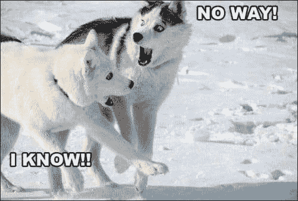
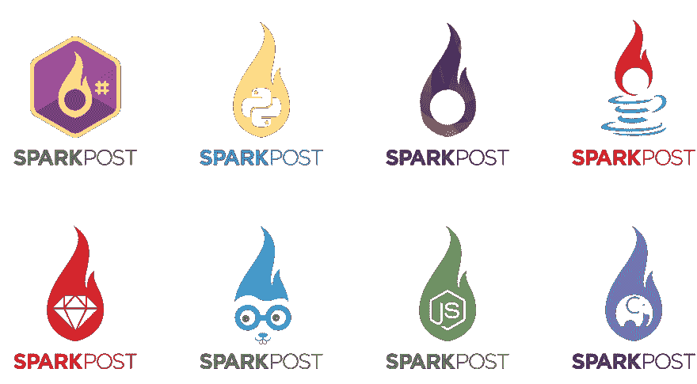
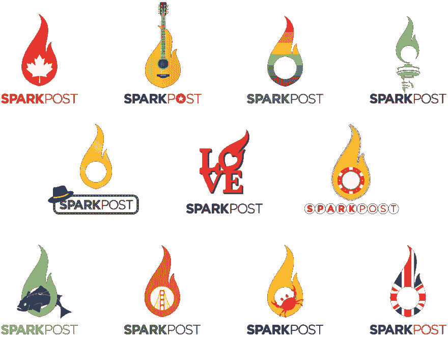
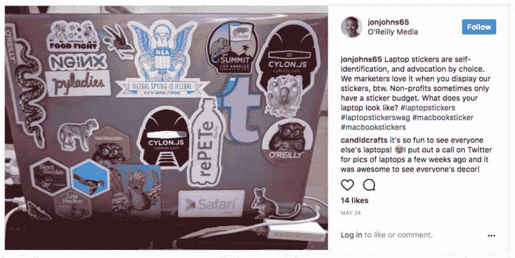

# 火花柱火焰的粘附力

> 原文:[https://dev . to/sparkpost/the-sticking-power-of-sparkpost-flame](https://dev.to/sparkpost/the-sticking-power-of-the-sparkpost-flame)

### 我们的火花柱火焰的粘附力

我今天的前提可能很难让你接受:软件开发人员喜欢贴纸。(注:在这种情况下，人们可能会认为“爱”这个词超出了“非常喜欢或乐在其中”的标准定义，进入了“痴迷”的范畴。)

[T2】](https://res.cloudinary.com/practicaldev/image/fetch/s--pRfiEf6Q--/c_limit%2Cf_auto%2Cfl_progressive%2Cq_auto%2Cw_880/https://media.sparkpost.com/uploads/2017/06/noway-huskies.jpg)

你说什么？开发人员喜欢贴纸已经是旧闻了，当他们[失去贴纸历史](https://twitter.com/search?q=lost%20my%20laptop%20need%20stickers&src=typd)时，这是一个悲剧？如果你愿意的话，这让这篇博客有点…难写。我们喜欢 SparkPost 的贴纸。每台笔记本电脑都是独一无二的，从“社交媒体忍者”到手持“邪恶苹果”的白雪公主的剪影，再到各种聚会、工具，当然还有[鳄梨](https://www.sparkpost.com/blog/building-internal-community/)。所以我相信你会理解为什么一年多前我去找我们出色的设计师[林恩·墨菲](https://www.behance.net/user/?username=LynnMurphy)并请她开始考虑为我们设计一系列 SparkPost 贴纸。

### 一个棘手的话题

至少可以说，设计公司标识，然后在上面即兴创作，是一个棘手的问题。任何优秀的设计师都会告诉你，在一家相对较新的公司，首要任务之一是确保标识易于识别，但这并不容易。你必须在所有正确的方面脱颖而出，你使用的任何品牌都必须令人难忘。

可以肯定地说，Github 用他们的 [Octocat](https://octodex.github.com/) 设计了 100 多个贴纸，现在受到全球开发者的追捧，你可以在 Twitter 上搜索 [Octocat。正如设计师 Cameron McEfee 在他关于](https://twitter.com/search?q=octocat&src=typd) [Octocat 的历史](http://cameronmcefee.com/work/the-octocat/)的帖子中所说，“当我用 GitHub 创建软件时，人们用[octo cat]说‘这就是我’。"

考虑到这一点，我首先联系了我们的杰出设计师兼创意服务总监 Lynn，将我们的 SparkPost 火焰整合到我们的 [Bitcamp 2016 赞助商](https://www.sparkpost.com/blog/bitcamp-2016-piggy-pennies/)的活动标志中，作为一种特殊的限量版贴纸。组织者在船上，这是一个相对容易的转变，因为基地是一堆篝火。Lynn 添加了我们的火焰来代替他们徽标中的 8 位火焰，Bitcamp 的与会者为之疯狂。

> SparkPost 状态@ SparkPost ops马里兰大学前往 [@bitcmp](https://twitter.com/bitcmp) ...用超级牛逼的贴纸！2016 年 04 月 08 日下午 18:34

### 一次一棒

对那次成功的兴奋仍然记忆犹新，我回到林恩，这次是关于我们令人敬畏的[客户端库](https://github.com/SparkPost)。我们可以做些什么来展示我们的图书馆，并通过笔记本电脑在世界各地提高品牌知名度？考虑到我们徽标的有趣本质和[她天才的想法](https://twitter.com/aydrianh/status/867150742892576769)，我想我们也许能想出一些不仅能推广我们的客户库，还能让我们的用户高兴的东西。

长话短说，Lynn 双脚跳了进去，看着编程语言徽标，头脑风暴想法。有些被证明比其他的更容易。例如，Node.js、Ruby 和 Python 相对容易合并，因为她只是将我们火焰的中心替换为适当的编程语言徽标。其他的，比如 Java，花费了更多的时间和创造力，但是很快就成为了大众的最爱。

[T2】](https://res.cloudinary.com/practicaldev/image/fetch/s--CK5Necib--/c_limit%2Cf_auto%2Cfl_progressive%2Cq_auto%2Cw_880/https://media.sparkpost.com/uploads/2017/06/Logo-Stickers_Code-Libraries-01.png%3F_t%3D1497459150)

“GoLang 是我的最爱，”林恩说。“改编地鼠的个性很有挑战性，我们可以使用我们活泼的角色，这很有趣。之后，PHP 无疑是最具挑战性的。PHP 的标志没有太多的品牌个性，也不太符合我们的火焰。基于 Enfys，多样性[大象](http://www.elephpant.com/)，我们最终选择了火焰中心的大象。”

火花邮报 CMO [乔希·阿伯兰特](https://twitter.com/jaberant)喜欢去林恩的书桌旁，猜猜每张贴纸对应哪种语言。Lynn 说:“我认为这是它们更吸引人的地方，而不是让每一个都明确地适用于相应的编程语言。”“这让它更像一个游戏。”

我们很快发现你们都同意了！我已经记不清有多少次我们让人们来到会议上的 SparkPost 展位，并试图仅凭贴纸猜测我们有哪些客户图书馆。一旦他们得了满分，他们当然会每人拿一个——[你必须抓住他们所有人](https://www.youtube.com/watch?v=lrHJhKEtQEI)！而且乐趣是会传染的！带新的贴纸去参加活动仍然是我最喜欢做的事情之一。

液体错误:内部

### 占领城市，一次一张贴纸

鉴于客户图书馆贴纸的成功，我们决定采取下一步行动:城市。

我们从纽约市开始，在那里，我们的开发者代言人 Aydrian Howard 经常参加聚会和会议。什么不仅是纽约的标志性和独特的，而且是火焰形状的？当然是自由女神像的火炬！那绝对有粘着力。

接下来是我们的营销和销售团队所在的旧金山，以及我们大多数工程团队所在的马里兰州。旧金山相对容易:我们的经典火焰是橙色的，金门大桥也是如此，它的轮廓完全符合火花柱的火焰。马里兰有点困难。我们经历了马里兰州国旗，海鲜和灯塔的各种迭代，然后在经典的马里兰蟹着陆。

从那时起，我们增加了其他地点，因为我们发现大量社区成员位于那里(又名加拿大)，或者如果我们碰巧赞助了一些当地活动(又名西雅图、芝加哥和奥斯汀)。虽然我们的收藏目前仍然很少，但我们喜欢玩转火焰，并为特殊场合(又名骄傲月)制作额外的贴纸。

[T2】](https://res.cloudinary.com/practicaldev/image/fetch/s--VbaS6e-I--/c_limit%2Cf_auto%2Cfl_progressive%2Cq_auto%2Cw_880/https://media.sparkpost.com/uploads/2017/07/Logo-Stickers_Other-01-1200x901.png)

### 粘在你身上

虽然与 Lynn 合作制作这些贴纸并观看她在工作中的出色表现非常有趣，但归根结底，这些贴纸其实是关于你们所有人的——我们的社区。信不信由你，我确实知道贴纸对开发者(或者任何有笔记本电脑的人)来说是一件大事。

几周前，当我要求人们展示他们的贴纸时，我得到了来自世界各地的许多人的巨大回应，他们自豪地展示了你们在开发过程中收集的贴纸。

> 玛丽[@玛丽 _ 格雷斯](https://dev.to/mary_grace)我们都爱贴纸...你如何展示你的？我的放在邮寄信封上，我的笔记本电脑滑入信封。给我看看…[twitter.com/i/web/status/8…](https://t.co/JNlF98kqoo)2017 年 4 月 25 日下午 18:09

无论你是像我一样，花几分钟(好吧，也许几个小时)在亚马逊上寻找[贴在全新笔记本电脑上的完美贴纸](https://www.amazon.com/gp/product/B00G708A3G/ref=oh_aui_search_detailpage?ie=UTF8&psc=1)，还是你只是[在贴纸上贴一层又一层的贴纸](https://twitter.com/joel__lord/status/856975404850184192)，我们收集的贴纸显示了我们的个性、我们的关系和我们的偏好。正如我的朋友[乔恩·约翰斯](https://twitter.com/jonjohns65)所说，“笔记本电脑贴纸是自我认同，是选择的主张。”

[T2】](https://www.instagram.com/p/BUex_2nlE4N/)

我们希望我们的贴纸的趣味性不仅能激发你建造一些令人敬畏的东西，还能让你感觉自己是我们社区的一部分，不管你使用什么语言，也不管你住在哪里。

对我们的下一张贴纸有什么想法吗？把它贴在下面，我们可能会送你一个热卖的！

*本帖最初发表于[sparkpost.com](https://www.sparkpost.com/blog/sticking-power-sparkpost-stickers/)T3】*