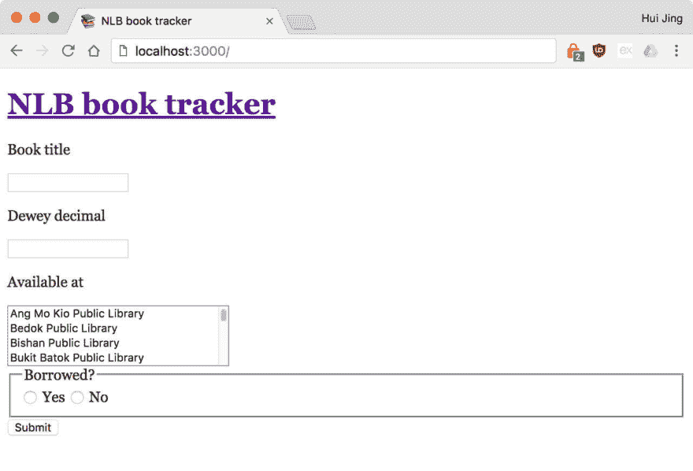
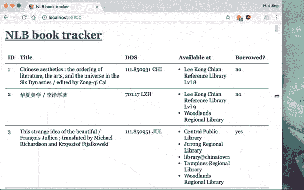

# 构建了我的第一个 CRUD 应用程序

> 原文:[https://dev.to/huijing/built-my-first-crud-app](https://dev.to/huijing/built-my-first-crud-app)

终于发生了。我做了一个合适的 Javascript。现在，在你开始评判我之前，让我澄清一下，虽然我从来没有写过 Javascript 帖子，但这并不是说我不知道如何使用它，好吗？当然，我在 2015 年开始使用 jQuery，没什么大不了的，我认识的几乎每个人都在他们职业生涯的某个时候使用过 jQuery😤。

事实上，我对外部验证的肤浅需求让我在 2015 年对使用 jQuery 如此自觉，以至于我很快就接受了[雷·尼克劳斯的](https://dev.to@RayNicholus) [你不需要 jQuery！](https://blog.garstasio.com/you-dont-need-jquery/)有一段时间像一些神圣的参考，直到我戒掉 jQuery。

但这是题外话。到目前为止，我一直在做客户端 Javascript。我将与一个“Javascript 人”合作，他将处理中间件方面的事情，并编写我将使用的漂亮的 API，然后开始我的快乐之路。众所周知，我非常喜欢 CSS，因为我喜欢它就像鸭子喜欢水一样🦆。

学习 Javascript 就像一只试图飞翔的鸭子。动物学课:鸭子会飞！只是它们没有被优化成可以随意飞行。但是总的来说，很明显鸭子会飞，甚至可以以每小时 50 英里的速度展翅高飞。所以几年后，我觉得是时候自立门户了，弄清楚中间件-服务器-API-路由是如何工作的。

## 用例

每个人和他们的猫都可以开发或者已经开发了一个应用程序，对吗？我该加入那个俱乐部了。我在 Dropbox 上存储了一个纯文本文件，一直在跟踪我想从世界级的新加坡国家图书馆[阅读/借阅的图书清单。这种方法非常有效，直到列表超过 40 本书。这个庞大列表的解决方案很明显:(所以跟我说)只需要为此开发一个应用程序。](https://www.nlb.gov.sg/)

> **通过书名、杜威十进制书号和可用位置跟踪图书列表**

这是这个想法的基本要点。我想要的关键功能是能够根据我当时访问的图书馆来过滤列表，因为有些书在多个图书馆都有副本。关键信息是书名和杜威十进制数来定位该书。很简单，我想。但从来都不是。

这是我的第一个“应用”，我认为记录思考过程和我问自己的问题会很有趣(老实说，大部分是#noobproblems)。此外，我从来没有一个标准的格式来写案例研究或博客文章。我也东拉西扯了很多。[源代码](https://github.com/huijing/library-app)如果真的要看 noob 代码。

### 博士(跳过那些让你厌烦的)

*   [使用的技术栈:node.js，Express，MongoDB，Nunjucks](#what-technology-stack-should-i-use)
*   [起点:Zell 的 CRUD 入门教程](#you-have-no-idea-how-to-write-this-from-scratch-do-you)
*   [数据库实施:mLAb，托管数据库解决方案](#so-this-mlab-thing-is-a-hosted-database-solution)
*   模板语言:Nunjucks
*   [数据输入:手动，手动](#couldnt-think-of-a-way-to-automate-data-entry)
*   [Nunjucks 语法类似于 Liquid](#can-you-nunjucks-like-you-do-liquid)
*   [带有 HTML 表格的响应式表格布局](#better-make-the-list-of-books-responsive-eh)
*   [过滤功能利用`indexOf()`](#lets-talk-about-this-filtering-thing-alright)
*   [实现上传和删除](#why-was-your-edit-and-delete-different-from-zells)
*   [服务人员的离线功能](#oooo-lets-also-play-with-service-worker)
*   [基本 HTTP 认证](#lets-put-some-authentication-on-this-baby)
*   [部署:Heroku](#what-about-deployment)

### 我应该使用什么技术堆栈？

我选择了 [node.js](https://nodejs.org/en/) 作为服务器， [Express](https://expressjs.com/) 作为中间件层， [MongoDB](https://www.mongodb.com/) 作为数据库，因为我真的不想写 SQL 查询，而 [Nunjucks](https://mozilla.github.io/nunjucks/) 作为模板语言，因为它有点类似于 Liquid(我在 Jekyll 中广泛使用)。

但是在我决定使用这个堆栈之前，我对数据进行了很多思考。以前，我被我的 Javascript 同行宠坏了，他们只给我传递端点，我可以从这些端点访问我需要的所有数据。这就像魔术一样(或者只是抽象，但是这两个术语不是可以互换的吗？).

我习惯于以 JSON 的形式接收数据，所以我的第一个想法是将纯文本文件中的数据转换成 JSON 文件，然后做我总是用 fetch 做的所有前端工作。但后来我意识到，我也想编辑数据，比如删除书籍或编辑错别字。所以我不知道如何坚持。

有一次出于好奇，我偷看了一下中间件代码，模糊地记得一些与 SQL 查询相关的东西，这让我得出结论，数据库必须参与这项工作💡。我并不像听起来那样无知，我知道如何编写 SQL 查询(从我的 Drupal 时代开始)，足以知道我不想为这个应用程序编写 SQL 查询。

### 你不知道如何从头开始写这个，是吗？

不，一点线索都没有。但是我的朋友[泽尔](https://zellwk.com/)早些时候写了一个关于[如何构建一个简单的 CRUD 应用](https://zellwk.com/blog/crud-express-mongodb/)的很棒的教程，我用它作为指南。这并不完全一样，所以需要大量的谷歌搜索。但是不做一个彻底的新手的好处是我知道哪些结果该丢弃，哪些是有用的😌。

Zell 的帖子涵盖了在 node.js 上运行的应用程序的基本设置，以及如何从终端上运行 node.js 服务器的简单说明。还有基本的路由，所以你可以把 index.html 文件作为你的主页，你也可以把它扩展到其他页面。 [Nodemon](https://nodemon.io/) 用于在每次进行更改时重启服务器，因此您不必每次都手动重启。

他确实使用了与我不同的堆栈，比如 EJS 而不是努恩朱克斯，但是大多数说明仍然非常相关，至少在第 1 部分是这样。大多数偏差发生在教程的编辑和删除部分。

### 所以这个 mLab 是一个托管数据库解决方案？

是的，Zell 在教程中使用了 [mLab](https://mlab.com/) ，这是一个数据库即服务，所以我跳过了学习如何设置 MongoDB 位。也许下次吧。关于如何开始使用 mLab 的文档相当不错，但有一件事让我竖起了眉毛(omg，这个表情符号什么时候出现？！)，这就是 MongoDB 连接，URI 包含数据库的用户名和密码。

我不是安全专家，但我知道这不是一个好主意。接下来要了解的是，作为一种配置，实现它的最佳方式是什么？在 Drupal 中，我们有一个`settings.php`文件。谷歌告诉我，StackOverflow 告诉[创建一个`config.js`文件](https://stackoverflow.com/questions/22348705/best-way-to-store-db-config-in-node-js-express-app)，然后导入该文件，用于数据库连接。一开始我这么做了，一切都很顺利，直到我尝试在 Heroku 上部署。我们稍后会谈到这一点，但重点是，将凭证存储在单独的文件中，不要将该文件提交给 git。

### 你不想像泽尔一样利用 EJS，那怎么做？

并不是说 [EJS](http://www.embeddedjs.com/) 不好，我只是想要一个我习惯的语法。但是不用担心，因为大多数流行项目的维护者都花时间写文档。在我职业生涯的很早时候，我就知道了术语 [RTFM](https://en.wikipedia.org/wiki/RTFM) 。 [Nunjucks](https://mozilla.github.io/nunjucks/) 是 Mozilla 的模板引擎，和 Jekyll 的(技术上是 Shopify 做的) [Liquid](https://github.com/Shopify/liquid) 很像。他们关于快速入门的[文档](https://mozilla.github.io/nunjucks/getting-started.html)对我来说非常容易理解。

### 想不出自动化数据输入的方法？

不，我不能。我在早年确实有过数据输入的经验，所以感觉...怀旧？无论如何，必须首先构建表单。书名和杜威十进制数字是简单明了的文本字段。这本书是否被借走会用单选按钮显示出来。库有点棘手，因为我想让它们成为多选输入，但是使用 Nunjucks 来生成每个选项。

在构建好我的表单，并测试提交表单会更新我的数据库之后。我冲了杯咖啡，暖暖手指，完成了大约半个小时的复制/粘贴(我想)。我非常确定有比这更好的方法来生成数据库，但是这肯定会花费我超过半个小时的时间来计算。让我们 KIV 这个项目，好吗？

### 你能像玩液体游戏一样玩双节棍吗？

大多数模板语言可能都可以做标准的循环和条件，只是要弄清楚语法。在 Jekyll 中，你将数据放入`_data`文件夹中的`.yml`或`.json`文件中，并使用如下方式访问它们:

```

  <!-- markup for single slide -->
 
```

<svg width="20px" height="20px" viewBox="0 0 24 24" class="highlight-action crayons-icon highlight-action--fullscreen-on"><title>Enter fullscreen mode</title></svg> <svg width="20px" height="20px" viewBox="0 0 24 24" class="highlight-action crayons-icon highlight-action--fullscreen-off"><title>Exit fullscreen mode</title></svg>

Jekyll 已经很好地为您处理了将数据从这些文件传递到模板的机制，所以我们必须做一些类似的事情来正确使用 Nunjucks。我有两大块数据要发送到客户端，我的图书馆列表(一个静态数组)和图书数据(从数据库中提取)。我了解到，要做到这一点，我们需要这样写:

```
app.get('/', (req, res) => {
  db.collection('books').find().toArray((err, result) => {
    if (err) return console.log(err)
    res.render('index', {
      libraries: libraries,
      books: result
    })
  })
}) 
```

<svg width="20px" height="20px" viewBox="0 0 24 24" class="highlight-action crayons-icon highlight-action--fullscreen-on"><title>Enter fullscreen mode</title></svg> <svg width="20px" height="20px" viewBox="0 0 24 24" class="highlight-action crayons-icon highlight-action--fullscreen-off"><title>Exit fullscreen mode</title></svg>

我相当确信这是一个 Express 函数，其中的`render()`函数有两个参数，模板文件和一个包含要传递的数据的对象。在这之后，我可以神奇地在`index.html`文件中为我的选择下拉列表和 books 表循环这些数据。Nunjucks 为我做了这些，而不是必须打出一长串令人讨厌的`option`元素。

```
<select name="available_at[]" multiple>
  
  <option>{{ library.name }}</option>
  
</select> 
```

<svg width="20px" height="20px" viewBox="0 0 24 24" class="highlight-action crayons-icon highlight-action--fullscreen-on"><title>Enter fullscreen mode</title></svg> <svg width="20px" height="20px" viewBox="0 0 24 24" class="highlight-action crayons-icon highlight-action--fullscreen-off"><title>Exit fullscreen mode</title></svg>

[T2】](https://res.cloudinary.com/practicaldev/image/fetch/s--0l4QUM90--/c_limit%2Cf_auto%2Cfl_progressive%2Cq_auto%2Cw_880/https://www.chenhuijing.cimg/posts/js-app/1%401280.jpg)

还有另一个💡当我在研究如何将书单转换成表格时，一个瞬间发生了。所以图书馆字段是一个多值字段，对吗？由于我做了多选，数据以数组的形式*存储在数据库中，然而，单个值以字符串*的形式*存储。这打乱了我最初格式化这个字段的尝试，直到我意识到可以在 select 的 name 属性中使用`[]`强制将单个值存储为一个数组。*

### 最好让书单有反应，嗯？

是的，考虑到我为自己是一个 CSS 人而感到自豪，如果显示器在某些屏幕宽度上坏掉了，那将是相当尴尬的。我已经有了一个响应性的表设置，它是由一堆 div 组成的，当宽度足够宽时，这些 div 假装成一个表。因为`display: table`是一个东西。我知道这一点，因为[我在](//%7B%7B%20site.url%20%7D%7D/blog/how-well-do-you-know-display/)之前研究过。

所以我一开始就这么做了，在意识到`<table>`元素[有普通元素没有的额外属性和方法](https://developer.mozilla.org/en/docs/Web/API/HTMLTableElement)之前。💡(照这样下去，我会有足够的灯泡来做一个漂亮的吊灯)。这与 CSS 部分没有任何关系，但由于我想要实现的过滤功能，这一点非常重要。

然后我想到，如果我能让 div 假装成一张桌子，我就能让一张桌子表现得像 div 一样。我甚至不明白为什么这个没有早点为我点击🤷。长话短说，当事情开始变得拥挤时，表格、行和单元格的显示设置为`block`。撒上一些伪元素好了，瞧，响应表。

[T2】](https://res.cloudinary.com/practicaldev/image/fetch/s--pGck3MZf--/c_limit%2Cf_auto%2Cfl_progressive%2Cq_66%2Cw_880/https://thepracticaldev.s3.amazonaws.com/i/jotw1w42ocy0nsg0dzcr.gif)

### 我们来谈谈过滤的事，好吗？

我实话实说。我以前从来没有自己写过一个合适的过滤函数。我做过一次自动补全。但仅此而已。我想我只是在必要的时候使用了别人的库(但我确保它真的很小，很优化，什么都有)。我想要的是有一个选择下拉菜单，只显示一个特定图书馆的图书。

棘手的是，图书馆字段是多值的。所以您不能将库单元格的内容与所选选项的值相匹配，是吗？所以我找到了[菲尔普·昂格尔](http://philippunger.com/)的这个 codepen ，它根据文本输入过滤了一个表格。

实际的过滤利用了`indexOf()`方法，而`forEach()`方法遍历 book 表中的所有后代。所以就像我之前提到的，一个普通的 HTMLElement 不具备 HTMLTableElement 所具备的属性，比如`HTMLTableElement.tBodies`和`HTMLTableElement.rows`。MDN 文档很棒，下面是 [indexOf()](https://developer.mozilla.org/en/docs/Web/JavaScript/Reference/Global_Objects/String/indexOf) 、 [forEach()](https://developer.mozilla.org/en-US/docs/Web/JavaScript/Reference/Global_Objects/Array/forEach) 和 [HTMLTableElement](https://developer.mozilla.org/en/docs/Web/API/HTMLTableElement) 的链接。

### 为什么你的编辑和删除与 Zell 的不同？

因为我有更多的数据，并且我不想在第一遍中使用 fetch。我想让 CRUD 在没有客户端 Javascript 的基础版本上工作。如果没有 Javascript 过滤也没关系，我的意思是，我可能可以让过滤在服务器端完成，但是我累了。

无论如何，我没有取，而是为每本书放入了单独的路径，在那里你可以编辑字段或者删除全部内容。我参考了 [Michael Herman](http://mherman.org/) 的[这篇文章](http://mherman.org/blog/2015/08/24/node-express-swig-mongo-primer/)中的上传和删除部分。代替 fetch，我们使用了[方法——覆盖](https://github.com/expressjs/method-override)中间件。

表单操作看起来是这样的:

```
<form method="post" action="/book/{{book._id}}?_method=PUT">
  <!-- Form fields -->
</form> 
```

<svg width="20px" height="20px" viewBox="0 0 24 24" class="highlight-action crayons-icon highlight-action--fullscreen-on"><title>Enter fullscreen mode</title></svg> <svg width="20px" height="20px" viewBox="0 0 24 24" class="highlight-action crayons-icon highlight-action--fullscreen-off"><title>Exit fullscreen mode</title></svg>

表单本身已经预先填充了数据库中的值，所以我可以更新单个字段，而不必每次都填写整个表单。尽管这确实涉及到在模板中为多选字段和我的单选按钮添加一些逻辑。我听过一些人说模板应该是无逻辑的，但是🤷。

```
<select name="available_at[]" multiple>
  
    
      <option selected>{{ library.name }}</option>
    
      <option>{{ library.name }}</option>
    
  
</select> 
```

<svg width="20px" height="20px" viewBox="0 0 24 24" class="highlight-action crayons-icon highlight-action--fullscreen-on"><title>Enter fullscreen mode</title></svg> <svg width="20px" height="20px" viewBox="0 0 24 24" class="highlight-action crayons-icon highlight-action--fullscreen-off"><title>Exit fullscreen mode</title></svg>

```
<fieldset>
  <legend>Borrowed?</legend>
  
    {{ checked }}
    
  
    {{ notchecked }}
    
  
  <label>
    <span>Yes</span>
    <input type="radio" name="borrowed" value="yes" {{ checked }}>
  </label>
  <label>
    <span>No</span>
    <input type="radio" name="borrowed" value="no" {{ notchecked }}>
  </label>
</fieldset> 
```

<svg width="20px" height="20px" viewBox="0 0 24 24" class="highlight-action crayons-icon highlight-action--fullscreen-on"><title>Enter fullscreen mode</title></svg> <svg width="20px" height="20px" viewBox="0 0 24 24" class="highlight-action crayons-icon highlight-action--fullscreen-off"><title>Exit fullscreen mode</title></svg>

我花了一段时间才弄明白的一个问题是，当我试图使用 ID 从数据库中查询一本书时，总是得到一个空值。我确信我使用了正确的财产。我了解到的是，MongoDB 中每个条目的 ID 不是一个字符串，而是一个 ObjectID，在使用它之前，您需要[来请求 ObjectID 函数](https://stackoverflow.com/questions/17545311/correct-way-to-search-for-mongodb-entries-by-id-in-node)。

### 呜，让我们也和服务人员一起玩吧！

你读过杰瑞米·基思(Jeremy Keith)的精彩著作《弹性网页设计》(T2，T3)吗？如果你还没有，现在就停下来读一读。当然这是一本网络书，但是它也可以在离线状态下很好地运行。所以我对服务人员有所了解，读了一些博客，听了一些谈话，但是从来没有做过任何事情。直到现在。

实际实现并没有那么难，因为最基本功能的介绍性教程很容易获得，比如[的](https://www.hacklabo.com/)[这个](https://www.hacklabo.com/your-first-service-worker/)尼古拉·菲奥拉万蒂。你知道当你构建一个东西，你要求业务用户做测试，不知何故，他们总是设法做一个模糊的事情，打破了东西。那是我。对自己下手。

因此，我按照说明，根据我需要缓存的文件修改了服务工作器，并进行了测试。如果你使用 Chrome，DevTools 在应用程序下有一个服务人员面板，你可以从那里触发离线模式。我遇到的第一件事是这个错误:`(unknown) #3016 An unknown error occurred when fetching the script`，但没什么大不了的，其他人在堆栈溢出上遇到了[同样的问题。](https://stackoverflow.com/questions/40555311/an-unknown-error-occurred-when-fetching-the-script-service-worker)

接下来让我困惑了一天半的事情是，与正常人不同，我反射性地通过按`⌘` + `Shift` + `R`，而不是`⌘` + `R`来重新加载我的页面。那个`Shift`键是我撤销的原因，因为它触发了重载并忽略了缓存的内容。原来我的服务人员已经注册并运行了所有这些🤦‍♀️ 。

啊，网络开发人员的生活。

### 让我们给这个宝贝做些鉴定

好吧，我实际上看了一眼 Zell 的演示应用程序，意识到它有点失控，因为它是一个免费的表单输入，任何人都可以提交他们想要的任何东西。这是演示的要点，所以没有问题。但对于我的个人应用程序，我完全有能力自己处理表单提交，谢谢。

身份验证是一件大事，因为有很多方法可以做到这一点，有些安全，有些不安全，但对于这个特定的用例，我只需要一些非常简单的方法。比如 htpasswd(你们还记得那是什么吧？).对于只有一个用户的应用程序来说，基本的 HTTP 认证已经足够好了。永远不会。

令人惊讶的是，有一个 npm 模块可以做到这一点。它被称为 [http-auth](https://github.com/http-auth/http-auth) ，实现相对简单。您可以选择保护特定的路径，所以在我的例子中，我只需要保护允许修改的页面。再说一遍，凭证在单独的文件里，孩子们。

```
const auth = require('http-auth')
const basic = auth.basic({ realm: 'Modify database' }, (username, password, callback) => {
  callback(username == username && password == password)
})

app.get('/admin', auth.connect(basic), (req, res) => {
  // all the db connection, get/post, redirect, render stuff
}) 
```

<svg width="20px" height="20px" viewBox="0 0 24 24" class="highlight-action crayons-icon highlight-action--fullscreen-on"><title>Enter fullscreen mode</title></svg> <svg width="20px" height="20px" viewBox="0 0 24 24" class="highlight-action crayons-icon highlight-action--fullscreen-off"><title>Exit fullscreen mode</title></svg>

### 部署呢？

是的，这是发展的一部分。如果你问我，最简单的方法是完全控制服务器(任何服务器)，通过 ssh 访问。因为尽管我在其他领域有不足之处(*咳咳* Javascript)，但我完全有能力设置一个带有 ssh 访问的 Linux 服务器，再加上一些表面上的强化。如果你能一丝不苟地按照说明去做，这并不困难，此外，我已经进行了大量的练习(我已经记不清为了重新开始而擦除服务器的次数了)。

但是我是一个非常非常吝啬的人，如果我能帮忙的话，我会拒绝付钱。我的路由器上的端口也用完了，所以那些多余的 SBC 只能继续收集灰尘。免费的选择似乎是 Heroku。但这很难说是一个平稳的过程。把这归因于我对在这个特定平台上部署 node.js 缺乏经验。

主要是数据库凭证的问题，因为我最初将它们存储在一个`config.js`文件中，并将其导入到我的主`app.js`文件中。但是我意识到如果不通过 git，我没有办法把那个文件上传到 Heroku，所以放弃这个计划。让我们用环境变量来代替，因为 Heroku 似乎已经内置了环境变量。

我花了很长时间才弄明白的是，在 Heroku 上，你需要有 dotenv 模块来识别`.env`文件(或者 Heroku 处理环境变量的地方)。因为在我的本地机器上，没有 dotenv 模块它也能工作。

## 包装完毕

我真的从中学到了很多，并从中获得了一个可用的应用程序，所以我认为时间花得值。我还了解到，实际上很难找到不使用大量库的教程。我并不反对图书馆，但是作为一个彻头彻尾的 noob，它对我来说有点太神奇了。一会儿撒上仙尘，谢谢。不管怎样，我要去研究下一个突然出现在我脑海中的荒谬想法了，你也应该试一试🤓。

*最初发表于 2017 年 7 月 13 日[www.chenhuijing.com](https://www.chenhuijing.com/blog/the-one-about-an-app/)。*