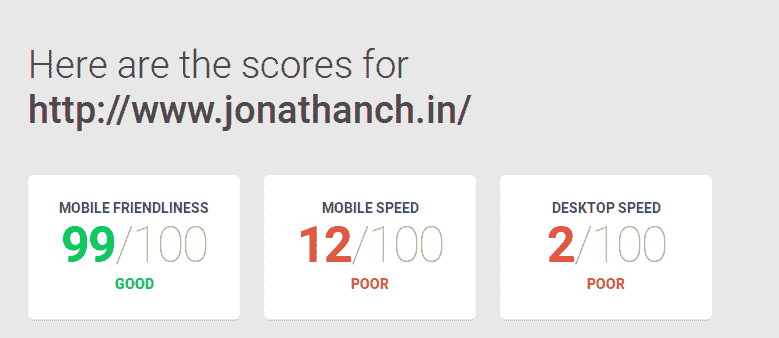
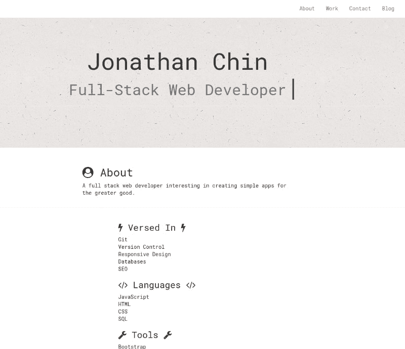
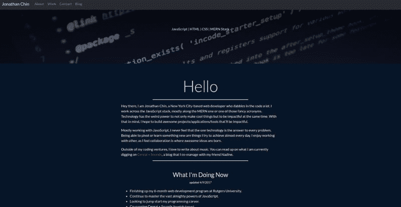
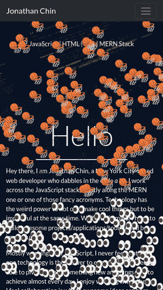
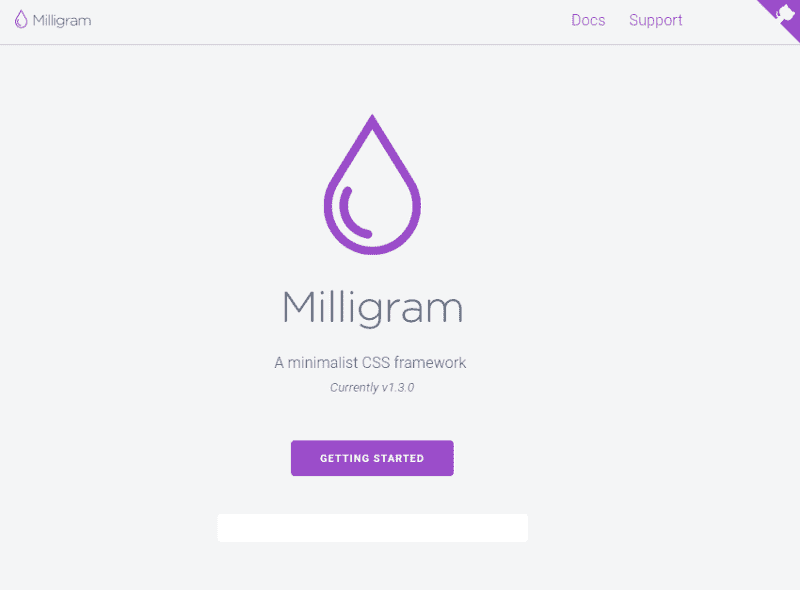
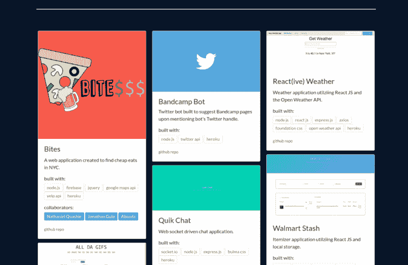
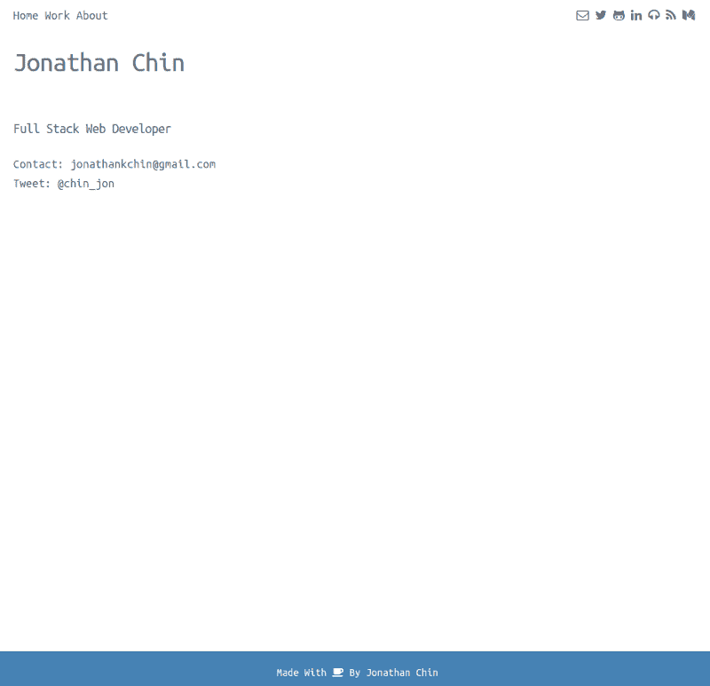
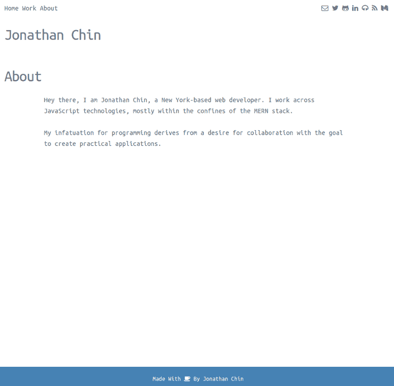
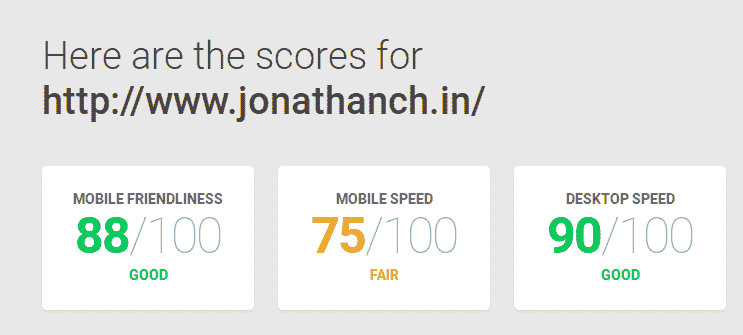

# 消除我的开发人员组合的膨胀

> 原文：<https://dev.to/chinjon/de-bloating-my-developer-portfolio>

[T2】](https://res.cloudinary.com/practicaldev/image/fetch/s--YAvVBk-q--/c_limit%2Cf_auto%2Cfl_progressive%2Cq_auto%2Cw_880/https://cdn-images-1.medium.com/max/800/1%2AsvBAS17YuEvbagcvR-gGLg.png)

*本文最初发表于[我的媒体博客](https://medium.com/@chinjon/de-bloating-my-developer-portfolio-f79f6a4d537)*

眼睛是你灵魂的窗户，你的个人网站是你代码的窗口。作为一个正在寻找自己第一个开发职位的人，[我的投资组合](http://jonathanch.in/)总是在我的脑海里。每天我都在想“我应该重新做这件事吗？”。我的一天充满了焦虑和咖啡因，所以一些如此普通的事情占据了我一天的一部分有点多。直到几天前，我的个人网站已经经历了两次大修。当我到达 **Rutger 的编码训练营**的中途时，第一次迭代出现了。那时，我刚刚熟悉了服务器端技术，并且非常兴奋地发现自己已经具备了启动网站的所有必要条件。

[T2】](https://res.cloudinary.com/practicaldev/image/fetch/s--9hORgWIs--/c_limit%2Cf_auto%2Cfl_progressive%2Cq_auto%2Cw_880/https://cdn-images-1.medium.com/max/800/1%2AqP5z5PfZYrjUQH-sCXIsIQ.png)

这不是一个雄心勃勃的事业，我计划保持它最小和简单。在 Express.js 上运行，用**Express-handler**做模板，我把它保持成一个单页网站，有一些打字动画(因为我觉得它很酷)和一个我迄今为止做的项目列表。它平淡无奇，用等宽字体和 Twitter **Bootstrap (3)** 作为骨架。尽管设计缺乏想象力，但它的响应速度非常快，我花了整整两个小时调整浏览器窗口的大小，观看媒体查询的神奇效果。

[T2】](https://res.cloudinary.com/practicaldev/image/fetch/s--1JsFj1DQ--/c_limit%2Cf_auto%2Cfl_progressive%2Cq_auto%2Cw_880/https://cdn-images-1.medium.com/max/800/1%2AcRgtFJoGNvH0QhG3J6L00g.png)

两个月后，我已经厌倦了这个设计，那些媒体的询问只能让我保持兴趣。所以对于下一个版本，我想从头开始重新构建。我对 **Bootstrap 4** 很好奇，主要是因为它在 Alpha 中 3 年了。除了复活节彩蛋给网页带来的表情符号，我对 **v2** 并不感冒。

[T2】](https://res.cloudinary.com/practicaldev/image/fetch/s--s6MY6Dqy--/c_limit%2Cf_auto%2Cfl_progressive%2Cq_auto%2Cw_880/https://cdn-images-1.medium.com/max/800/1%2AQUI0gsvA2PIfCRI1NVSqrg.png)

**v2 的问题:**

*   它很慢
*   这是一个令人畏缩的设计
*   太逊了
*   太自举了

**v3 的目标:**

*   简单点
*   时髦的
*   最小的
*   应答的
*   更像我

### 毫克是选择

[T2】](https://res.cloudinary.com/practicaldev/image/fetch/s--FNVvI2-N--/c_limit%2Cf_auto%2Cfl_progressive%2Cq_auto%2Cw_880/https://cdn-images-1.medium.com/max/800/1%2ABjPbCQz7SVRfzUuaLIwRFQ.png)

众所周知的框架的主要问题是膨胀。布尔玛是一个不错的选择，但是还有一些问题，它还没有完全成熟。我曾考虑使用受 markdown 启发的框架[黑掉由](http://hackcss.com/)[利己主义者](https://github.com/egoist)开发的 CSS ，但在使用它之后，这种风格看起来有点滑稽，而且这来自一个喜欢用 markdown 写作的人。输入 [**毫克**](http://milligram.io/) 。我以前用过一次，但是缺乏风格伤害了我，因为我不太习惯用 CSS 制作组件。

它只有 ***2kb 压缩的*** ，它的目的是为你的网站打下基础，没有任何侵入性的风格。

### 整理者

v2 的一个主要问题是它太花哨，但没有闪亮或时尚的设计。它看起来又圆又怪，像一辆 PT 巡洋舰。我在考虑 React，但是我觉得它对于那些只需要简单的东西来说有点大材小用了。与几个月前相比，现在模板化对我来说已经变得容易多了，所以我再次使用手柄。我在考虑帕格(FKA·杰德饰)，但是因为我正忙于找工作，所以现在就必须做，而不是以后。

[T2】](https://res.cloudinary.com/practicaldev/image/fetch/s--dhoVmV18--/c_limit%2Cf_auto%2Cfl_progressive%2Cq_auto%2Cw_880/https://cdn-images-1.medium.com/max/800/1%2AdVHLrUC12HWyQw4k-PS9dw.png)

我在/r/web_design 子编辑上看到了一个关于“简单得可笑的投资组合网站”的[帖子，这让我想到我真的不需要做这么复杂的东西。我只需要做一些反映我的东西，让信息传递出去，或者只是展示我的工作和联系方式。我真的很喜欢 **v1** 的简洁，灰色的文字和白色的背景。简单明了。](https://www.reddit.com/r/web_design/comments/6glc6i/best_ridiculously_simple_portfolio_sites/)

### 新鲜出炉

[T11】](https://res.cloudinary.com/practicaldev/image/fetch/s--cv7QjEeo--/c_limit%2Cf_auto%2Cfl_progressive%2Cq_auto%2Cw_880/https://cdn-images-1.medium.com/max/800/1%2AUFFldOVdICmDisiwlrmz4A.png)

结果只是一个三页的网站，只有很少的组件，花了我大约三天的时间。我决定反对单页布局，以保持一切整洁有序。我在单页布局上遇到的问题是，你必须对信息进行优先排序，也许滚动的事情需要太多的工作。但是，另一方面，三页的布局也可能是失败的，因为访问者必须点击才能找到信息。他们都有权衡，但他们是主观的。为了简单一点，我保留了一个持久的导航条，上面有链接到我的各种在线实体的图标。我用了**字体 Awesome** ，因为它们的整体风格与我选择的字体很匹配， **Ubuntu Mono** ，它们有各种图标。以**为基准，谷歌的页面速度也很快** l， **v3** 的表现击败了 **v2** 的缓慢表现，所以我想这也是一个优点。由于**毫克**使用 flexbox，它也是移动友好的。

[T2】](https://res.cloudinary.com/practicaldev/image/fetch/s--o504DLDR--/c_limit%2Cf_auto%2Cfl_progressive%2Cq_auto%2Cw_880/https://cdn-images-1.medium.com/max/800/1%2A3YHOLu9TRDCvKaK2oEQQFw.png)

这是守门员吗？大概不会。就像之前的大修一样，一个开发者的个人网站就像一个艺术家的声明，它反映了你在生活中的位置和你的思想框架。希望在 v4 中，我能重温我糟糕的设计技巧。但与此同时，[看一看](http://jonathanch.in/)。