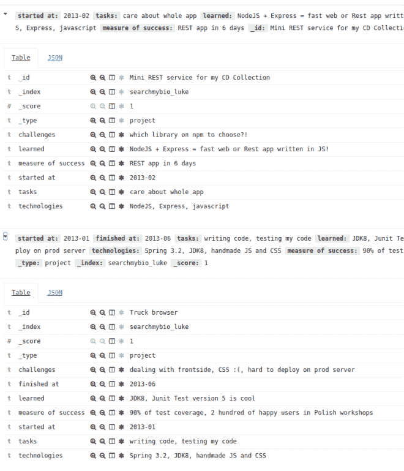

# 索引我的简历

> 原文：<https://dev.to/lukaszkuczynski/index-my-bio>

我想让换工作的人和人类研究人员的生活更轻松。我想使易于搜索的项目视图。我想把它放在 Elasticsearch 上，因为我想证明，你可以很容易地用它做一些小事情，所以它不仅适用于非常大的数据项目。

下面这段可用的代码在 [Github](https://github.com/lukaszkuczynski/search_my_bio) 上。

## 在你的 Linux 机器上运行

这很容易。你只需要`docker`而且是弟弟`docker-compose`。然后这个小脚本就可以让我运行整个机器。

```
version: "2"
services:
  kibana:
    image: kibana
    ports:
    - 5601:5601
  elasticsearch:
    image: elasticsearch 
```

## 写在 YAML，索引为 ES

现在考虑域名，当考虑我的简历时，我需要什么？我将其简化为`project`对象。这可能是某人的典型传记..

```
Projects:
  Commercial:
    Truck browser:
      started at: 2013-01
      finished at: 2013-06
      tasks:
      - writing code
      - testing my code
      learned:
      - JDK8
      - Junit Test version 5 is cool
      challenges:
      - dealing with frontside, CSS :(
      - hard to deploy on prod server
      technologies:
      - Spring 3.2
      - JDK8
      - handmade JS and CSS
      measure of success:
      - 90% of test coverage
      - 2 hundred of happy users in Polish workshops
  Private:
    Mini REST service for my CD Collection:
      started at: 2013-02
# still working on it
      tasks:
      - care about whole app
      learned:
      - NodeJS + Express = fast web or Rest app written in JS!
      challenges:
      - which library on npm to choose?!
      technologies:
      - NodeJS
      - Express
      - javascript
      measure of success:
      - REST app in 6 days 
```

怎么索引？首先，用它做一个 JSON。

## Python 中的数据挖掘和 ES I/O

数据转换是如此容易。让我们在这里用 Yaml 符号制作 JSON。有了 [yaml 库](http://pyyaml.org/wiki/PyYAMLDocumentation)就简单了。

```
import yaml
fname = "projects.yml"
with open(fname) as f:
    doc = yaml.load(f) 
```

然后让我们证明我们可以连接到 ElasticSearch。导入官方库后，可以看到这行

```
luk@luk-UX410UAK:~/prj/searchmybio$ python indexmyprojects.py
--Listing commercial projects--
Truck browser
--Listing side-projects--
Mini REST service for my CD Collection
{'name': 'HmNOtOU', 'cluster_name': 'elasticsearch', 'cluster_uuid': 'tRdhrV3gR0OnUfZMkPrpqQ', 'version': {'number': '5.5.0', 'build_hash': '260387d', 'build_date': '2017-06-30T23:16:05.735Z', 'build_snapshot': False, 'lucene_version': '6.6.0'}, 'tagline': 'You Know, for Search'} 
```

很好，连接完成！

## 索引时间！

在我们开始索引文件之前，我们必须为它们安排位置。有模式吗？不..Elasticsearch 可以帮我们做到。我们只需创建索引，很容易与一些 py 脚本。然后..

```
res = es.indices.create("searchmybio_luke") 
```

..我们可以在 Kibana 工具中查询 ES。所以现在让我们把它填满吧！在几次重构之后，我们准备好插入或放置文档到它们的位置。脚本中的索引是由这个一行程序完成的:所有的文档都在那里。有证据吗？查询它:

```
GET searchmybio_luke/project/_search
{
  "query": {
    "match": {
      "technologies": "nodejs"  
    }
  }
} 
```

您甚至可以编写测试并根据这个索引运行它。

```
query_find_nodejs = {
    "query": {
        "match": {
            "technologies": "nodejs"
        }
    }
}
res = self.es.search(index='searchmybio_luke', doc_type='project', body=query_find_nodejs)
hits = res['hits']['hits']
self.assertEquals(len(hits), 1) 
```

仅此而已。不到一个小时，我们就可以在我们的机器上运行 Elasticsearch，并将 yaml 中的文档直接索引到 index 中。

这是我的基巴纳的截图

[T2】](https://res.cloudinary.com/practicaldev/image/fetch/s--0Be1YTQt--/c_limit%2Cf_auto%2Cfl_progressive%2Cq_auto%2Cw_880/https://i0.wp.com/lukcreates.pl/wp-content/uploads/2017/07/Selection_001.png%3Fresize%3D660%252C769)