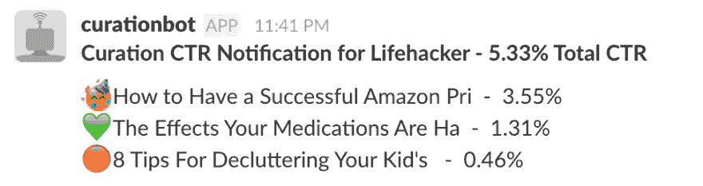
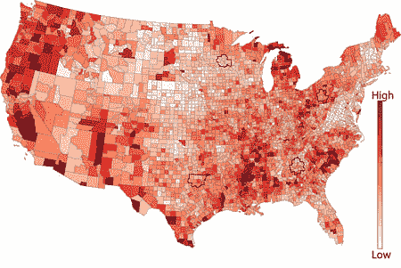

# 与 Josh Laurito 一起将编程的业余爱好转变为数据工程职业

> 原文:[https://dev . to/walker/talking-data-with-Josh-laurito-head-of-data-engineering-at-fusion-media-group](https://dev.to/walker/talkin-data-with-josh-laurito-head-of-data-engineering-at-fusion-media-group)

Josh Laurito 是 Fusion Media Group 的数据工程主管，Fusion Media Group 是网络上最广泛阅读的媒体品牌的出版商，每月的独立访问者超过 9000 万。他的团队偶尔会在 fmgdata.kinja.com 写博客。他还为纽约数据社区经营一份时事通讯，你可以在这里订阅。

### **你的团队最近必须解决的数据问题是什么？**

我们的大部分工作都致力于我们的发布平台 Kinja。Kinja 过去只允许像博客一样组织主页，故事从最新到最早列出。大约一年前，我们开始支持将故事“钉”在主页顶部。这是一个受到全公司欢迎的巨大变化，让我们的编辑有机会突出每个出版物的最佳作品。

然而，人工策展的另一面是，我们作为一个组织以前从未真正以这种方式挑选过特别报道的故事。虽然编辑们通常很清楚应该钉上什么样的故事，但我们没有经验知道它们应该钉多久。8 小时前的大新闻比现在刚刚爆出的小新闻更吸引我们的观众吗？

起初，我的团队做了一些分析，认为我们可以自动将故事提升到页面顶部，或者至少推荐哪些故事应该放在那里。

然而，很明显，编辑需要在这里有很大的控制权。编辑组织有他们自己的敏感性，很难在模型中表达出来。此外，还有很多计划好的事件报道，比如 Gizmodo 的苹果 WWDC 或者 Kotaku 的 E3，我们需要让帖子排队来覆盖任何自动化的东西。

### **那么你是如何找到合适的自动化水平的呢？**

最后，我们构建了一个轻量级的警报系统。数学很简单:我们计算我们支持的每个网站上故事的预期点击率，然后看看故事的表现如何。我们将提醒整合到每个出版物的闲置空间中，并添加了一个符号系统，这样编辑们就能确切地知道数字的含义。这里有一个来自 Lifehacker 的例子:

[T2】](https://res.cloudinary.com/practicaldev/image/fetch/s--fbQ_qdbc--/c_limit%2Cf_auto%2Cfl_progressive%2Cq_auto%2Cw_880/https://thepracticaldev.s3.amazonaws.com/i/8dkfym05bdm2eo8bt3jk.png)

因此，我们没有围绕固定故事建立完全自动化的东西，而是利用这些数据来教育和支持我们的编辑团队。它之所以成功，是因为它推动了主页的变化，但并没有规定条款:如果编辑想要在客观表现较低的情况下继续发布一篇文章，可能是因为报道非常出色，或者他们只是认为某篇文章非常有趣，他们有这个选项。

### **除了策展，数据团队是否也对文章的实际标题或内容提出建议？**

我们已经谈过很多次了，到目前为止我们一直在回避这个问题。偶尔对于赞助内容或销售团队，我们会帮助研究策略，但到目前为止还没有针对社论。

有两个主要的数据导向的原因，我们已经远离(我们的编辑人员可能会给你更多)。一是我们担心我们会淡化使我们的出版物与众不同的东西，也就是他们的声音。当很多人在测试标题或内容时，将会出现趋同进化，这意味着网站将更难区分。虽然我不怀疑这会导致短期的度量标准的提高，但我确信这会冲淡读者对我们的关注。

第二个原因是，测试背后隐含的假设是，你正在训练的受众(今天的流量)看起来很像你的测试集(未来的流量)。但事实是，我们的大部分流量都是先通过别人的算法过滤掉的，不管是在脸书、谷歌、Twitter，还是别人。我对这些算法的稳定性没有太大的信心，我认为对它们的过度优化会使我们容易受到变化的影响。我宁愿让编辑和观众团队尝试他们想要的，并拥有一套更多样化的标题和内容。

### **你是什么时候、怎么学会编程的？**

实际上，我大学毕业时获得了化学学位，然后进入了金融行业，心想即使我不知道自己想做什么，至少我可以赚些钱，结识一些聪明人。那是在房地产繁荣时期，我有一个朋友在一家大银行的抵押贷款衍生品部门工作，他帮我找到了一份结构师的工作，基本上就是做场景建模的人。

这项工作很有趣，也很有挑战性，但是如果你做不到的话，工作量会很大。我学会了如何编程，以便跟上所有占用我时间的请求。这些课程的发生大部分要感谢坐在我旁边的家伙，他拥有计算机科学硕士学位，同情我在凌晨 1 点一遍又一遍地手动输入场景参数。

几年后市场跌到谷底，我们都被解雇了。这是关于我们的模型所能做的极限的一个艰难的教训。我实际上和一些人一起工作，他们最终成为了《大结局》中的角色。

### **你是如何将自己对编程的兴趣转化为数据工程工作的？**

我最后去了一家保险公司，有一天，该公司的首席执行官走过我的办公桌，向我抱怨他没有办法将自己的数据与政府数据进行匹配。因此，如果他想知道他的保险单有多少是写在高失业率的地区，他就被卡住了。

这听起来像是一个非常有趣的问题，所以在圣诞节和新年之间，当周围没有其他人的时候，我制作了一个从内部和政府来源获取信息的应用程序原型，并将 [choropleth 地图](https://en.wikipedia.org/wiki/Choropleth_map)放在一起。

[T2】](https://res.cloudinary.com/practicaldev/image/fetch/s--BPeE1NBa--/c_limit%2Cf_auto%2Cfl_progressive%2Cq_auto%2Cw_880/http://www.axismaps.com/media/guides/unclassed_choropleth_map.jpg)

当人们在一月份回来时，我展示了我的应用程序，每个人都对此非常兴奋。我们围绕这个想法建立了一个小团队。我当时不知道的是，保险公司在抵押贷款上投入了太多资金，就像银行一样，很快就要破产了。

幸运的是，与我共事的两位高管对基于我的应用创建一家初创公司感兴趣。这就是我的第一个创业项目，lume sis T1。两位创始人想把公司搬到康涅狄格州，这并不真正吸引我，但在尝到甜头后，我对科技世界感到兴奋，并开始在科技领域寻找其他使用数学和统计数据解决问题的工作。

在我的一个曾在 CrowdTwist 工作的朋友把我招进 Gawker 之前，我在几家初创公司中辗转过。我于 2014 年开始在那里工作，并在 Univision 破产和收购期间一直留在这里。

### **自从你第一次被聘用以来，你的工作有什么变化？**

哦，哇，就像白天和黑夜。当我开始工作时，我实际上是唯一的数据科学家/分析师(尽管我们有一个数据工程师)。我几乎把所有的时间都花在了编码、测试和记录结果上。

现在，团队变大了，我们为一家大公司工作，我花了很多时间管理、做战略工作和招聘。说到这里，我们正在招聘产品、工程和数据角色，以及组织中的其他职位。你的读者应该[看一看](http://gizmodo.com/careers)！

### **你对新员工有什么要求，你会给有抱负的数据科学家什么建议？**

我给大家的建议是，完成一个项目，公之于众。当我教数据可视化的时候，我强迫我的学生公开他们的最终项目。它是什么并不重要:是否与工作相关，可视化还是开源库，是否经过润色，你都需要把它拿出来。

我们所有以与数字或代码打交道为生人都知道，大多数项目都包含一些丑陋的部分，无论你认为它们是组装的还是技术债务，或者是通过假设/理论挥舞的。仅仅是能够提供它所承诺的东西就让你领先于大多数想从事数据科学工作的人。

当我开始的时候，我围绕我感兴趣的事情做了各种各样愚蠢的有趣的项目，只是为了学习。我做了一个[鼠标速度计](http://bl.ocks.org/jlaurito/raw/d2f172c58b6ee07cf3d4/)，一张[美国银行系统地图](http://jlaurito.github.io/us_bank_map/mapping_us_banks.html)，一张[欧洲语言对比图](http://joshlaurito.com/blog/languages.html)，一堆东西。这些都不会赢得任何奖项，但它们帮助我建立了一个投资组合，并且在我学习新技术的过程中，它们给我带来了很多乐趣。

当我招聘的时候，我喜欢看人们以前做过什么，无论是在工作中还是在他们自己身上。我认为对工业界以数据为导向的人的头号抱怨是，我们并不总是擅长将产品运出门外，所以知道有人真正完成了工作对我来说意义重大。