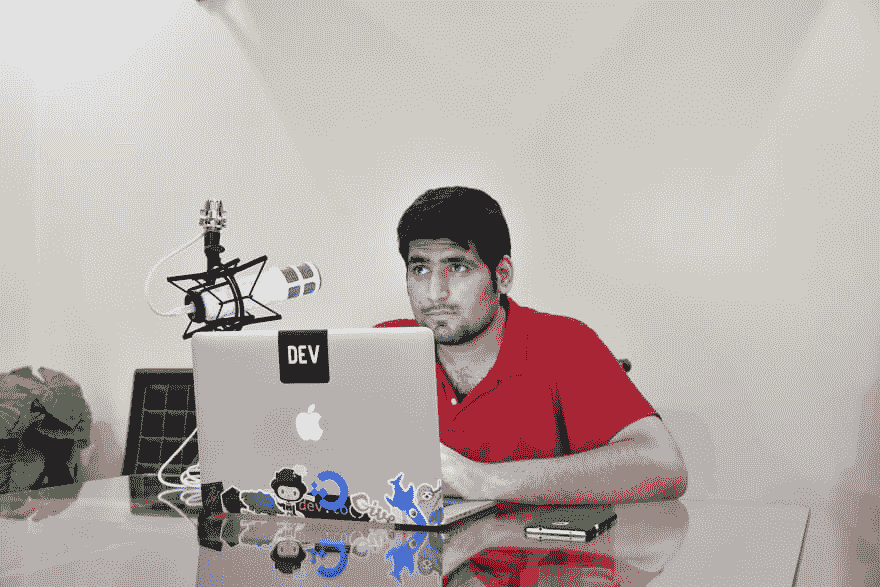

# 对于播客和在线教学，您的音频后处理工作流程是什么？

> 原文：<https://dev.to/ahmadawais/what-is-your-audio-post-processing-workflow-for-podcasting-and-online-teaching>

[T2】](https://res.cloudinary.com/practicaldev/image/fetch/s--vSOQ0PAg--/c_limit%2Cf_auto%2Cfl_progressive%2Cq_auto%2Cw_880/https://thepracticaldev.s3.amazonaws.com/i/s0oriinukr7fuviue5jd.jpg)

嘿，伙计们！

这位是艾哈迈德·阿瓦斯(Ahmad Awais)——全栈网络开发&定期 WordPress 核心贡献开发者。我喜欢戴夫。并一直是 Ben 在这里所做工作的粉丝。长期读者，现在试图在这里得到更多的参与。

我一直是一名教师，但最近我对在线教学进行了大量投资，并变得认真起来。并开始在名为 [The WordPress Takeaway](https://WPTakeaway.club) 的时事通讯中分享这些见解！

我买了

*   红色播客
*   骑式 PSA1 吊臂
*   罗德 PSM1 减震架

我还开发了一些信息产品，并推出了一个网络课程(在一个定制的在线教学平台上)——这是我精心设计的😂).

现在，我们正在研究如何改进音频后期处理。我可以访问 Adobe Audition，并已经开始构建自定义预设。我想问一下你的播客和在线教学的音频后期处理设置是什么？

期待！