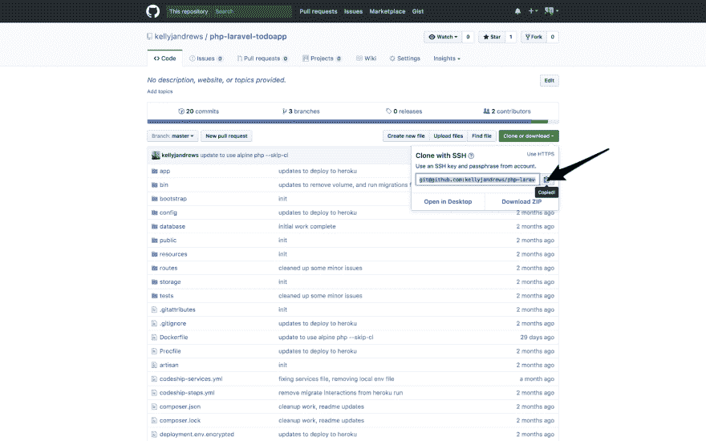
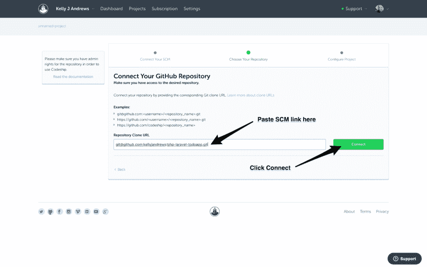
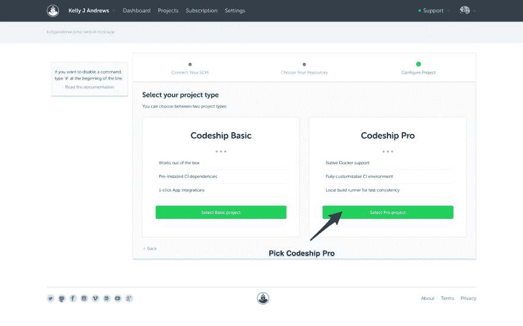

# 为 PHP 应用程序部署使用 Codeship

> 原文:[https://dev . to/kellyjandrews/using-codeship-for-PHP-application-deployments](https://dev.to/kellyjandrews/using-codeship-for-php-application-deployments)

> 这篇文章最初发表在 [Codeship 博客](https://blog.codeship.com/using-codeship-for-php-application-deployments/)上，经作者允许后发表在这里。

[在本系列](https://blog.codeship.com/using-docker-compose-for-php-development/)的第一部分，我使用 PHP、Laravel 和 PostgreSQL 开发了一个简单的`todo` API，使用 [Docker Compose](https://docs.docker.com/compose/) 。在这篇文章中，我将介绍使用 Codeship Pro 创建 CI/CD 管道的[。](https://codeship.com/features/pro/)

## 对本教程的要求

本教程要求您在开始之前具备一些条件:

*   安装 [Docker 社区版](https://store.docker.com/search?type=edition&offering=community)
*   安装〔t0〕坞站复合〔t1〕
*   从我们的代码库下载 [Todo 应用示例-dockered 分支](https://github.com/codeship-library/php-laravel-todoapp/tree/dockerized)
*   [代码船](http://codeship.com/)账户
*   Codeship Jet CLI
*   [Heroku](https://www.heroku.com/) 账号
*   [GitHub](https://github.com/) 、 [Bitbucket](https://bitbucket.org/product) 或 [GitLab](https://about.gitlab.com/) 账户
*   您已经阅读了第 1 部分:[使用 Docker Compose 进行 PHP 开发](https://blog.codeship.com/using-docker-compose-for-php-development/)

在我们的例子中，我们将代码直接部署到 Heroku 中，没有 Docker。虽然我们将在本地和 CI/CD 中使用 Docker，但 Codeship Pro 允许我们将 Docker 应用部署到生产中，即使生产不使用 Docker，如 classic Heroku。这种情况下的部署可以与任何其他服务器、映像存储库或 Docker 主机交换。

本质上，您可以修改这个例子来满足您的需要，通过使用任何 Docker 映像来完成您需要的工作，例如*部署到 AWS。我们的[文档](https://documentation.codeship.com/pro/)有例子，你可以查看。*

一旦你设置好了一切，你就可以进入下一部分了。

## 用 Codeship 测试 PHP 应用

[连续积分](https://en.wikipedia.org/wiki/Continuous_integration)定义如下:

> 在软件工程中，持续集成(CI)是指一天几次将所有开发人员的工作副本合并到一个共享主线(就像一个主分支)的实践。

我们希望通过 Codeship 实现所有这些自动化，以便在允许合并之前构建和测试每个推送的提交。让我们设置必要的文件，并在本地测试我们的管道。

### 代码船服务文件

我们需要创建的第一个文件是 [Codeship 服务定义文件](https://documentation.codeship.com/pro/builds-and-configuration/services/)。这将指导 Codeship 我们在构建期间需要的服务。

```
/> touch codeship-services.yml 
```

`codeship-services.yml`语法直接受到 Docker Compose 语法的影响，在[最后一篇文章](https://blog.codeship.com/using-docker-compose-for-php-development/)中创建的`docker-compose.yml`文件让我们走了大部分路。在你的编辑器中打开`codeship-services.yml`，复制下面的代码，并粘贴到那里。

```
web:
  build: .
  links:
    - postgres
  environment:
    DATABASE_URL: postgres://todoapp@postgres/todos
  cached: true
postgres:
  image: postgres:9.6.2-alpine
  environment:
    POSTGRES_USER: todoapp
    POSTGRES_DB: todos 
```

这里定义`codeship-services.yml`文件与最初的`docker-compose.yml`文件的区别非常小。接下来，我们可以定义在构建和自动化测试期间运行的实际步骤。

### 代码船步骤文件

下一个要创建的文件是`codeship-steps.yml`文件，它将告诉 Codeship 要运行哪些步骤以及以什么顺序运行。你可以[在我们的文档](https://documentation.codeship.com/pro/builds-and-configuration/steps/)中了解更多关于`codeship-steps.yml`文件的信息。继续创建新的步骤文件，并在编辑器中打开它。

```
/> touch codeship-steps.yml 
```

在`codeship-steps.yml`文件中定义的每个步骤都基于您定义的管道。这个例子从一个`lint`测试和`integration`测试开始，最终也将部署代码。您的管道可以完全定制，以满足您的特定需求。

```
- name: tests
  service: web
  command: phpunit 
```

首先运行的步骤是`tests`。如果您想要运行额外的测试，您可以通过一个`parallel`步骤同时运行它们。这非常有效，因为如果这些测试中的任何一个失败了，构建就会失败，并且总体上节省了时间。你可以在这里找到更多关于 Codeship Pro 步骤类型[的信息。](https://documentation.codeship.com/pro/builds-and-configuration/steps/#group-steps)

### Bin 脚本

现在事情更加自动化了，我们最后引入一个小的 race 案例，我们可以通过一些简单的脚本轻松地绕过它。随着项目的构建，集成测试需要运行`Postgres`来执行迁移。我们不能保证仅用`codeship-services.yml`文件就会发生这种情况。一种方法是在开始迁移之前检查数据库是否可用。

```
/> mkdir bin && touch bin/{wait-for-postgres,ci}
/> chmod +x bin/** 
```

#### 等待 postgres

`wait-for-postgres`脚本的内容如下:

```
#!/bin/sh
# wait-for-postgres
set -e

TIMEOUT=60
COUNT=0

until pg_isready -h "postgres" -p "5432" || [ $COUNT -eq $TIMEOUT ];
do echo $COUNT
  echo $TIMEOUT
  sleep 1
  COUNT=$((COUNT+1))
done 
```

我依靠 [`pg_isready`](https://www.postgresql.org/docs/9.3/static/app-pg-isready.html) 函数来检查`postgres`数据库的准备情况。如果还没准备好，我们就睡一会儿，再试一次。

这个函数在 60 秒后超时，但是如果你发现它用的时间更长，你可以调整它。连接通常只需要几秒钟。

#### 词

`ci`脚本如下:

```
#!/bin/bash
# Usage: bin/ci [setup]
set -e

bin/wait-for-postgres
time php artisan migrate --force --no-interaction

time $1 
```

这里没有太多的重物。这个脚本运行`wait-for-postgres`脚本来结束，然后它将执行迁移，最后一行接受第一个参数并运行它。这允许我更改`codeship-steps.yml`中的一行来首先运行这个脚本。

```
- name: tests
  service: web
  command: bin/ci phpunit # you only need to change the command here 
```

### 使用 Codeship Jet CLI 进行本地测试

我们能够使用`Codeship Jet CLI`在本地测试我们的设置。如果您还没有这样做，请查看我们的[code ship Jet CLI 入门文档](https://documentation.codeship.com/pro/builds-and-configuration/cli/)。`Codeship Jet CLI`将像在 Codeship 上一样运行步骤文件。这是在提交和推送到存储库之前尽早捕捉错误的快速方法。

```
/> jet steps
## build stuff, run tests ##
{StepFinished=step_name:"tests" type:STEP_FINISHED_TYPE_SUCCESS} 
```

如果您看到上面的最终结果，您已经正确设置了所有内容。如果您收到的是`type:STEP_FINISHED_TYPE_ERROR`，说明有些事情不太对劲，您应该检查一些事情。`Codeship Jet CLI`将生成一个日志，您可以查看该日志以尝试定位问题。能够在推送到您的存储库之前捕捉任何错误，这使得它成为代码库中一个特别强大的工具。

这个项目的完成版本也可以在 [GitHub](https://github.com/codeship-library/php-laravel-todoapp) 上找到，以防你卡住了，想要跳过。

## 设置您的 Codeship Pro 项目

下一个阶段是建立 Codeship 项目，这样新的推送到您的存储库将开始构建。在这一步中，我们将确保您已经建立了一个存储库，创建了项目，并推进了一个构建。

### 源代码管理设置

登录您的 GitHub、Bitbucket 或 GitLab 帐户，在那里创建一个您拥有 **admin** 权限的新 repo。抓取克隆 URL 并切换到[代码船应用](https://app.codeship.com)。

### 创建项目

当您的 repo 准备就绪时，您现在可以设置 Codeship 项目了。

*   导航到项目，然后单击“新建项目”按钮。

[T2】](https://res.cloudinary.com/practicaldev/image/fetch/s--Aob1q3Z_--/c_limit%2Cf_auto%2Cfl_progressive%2Cq_auto%2Cw_880/https://blog.codeship.com/wp-content/uploads/2017/06/image3-2.png)

*   通过选择在上一步中设置的源代码管理(SCM)工具来连接 SCM。

[T2】](https://res.cloudinary.com/practicaldev/image/fetch/s--4f-fZp7r--/c_limit%2Cf_auto%2Cfl_progressive%2Cq_auto%2Cw_880/https://blog.codeship.com/wp-content/uploads/2017/06/image5-2.png)

```
> If you originally signed up with an SCM different than above, we will connect to the service during this step. 
```

*   通过复制/粘贴上一步中的存储库克隆 URL 链接来选择您的存储库。单击连接按钮。

[T2】](https://res.cloudinary.com/practicaldev/image/fetch/s--LoaakOMH--/c_limit%2Cf_auto%2Cfl_progressive%2Cq_auto%2Cw_880/https://blog.codeship.com/wp-content/uploads/2017/06/image2-2.png)

[T2】](https://res.cloudinary.com/practicaldev/image/fetch/s--Mw9CJYGL--/c_limit%2Cf_auto%2Cfl_progressive%2Cq_auto%2Cw_880/https://blog.codeship.com/wp-content/uploads/2017/06/image4-2.png)

*   通过点按“选择专业项目”按钮来配置您的项目。

[T2】](https://res.cloudinary.com/practicaldev/image/fetch/s--vShtxsud--/c_limit%2Cf_auto%2Cfl_progressive%2Cq_auto%2Cw_880/https://blog.codeship.com/wp-content/uploads/2017/06/image1-2.png)

此时您的项目已经设置好了，任何提交并推送到存储库的代码都将自动运行构建。

### 推你的第一个构建

现在让我们运行一个构建。在您的命令行中，或者使用您最喜欢的`git`工具，确保 repo 已初始化，连接遥控器，添加文件，提交并推送。

```
/> git init
/> git remote add origin &lt;&lt;YOUR_REPOSITORY_CLONE_URL>>
/> git add .
/> git commit -am "initial build"
/> git push -u origin master 
```

如果您返回到 Codeship 并点击进入您的项目，您应该看到构建运行。确保在这一点上你得到一个绿色建筑。否则你可能需要回去检查一些东西:

*   确保您已经将所有文件添加到您的 repo 中。
*   查看您的`codeship-services.yml`和`codeship-steps.yml`文件。
*   在本地运行`Codeship Jet CLI`以在本地仔细检查它的工作情况。

一旦 CI 开始工作，您就可以进入部署部分，在这里我们将自动将代码部署到 Heroku。

## 用 Codeship Pro 连续部署到 Heroku

到目前为止，我们已经运行了集成步骤，每个新的提交都将运行测试，以确保代码准备好进行合并。

然而，当分支是`master`时，我们想要运行另一个步骤，以便在测试通过时实际**部署**应用程序。

### 创建 Heroku app

您可以使用 Heroku UI 创建一个应用程序，这是最简单的入门方式。如果您熟悉 Heroku CLI，您也可以使用它来执行这些步骤。一旦创建了应用程序，就需要一些步骤来获得部署所需的所有代码。

#### Heroku PostgreSQL 插件

这些步骤将为您的应用程序设置 Heroku PostgreSQL 加载项，以便在部署时用作其数据库。

1.  点击**资源**。
2.  在**附加组件**下，搜索`postgres`。
3.  在结果下拉列表中，点击 **Heroku Postgres** 。
4.  保持选择为**业余爱好自由发展**，然后点击**供应**。

#### 获取 Heroku API 密钥

1.  点击你右上角的头像，然后点击**账号设置**。
2.  在设置页面的底部附近，你会找到一个 API 键。点击**显示**。
3.  复制 API 密钥。

用您的终端在一个`deployment.env`文件中进行设置:

```
/> echo "HEROKU_API_KEY=YOUR_API_KEY_HERE" > deployment.env 
```

#### 创建 Heroku procfile

这是一个简单的一行程序，但是 Heroku 需要它来运行应用程序:

```
/> echo "web: bundle exec puma -C config/puma.rb" > Procfile 
```

### 使用 Codeship Jet CLI 加密

由于我们需要使用一些敏感的密钥，`Codeship Jet CLI`提供了一些加密工具来保护您的密钥。在这种情况下，它是部署所需的环境变量，但是您可以加密您所有的秘密。更多信息，你可以阅读关于[加密环境变量](https://documentation.codeship.com/pro/builds-and-configuration/environment-variables/#encrypting-your-environment-variables)的 Codeship 文档。

在 Codeship UI 中，按照下列步骤操作:

1.  点击**项目**，然后你当前正在工作的项目。
2.  点击**设置**，然后点击**通用**。
3.  找到并复制`AES Key`。

在您的终端中，包括:

```
/> echo "YOUR_AES_KEY" > codeship.aes 
```

> 注意:确保`codeship.aes`和`deployment.env`在你的`.gitignore`文件中被忽略。因为它们包含敏感数据，所以您不希望这些数据被推送到您的存储库中。

剩下要做的就是加密`deployment.env`文件。我们使用`Codeship Jet CLI`来实现这一点。

```
/> jet encrypt deployment.env deployment.env.encrypted 
```

然后,`deployment.env.encrypted`将被包含在您的存储库中，并在 Codeship 中解密。

### 添加 Heroku 部署服务

在 Codeship Pro 中，我们可以使用 Docker 创建任何我们需要的服务。这对您的意义在于，如果它在 Docker 上运行，它就在 Codeship 上运行。在这个例子中，我们使用了 Codeship 专门为 [Heroku 部署](https://hub.docker.com/r/codeship/heroku-deployment/)提供的服务。让我们将服务添加到我们的`codeship-services.yml`文件的末尾。

```
web:
  build: .
  links:
    - postgres
  environment:
    DATABASE_URL: postgres://todoapp@postgres/todos
  cached: true
postgres:
  image: postgres:9.6.2-alpine
  environment:
    POSTGRES_USER: todoapp
    POSTGRES_DB: todos
deploy:
  image: codeship/heroku-deployment
  encrypted_env_file: deployment.env.encrypted
  volumes:
    - ./:/deploy 
```

注意，我们在这里添加了`encrypted_env_file`。这指示 Codeship 使用哪个文件来查找容器内部使用的 Heroku API 密钥。

### 添加部署步骤

剩下的唯一步骤是告诉 Codeship 何时使用`deploy`服务。打开`codeship-steps.yml`文件并添加以下内容:

```
- name: tests
  service: web
  command: bin/ci phpunit
- name: deploy #step added
  tag: master
  service: deploy
  command: codeship_heroku deploy /deploy php-laravel-todoapp
- name: migrate #step added
  tag: master
  service: deploy
  command: heroku run --app php-laravel-todoapp -- php artisan migrate --no-interaction 
```

这个`codeship-steps.yml`文件现在表明，如果列为`tag`的分支等于`master`，它将运行部署服务。如果我们推进到任何其他分支，一切都将运行**除了**部署。你可以在 Codeship Pro 中阅读更多关于[`tag`和`exclude`属性和限制步骤的内容。](https://documentation.codeship.com/pro/builds-and-configuration/steps/#limiting-steps-to-specific-branches--tags)

图像`codeship/heroku-deployment`有命令`codeship_heroku deploy`，它接受两个参数:文件的路径和 Heroku 应用程序的名称。在这种情况下，它们是`/deploy`和`php-laravel-todoapp`。只要所有测试都通过，并且分支是`master`，我们的代码将被部署到 Heroku。`codeship/heroku-deployment`图像也允许我们运行 Heroku 命令行工具。在这种情况下，在我们部署了应用程序之后，`codeship-steps.yml`将执行`heroku run --app php-laravel-todoapp -- php artisan migrate --no-interaction`来确保我们最新的模式被迁移到 Heroku PostgreSQL 数据库。

`codeship/heroku-deployment`镜像正在运行几个命令来测试对应用程序的正确访问，打包代码，并使用它们的 API 部署到 Heroku。重申一下，这可以是你需要的任何东西，*例如*，部署到 AWS。如果它在 Docker 容器中运行，Codeship Pro 可以运行它。

### 在 Codeship Pro 上开始构建

现在我们可以把这些变化推进到我们的 SCM 中，让 Codeship 从这里接手。

> 确保你已经将你的`codeship.aes`和`deployment.env`文件添加到`.gitignore`中。您希望忽略这些文件，这样就不会公开暴露存储库中的秘密。如果你还没有，现在就去做吧。

```
git add .
git commit -am "adding deployment"
git push 
```

前往您的 Codeship Pro 项目，从仪表板上观察您的构建和部署。

## 结论

本系列的两篇文章涵盖了相当多的内容。最初，我们的任务是手动测试和部署我们的应用程序。这个过程不仅乏味，而且会占用一些人的时间，并且容易出错。第一篇文章介绍了如何使用 Docker Compose 建立我们的本地开发和测试工作流。在这篇文章中，我们使用 Codeship Pro 和 Jet CLI 来进一步自动化我们的步骤。现在我们可以向`master`推送一个新的提交，然后它运行我们的测试并通过 Codeship Pro 部署到 Heroku。

以下是这两篇文章中的一些资源:

#### 码头工人

*   [Docker 社区版](https://store.docker.com/search?type=edition&offering=community)
*   [docker 文件参考](https://docs.docker.com/engine/reference/builder/)
*   [坞站复合概述](https://docs.docker.com/compose/overview/)
*   [坞站复合 CLI](https://docs.docker.com/compose/reference/overview/)

#### Docker 使用的图像

*   [PHP](https://store.docker.cimg/php?tab=description)
*   [NGINX](https://store.docker.cimg/nginx?tab=description)
*   [PostgreSQL](https://store.docker.cimg/022689bf-dfd8-408f-9e1c-19acac32e57b?tab=description)
*   [代码船 Heroku 部署](https://hub.docker.com/r/codeship/heroku-deployment/)

#### Codeship Pro

*   [Codeship Pro 文档](https://documentation.codeship.com/pro/)
*   [Codeship Jet CLI 文档](https://documentation.codeship.com/pro/builds-and-configuration/cli/)
*   [加密环境变量](https://documentation.codeship.com/pro/builds-and-configuration/environment-variables/#encrypting-your-environment-variables)
*   [代码发布步骤文档](https://documentation.codeship.com/pro/builds-and-configuration/steps/)
*   [代码船服务文档](https://documentation.codeship.com/pro/builds-and-configuration/services/)

#### 文章资源

*   [使用 Docker Compose 进行 PHP 开发](https://blog.codeship.com/using-docker-compose-for-php-development/)
*   [PHP Laravel Todo App Repo](https://github.com/codeship-library/php-laravel-todoapp)
*   [基于 Alpine 的 Docker 图像在现实应用中发挥了重要作用](https://blog.codeship.com/alpine-based-docker-images-make-difference-real-world-apps/)

#### 使用的附加工具和资源

*   [PHP](http://www.php.net/)
*   拉勒维尔
*   [PHPUnit](https://phpunit.de/)
*   [NGINX](https://www.nginx.com/)
*   [Heroku](https://www.heroku.com/)
*   [GitHub](https://github.com/)
*   [Bitbucket](https://bitbucket.org/product)
*   [GitLab](https://about.gitlab.com/)
*   [PostgreSQL](https://www.postgresql.org)
*   [待办事项后端](http://todobackend.com/)